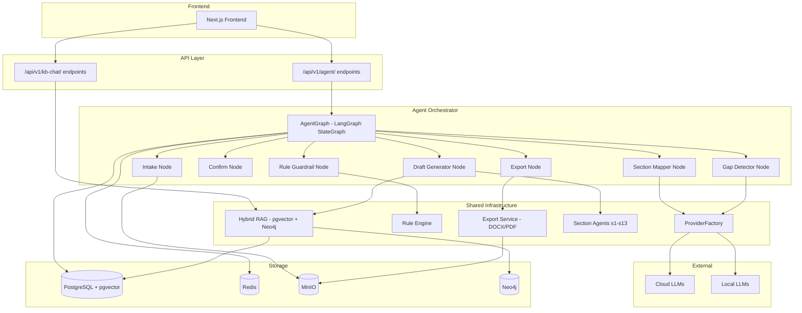
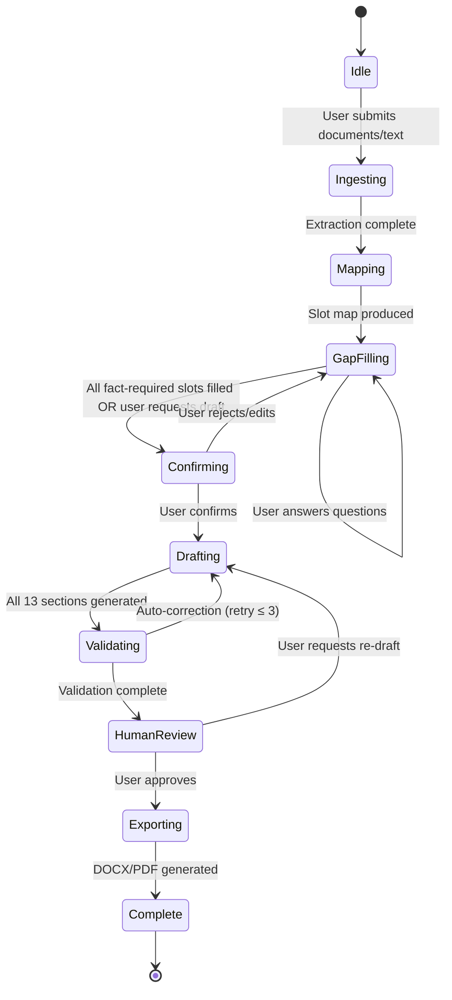

# Design Document: Agent TOR Drafting

## Overview

This design replaces the existing 8-step wizard-based TOR drafting approach with an agent-based conversational workflow. The system accepts bulk document uploads, automatically maps content to TOR sections, detects gaps, conducts a conversational gap-filling loop, and generates a legally compliant TOR draft — all within a stateful LangGraph orchestrator.

The design coexists with the existing wizard flow (wizard endpoints remain intact) while the new agent endpoints provide an alternative entry path. Both share the same underlying infrastructure: ProviderFactory, Rule Engine, hybrid RAG retrieval, specialized section agents, and the export pipeline.

**Key design decisions:**

1. **LangGraph StateGraph for orchestration** — The new agent workflow is implemented as a LangGraph graph with a different topology than the existing per-section graph. The agent graph orchestrates the full lifecycle: ingest → map → gap-fill → confirm → draft-all → validate → export.
2. **Redis session cache** — Intermediate analysis results (extracted text, slot_map, partial drafts) are cached in Redis with project-scoped keys and configurable TTL, enabling resumable sessions without re-processing.
3. **Incremental slot updates** — After initial mapping, user answers update individual slots via an LLM classification step without full re-analysis of previously mapped content.
4. **Existing infrastructure reuse** — ProviderFactory, Rule Engine, hybrid_retrieve, section agents (BaseDraftingAgent), export generators, and the Project/TORSection models are all reused directly.

## Architecture

### High-Level Component Diagram



### Agent Workflow State Machine



## Components and Interfaces

### 1. AgentWorkflowState (New LangGraph State)

```python
class AgentWorkflowState(TypedDict, total=False):
    """Shared state for the agent-based TOR drafting workflow."""

    # --- Session Identity ---
    session_id: str              # UUID for this agent session
    project_id: str              # UUID of the project
    user_id: str                 # UUID of the authenticated user

    # --- Workflow Phase ---
    phase: str                   # "idle"|"ingesting"|"mapping"|"gap_filling"|"confirming"|"drafting"|"validating"|"human_review"|"exporting"|"complete"|"error"

    # --- Intake ---
    intake_files: list[dict]     # [{name, size, content_hash, status, chars}]
    intake_texts: list[dict]     # [{name, text}]
    total_chars: int             # Sum of extracted characters

    # --- Section Mapping ---
    slot_map: dict[str, dict]    # {slot_key: {content, status, sources}}
    coverage_map: list[dict]     # Derived coverage table
    readiness_score: float       # 0.0–1.0 fraction of fact-required filled
    ready: bool                  # True when readiness_score == 1.0

    # --- Gap Filling ---
    gap_questions: list[str]     # Current batch of gap questions
    gap_iteration: int           # Number of gap-fill rounds completed
    max_gap_iterations: int      # Hard limit (default 20)

    # --- Confirmation ---
    user_confirmed: bool         # User explicitly confirmed slot content

    # --- Draft Generation ---
    section_drafts: dict[str, str]   # {section_key: draft_content}
    sections_pending: list[str]      # Sections not yet drafted
    draft_quality_scores: dict[str, float]  # Per-section quality scores
    overall_quality_score: float     # Average across all sections

    # --- Validation ---
    validation_findings: list[dict]  # Findings from Rule Engine
    correction_attempts: dict[str, int]  # {section_key: attempt_count}
    mandatory_review_sections: list[str]  # Sections needing explicit ack
    sections_acknowledged: list[str]      # Sections user has reviewed

    # --- Export ---
    export_docx_url: str | None  # MinIO presigned URL for DOCX
    export_pdf_url: str | None   # MinIO presigned URL for PDF

    # --- Timeouts & Config ---
    agent_timeout_seconds: int   # Per-LLM-call timeout
    draft_timeout_seconds: int   # Full draft generation timeout (900s)
    ingestion_timeout_seconds: int  # Intake batch timeout (600s)
    deployment_mode: str         # "on_prem"|"cloud"|"hybrid"

    # --- Error ---
    error: str | None
    warnings: list[str]

    # --- Conversation ---
    messages: list[dict]         # Chat history [{role, content, timestamp}]
```

### 2. Agent Graph Topology

```python
def build_agent_workflow_graph() -> StateGraph:
    graph = StateGraph(AgentWorkflowState)

    graph.add_node("ingest", ingest_node)
    graph.add_node("map_sections", map_sections_node)
    graph.add_node("detect_gaps", detect_gaps_node)
    graph.add_node("fill_slot", fill_slot_node)
    graph.add_node("confirm", confirm_node)
    graph.add_node("draft_all", draft_all_node)
    graph.add_node("validate_draft", validate_draft_node)
    graph.add_node("human_review", human_review_node)
    graph.add_node("export", export_node)
    graph.add_node("handle_error", handle_error_node)

    graph.set_entry_point("ingest")

    graph.add_edge("ingest", "map_sections")
    graph.add_edge("map_sections", "detect_gaps")
    graph.add_conditional_edges("detect_gaps", route_after_gaps, {
        "confirm": "confirm",
        "fill_slot": "fill_slot",
    })
    graph.add_edge("fill_slot", "detect_gaps")
    graph.add_conditional_edges("confirm", route_after_confirm, {
        "draft_all": "draft_all",
        "fill_slot": "fill_slot",
    })
    graph.add_edge("draft_all", "validate_draft")
    graph.add_conditional_edges("validate_draft", route_after_validation, {
        "human_review": "human_review",
        "draft_all": "draft_all",  # auto-correction retry
    })
    graph.add_conditional_edges("human_review", route_after_review, {
        "export": "export",
        "draft_all": "draft_all",
    })
    graph.add_edge("export", END)

    return graph
```

### 3. API Endpoints

| Method | Path | Purpose | Interrupt? |
|--------|------|---------|------------|
| POST | `/api/v1/agent/sessions` | Create new agent session, upload initial docs/text | No |
| POST | `/api/v1/agent/sessions/{id}/ingest` | Add more documents to existing session | No |
| GET | `/api/v1/agent/sessions/{id}/coverage` | Get current coverage map | No |
| POST | `/api/v1/agent/sessions/{id}/answer` | Submit answer to gap questions | Yes (resumes graph) |
| POST | `/api/v1/agent/sessions/{id}/confirm` | Confirm slot content, proceed to drafting | Yes (resumes graph) |
| GET | `/api/v1/agent/sessions/{id}/draft` | Get current draft content + scores | No |
| POST | `/api/v1/agent/sessions/{id}/review` | Submit human review decision | Yes (resumes graph) |
| GET | `/api/v1/agent/sessions/{id}/export` | Get export download URLs | No |
| GET | `/api/v1/agent/sessions/{id}/status` | Get workflow phase + progress info | No |
| DELETE | `/api/v1/agent/sessions/{id}` | Cancel/archive session | No |
| POST | `/api/v1/kb-chat/sessions` | Create KB chat session | No |
| POST | `/api/v1/kb-chat/sessions/{id}/message` | Send message to KB chat | No |
| GET | `/api/v1/kb-chat/sessions/{id}/history` | Get chat history | No |

### 4. Intake Ingestion Service (Enhanced)

```python
class IntakeIngestionService:
    """Processes uploaded documents and text for the agent workflow."""

    MAX_FILES_PER_REQUEST = 20
    MAX_FILE_SIZE_BYTES = 50 * 1024 * 1024  # 50 MB
    MAX_CONTENT_CHARS = 200_000
    INGESTION_TIMEOUT = 600  # seconds
    SUPPORTED_FORMATS = {"pdf", "docx", "pptx", "txt"}

    async def process_batch(
        self,
        project_id: UUID,
        files: list[UploadFile],
        free_text: str | None,
        storage_backend: str,  # "minio" or "local"
    ) -> IngestionResult:
        """
        1. Validate file count (≤ 20) and per-file size (≤ 50 MB)
        2. Extract text from each file (PDF/DOCX/PPTX/TXT)
        3. Store raw files in MinIO/local with project_id prefix
        4. Compute content_hash per file for cache-hit detection
        5. Concatenate all text (respecting 200k char chunking)
        6. Return per-file status + total extracted content
        """
        ...
```

### 5. Section Mapper

```python
class SectionMapper:
    """Maps extracted content to 27 TOR slots via single-pass LLM analysis."""

    ANALYSIS_TIMEOUT = 90  # seconds
    RETRY_REDUCTION = 0.5  # Reduce to 50% tokens on retry

    async def map_content(
        self,
        content: str,
        project_metadata: dict,
    ) -> MappingResult:
        """
        Single-pass analysis that produces a slot_map.
        Uses existing analyze_pack prompt pattern from intake_service.py.
        On timeout/error: retry once with reduced content.
        On second failure: return partial result.
        """
        ...

    async def incremental_update(
        self,
        answer_text: str,
        current_slot_map: dict,
        context_questions: list[str],
    ) -> IncrementalUpdateResult:
        """
        Classify user answer to target slots without re-analyzing all content.
        Returns updated slot entries + list of affected slot keys.
        """
        ...
```

### 6. Gap Detector

```python
class GapDetector:
    """Identifies missing data and generates follow-up questions."""

    MAX_QUESTIONS_PER_ROUND = 5

    def detect_gaps(self, slot_map: dict) -> list[GapInfo]:
        """
        Pure function. Scans slot_map for:
        - Fact_Required_Slots with status != "filled" (critical)
        - Other slots with status == "gap" (non-critical)
        Returns sorted by priority (fact-required first).
        """
        ...

    async def generate_questions(
        self,
        gaps: list[GapInfo],
        project_context: dict,
    ) -> list[str]:
        """
        Generate Thai-language questions for up to 5 gaps per round.
        Questions reference section name, state what's missing, request specific info.
        Grouped by TOR section.
        """
        ...
```

### 7. Draft Generator (Full TOR)

```python
class FullDraftGenerator:
    """Generates all 13 TOR sections using specialized agents."""

    TOTAL_TIMEOUT = 900  # 15 minutes
    MAX_CORRECTIONS_PER_SECTION = 3

    async def generate_all(
        self,
        slot_map: dict,
        project_metadata: dict,
        deployment_mode: str,
    ) -> DraftResult:
        """
        For each section s1–s13:
        1. Retrieve RAG context via hybrid_retrieve
        2. Invoke section-specific agent (BaseDraftingAgent subclass)
        3. Collect draft content
        4. Track timing against TOTAL_TIMEOUT

        If timeout reached, return partially completed sections.
        """
        ...

    async def auto_correct(
        self,
        section_key: str,
        draft: str,
        findings: list[dict],
        slot_map: dict,
        attempt: int,
    ) -> str:
        """
        Re-draft a section with validation feedback included.
        Uses existing agent retry pattern from graph.py.
        """
        ...
```

### 8. Knowledge Base Chat Service

```python
class KnowledgeChatService:
    """Conversational Q&A over the knowledge base (global + user-specific)."""

    MAX_HISTORY = 20  # message pairs
    MAX_MESSAGE_LENGTH = 1000
    SESSION_TIMEOUT_MINUTES = 30
    RELEVANCE_THRESHOLD = 0.5

    async def answer(
        self,
        session_id: UUID,
        user_id: UUID,
        message: str,
        history: list[dict],
    ) -> ChatResponse:
        """
        1. Retrieve chunks via hybrid_retrieve (search_scope="both")
        2. Check relevance threshold (score >= 0.5 for at least 1 chunk)
        3. If no relevant chunks: return "ไม่พบข้อมูลที่เกี่ยวข้อง" message
        4. If relevant: generate answer with citations
        5. Respect access control: user sees only global + own docs
        """
        ...
```

## Data Models

### New Database Tables

```sql
-- Agent workflow sessions (separate from existing wizard-based projects)
CREATE TABLE agent_sessions (
    id UUID PRIMARY KEY DEFAULT gen_random_uuid(),
    project_id UUID NOT NULL REFERENCES projects(id),
    user_id UUID NOT NULL REFERENCES users(id),
    phase VARCHAR(30) NOT NULL DEFAULT 'idle',
    slot_map JSONB NOT NULL DEFAULT '{}',
    gap_iteration INTEGER NOT NULL DEFAULT 0,
    graph_state JSONB,  -- Serialized LangGraph checkpoint
    messages JSONB NOT NULL DEFAULT '[]',
    warnings JSONB NOT NULL DEFAULT '[]',
    created_at TIMESTAMPTZ NOT NULL DEFAULT now(),
    updated_at TIMESTAMPTZ NOT NULL DEFAULT now(),
    expires_at TIMESTAMPTZ NOT NULL DEFAULT now() + INTERVAL '30 days'
);
CREATE INDEX idx_agent_sessions_user ON agent_sessions(user_id, phase);
CREATE INDEX idx_agent_sessions_project ON agent_sessions(project_id);

-- Knowledge base chat sessions
CREATE TABLE kb_chat_sessions (
    id UUID PRIMARY KEY DEFAULT gen_random_uuid(),
    user_id UUID NOT NULL REFERENCES users(id),
    history JSONB NOT NULL DEFAULT '[]',
    created_at TIMESTAMPTZ NOT NULL DEFAULT now(),
    last_active_at TIMESTAMPTZ NOT NULL DEFAULT now()
);
CREATE INDEX idx_kb_chat_user ON kb_chat_sessions(user_id);

-- Extend existing projects table
ALTER TABLE projects ADD COLUMN workflow_mode VARCHAR(20) DEFAULT 'wizard';
-- 'wizard' = existing 8-step, 'agent' = new conversational
```

### Redis Cache Schema

| Key Pattern | Value | TTL | Purpose |
|-------------|-------|-----|---------|
| `agent:extract:{project_id}:{content_hash}` | Extracted text (JSON) | 24h | Skip re-extraction for unchanged docs |
| `agent:slotmap:{project_id}` | Full slot_map (JSON) | 24h | Avoid full re-analysis on follow-up |
| `agent:draft:{project_id}:{section_key}` | Section draft text | 48h | Cache generated drafts |
| `agent:session:{session_id}` | Full session state snapshot | 24h | Fast state loading |
| `kb:session:{session_id}` | Chat history (JSON) | 30min | KB chat session data |

**TTL Configuration** (stored in app config):
- Minimum: 1 hour
- Maximum: 168 hours (7 days)
- Defaults: extraction=24h, mapping=24h, draft=48h

### Interaction with Existing Models

- **Project model**: Gains `workflow_mode` column. Agent sessions create a Project with `workflow_mode='agent'` and `current_step=0` (unused in agent mode).
- **TORSection model**: Reused for final persisted content. Agent workflow writes to tor_sections upon finalization.
- **UploadedFile model**: Reused for tracking ingested files.
- **ProjectVersion model**: Snapshot created when draft is finalized.

## Error Handling

### Timeout Strategy

| Operation | Default Timeout | Max | Recovery |
|-----------|----------------|-----|----------|
| Single LLM call (cloud) | 120s | 300s | Log + error response |
| Single LLM call (on_prem) | 300s | 300s | Log + error response |
| Full ingestion batch | 600s | 600s | Return partial per-file statuses |
| Section mapping | 90s | 180s | Retry at 50% content, then partial |
| Full draft generation | 900s | 900s | Return completed sections |
| Gap question generation | 30s | 60s | Return generic questions |

### Error Categories

1. **LLM Provider Unreachable** — Log, preserve session state, return error without retry (Req 5.7)
2. **LLM Timeout** — Log, return timeout error, session remains resumable (Req 5.5)
3. **RAG Retrieval Failure** — Proceed without context, append warning (Req 8.3, 8.4)
4. **Cache Write Failure** — Log, proceed without blocking (Req 4.7)
5. **File Extraction Failure** — Per-file error, other files continue (Req 1.6)
6. **Validation Engine Error** — Treat as failed validation, increment retry

### Graceful Degradation Hierarchy

```
LLM available + RAG available → Full quality output
LLM available + RAG failed   → Draft with warnings (no legal refs)
LLM timeout (retry)          → Reduced content retry
LLM unreachable              → Error response, session preserved
```

## Testing Strategy

### Unit Tests

- **Section Mapper prompt construction** — Verify prompt includes all slot keys, handles edge cases (empty content, max content)
- **Gap Detector logic** — Verify priority ordering, question count limiting, fact-required identification
- **Coverage scoring** — Verify readiness_score calculation, ready boolean logic
- **Cache key generation** — Verify deterministic content hashing, key format correctness
- **Timeout enforcement** — Verify asyncio.wait_for wrapping, cleanup on timeout
- **Graph routing logic** — Verify conditional edges produce correct next nodes for all state combinations
- **Incremental update merge** — Verify append vs replace semantics, multi-slot distribution

### Integration Tests

- **Full graph execution** — End-to-end with mocked LLM, verifying state transitions
- **Redis cache hit/miss** — Verify extraction skip on hash match, TTL expiry behavior
- **RAG degradation** — Verify draft proceeds when RAG returns empty or errors
- **Export pipeline** — Verify DOCX/PDF generation from complete section_drafts
- **Database persistence** — Verify agent_sessions CRUD, TORSection write on finalize

### Property-Based Tests

Property-based testing is applicable to the pure-logic components of this feature:
- Coverage scoring (pure math on slot_map)
- Gap detection (deterministic classification of slot statuses)
- Slot status classification rules
- Incremental slot update merge logic
- Cache key computation (hash determinism)

See Correctness Properties section below.

## Correctness Properties

*A property is a characteristic or behavior that should hold true across all valid executions of a system — essentially, a formal statement about what the system should do. Properties serve as the bridge between human-readable specifications and machine-verifiable correctness guarantees.*

### Property 1: Coverage readiness score is ratio of filled fact-required slots

*For any* slot_map containing any combination of statuses across the 27 TOR slots, the readiness_score SHALL equal the count of Fact_Required_Slots with status "filled" and non-empty content divided by the total count of Fact_Required_Slots (6), and the `ready` boolean SHALL be True if and only if readiness_score equals 1.0.

**Validates: Requirements 10.4**

### Property 2: Gap detection prioritizes fact-required slots

*For any* slot_map where at least one Fact_Required_Slot has status "gap" or "reference_only", the Gap_Detector SHALL return those critical gaps before any non-critical gaps in the output list.

**Validates: Requirements 3.3**

### Property 3: Gap question batch size is bounded

*For any* set of detected gaps (of any size from 1 to 27), the generated question list per round SHALL contain at most 5 questions.

**Validates: Requirements 3.4**

### Property 4: Slot map coverage is exhaustive

*For any* valid MappingResult produced by the Section_Mapper, the resulting slot_map SHALL contain exactly 27 keys (s1–s13 plus s4.1–s4.14), each with a status of "filled", "gap", or "reference_only".

**Validates: Requirements 2.1, 2.2**

### Property 5: Incremental update preserves unaffected slots

*For any* slot_map and any user answer that targets a subset of slots, all slots NOT in the target subset SHALL remain unchanged (same content and status) after the incremental update.

**Validates: Requirements 4.3, 11.1**

### Property 6: Cache key determinism

*For any* file content, computing the content_hash twice SHALL produce identical values, and two files with identical byte content SHALL produce the same content_hash regardless of filename.

**Validates: Requirements 4.1, 4.4**

### Property 7: Payment installment percentages sum to 100

*For any* generated TOR draft where section s8 (payment schedule) contains installment percentages, the sum of all installment percentages SHALL equal exactly 100, and each individual percentage SHALL be between 5 and 50 inclusive.

**Validates: Requirements 7.2 (Rule Engine validation)**

### Property 8: Quality score bounds

*For any* draft result produced by the Draft_Generator, the overall_quality_score SHALL be a value between 0 and 100 inclusive, and SHALL equal the arithmetic mean of all per-section quality_scores.

**Validates: Requirements 7.5**

### Property 9: Ingestion file count validation

*For any* ingestion request, if the number of submitted files exceeds 20, the service SHALL reject the entire batch; if any individual file exceeds 50 MB, only that file SHALL be rejected while others proceed.

**Validates: Requirements 1.1, 1.2**

### Property 10: Session message history bounded

*For any* Knowledge Base chat session, the stored history SHALL contain at most 20 message pairs (40 total messages); when a new pair would exceed this limit, the oldest pair SHALL be evicted.

**Validates: Requirements 9.6**

