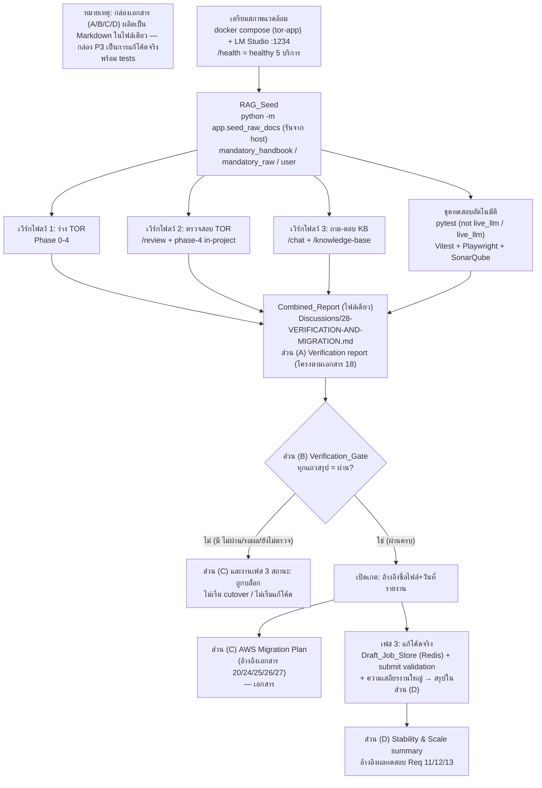

# เอกสารออกแบบ (Design Document)

## ภาพรวม (Overview)

งานนี้แบ่งเป็น **สามเฟส** ที่มีลำดับชัดเจนและมี **เกต (gate)** กั้น โดย **เฟส 1 และเฟส 2 เป็นงานวางแผนและจัดทำเอกสารเท่านั้น (planning & documentation-only)** ส่วน **เฟส 3 เป็นงานแก้ไขซอร์สโค้ดจริง (real code changes)** เพื่อทำให้ระบบย่อยการร่าง (draft) และการตรวจ (review) มีความเสถียรและรองรับงานปริมาณมาก

ผลลัพธ์เอกสารของเฟส 1 และเฟส 2 ถูก **รวมเป็นไฟล์ Markdown ฉบับเดียว (Combined_Report)** ที่เสนอไว้ที่ `Discussions/28-VERIFICATION-AND-MIGRATION.md` แทนการแยกเป็นสองไฟล์ โดยเอกสารนี้ประกอบด้วย **สี่ส่วนเรียงตามลำดับ**:

- **ส่วน (A) — Verification report** บันทึกหลักฐานการทดสอบครบวงจร (end-to-end) ของแอป TOR Generator v0.2.4 บน Local LLM สะท้อนโครงของ `Discussions/18-TEST_EVIDENCE.md`
- **ส่วน (B) — Verification_Gate divider** ส่วนคั่นที่ระบุสถานะเกตและนิยาม "ผ่านครบ" วางไว้หลังส่วน (A) และก่อนทั้งส่วน (C) และงานเฟส 3
- **ส่วน (C) — AWS Migration Plan** การจับคู่บริการ, การเปลี่ยนตัวแปรสภาพแวดล้อม, cutover, rollback, ทะเบียนความเสี่ยง โดย **อ้างอิง** เอกสารเดิม (`Discussions/20, 24, 25, 26, 27` และ `app/infra/aws/env.cloud.example`) แทนการทำซ้ำ
- **ส่วน (D) — Stability & Scale summary** สรุปงานแก้โค้ดของเฟส 3 (Req 11–13) และผลการทดสอบที่เกี่ยวข้อง ผูกกับหลักฐานในส่วน (A)

**สามเฟส (Three phases):**

1. **เฟส 1 — ตรวจสอบบน Local LLM (เอกสาร):** ผลิตเนื้อหาส่วน (A) ของ Combined_Report บันทึกหลักฐานครอบคลุมความพร้อมสภาพแวดล้อม, การ seed คลัง RAG, สามเวิร์กโฟลว์ (ร่าง TOR / ตรวจสอบ TOR / ถาม-ตอบฐานความรู้) และชุดทดสอบอัตโนมัติ
2. **เฟส 2 — วางแผนย้ายขึ้น AWS (เอกสาร):** ผลิตเนื้อหาส่วน (C) ของ Combined_Report เฟสนี้ถูก **บล็อก** จนกว่า Verification report (ส่วน A) จะแสดงผล "ผ่านครบ" ผ่านเกตในส่วน (B)
3. **เฟส 3 — ทำให้ระบบร่าง/ตรวจเสถียรและรองรับงานขนาดใหญ่ (แก้โค้ดจริง):** ปรับปรุงซอร์สโค้ดของระบบย่อยการร่าง/ตรวจให้รองรับหลายอินสแตนซ์และงานที่ใช้เวลานาน (Req 11–13) พร้อมชุดทดสอบ เฟสนี้อยู่ **หลังเกต (Verification_Gate)** เช่นเดียวกับเฟส 2 และสรุปผลไว้ในส่วน (D)

> **เกตกั้นทั้งสองงานหลังเกต:** Verification_Gate (ส่วน B) นำหน้า **ทั้งส่วนแผนย้ายระบบ (C) ของเฟส 2 และงานแก้ไขซอร์สโค้ดของเฟส 3** — ทั้งสองงานจะเริ่มได้ก็ต่อเมื่อ Verification report ผ่านครบ

**หนึ่งสิ่งส่งมอบเอกสารรวม + งานโค้ดเฟส 3 (Combined deliverable + Phase 3 code):**

| # | สิ่งส่งมอบ | ตำแหน่งที่เสนอ | เนื้อหา/อ้างอิง |
|---|-----------|----------------|-----------------|
| 1 | Combined_Report (ไฟล์เดียว) | `Discussions/28-VERIFICATION-AND-MIGRATION.md` | สี่ส่วน: (A) Verification report โครงตาม `18-TEST_EVIDENCE.md` → (B) Verification_Gate → (C) Migration Plan อ้างอิง `20/24/25/26/27` + `env.cloud.example` → (D) Stability & Scale summary |
| 2 | งานแก้โค้ดเฟส 3 | `app/api/v1/endpoints/draft_chat.py`, `app/api/v1/endpoints/projects.py` + โมดูล job-store ใหม่ + tests | Draft_Job_Store (Redis), server-side submit validation, ความเสถียรงานร่าง/ตรวจขนาดใหญ่ (สรุปผลในส่วน D) |

**นอกขอบเขต (Non-goals):** ดีพลอย AWS จริง, provision โครงสร้างพื้นฐาน, ย้ายข้อมูลจริงขึ้นคลาวด์ (การแก้ไขซอร์สโค้ดของแอปอยู่ในขอบเขตเฉพาะเฟส 3 เท่านั้น)

---

## สถาปัตยกรรม (Architecture)

สถาปัตยกรรมในที่นี้เป็น **สถาปัตยกรรมของกระบวนการ + เอกสาร + โค้ด (process/documentation-plus-code architecture)** เฟส 1–2 ผลิตเนื้อหาเอกสารรวมเข้าไฟล์เดียว ส่วนเฟส 3 เป็นการแก้โค้ดจริง แผนภาพด้านล่างแสดงไปป์ไลน์ตั้งแต่การเตรียมสภาพแวดล้อม รวมหลักฐานเป็น Combined_Report แล้วผ่านเกตไปสู่สองเส้นทางหลังเกต: (a) ส่วนแผนย้ายระบบ และ (b) งานแก้โค้ดเฟส 3



**ลำดับความสัมพันธ์เชิงตรรกะ:** การเตรียมสภาพแวดล้อม (Req 1) เป็นเงื่อนไขก่อน RAG_Seed (Req 2) ซึ่งเป็นเงื่อนไขก่อนการทดสอบสามเวิร์กโฟลว์ (Req 3–5) และชุดทดสอบ (Req 6) หลักฐานทั้งหมดถูกรวมเป็นส่วน (A) ของ Combined_Report (Req 7, 14) ซึ่งเป็นตัวควบคุม Verification_Gate ส่วน (B) (Req 8) ที่เปิดทางให้ **ทั้ง** ส่วนแผนย้ายระบบ (C) ของเฟส 2 (Req 9–10) **และ** งานแก้โค้ดเฟส 3 (Req 11–13) โดยผลเฟส 3 สรุปในส่วน (D) (Req 14.3)

---

## ส่วน (A) ของ Combined_Report: Verification report

> ส่วนนี้คือ **section (A)** ของไฟล์เดียว `Discussions/28-VERIFICATION-AND-MIGRATION.md` (เดิมเคยเสนอเป็นไฟล์แยก ปัจจุบันรวมเป็นส่วนหนึ่งของ Combined_Report ตาม Req 14)

### ตำแหน่งและรูปแบบ

- **ตำแหน่ง:** ส่วน (A) ในไฟล์ `Discussions/28-VERIFICATION-AND-MIGRATION.md` (ไม่ทับเอกสาร 18)
- **รูปแบบ:** สะท้อนโครงของ `Discussions/18-TEST_EVIDENCE.md` — ส่วนหัว (วันที่ พ.ศ., สแตก, health, ตารางโมเดล) → ตารางสรุปตัวเลข → ส่วนรายเคสพร้อมภาพ → ส่วน Coverage → ส่วน SonarQube → ส่วนคำสั่งที่รัน (รองรับ Req 7.1)

### โครงหัวข้อของส่วน (A) Verification report (Section Outline)

```
## (A) หลักฐานการตรวจสอบบน Local LLM — TOR Generator v0.2.4
0. ส่วนหัว: วันที่ (พ.ศ.), เวอร์ชันแอป v0.2.4, สแตก Docker tor-app, endpoint Local LLM, ตารางโมเดล (chat/embeddings)   [Req 7.2]
1. ความพร้อมสภาพแวดล้อม (Health + Provider + DEPLOYMENT_MODE)                                                        [Req 1]
2. การ seed คลัง RAG (คำสั่ง, exit status, จำนวนเอกสาร, จำนวนต่อกลุ่มบังคับ)                                          [Req 2]
3. เวิร์กโฟลว์ร่าง TOR (Phase 0-4 + คะแนน + สถานะโครงการ + export)                                                   [Req 3]
4. เวิร์กโฟลว์ตรวจสอบ TOR (/review + phase-4 in-project + compare-projects)                                          [Req 4]
5. เวิร์กโฟลว์ถาม-ตอบ KB (SSE, citations, attach/download/delete, ACL)                                               [Req 5]
6. ชุดทดสอบอัตโนมัติ (pytest not live_llm / live_llm, Vitest, Playwright)                                            [Req 6]
7. ตารางสรุปผลรวม (Summary Table)                                                                                    [Req 7.3, 7.4]
8. Coverage (htmlcov :8765, coverage :8766, playwright-report :8767)                                                 [Req 6.2]
9. SonarQube (:9400 quality gate)
10. คำสั่งที่รันในรอบนี้ (reproducibility)
```

### ขั้นตอนการตรวจสอบต่อเวิร์กโฟลว์ (พร้อมคำสั่งและหลักฐานที่ต้องบันทึก)

**หมายเหตุปฏิบัติที่ต้องเคารพ:** อย่า rebuild backend container ระหว่างรัน draft (คิวร่างเก็บใน `_DRAFT_JOBS` แบบ in-memory จะสูญหาย) และการรัน `seed_raw_docs` ต้องรันจาก **host** ไม่ใช่จากใน container (ชื่อ bind-mount ภาษาไทยทำให้เกิด Errno 5)

#### 2.A ความพร้อมสภาพแวดล้อม / Health (Req 1)

- คำสั่ง: `docker compose -p tor-app ps` และ `curl -m 10 http://localhost:4000/health`
- หลักฐานที่บันทึก: JSON `/health` แสดง `healthy` ครบ 5 บริการ (postgres, redis, minio, mongo, neo4j) ภายใน 10 วินาที; ค่า `DEPLOYMENT_MODE=on_prem`; `LLM_PROVIDER ∈ {lm_studio, ollama, llama_cpp, sglang}`; ตารางโมเดล (chat `google/gemma-4-e4b`, embeddings `text-embedding-embeddinggemma-300m` 768 มิติ), endpoint `http://127.0.0.1:1234/v1`
- กรณีล้มเหลว: หากบริการใดไม่ `healthy` หรือ `/health` ไม่ตอบใน 10 วินาที/เชื่อมต่อไม่ได้ → บันทึกชื่อบริการที่ไม่พร้อม/ระบุว่า Health_Endpoint เข้าไม่ถึง และตั้งผลเฟสเป็น "ไม่ผ่าน"

#### 2.B การ seed คลัง RAG (Req 2)

- คำสั่ง: `python -m app.seed_raw_docs` (รันจาก host, PDF จาก `documents/sources/`) พร้อมบันทึกวัตถุประสงค์แยกของ `seed_raw_docs` (สร้างคลังกลาง RAG ที่แชทใช้จริง), `seed_db` (ข้อมูลเริ่มต้น), `seed_kb` (ส่วนสกัดงานวิจัยเท่านั้น — ไม่ใช่คลังแชท)
- หลักฐานที่บันทึก: คำสั่งครบถ้วน, exit status สำเร็จ, จำนวนเอกสารรวมที่นำเข้า, จำนวนเอกสารพร้อมค้นต่อกลุ่ม (`mandatory_handbook ≥ 1`, `mandatory_raw ≥ 1`, กลุ่ม `user` ต่อผู้ใช้)
- กรณีพิเศษ: Neo4j ล่ม → บันทึก `graph_degraded` และยืนยันว่าแชทยังตอบจากชิ้นเวกเตอร์ได้ (คำตอบอาจว่างหากชิ้นไม่พอ)
- กรณีล้มเหลว: seed จบด้วยสถานะล้มเหลว → บันทึกสถานะล้มเหลว + ข้อความสาเหตุที่คำสั่งคืน + ยืนยันว่าไม่ใช้คลังเดิม (ก่อน seed) เป็นข้อมูลทดสอบที่ผ่าน

#### 2.C เวิร์กโฟลว์ร่าง TOR (Req 3)

- ขั้นตอน: เดิน `/projects/{id}/draft` Phase 0 (อัปโหลด/วาง + เริ่มวิเคราะห์ 27 ช่อง s1–s13 + s4.1–s4.14, fact-required s1,s2,s5,s6,s7,s4.1) → Phase 1 ตารางความครบ → Phase 2 `POST .../intake/chat` เติมช่อง (gate = fact-required ครบ, confirm-ready) → Phase 3 `/draft-chat/start` ร่าง 13 หมวด (สตรีม `section_done`/`all_done`, `DRAFT_MAX_TOKENS=32768`) → Phase 4 รีวิว
- หลักฐานที่บันทึก: ผ่าน/ไม่ผ่าน ต่อขั้น (5 ขั้น); คะแนนคุณภาพ 0–100 (rule engine น้ำหนัก legal 40% / completeness 30% / consistency 20% / format 10%, ผ่าน ≥ 70); สถานะการตรวจ `valid`/ไม่ `valid`; การเปลี่ยนสถานะ → `in_review` เมื่อ submit; ผู้ตรวจ approve→`approved` / reject→`rejected`; ผล export DOCX และ PDF แยกกัน (สำเร็จ/ไม่สำเร็จ) พร้อมยืนยันการมีอยู่ของไฟล์
- กรณีล้มเหลว: ขั้นใดล้มเหลว → บันทึกหมายเลขขั้น + ข้อความ error ที่สังเกตได้ + ยืนยันสถานะโครงการคงเดิม ไม่เลื่อนขั้น

#### 2.D เวิร์กโฟลว์ตรวจสอบ TOR (Req 4)

- ขั้นตอน (หน้า `/review`): `POST /review/extract` (preview ≤ 20000 ตัวอักษร) → confirm → (ตัวเลือก) compare-projects Jaccard 2–5 ฉบับ (โทนผ่านบนจอ ≥ 0.5) → `POST /review/run` (rule engine)
- ขั้นตอน (phase-4 in-project): `POST /projects/{id}/review` → ReviewAgent ข้อเสนอ ≤ 20 ข้อ ในหมวด compliance/clarity/completeness/consistency
- หลักฐานที่บันทึก: ข้อความสกัด (ตัวอย่าง ≤ 20000), การยืนยันเริ่มตรวจ, คะแนน 0–100 + รายการข้อค้นพบ; ค่า Jaccard 0.0–1.0 ต่อคู่; คะแนน/ข้อค้นพบ/ความเห็นรวม/ข้อเสนอแนะจาก ReviewAgent
- กรณีสำรอง: compare-projects คืน 404/405/501 → บันทึกใช้ fallback คำนวณในเบราว์เซอร์ + ค่าที่ได้; ReviewAgent คืน JSON แจงไม่สำเร็จ → บันทึกใช้ fallback และยังคืนผลจาก rule engine โดยไม่สูญคะแนน/ข้อค้นพบ

#### 2.E เวิร์กโฟลว์ถาม-ตอบ KB (Req 5)

- ขั้นตอน: `/chat` ห้อง `kind=kb`, `POST .../messages` SSE (`queued/started/token/done/error`), `search_scope=both` (ค่าเริ่มต้น); RAG hybrid_retrieve `top_k=32` สูงสุด 48 ชิ้น context 128000; แนบไฟล์ `POST .../attachments` (magic-byte PDF/DOCX/TXT ≤ 20MB → category=other) จนถึงสถานะ «ใช้กับ RAG ได้»; ดาวน์โหลด `GET /api/v1/knowledge-base/mine/{id}/file`; ทดสอบ ACL (`owner_id` scoping, `mine` คืนค่าว่างแทนรั่ว)
- หลักฐานที่บันทึก: สตรีมจบด้วย `done` + citation ≥ 1 (ระบุชื่อไฟล์ต้นฉบับ); ผลถามในขอบเขต `mine` หลังแนบไฟล์มี citation ระบุไฟล์นั้น; ผล อัปโหลด/ดาวน์โหลด/ลบ แยกกันและบันทึกทันทีที่แต่ละการกระทำเสร็จ
- กรณีล้มเหลว/ปฏิเสธ: `error` หรือไม่มี citation → บันทึกไม่ผ่าน + เหตุการณ์/ข้อความสถานะ; ไฟล์ผิดชนิด/เกิน 20MB → บันทึกว่าถูกปฏิเสธและไม่ ingest; ผู้ใช้อื่นเจ้าของไฟล์ → ยืนยันไม่ปรากฏใน `mine` และคืนค่าว่าง

#### 2.F ชุดทดสอบอัตโนมัติ (Req 6)

| ชุด | คำสั่ง | ฐานอ้างอิง (เอกสาร 18) | หลักฐาน |
|-----|--------|------------------------|---------|
| pytest `not live_llm` | `pytest -m "not live_llm and not integration" --cov=app` | ~1596 passed / 22 skipped, cov ~83% | passed/skipped/failed + coverage % (htmlcov :8765, coverage.xml) |
| pytest `live_llm` | `pytest tests/test_live_ect_tor_full.py` | 3 passed (~40 นาที) | เชื่อม LM Studio :1234 จริง (ไม่ mock) |
| Vitest | `npm run test:coverage` | ~205 passed / 48 files, lines ~82.22% | passed/failed + coverage % (:8766) |
| Playwright | `npm run test:e2e:headed` + `wizard-flow.spec.ts --headed` | ~15 passed / 3 skipped (mock-only), golden 0→4 ~19.9 นาที | เชื่อม next dev :3000 + LM Studio (:8767) |
| SonarQube | `sonar-scanner` (:9400) | quality gate OK, new_violations=0 | สถานะ quality gate |

- หลักฐานที่บันทึก: passed/skipped/failed เป็นจำนวนเต็มต่อชุด; coverage % (pytest, Vitest); ยืนยัน `live_llm`/Playwright เชื่อม Local LLM จริงไม่ใช้ mock (แม้เชื่อมจริงอาจไม่สำเร็จ)
- กรณีล้มเหลว: เคสล้มเหลว → บันทึกชื่อชุด/ชื่อเคส/สาเหตุ; ชุดที่เริ่มรันไม่ได้/รันไม่จบ → บันทึกชื่อชุด + สถานะ "รันไม่สำเร็จ" + สาเหตุ

### แม่แบบตารางสรุปผล (Summary Table Template)

| รายการ | สถานะ (ผ่าน/ไม่ผ่าน/ข้าม) | จำนวนที่ผ่าน | Coverage | หมายเหตุ |
|--------|---------------------------|--------------|----------|----------|
| ความพร้อมสภาพแวดล้อม (Health 5 บริการ) | ผ่าน | 5/5 | — | DEPLOYMENT_MODE=on_prem, lm_studio |
| RAG_Seed | ผ่าน | — | — | mandatory_handbook/raw ≥ 1 |
| เวิร์กโฟลว์ร่าง TOR | ผ่าน | 5/5 ขั้น | — | คะแนน ≥ 70, export DOCX+PDF |
| เวิร์กโฟลว์ตรวจสอบ TOR | ผ่าน | — | — | rule engine + ReviewAgent |
| เวิร์กโฟลว์ถาม-ตอบ KB | ผ่าน | — | — | citation ≥ 1, ACL ยืนยัน |
| pytest not live_llm | ผ่าน | 1596 | ~83% | 22 skipped |
| pytest live_llm | ผ่าน | 3 | — | LM Studio :1234 จริง |
| Vitest | ผ่าน | 205 | ~82% | 48 files |
| Playwright | ผ่าน | 15 | — | 3 skipped (mock-only) |

> คอลัมน์บังคับขั้นต่ำ: **รายการ / สถานะ / จำนวนที่ผ่าน** และชุดที่มี coverage ต้องระบุ **Coverage** (Req 7.3) ทุกแถวที่ไม่มีผล/ถูกข้ามต้องมี **หมายเหตุ** ระบุเหตุผล ซึ่งหมายเหตุปรากฏร่วมกับสถานะใดก็ได้ (Req 7.4)

---

## ส่วน (B) + (C) ของ Combined_Report: Verification_Gate + Migration Plan

> ส่วนแผนย้ายระบบคือ **section (C)** ของไฟล์เดียว `Discussions/28-VERIFICATION-AND-MIGRATION.md` โดยมี **section (B) Verification_Gate divider** คั่นอยู่ก่อนหน้าเสมอ (Req 14.2) เดิมเคยเสนอเป็นไฟล์แยก `29-AWS_MIGRATION_PLAN.md` ปัจจุบันรวมเป็นส่วนหนึ่งของ Combined_Report

### ตำแหน่งและหลักการ

- **ตำแหน่ง:** ส่วน (C) ในไฟล์ `Discussions/28-VERIFICATION-AND-MIGRATION.md` (ต่อจากส่วน (B))
- **หลักการ:** เป็นเนื้อหา Markdown บรรยายแนวทาง/แผนเท่านั้น **ไม่มี code diff/patch และไม่มีคำสั่ง provision/deploy จริง** (Req 9.1) ทุกรายละเอียดที่มีอยู่แล้วให้ **อ้างอิง** Reference_Docs แทนทำซ้ำ (Req 9.2)

### ส่วน (B) — ข้อความ Verification_Gate divider

ส่วนคั่นนี้ต้องปรากฏ **หลังส่วน (A) และก่อนส่วน (C)** เสมอ (Req 8, Req 14.2) และเป็นเกตกั้น **ทั้งส่วน (C) ของเฟส 2 และงานแก้โค้ดเฟส 3**:

> **สถานะเกต:** เปิด / ถูกบล็อก
> **นิยาม "ผ่านครบ":** ไม่มีรายการใดในตารางสรุปของส่วน (A) Verification report ที่มีสถานะ *ไม่ผ่าน*, *รอผล* หรือ *ยังไม่ตรวจ*
> **เงื่อนไขเปิดเกต:** อ้างอิง Verification report ที่ผ่าน โดยระบุ **ชื่อไฟล์** (`Discussions/28-VERIFICATION-AND-MIGRATION.md`) และ **วันที่** ของรายงาน (หากบันทึกการอ้างอิงล้มเหลว เกตยังเปิดได้ตราบที่รายงานผ่านครบ — Req 8.2)
> **ขอบเขตเกต:** เกตนี้กั้น **ทั้ง** ส่วน (C) Migration Plan **และ** งานแก้โค้ดเฟส 3 (Req 11–13)
> **หากไม่มี/เข้าไม่ถึงส่วน (A):** ถือว่าเกตยังไม่เปิด สถานะ = ถูกบล็อก (Req 8.4)

### ส่วน (C) — เนื้อหา Migration Plan

### ตารางจับคู่บริการ (Service Mapping) — อ้างอิงเอกสาร 25

| สแตกปัจจุบัน | บริการ AWS เป้าหมาย | หมายเหตุ (ดูรายละเอียดในเอกสาร 25/26/27) |
|--------------|----------------------|------------------------------------------|
| Next.js + FastAPI | ECS Fargate + ECR | ใช้ IAM task role |
| Postgres + pgvector | RDS PostgreSQL 16 หรือ Aurora | vector store = pgvector |
| Redis | ElastiCache | `REDIS_TLS=true` → `rediss://` |
| MinIO | S3 | `MINIO_SECURE=true`, `MINIO_USE_IAM=true` |
| MongoDB GridFS | S3 (แนะนำ) หรือ DocumentDB | DocumentDB **ไม่รองรับ** GridFS |
| Neo4j GraphRAG | Neptune openCypher หรือ `GRAPH_PROVIDER=off` | ดู Req 10.5 |
| LM Studio / SGLang | Amazon Bedrock | โมเดลแชท |
| EmbeddingGemma | Bedrock Titan | **ต้อง re-seed** (มิติต่าง) |
| ความลับ / images / เครือข่าย | Secrets Manager / ECR / VPC·ALB·CloudFront·WAF·Route53·ACM + VPC endpoints | S3/ECR/CloudWatch/Secrets/KMS/Bedrock |

### ตารางค่าตัวแปรสภาพแวดล้อมโหมดคลาวด์ — อ้างอิง `env.cloud.example` (Req 9.4, 9.5)

| ตัวแปร | ค่าโหมดคลาวด์ | หมายเหตุ |
|--------|----------------|----------|
| `DEPLOYMENT_MODE` | `cloud` | |
| `LLM_PROVIDER` | `bedrock` | ห้าม `lm_studio/ollama/llama_cpp/sglang` ใน prod |
| `EMBEDDING_PROVIDER` | `bedrock` | **ห้าม** `local` ใน prod |
| `VECTOR_STORE_PROVIDER` | `pgvector` | |
| `AWS_ACCESS_KEY_ID` / `AWS_SECRET_ACCESS_KEY` | *(ว่าง)* | ใช้ IAM task role ของ ECS |
| `BEDROCK_REGION` | `ap-southeast-1` | |
| `BEDROCK_MODEL_ID` | `anthropic.claude-3-5-sonnet-20241022-v2:0` | |
| `BEDROCK_EMBEDDING_MODEL_ID` | `amazon.titan-embed-text-v2:0` | |
| `REDIS_TLS` / `MINIO_SECURE` / `MINIO_USE_IAM` / `COOKIE_SECURE` | `true` | |

### ลำดับตัดระบบ (Cutover Sequence) — อ้างอิงเอกสาร 27 ตอน 5

แต่ละขั้นระบุ: การกระทำ / ผู้รับผิดชอบ / เงื่อนไขก่อนเริ่ม / เกณฑ์ตรวจสอบสำเร็จ (Req 10.1)

| # | การกระทำ | ผู้รับผิดชอบ | เงื่อนไขก่อนเริ่ม (precondition) | เกณฑ์ตรวจสอบ (verification) |
|---|----------|-------------|----------------------------------|------------------------------|
| 1 | ตั้ง VPC + RDS + ElastiCache + S3 + เปิดใช้ Bedrock | Cloud Eng | เกตเปิด (Verification ผ่าน) | ทรัพยากรพร้อม, VPC endpoints ตอบสนอง |
| 2 | ย้าย schema + รัน `seed_db` | Backend Eng | ขั้น 1 สำเร็จ | migration สำเร็จ, ข้อมูลเริ่มต้นครบ |
| 3 | seed คลังด้วย Titan (re-seed embeddings) | Backend Eng | ขั้น 2 + ปรับมิติ vector แล้ว | เอกสารพร้อมค้นต่อกลุ่มบังคับ ≥ 1 |
| 4 | ชี้ DNS ไป UAT สำหรับกลุ่มเล็ก | Ops | ขั้น 3 สำเร็จ | เข้าถึง UAT ได้ |
| 5 | ตรวจสอบ (analyze 27 ช่อง + review ไฟล์ + ร่าง 1 หมวดบน Bedrock) | Verification_Author | ขั้น 4 สำเร็จ | สามรายการผ่านบน Bedrock |
| 6 | ปลด dev Compose ออกจากเครือข่ายองค์กร | Ops | ขั้น 5 ผ่าน | ไม่มีทราฟฟิกไป dev เดิม |

### แผนย้อนกลับ (Rollback Plan) — ลำดับแยกจาก cutover (Req 10.2, 10.3)

- **Rollback trigger:** ขั้น cutover ใดไม่ผ่านเกณฑ์ตรวจสอบ (โดยเฉพาะขั้น 5)
- **สถานะเป้าหมายหลังย้อนกลับ:** ระบบ on-prem `tor-app` เดิมบน Local LLM ให้บริการได้ตามปกติ, DNS ชี้กลับ on-prem

| # | ขั้นย้อนกลับ | รายละเอียด |
|---|--------------|-------------|
| 1 | ชี้ DNS กลับ on-prem | ยกเลิกการชี้ UAT |
| 2 | ปิดการรับทราฟฟิกที่ ECS (desiredCount=0) | หยุดฝั่งคลาวด์ |
| 3 | ยืนยัน on-prem `/health` = healthy 5 บริการ | คืนสถานะเป้าหมาย |
| 4 | บันทึกสาเหตุและเก็บ artifact คลาวด์ไว้วิเคราะห์ | ไม่ลบทันที |

### ทะเบียนความเสี่ยง (Risk Register) — อย่างน้อย 2 รายการ (Req 10.4, 10.5)

| # | ความเสี่ยง | ผลกระทบ | แนวทางบรรเทา + ผู้รับผิดชอบ |
|---|-----------|---------|------------------------------|
| 1 | Titan มิติเวกเตอร์ต่างจาก EmbeddingGemma (768) | ค้น RAG ผิด/ล้มเหลว | Alembic `ALTER` `kb_chunks.embedding` + ตั้ง `EMBEDDING_DIMENSIONS` + **re-seed** ด้วย Titan (อ้างเอกสาร 27) — Backend Eng |
| 2 | คิวร่างเก็บ in-memory (`_DRAFT_JOBS`) | หลายอินสแตนซ์ทำงานร่างพัง | จำกัด ECS backend `desiredCount=1` จนกว่าจะย้าย job ออกนอกโปรเซส (Redis/SQS) — Backend Eng |
| 3 | ย้าย Neo4j GraphRAG | GraphRAG ไม่พร้อม | ใช้ Neptune openCypher หรือ `GRAPH_PROVIDER=off` เปิด pgvector-only ก่อน (อ้างเอกสาร 25, 27) — Cloud Eng |

---

## เฟส 3: การแก้โค้ดเพื่อความเสถียรและสเกล (Stability & Scale — Code Design)

> **นี่คือส่วนแก้โค้ดจริง** ไม่ใช่เอกสาร งานเฟสนี้อยู่ **หลังเกต (Verification_Gate)** เช่นเดียวกับเฟส 2 และผลการทดสอบสรุปไว้ในส่วน (D) ของ Combined_Report ส่วนนี้บรรยาย **อินเทอร์เฟซ, สคีมาคีย์ Redis และขั้นตอน** เท่านั้น ไม่ใส่ซอร์สโค้ดเต็ม

### ข้อเท็จจริงของโค้ดปัจจุบัน (Grounding)

- **คิวงานร่างเก็บในหน่วยความจำ:** `_DRAFT_JOBS: dict[str, asyncio.Task[int]]` คีย์ด้วย `project_id` ใน `app/api/v1/endpoints/draft_chat.py` เริ่มงานผ่าน `_run_sequential_draft`; การเรียกซ้ำ (dedup) ใช้ task ที่กำลังรันอยู่เดิม; เหตุการณ์ SSE = `progress`, `section_done`, `subsection_done`, `all_done`; สถานะถูก poll ผ่าน `draft-chat/status` (แถวราย section + `drafted_count`/`total`) ทุก 4 วินาที
- **แบบอย่างคิว admission ที่มีอยู่แล้ว (ต้นแบบให้ mirror):** `app/llm_admission.py` ใช้ `redis.hset(key, mapping=...)` + `redis.expire(key, 600)`; **fail-open เมื่อ `redis is None`** (wire ผ่าน `app.state`); ฟิลด์เช่น `status`/`kind`/`updated_at`
- **เกตการส่งตรวจ (submit gate):** `officer_can_submit(status, current_phase, has_review_score)` ใน `app/api/v1/endpoints/projects.py` ปัจจุบันตรวจ **status อย่างเดียว**; `submit_project` (POST `/projects/{id}/submit`) ตั้งสถานะ `in_review`; โมเดล `TORSection`: `section_key`, `sub_key`, `content`, `ai_draft`, `is_approved`; กฎ `isSectionFilled`: s1–s13 ถือว่าครบเมื่อมี content หลัก **หรือ** (เฉพาะ s4) มี s4.1–s4.14 ที่กรอกแล้วอย่างน้อยหนึ่งหัวข้อ

### Req 11 — Draft_Job_Store (Redis)

**เป้าหมาย:** ย้ายสถานะงานร่างออกจาก `_DRAFT_JOBS` ไปไว้ที่เก็บนอกโปรเซส เพื่อให้อ่านสถานะได้ข้ามอินสแตนซ์ และปลดล็อกข้อจำกัด ECS `desiredCount=1`

**สคีมาคีย์ Redis (hash):** คีย์ `draft:job:{project_id}` — mirror รูปแบบของ `llm_admission` (ใช้ `hset(mapping=...)` + `expire(key, 600)`)

| ฟิลด์ | ชนิด | ความหมาย |
|-------|------|----------|
| `status` | string | `queued` / `running` / `done` / `failed` |
| `drafted_count` | int | จำนวนหมวดที่ร่างเสร็จ (0 ถึง total) |
| `total` | int | จำนวนหัวข้อทั้งหมด |
| `updated_at` | epoch/ISO | เวลาปรับปรุงล่าสุด |
| **TTL** | — | 600 วินาที (ตั้งผ่าน `expire` ทุกครั้งที่เขียน) |

**การผูกเข้ากับ endpoint เดิม (ไม่แตะสัญญา SSE):**
- `draft-chat/start` — เขียน/ปรับปรุงระเบียนเมื่อสร้างงาน (`queued`→`running`) และทุกครั้งที่ `drafted_count` เพิ่ม (ภายใน 5 วินาทีหลังเปลี่ยน)
- `draft-chat/status` — **อ่านจาก Draft_Job_Store โดยตรง** (ทำให้อินสแตนซ์อื่นที่ไม่ได้เริ่มงานยังตอบสถานะล่าสุดได้)
- สัญญา SSE (`progress`, `section_done`, `subsection_done`, `all_done`) และลำดับเหตุการณ์/payload **คงเดิมทุกประการ**

**Fail-open (degrade gracefully):** หาก Redis ไม่พร้อม/อ่าน-เขียนล้มเหลว → ถอยกลับใช้ `_DRAFT_JOBS` ในหน่วยความจำ (โหมดอินสแตนซ์เดียว) และดำเนินการร่างต่อได้ ไม่ทำให้ทั้งงานล้มเหลว — mirror พฤติกรรม `redis is None` ของ `llm_admission`

**Stale-running detection:** เมื่ออ่านสถานะ ถ้า `status=running` แต่ `updated_at` เก่ากว่า 600 วินาที → รายงานเป็น `failed` (แทน running ค้าง/หายเงียบ) และคง `drafted_count` เดิมของหมวดที่ทำสำเร็จไว้

**คำอธิบายการเปลี่ยนสถานะ (state transitions):**
```
(สร้างงาน) → queued → running → done      (ร่างครบ total)
                         │
                         └────────→ failed  (ล้มเหลว หรือ stale-running > 600s)
running: drafted_count += 1 ต่อหมวดที่เสร็จ (เขียนพร้อม updated_at ปัจจุบัน)
```

**หมายเหตุ ECS:** เมื่อ Draft_Job_Store ลงระบบแล้ว ข้อจำกัด backend `desiredCount=1` (ความเสี่ยงข้อ 2 ในส่วน C) จะถูก **ปลดล็อก** ให้สเกลแนวนอนได้

### Req 12 — Server-side submit validation

**เป้าหมาย:** ขยาย `officer_can_submit` / `submit_project` ให้ตรวจ **ความครบของทั้ง 13 หมวด** ฝั่งเซิร์ฟเวอร์ ไม่ใช่ตรวจ status อย่างเดียว — เสริม (ไม่แทนที่) เกตฝั่ง UI

**ตรรกะ:**
1. Query แถว `TORSection` ของโครงการ แล้วประเมิน `isSectionFilled` ต่อ s1–s13 (s4 ครบเมื่อมี s4.1–s4.14 ที่กรอกแล้วอย่างน้อยหนึ่ง หรือมี content หลัก)
2. คงเกต status เดิม: อนุญาตเฉพาะสถานะ `draft` หรือ `rejected`
3. **ครบ + status ถูกต้อง** → เปลี่ยนเป็น `in_review` และตอบกลับตาม **response contract เดิม**
4. **ไม่ครบ** → ปฏิเสธด้วย HTTP 4xx พร้อมข้อความ **ระบุรายการ `section_key`/`sub_key` ที่ยังขาด** และคงสถานะโครงการเดิม
5. **status ไม่ใช่ draft/rejected** → ปฏิเสธด้วย HTTP 4xx คงสถานะเดิม
6. เมื่อปฏิเสธ → **ไม่เปลี่ยนสถานะและไม่บันทึกเหตุการณ์ submit** และการตรวจต้องบังคับที่ endpoint เสมอไม่ว่า UI ส่งค่ามาอย่างไร

### Req 13 — ความเสถียรของงานร่าง/ตรวจขนาดใหญ่และใช้เวลานาน

- **ทำงานต่อแม้ SSE หลุด:** background task ทำงานต่อจนครบ 13 หมวดแม้ client หลุด (พฤติกรรมนี้เป็นจริงอยู่แล้ว) บันทึกความคืบหน้าราย section ลง Draft_Job_Store ทุกครั้งที่หมวดหนึ่งเสร็จ
- **Resume-progress เมื่อ reconnect:** เมื่อ client เชื่อม SSE ใหม่ระหว่างงานยังรัน → ส่งความคืบหน้าล่าสุด (หมวดที่เสร็จ + หมวดที่กำลังทำ) จาก Draft_Job_Store กลับภายใน 4 วินาที โดยไม่เริ่มงานใหม่
- **Per-section failure isolation:** หากการเรียกโมเดลของหมวดใดล้มเหลวหรือใช้เวลาเกิน 1800 วินาที/หมวด → มาร์กหมวดนั้น `failed` พร้อมเหตุผล แล้ว **ทำหมวดถัดไปต่อทันที** ไม่ค้างทั้งงาน
- **Idempotent start ตาม project_id:** ถ้าเรียกเริ่มงานสำหรับ `project_id` เดิมขณะงานเดิมยังรัน (ยังไม่ `done`/`failed`) → ไม่สร้างงานใหม่ คืน reference งานเดิม (ทำให้เป็นทางการจากพฤติกรรม dedup ที่มีอยู่)
- **แนวทางทดสอบโหลด:** review pack สูงสุด 200,000 อักขระ, paste สูงสุด 500,000 อักขระ, งานร่างพร้อมกัน ≥ 3 งานต่างโครงการ — บันทึกหลักฐาน (สถานะสำเร็จ/ล้มเหลว + เวลาต่องาน) ไว้ในส่วน (D) ของ Combined_Report

### Data model / อินเทอร์เฟซ (Phase 3)

**สคีมาคีย์ Redis:** `draft:job:{project_id}` (hash) พร้อมฟิลด์ตามตาราง Req 11 ข้างต้น + TTL 600s

**อินเทอร์เฟซ job-store (ชื่อเท่านั้น ไม่ใส่โค้ด):** โมดูลใหม่ (เช่น `app/draft_job_store.py`) ที่ mirror สไตล์ `llm_admission`
- `set_job(project_id, status, drafted_count, total)` — เขียน hash + ตั้ง TTL 600s + `updated_at` ปัจจุบัน (fail-open เมื่อ redis None)
- `bump_progress(project_id, drafted_count)` — ปรับ `drafted_count` + `updated_at`
- `mark_status(project_id, status)` — เปลี่ยน `status` (running/done/failed) + `updated_at`
- `get_job(project_id)` — อ่านระเบียน; ถ้า `running` แต่ `updated_at` เก่ากว่า 600s → คืน `failed`; ถ้า Redis ไม่พร้อม → อ่านจาก `_DRAFT_JOBS` ในหน่วยความจำ

**จุดเสียบเข้ากับ draft_chat endpoints:** `draft-chat/start` เรียก `set_job`/`bump_progress`/`mark_status` ระหว่าง `_run_sequential_draft`; `draft-chat/status` เรียก `get_job` — โดย **ไม่เปลี่ยน** โครง event/payload ของ SSE

### กลยุทธ์การทดสอบเฟส 3 (Testing Strategy — Phase 3)

เฟสนี้ **มีโค้ดจริง** จึงใช้ทั้ง unit test และ property-based test (ต่างจากเฟส 1–2 ที่เป็นเอกสารล้วน)

- **Unit tests — job-store:** เขียน/อ่านระเบียน, TTL 600s, การตรวจ stale-running (`updated_at` > 600s → failed), และ **การ fallback เมื่อ Redis ไม่พร้อม** (ใช้ in-memory ต่อได้)
- **Unit tests — submit validation:** กรณีครบทั้ง 13 หมวด (→ in_review), ไม่ครบ (→ 4xx + รายการที่ขาด), สถานะผิด (ไม่ใช่ draft/rejected → 4xx), และยืนยันว่าปฏิเสธแล้วไม่เปลี่ยนสถานะ/ไม่บันทึก event
- **Load / concurrency tests (notes):** review pack 200k อักขระ, paste 500k อักขระ, งานร่าง ≥ 3 งานพร้อมกันต่างโครงการ — บันทึกเวลาต่องานและสถานะปลายทาง ผลรวบไว้ในส่วน (D)
- **การกำหนดค่า property test:** ไลบรารีที่มีอยู่ในโปรเจกต์ (Hypothesis สำหรับ pytest) อย่างน้อย 100 รอบต่อ property; แท็กแต่ละเทสต์อ้างอิง property ในเอกสารนี้ รูปแบบแท็ก **Feature: local-llm-verification-aws-migration-plan, Property {number}: {property_text}**

---

## รายละเอียดขั้นตอนการตรวจสอบ (Verification Procedures Detail)

เช็กลิสต์ต่อเวิร์กโฟลว์ พร้อมแมประหว่างการตรวจกับ requirement/AC ที่รองรับ

### เช็กลิสต์ A — สภาพแวดล้อม (Req 1)

- [ ] `/health` = healthy ครบ 5 บริการ ภายใน 10 วินาที — **AC 1.1**
- [ ] บันทึก provider + โมเดลแชท + โมเดล embeddings — **AC 1.2**
- [ ] มีบริการไม่ healthy → บันทึกชื่อ + ผล "ไม่ผ่าน" — **AC 1.3**
- [ ] `DEPLOYMENT_MODE=on_prem` และ `LLM_PROVIDER` เป็น local — **AC 1.4**
- [ ] `/health` ไม่ตอบใน 10 วินาที/เชื่อมไม่ได้ → บันทึกเข้าไม่ถึง + "ไม่ผ่าน" — **AC 1.5**

### เช็กลิสต์ B — RAG_Seed (Req 2)

- [ ] บันทึกคำสั่ง seed + exit status + จำนวนเอกสารรวม — **AC 2.1**
- [ ] ยืนยัน `seed_raw_docs` รันจาก host + เหตุผล Errno 5 — **AC 2.2**
- [ ] จำนวนต่อกลุ่ม: `mandatory_handbook ≥ 1`, `mandatory_raw ≥ 1` — **AC 2.3**
- [ ] Neo4j ล่ม → `graph_degraded` + แชทตอบจากเวกเตอร์ — **AC 2.4**
- [ ] seed ล้มเหลว → สถานะ + สาเหตุ + ไม่ใช้คลังเดิมเป็นผลผ่าน — **AC 2.5**
- [ ] แยกวัตถุประสงค์ `seed_raw_docs`/`seed_db`/`seed_kb` — **AC 2.6**

### เช็กลิสต์ C — ร่าง TOR (Req 3)

- [ ] ผ่าน/ไม่ผ่าน ต่อ Phase 0–4 (27 ช่อง, 13 หมวด) — **AC 3.1**
- [ ] คะแนน 0–100 + ผ่านเกณฑ์ ≥ 70 — **AC 3.2**
- [ ] สถานะการตรวจ `valid`/ไม่ `valid` — **AC 3.3**
- [ ] submit → `in_review` — **AC 3.4**
- [ ] approve → `approved` / reject → `rejected` — **AC 3.5**
- [ ] export DOCX + PDF แยกกัน + ยืนยันไฟล์มีอยู่ — **AC 3.6**
- [ ] ขั้นล้มเหลว → หมายเลขขั้น + error + สถานะคงเดิม — **AC 3.7**

### เช็กลิสต์ D — ตรวจสอบ TOR (Req 4)

- [ ] `/review`: สกัด ≤ 20000 + คะแนน 0–100 + ข้อค้นพบ (≥ 70 โทนผ่าน) — **AC 4.1**
- [ ] compare-projects 2–5 ฉบับ: Jaccard 0.0–1.0 (≥ 0.5 โทนผ่าน) — **AC 4.2**
- [ ] compare-projects 404/405/501 → fallback ในเบราว์เซอร์ + ค่า — **AC 4.3**
- [ ] phase-4: คะแนน + ข้อค้นพบ + ความเห็นรวม + ReviewAgent ≤ 20 ข้อ 4 หมวด — **AC 4.4**
- [ ] ReviewAgent JSON แจงไม่สำเร็จ → fallback rule engine ไม่สูญผล — **AC 4.5**

### เช็กลิสต์ E — ถาม-ตอบ KB (Req 5)

- [ ] `/chat` `both`: สตรีมจบ `done` + citation ≥ 1 ระบุไฟล์ — **AC 5.1**
- [ ] `error`/ไม่มี citation → ไม่ผ่าน + เหตุการณ์ + สถานะ — **AC 5.2**
- [ ] แนบ PDF/DOCX/TXT ≤ 20MB → category=other → «ใช้กับ RAG ได้» → ถาม `mine` มี citation — **AC 5.3**
- [ ] ไฟล์ผิดชนิด/เกิน 20MB → ปฏิเสธ ไม่ ingest — **AC 5.4**
- [ ] อัปโหลด/ดาวน์โหลด/ลบ บันทึกทันทีแยกกัน — **AC 5.5**
- [ ] `mine` ต่อไฟล์ผู้อื่น → ไม่ปรากฏ + คืนค่าว่าง (ACL) — **AC 5.6**

### เช็กลิสต์ F — ชุดทดสอบ (Req 6)

- [ ] passed/skipped/failed ต่อชุด (4 ชุด) — **AC 6.1**
- [ ] coverage % (pytest, Vitest) — **AC 6.2**
- [ ] ยืนยัน live_llm/Playwright เชื่อม Local LLM จริงไม่ mock — **AC 6.3**
- [ ] เคสล้มเหลว → ชุด/เคส/สาเหตุ — **AC 6.4**
- [ ] ชุดรันไม่สำเร็จ → ชื่อชุด + สถานะ + สาเหตุ — **AC 6.5**

---

## ข้อมูล / แม่แบบ (Data / Templates)

แม่แบบ Markdown ที่นำกลับมาใช้ซ้ำได้ในทุกส่วนของ Combined_Report

### แม่แบบแถวตารางสรุป (Summary row)

```markdown
| <ชื่อรายการ> | <ผ่าน|ไม่ผ่าน|ข้าม> | <จำนวนที่ผ่าน หรือ —> | <Coverage % หรือ —> | <หมายเหตุ> |
```

### แม่แบบบล็อกหลักฐานต่อเวิร์กโฟลว์ (Evidence block)

```markdown
### <ชื่อเวิร์กโฟลว์/ขั้น>
- **ผล:** ผ่าน | ไม่ผ่าน | ข้าม
- **คำสั่งที่รัน:** `<command>`
- **สิ่งที่สังเกตได้:** <ตัวเลข/สถานะ/สตริงที่ระบบคืน>
- **อ้างอิง AC:** <Req X.Y>

```

### แม่แบบแถวความเสี่ยง (Risk row)

```markdown
| <#> | <คำอธิบายความเสี่ยง> | <ผลกระทบ> | <แนวทางบรรเทา> — <ผู้รับผิดชอบ> |
```

### แม่แบบแถวขั้นตอน cutover (Cutover step row)

```markdown
| <#> | <การกระทำ> | <ผู้รับผิดชอบ> | <เงื่อนไขก่อนเริ่ม> | <เกณฑ์ตรวจสอบสำเร็จ> |
```

---

## การจัดการข้อผิดพลาด (Error Handling)

เนื่องจากสิ่งส่งมอบเป็นเอกสาร การ "จัดการข้อผิดพลาด" คือ **วิธีที่รายงานบันทึกความล้มเหลว** ให้ตรวจสอบย้อนกลับได้

| สถานการณ์ | วิธีบันทึกในเอกสาร | รองรับ AC |
|-----------|--------------------|-----------|
| Health เข้าไม่ถึง/ไม่ตอบใน 10 วินาที | บันทึก "Health_Endpoint เข้าไม่ถึง" + ตั้งผลเฟส "ไม่ผ่าน" | 1.5 |
| บริการไม่ healthy | ระบุชื่อบริการที่ไม่พร้อมทั้งหมด + ผล "ไม่ผ่าน" | 1.3 |
| seed ล้มเหลว | สถานะล้มเหลว + ข้อความสาเหตุ + ยืนยันไม่ใช้คลังเดิมเป็นผลผ่าน | 2.5 |
| ขั้นเวิร์กโฟลว์ล้มเหลว | หมายเลขขั้น + error ที่สังเกตได้ + สถานะคงเดิม | 3.7 |
| API สำรอง (compare/ReviewAgent) | บันทึกใช้ fallback + ผลที่ยังได้ | 4.3, 4.5 |
| สตรีม KB error/ไม่มี citation | ไม่ผ่าน + เหตุการณ์ + สถานะ | 5.2 |
| ชุดทดสอบรันไม่สำเร็จ | ชื่อชุด + "รันไม่สำเร็จ" + สาเหตุ | 6.5 |
| แถวสรุปไม่มีผล/ถูกข้าม | หมายเหตุระบุเหตุผล (ปรากฏได้กับทุกสถานะ) | 7.4 |
| ไม่มี/เข้าไม่ถึงส่วน (A) Verification report | ส่วน (C) + เฟส 3 สถานะ "ถูกบล็อก" | 8.4 |
| บันทึกอ้างอิงรายงานล้มเหลวแต่รายงานผ่านครบ | เกตยังเปิดได้ | 8.2 |

---

## กลยุทธ์การทดสอบ (Testing Strategy)

กลยุทธ์การทดสอบแบ่งตามลักษณะงาน: **เฟส 1–2 เป็นเอกสาร** จึงใช้ **เกณฑ์รีวิวเอกสาร (document review criteria)** เพื่อยืนยันความถูกต้องครบถ้วนของสี่ส่วนใน Combined_Report ส่วน **เฟส 3 เป็นโค้ดจริง** จึงใช้ unit test + property-based test (ดูหัวข้อ "กลยุทธ์การทดสอบเฟส 3" ในส่วนออกแบบเฟส 3)

### เกณฑ์รีวิวส่วน (A) Verification report

- [ ] มีทุกหัวข้อตามโครงเอกสาร 18 (ส่วนหัว, ตารางสรุป, รายเคส+ภาพ, Coverage) — Req 7.1
- [ ] ส่วนหัวระบุวันที่ พ.ศ., `v0.2.4`, สแตก `tor-app`, endpoint Local LLM — Req 7.2
- [ ] ตารางสรุปมีคอลัมน์ รายการ/สถานะ/จำนวนที่ผ่าน + Coverage สำหรับชุดที่มี — Req 7.3
- [ ] ทุกแถวมีค่าสถานะ (ผ่าน/ไม่ผ่าน/ข้าม) — ไม่มีเซลล์ว่าง
- [ ] แถวไม่มีผล/ถูกข้ามมีหมายเหตุ — Req 7.4
- [ ] ทุกลิงก์ภาพชี้ไฟล์ที่มีอยู่จริงใน `Discussions/test-evidence/` — Req 7.5
- [ ] ทุก AC ของ Req 1–6 มีหลักฐานครอบคลุมในเอกสาร

### เกณฑ์รีวิวส่วน (B)+(C) Verification_Gate + Migration Plan

- [ ] มีส่วน (B) Verification_Gate divider หลังส่วน (A) และก่อนส่วน (C) + นิยาม "ผ่านครบ" — Req 8.1, 8.3, 14.2
- [ ] ไม่มี code diff/patch และไม่มีคำสั่ง provision/deploy จริง — Req 9.1
- [ ] อ้างอิงเอกสาร 20/24/25/26/27 + `env.cloud.example` (ลิงก์/ชื่อไฟล์) ไม่ทำซ้ำ — Req 9.2
- [ ] ตารางจับคู่บริการครอบคลุม MinIO→S3, PG→RDS/Aurora, Redis→ElastiCache, backend→ECS Fargate (IAM role), Local LLM→Bedrock — Req 9.3
- [ ] ตัวแปรคลาวด์ครบ + ห้าม `EMBEDDING_PROVIDER=local` + AWS keys ว่าง — Req 9.4
- [ ] ค่า Bedrock: region `ap-southeast-1`, model IDs ถูกต้อง — Req 9.5
- [ ] cutover เรียงเลขต่อเนื่อง แต่ละขั้นมี การกระทำ/ผู้รับผิดชอบ/precondition/verification — Req 10.1
- [ ] rollback มี trigger + สถานะเป้าหมาย + ลำดับเริ่มจาก 1 แยกจาก cutover — Req 10.2, 10.3
- [ ] ความเสี่ยง ≥ 2 ครอบคลุม Titan re-seed + draft queue desiredCount=1 + Neptune/`GRAPH_PROVIDER` — Req 10.4, 10.5

### เกณฑ์รีวิวส่วน (D) Stability & Scale summary + โครง Combined_Report

- [ ] Combined_Report เป็นไฟล์เดียวมีครบสี่ส่วนเรียงลำดับ A→B→C→D — Req 14.1, 14.4
- [ ] ส่วน (B) อยู่หลัง (A) และก่อน (C) เสมอ — Req 14.2
- [ ] ส่วน (D) อ้างอิงผลทดสอบ Req 11/12/13 และผูกกับผลตรวจในส่วน (A) — Req 14.3
- [ ] ส่วนใดยังไม่มีเนื้อหา → แสดงหัวข้อ + สถานะ "ยังไม่จัดทำ" ไม่ละเว้นหัวข้อ — Req 14.5
- [ ] ส่วน (D) บันทึกผลทดสอบโหลด (review pack 200k, paste 500k, ≥ 3 งานร่างพร้อมกัน) พร้อมสถานะ/เวลาต่องาน — Req 13.5

### เกณฑ์รีวิวร่วม (ทุกส่วนของ Combined_Report)

- [ ] ตารางทุกตารางไม่มีเซลล์ว่าง (ใช้ `—` แทน "ไม่มีค่า")
- [ ] ลิงก์ภายในและลิงก์เอกสารอ้างอิงทั้งหมด resolve ได้
- [ ] ไม่แนะนำตัวแปร prod ต้องห้าม (`LLM_PROVIDER=lm_studio/ollama/llama_cpp/sglang`, `EMBEDDING_PROVIDER=local`)

---

## Correctness Properties

*Property คือคุณสมบัติที่ต้องเป็นจริงเสมอในทุกการทำงานที่ถูกต้องของระบบ* ในเอกสารนี้แบ่งเป็นสองกลุ่ม: **P1–P7 เป็นค่าคงที่เชิงเอกสาร (documentation invariants)** ของ Combined_Report ส่วน (A)–(C) ที่ใช้เป็นเกณฑ์ตรวจรับ (ไม่มีโค้ด) ส่วน **P8–P11 เป็น property ของโค้ดจริงเฟส 3** ที่ต้องพิสูจน์ด้วย property-based test (อย่างน้อย 100 รอบต่อ property)

### Property 1: เกตปิดเว้นแต่ผ่านครบ
*สำหรับทุก* Verification_Report หาก **มีอย่างน้อยหนึ่งแถว** ในตารางสรุปที่สถานะ *ไม่ผ่าน*, *รอผล* หรือ *ยังไม่ตรวจ* แล้ว Migration_Plan จะต้องแสดงสถานะ **ถูกบล็อก** เสมอ
**Validates: Requirements 8.1, 8.3, 8.4**

### Property 2: ทุกแถวสรุปมีสถานะ
*สำหรับทุก* แถวในตารางสรุปของ Verification_Report ต้องมีค่าสถานะหนึ่งค่าใน {ผ่าน, ไม่ผ่าน, ข้าม} เสมอ (ไม่มีเซลล์สถานะว่าง)
**Validates: Requirements 7.3, 7.4**

### Property 3: แผนอ้างอิงไม่ทำซ้ำ
*สำหรับทุก* รายละเอียดที่มีอยู่แล้วใน Reference_Docs (20/24/25/26/27, `env.cloud.example`) Migration_Plan ต้องอ้างอิงด้วยลิงก์/ชื่อไฟล์ ไม่คัดลอกเนื้อหาซ้ำ
**Validates: Requirements 9.1, 9.2**

### Property 4: ไม่แนะนำค่า prod ต้องห้าม
*สำหรับทุก* ค่าตัวแปรสภาพแวดล้อมที่ Migration_Plan แนะนำในโหมด production ต้องไม่มี `LLM_PROVIDER ∈ {lm_studio, ollama, llama_cpp, sglang}` และไม่มี `EMBEDDING_PROVIDER=local` และ `AWS_ACCESS_KEY_ID`/`AWS_SECRET_ACCESS_KEY` ต้องว่าง
**Validates: Requirements 9.4**

### Property 5: ลิงก์ภาพต้องมีอยู่จริง
*สำหรับทุก* ลิงก์ภาพใน Verification_Report ไฟล์ปลายทางต้องมีอยู่จริงใน `Discussions/test-evidence/`
**Validates: Requirements 7.5**

### Property 6: cutover และ rollback เป็นลำดับแยกกัน
*สำหรับทุก* Migration_Plan ลำดับ rollback ต้องเริ่มนับจาก 1 และเป็นชุดเลขลำดับแยกจากลำดับ cutover
**Validates: Requirements 10.2**

### Property 7: ทุก failure-path บันทึกได้
*สำหรับทุก* สถานการณ์ล้มเหลวที่นิยามใน Req 1–6 (health ไม่ถึง, seed ล้ม, ขั้นเวิร์กโฟลว์ล้ม, ชุดทดสอบรันไม่ได้) Verification report (ส่วน A) ต้องมีที่บันทึกผลและสาเหตุที่สังเกตได้
**Validates: Requirements 1.3, 1.5, 2.5, 3.7, 6.5**

> **P8–P11 ต่อไปนี้เป็น property ของโค้ดจริงเฟส 3** (พิสูจน์ด้วย property-based test อย่างน้อย 100 รอบต่อ property)

### Property 8: สถานะงานร่างอ่านได้ข้ามอินสแตนซ์
*สำหรับทุก* งานร่างและทุกลำดับการปรับปรุงสถานะ ค่าที่อ่านจาก `draft-chat/status` (ผ่าน Draft_Job_Store) จากอินสแตนซ์ใด ๆ ต้องเท่ากับค่าที่ถูกบันทึกล่าสุด (updated_at ล่าสุด) ของ `status`/`drafted_count`/`total`
**Validates: Requirements 11.1, 11.2, 11.3**

### Property 9: submit ถูกปฏิเสธก็ต่อเมื่อไม่ครบหรือสถานะผิด
*สำหรับทุก* โครงการและสถานะ การส่ง submit จะถูก **ปฏิเสธก็ต่อเมื่อ (iff)** มีอย่างน้อยหนึ่งใน s1–s13 ที่ไม่ผ่าน `isSectionFilled` **หรือ** สถานะไม่อยู่ใน {`draft`, `rejected`}; และเมื่อปฏิเสธ สถานะโครงการต้องคงเดิม
**Validates: Requirements 12.1, 12.2, 12.3, 12.4, 12.5**

### Property 10: งานร่างเดินไปถึงสถานะปลายทางเสมอ
*สำหรับทุก* งานร่าง ไม่ว่ามี SSE client เชื่อมต่ออยู่หรือไม่ งานต้องดำเนินไปถึงสถานะปลายทาง (`done` หรือ `failed`) เสมอ โดยหมวดที่ล้มเหลว/หมดเวลา (>1800s) ถูกมาร์ก failed แล้วดำเนินหมวดถัดไปต่อ ไม่ค้างที่ `running` ค้างถาวร
**Validates: Requirements 13.1, 13.3, 11.4**

### Property 11: สัญญา SSE เข้ากันได้กับ frontend เดิม
*สำหรับทุก* งานร่าง ลำดับและ payload ของเหตุการณ์ SSE (`progress`, `section_done`, `subsection_done`, `all_done`) ต้อง byte-compatible กับที่ frontend เดิมคาดหวัง ไม่เปลี่ยนจากพฤติกรรมก่อนแก้โค้ด
**Validates: Requirements 11.6, 13.2**

---

## หมายเหตุการสืบสาวความต้องการ (Requirements Traceability)

| ส่วนของ Design | Requirement ที่รองรับ |
|-----------------|------------------------|
| ส่วน (A) §2.A + เช็กลิสต์ A | Req 1 |
| ส่วน (A) §2.B + เช็กลิสต์ B | Req 2 |
| ส่วน (A) §2.C + เช็กลิสต์ C | Req 3 |
| ส่วน (A) §2.D + เช็กลิสต์ D | Req 4 |
| ส่วน (A) §2.E + เช็กลิสต์ E | Req 5 |
| ส่วน (A) §2.F + เช็กลิสต์ F | Req 6 |
| ส่วน (A) (โครงหัวข้อ + แม่แบบตารางสรุป) | Req 7 |
| ส่วน (B) Verification_Gate divider | Req 8 |
| ส่วน (C) (จับคู่บริการ + ตัวแปรคลาวด์) | Req 9 |
| ส่วน (C) (cutover + rollback + risk register) | Req 10 |
| เฟส 3 §Req 11 — Draft_Job_Store (Redis) + P8, P10, P11 | Req 11 |
| เฟส 3 §Req 12 — Server-side submit validation + P9 | Req 12 |
| เฟส 3 §Req 13 — ความเสถียรงานใหญ่ + P10; ส่วน (D) สรุปผลทดสอบโหลด | Req 13 |
| ภาพรวม/สถาปัตยกรรม (Combined_Report สี่ส่วน A/B/C/D) + ส่วน (D) Stability & Scale summary | Req 14 |

> เอกสารออกแบบนี้อธิบายการผลิต **Combined_Report ไฟล์เดียว** (ส่วน A/B/C/D) สำหรับเฟส 1–2 และ **งานแก้ซอร์สโค้ดจริงของเฟส 3** (Req 11–13) โดยส่วน (C) Migration Plan อ้างอิงเอกสารเดิมแทนการทำซ้ำ และงานเฟส 3 อยู่หลัง Verification_Gate เช่นเดียวกับเฟส 2
