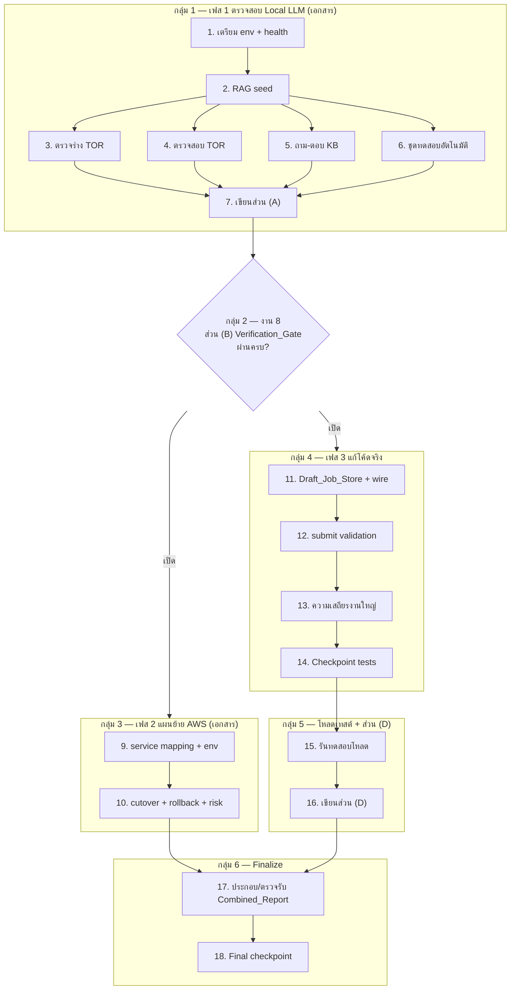

# แผนการดำเนินงาน (Implementation Plan): การตรวจสอบบน Local LLM + แผนย้าย AWS + ความเสถียร/สเกล

## ภาพรวม (Overview)

งานนี้มี **สามเฟส** และงานสองลักษณะ:

- **เฟส 1 และ 2 = งานจัดทำเอกสาร (documentation only)** — ผลิต **สี่ส่วน** ในไฟล์เดียว `Discussions/28-VERIFICATION-AND-MIGRATION.md` (Combined_Report): ส่วน (A) ผลการตรวจสอบ, ส่วน (B) เกตคั่น Verification_Gate, ส่วน (C) แผนย้าย AWS, ส่วน (D) สรุปความเสถียร/สเกล งานกลุ่มนี้ **ไม่แก้ไขซอร์สโค้ดของแอป** (เป็นการรันคำสั่งเดิม เก็บหลักฐาน และเขียน Markdown)
- **เฟส 3 = แก้ไขซอร์สโค้ดจริง (backend Python)** — ทำให้ระบบย่อยการร่าง/ตรวจเสถียรและรองรับงานปริมาณมาก พร้อม unit test และ property-based test งานกลุ่มนี้ **แตะซอร์สโค้ดของแอป** ที่ `app/backend/app/...`

**ลำดับและเกต (Ordering & Gate):** กลุ่ม 1 → กลุ่ม 2 (เกต) → {กลุ่ม 3, กลุ่ม 4} → กลุ่ม 5 → กลุ่ม 6
กลุ่ม 3 (แผนย้าย AWS) และกลุ่ม 4 (แก้โค้ดเฟส 3) เริ่มได้เมื่อเกต (กลุ่ม 2) เปิดแล้วเท่านั้น และทำคู่ขนานกันได้ กลุ่ม 5 ขึ้นกับกลุ่ม 4 ส่วนกลุ่ม 6 ขึ้นกับทุกกลุ่ม

**รูปแบบแท็ก property-based test (เฟส 3):** `Feature: local-llm-verification-aws-migration-plan, Property {number}: {property_text}` (อย่างน้อย 100 รอบต่อ property ด้วย Hypothesis)

---

## Tasks

### กลุ่ม 1 — เฟส 1: การตรวจสอบบน Local LLM (ผลิตส่วน (A) ของ Combined_Report)

> **ลักษณะงาน: จัดทำเอกสาร (ไม่แก้ไขซอร์สโค้ด)** — รันคำสั่งเดิม เก็บหลักฐาน แล้วเขียนเนื้อหา Markdown ลงส่วน (A) ของ `Discussions/28-VERIFICATION-AND-MIGRATION.md`

- [ ] 1. เตรียมสภาพแวดล้อมและบันทึกความพร้อม health/provider (เอกสาร)
  - รัน `docker compose -p tor-app ps` และ `curl -m 10 http://localhost:4000/health` เก็บ JSON ผลลัพธ์
  - บันทึกว่า `/health` แสดง `healthy` ครบ 5 บริการ (postgres, redis, minio, mongo, neo4j) ภายใน 10 วินาที
  - บันทึก `DEPLOYMENT_MODE=on_prem`, `LLM_PROVIDER` (หนึ่งใน lm_studio/ollama/llama_cpp/sglang), ชื่อโมเดลแชท + embeddings + endpoint Local LLM
  - บันทึกกรณีล้มเหลว: บริการไม่ healthy → ระบุชื่อบริการ + ผล "ไม่ผ่าน"; health ไม่ตอบใน 10 วินาที/เชื่อมไม่ได้ → "Health_Endpoint เข้าไม่ถึง" + "ไม่ผ่าน"
  - บันทึกหลักฐาน (ภาพ) ไว้ใต้ `Discussions/test-evidence/`
  - _Requirements: 1.1, 1.2, 1.3, 1.4, 1.5_

- [ ] 2. รัน RAG seed และบันทึกหลักฐาน (เอกสาร)
  - รัน `python -m app.seed_raw_docs` **จาก host** (ไม่ใช่ใน container) เก็บคำสั่ง + exit status + จำนวนเอกสารรวม
  - บันทึกเหตุผลข้อจำกัด host (bind-mount ชื่อไฟล์ภาษาไทยใน container → Errno 5)
  - บันทึกจำนวนเอกสารพร้อมค้นต่อกลุ่มบังคับ: `mandatory_handbook ≥ 1`, `mandatory_raw ≥ 1`, กลุ่ม `user`
  - บันทึกวัตถุประสงค์แยกของ `seed_raw_docs` / `seed_db` / `seed_kb`
  - บันทึกกรณีพิเศษ: Neo4j ล่ม → `graph_degraded` + แชทยังตอบจากเวกเตอร์ได้; seed ล้มเหลว → สถานะ+สาเหตุ + ไม่ใช้คลังเดิมเป็นผลผ่าน
  - _Requirements: 2.1, 2.2, 2.3, 2.4, 2.5, 2.6_

- [ ] 3. ตรวจเวิร์กโฟลว์ร่าง TOR แบบครบวงจร (เอกสาร)
  - เดินเส้นทาง `/projects/{id}/draft` Phase 0–4 (27 ช่อง s1–s13 + s4.1–s4.14, ร่าง 13 หมวด)
  - บันทึกผล ผ่าน/ไม่ผ่าน ต่อ 5 ขั้น, คะแนน 0–100 + เกณฑ์ ≥ 70, สถานะการตรวจ `valid`/ไม่ `valid`
  - บันทึกการเปลี่ยนสถานะ submit→`in_review`, approve→`approved`/reject→`rejected`, ผล export DOCX + PDF แยกกัน + ยืนยันไฟล์มีอยู่
  - บันทึกกรณีขั้นล้มเหลว: หมายเลขขั้น + error + สถานะโครงการคงเดิม
  - **หมายเหตุปฏิบัติ:** อย่า rebuild backend container ระหว่างรัน draft (คิว `_DRAFT_JOBS` in-memory จะหาย)
  - เก็บภาพหลักฐานไว้ใต้ `Discussions/test-evidence/`
  - _Requirements: 3.1, 3.2, 3.3, 3.4, 3.5, 3.6, 3.7_

- [ ] 4. ตรวจเวิร์กโฟลว์ตรวจสอบ TOR แบบครบวงจร (เอกสาร)
  - หน้า `/review`: `POST /review/extract` (preview ≤ 20000) → confirm → `POST /review/run` (rule engine) บันทึกคะแนน 0–100 + ข้อค้นพบ
  - compare-projects 2–5 ฉบับ: บันทึก Jaccard 0.0–1.0 ต่อคู่ (≥ 0.5 โทนผ่านบนจอ)
  - phase-4 in-project `POST /projects/{id}/review`: บันทึกคะแนน + ข้อค้นพบ + ความเห็นรวม + ReviewAgent ≤ 20 ข้อ 4 หมวด
  - บันทึกกรณีสำรอง: compare-projects 404/405/501 → fallback ในเบราว์เซอร์ + ค่า; ReviewAgent JSON แจงไม่สำเร็จ → fallback rule engine ไม่สูญผล
  - เก็บภาพหลักฐานไว้ใต้ `Discussions/test-evidence/`
  - _Requirements: 4.1, 4.2, 4.3, 4.4, 4.5_

- [ ] 5. ตรวจเวิร์กโฟลว์ถาม-ตอบ KB แบบครบวงจร (เอกสาร)
  - ใช้ Playwright `app/frontend/e2e/chat.spec.ts` (headed, `E2E=1`) ครอบ Req 5.1–5.3 + ภาพ `13a`–`13c`
  - Manual เพิ่ม: ดาวน์โหลด/ลบที่ `/knowledge-base`, ACL ข้าม owner, ปฏิเสธไฟล์ผิดชนิด/เกิน 20MB (Req 5.4–5.6)
  - `/chat` `search_scope=both`: บันทึกสตรีมจบด้วย `done` + citation ≥ 1 ระบุชื่อไฟล์
  - แนบไฟล์ PDF/DOCX/TXT ≤ 20MB → category=other → «ใช้กับ RAG ได้» → ถาม `mine` มี citation ระบุไฟล์นั้น
  - บันทึกอัปโหลด/ดาวน์โหลด (`GET /api/v1/knowledge-base/mine/{id}/file`)/ลบ แยกกันและบันทึกทันทีที่แต่ละการกระทำเสร็จ
  - ทดสอบ ACL: ไฟล์ของผู้อื่นไม่ปรากฏใน `mine` และคืนค่าว่างแทนการรั่ว
  - บันทึกกรณีล้มเหลว/ปฏิเสธ: `error`/ไม่มี citation → ไม่ผ่าน + เหตุการณ์; ไฟล์ผิดชนิด/เกิน 20MB → ถูกปฏิเสธ ไม่ ingest
  - เก็บภาพหลักฐานไว้ใต้ `Discussions/test-evidence/`
  - _Requirements: 5.1, 5.2, 5.3, 5.4, 5.5, 5.6_

- [ ] 6. รันชุดทดสอบอัตโนมัติและบันทึก coverage (เอกสาร)
  - รัน `pytest -m "not live_llm and not integration" --cov=app` บันทึก passed/skipped/failed + coverage %
  - รัน `pytest tests/test_live_ect_tor_full.py` (live_llm) บันทึกผล + ยืนยันเชื่อม LM Studio :1234 จริง (ไม่ mock)
  - รัน Vitest (`npm run test:coverage`) + Playwright (`npm run test:e2e:headed`) บันทึก passed/failed + coverage % + ยืนยันเชื่อม Local LLM/Docker :3000 จริง
  - บันทึก SonarQube quality gate (:9400) — หากไม่มี stack ให้แถวสรุปเป็น **ข้าม** พร้อมหมายเหตุ
  - **ตารางสรุปส่วน (A) มี 10 แถว:** Health, RAG_Seed, Draft, Review, KB QA, pytest not live_llm, pytest live_llm, Vitest, Playwright, SonarQube
  - บันทึกกรณีล้มเหลว: เคสล้ม → ชุด/เคส/สาเหตุ; ชุดรันไม่สำเร็จ → ชื่อชุด + สถานะ "รันไม่สำเร็จ" + สาเหตุ
  - _Requirements: 6.1, 6.2, 6.3, 6.4, 6.5_

- [ ] 7. เขียนส่วน (A) Verification report ลง Combined_Report (เอกสาร)
  - สร้าง/เปิด `Discussions/28-VERIFICATION-AND-MIGRATION.md` และเขียนส่วน (A) **แบบ incremental** หลังงาน 1–6 แล้วสรุปตาราง 10 แถวท้ายสุด
  - รวมหลักฐานจากงาน 1–6 เป็นบล็อกรายเคสพร้อมภาพ (อ้างอิงไฟล์ใน `Discussions/test-evidence/` ที่มีอยู่จริง)
  - เขียน **ตารางสรุปผล 10 แถว** อย่างน้อยคอลัมน์ รายการ/สถานะ (ผ่าน/ไม่ผ่าน/ข้าม)/จำนวนที่ผ่าน + Coverage สำหรับชุดที่มี
  - ทุกแถวไม่มีผล/ถูกข้าม ต้องมีหมายเหตุระบุเหตุผล (หมายเหตุปรากฏร่วมกับสถานะใดก็ได้)
  - _Requirements: 7.1, 7.2, 7.3, 7.4, 7.5_

### กลุ่ม 2 — ส่วน (B) Verification_Gate divider (เกตกั้น)

> **ลักษณะงาน: จัดทำเอกสาร (ไม่แก้ไขซอร์สโค้ด)** — งานนี้ **เป็นเกต** กั้นทั้งกลุ่ม 3 และกลุ่ม 4

- [ ] 8. เขียนส่วน (B) เกตคั่น Verification_Gate หลังส่วน (A) (เอกสาร)
  - เพิ่มส่วน (B) **หลังส่วน (A) และก่อนส่วน (C)** เสมอ ใน `Discussions/28-VERIFICATION-AND-MIGRATION.md`
  - ระบุ **สถานะเกต** (เปิด/ถูกบล็อก) และ **นิยาม "ผ่านครบ"**: ไม่มีรายการใดในตารางสรุปส่วน (A) ที่สถานะ *ไม่ผ่าน*, *รอผล* หรือ *ยังไม่ตรวจ*
  - ระบุเงื่อนไขเปิดเกต: อ้างอิงชื่อไฟล์ + วันที่รายงาน (หากบันทึกอ้างอิงล้มเหลวแต่รายงานผ่านครบ เกตยังเปิดได้)
  - ระบุขอบเขตเกต: กั้น **ทั้ง** ส่วน (C) Migration Plan **และ** งานแก้โค้ดเฟส 3 (Req 11–13)
  - ระบุกรณีไม่มี/เข้าไม่ถึงส่วน (A) → สถานะ "ถูกบล็อก"
  - _Requirements: 8.1, 8.2, 8.3, 8.4, 14.2_

### กลุ่ม 3 — เฟส 2: แผนย้าย AWS (ส่วน (C) ของ Combined_Report)

> **ลักษณะงาน: จัดทำเอกสาร (ไม่แก้ไขซอร์สโค้ด)** — ขึ้นกับเกต (กลุ่ม 2) เท่านั้น อ้างอิงเอกสาร 20/24/25/26/27 + `env.cloud.example` แทนการทำซ้ำ ห้ามใส่ code diff/คำสั่ง provision/deploy จริง

- [ ] 9. เขียนตารางจับคู่บริการและตัวแปรสภาพแวดล้อมคลาวด์ (เอกสาร)
  - [ ] 9.1 ตารางจับคู่บริการ (Service Mapping)
    - อ้างอิงเอกสาร 25 ครอบคลุมอย่างน้อย MinIO→S3, Postgres+pgvector→RDS/Aurora, Redis→ElastiCache, backend→ECS Fargate (IAM task role), Local LLM→Bedrock
    - เพิ่ม MongoDB GridFS→S3/DocumentDB, Neo4j→Neptune/`GRAPH_PROVIDER=off`, EmbeddingGemma→Titan (ต้อง re-seed)
    - _Requirements: 9.1, 9.2, 9.3_
  - [ ] 9.2 ตารางค่าตัวแปรสภาพแวดล้อมโหมดคลาวด์
    - อ้างอิง `app/infra/aws/env.cloud.example`; ระบุ `DEPLOYMENT_MODE=cloud`, `LLM_PROVIDER=bedrock`, `EMBEDDING_PROVIDER=bedrock`
    - ระบุห้ามตั้ง `EMBEDDING_PROVIDER=local` ใน prod และปล่อย `AWS_ACCESS_KEY_ID`/`AWS_SECRET_ACCESS_KEY` ว่าง (ใช้ IAM task role)
    - ระบุค่า Bedrock: region `ap-southeast-1`, `BEDROCK_MODEL_ID=anthropic.claude-3-5-sonnet-20241022-v2:0`, `BEDROCK_EMBEDDING_MODEL_ID=amazon.titan-embed-text-v2:0`
    - _Requirements: 9.2, 9.4, 9.5_

- [ ] 10. เขียนลำดับตัดระบบ แผนย้อนกลับ และทะเบียนความเสี่ยง (เอกสาร)
  - [ ] 10.1 ลำดับตัดระบบ (Cutover Sequence)
    - อ้างอิงเอกสาร 27 ตอน 5; แต่ละขั้นเรียงเลขต่อเนื่อง ระบุ การกระทำ/ผู้รับผิดชอบ/เงื่อนไขก่อนเริ่ม/เกณฑ์ตรวจสอบสำเร็จ
    - _Requirements: 10.1_
  - [ ] 10.2 แผนย้อนกลับ (Rollback Plan)
    - ระบุ rollback trigger + สถานะเป้าหมายหลังย้อนกลับ + ลำดับขั้นเริ่มจาก 1 (เป็นชุดเลขแยกจาก cutover)
    - ระบุว่าเมื่อ cutover ไม่ผ่านเกณฑ์ → ดำเนินการตาม rollback
    - _Requirements: 10.2, 10.3_
  - [ ] 10.3 ทะเบียนความเสี่ยง (Risk Register)
    - ระบุความเสี่ยง ≥ 2 (คำอธิบาย/ผลกระทบ/แนวทางบรรเทา + ผู้รับผิดชอบ) ครอบคลุม Titan re-seed (มิติ ≠ 768), draft queue desiredCount=1, และ Neo4j→Neptune/`GRAPH_PROVIDER=off` (อ้างอิงเอกสาร 25, 27)
    - _Requirements: 10.4, 10.5_

### กลุ่ม 4 — เฟส 3: แก้ไขซอร์สโค้ดจริงเพื่อความเสถียร/สเกล

> **ลักษณะงาน: แก้ไขซอร์สโค้ด (backend Python)** — ขึ้นกับเกต (กลุ่ม 2) แตะไฟล์ที่ `app/backend/app/...` พร้อม unit test + property-based test ทุกงานโค้ดต้องรัน build/test ของโปรเจกต์เพื่อยืนยัน

- [ ] 11. สร้างโมดูล Draft_Job_Store (Redis) และผูกเข้ากับ draft_chat
  - [ ] 11.1 สร้างโมดูล `app/backend/app/draft_job_store.py`
    - mirror สไตล์ `app/backend/app/llm_admission.py` (`hset(mapping=...)` + `expire(key, 600)`, fail-open เมื่อ `redis is None` ผ่าน `app.state`)
    - คีย์ `draft:job:{project_id}` (hash) ฟิลด์ `status` (queued/running/done/failed), `drafted_count` (int), `total` (int), `updated_at`; TTL 600s ทุกครั้งที่เขียน
    - อินเทอร์เฟซ: `set_job(project_id, status, drafted_count, total)`, `bump_progress(project_id, drafted_count)`, `mark_status(project_id, status)`, `get_job(project_id)`
    - `get_job`: ถ้า `status=running` แต่ `updated_at` เก่ากว่า 600s → คืน `failed` (คง `drafted_count` เดิม); ถ้า Redis ไม่พร้อม → อ่านจาก `_DRAFT_JOBS` in-memory
    - _Requirements: 11.1, 11.2, 11.4, 11.5_
  - [ ]* 11.2 เขียน unit test สำหรับ Draft_Job_Store
    - ทดสอบเขียน/อ่านระเบียน, TTL 600s, stale-running (`updated_at` > 600s → failed), และ fallback เมื่อ Redis ไม่พร้อม (ใช้ in-memory ต่อได้)
    - _Requirements: 11.1, 11.4, 11.5_
  - [ ] 11.3 ผูก Draft_Job_Store เข้ากับ `app/backend/app/api/v1/endpoints/draft_chat.py`
    - `draft-chat/start`: เรียก `set_job`/`bump_progress`/`mark_status` ระหว่าง `_run_sequential_draft` (queued→running, bump ต่อหมวด, →done/failed) ภายใน 5 วินาทีหลังเปลี่ยน
    - `draft-chat/status`: อ่านจาก `get_job` โดยตรง (อินสแตนซ์อื่นตอบสถานะล่าสุดได้)
    - **ไม่เปลี่ยนสัญญา SSE** (`progress`, `section_done`, `subsection_done`, `all_done`) ทั้ง payload และลำดับเหตุการณ์
    - _Requirements: 11.2, 11.3, 11.6_
  - [ ]* 11.4 เขียน property test: สถานะงานร่างอ่านได้ข้ามอินสแตนซ์
    - **Property 8: สถานะงานร่างอ่านได้ข้ามอินสแตนซ์** (ค่าที่อ่านจาก `draft-chat/status` = ค่าที่บันทึกล่าสุด)
    - **Validates: Requirements 11.1, 11.2, 11.3**
    - แท็ก: `Feature: local-llm-verification-aws-migration-plan, Property 8: ...`
    - _Requirements: 11.1, 11.2, 11.3_
  - [ ]* 11.5 เขียน property test: สัญญา SSE เข้ากันได้กับ frontend เดิม
    - **Property 11: สัญญา SSE เข้ากันได้กับ frontend เดิม** (ลำดับ/payload ของ `progress`/`section_done`/`subsection_done`/`all_done` byte-compatible)
    - **Validates: Requirements 11.6, 13.2**
    - แท็ก: `Feature: local-llm-verification-aws-migration-plan, Property 11: ...`
    - _Requirements: 11.6, 13.2_

- [ ] 12. บังคับการตรวจครบถ้วนฝั่งเซิร์ฟเวอร์ก่อน submit
  - [ ] 12.1 ขยาย `officer_can_submit` / `submit_project` ใน `app/backend/app/api/v1/endpoints/projects.py`
    - Query `TORSection` ของโครงการ ประเมิน `isSectionFilled` ต่อ s1–s13 (s4 ครบเมื่อมี s4.1–s4.14 ที่กรอกแล้ว ≥ 1 หรือมี content หลัก)
    - คงเกต status เดิม: อนุญาตเฉพาะ `draft`/`rejected`; ครบ + status ถูกต้อง → `in_review` + response contract เดิม
    - ไม่ครบ → HTTP 4xx ระบุรายการ `section_key`/`sub_key` ที่ขาด + คงสถานะเดิม; status ผิด → HTTP 4xx คงสถานะเดิม
    - เมื่อปฏิเสธ → ไม่เปลี่ยนสถานะและไม่บันทึกเหตุการณ์ submit; บังคับที่ endpoint เสมอไม่ว่า UI ส่งค่าใด
    - _Requirements: 12.1, 12.2, 12.3, 12.4, 12.5_
  - [ ]* 12.2 เขียน unit test สำหรับ submit validation
    - ทดสอบกรณีครบ 13 หมวด (→ in_review), ไม่ครบ (→ 4xx + รายการที่ขาด), status ผิด (ไม่ใช่ draft/rejected → 4xx), และยืนยันปฏิเสธแล้วไม่เปลี่ยนสถานะ/ไม่บันทึก event
    - _Requirements: 12.1, 12.2, 12.3, 12.4, 12.5_
  - [ ]* 12.3 เขียน property test: submit ถูกปฏิเสธก็ต่อเมื่อไม่ครบหรือสถานะผิด
    - **Property 9: submit ถูกปฏิเสธก็ต่อเมื่อ (iff) มี s1–s13 ที่ไม่ผ่าน isSectionFilled หรือ status ∉ {draft, rejected}; เมื่อปฏิเสธสถานะคงเดิม**
    - **Validates: Requirements 12.1, 12.2, 12.3, 12.4, 12.5**
    - แท็ก: `Feature: local-llm-verification-aws-migration-plan, Property 9: ...`
    - _Requirements: 12.1, 12.2, 12.3, 12.4, 12.5_

- [ ] 13. ความเสถียรของงานร่าง/ตรวจขนาดใหญ่และใช้เวลานาน
  - [ ] 13.1 Resume-progress เมื่อ reconnect + formalize idempotent start (แก้ `draft_chat.py`)
    - เมื่อ client เชื่อม SSE ใหม่ระหว่างงานยังรัน → ส่งความคืบหน้าล่าสุด (หมวดที่เสร็จ + หมวดที่กำลังทำ) จาก Draft_Job_Store ภายใน 4 วินาที โดยไม่เริ่มงานใหม่
    - ทำ idempotent start เป็นทางการ: เรียกเริ่มงานสำหรับ `project_id` เดิมขณะงานยังรัน (ยังไม่ done/failed) → คืน reference งานเดิม ไม่สร้างใหม่
    - _Requirements: 13.1, 13.2, 13.4_
  - [ ] 13.2 Per-section failure isolation (แก้ `draft_chat.py` / `_run_sequential_draft`)
    - หมวดใดล้มเหลวหรือใช้เวลาเกิน 1800s/หมวด → มาร์กหมวดนั้น `failed` พร้อมเหตุผล แล้วทำหมวดถัดไปต่อทันที ไม่ค้างทั้งงาน
    - บันทึกความคืบหน้าราย section ลง Draft_Job_Store ทุกครั้งที่หมวดเสร็จ
    - _Requirements: 13.1, 13.3_
  - [ ]* 13.3 เขียน unit test สำหรับ reconnect/resume + per-section failure isolation
    - ทดสอบ resume-progress ภายใน 4s เมื่อ reconnect, per-section failure isolation (หมวดล้ม/หมดเวลา → failed แล้วทำต่อ)
    - _Requirements: 13.1, 13.2, 13.3, 13.4_
  - [ ]* 13.4 เขียน property test: งานร่างเดินไปถึงสถานะปลายทางเสมอ
    - **Property 10: งานร่างเดินไปถึงสถานะปลายทาง (done/failed) เสมอ ไม่ว่ามี SSE client หรือไม่; หมวดล้ม/หมดเวลา (>1800s) → failed แล้วทำหมวดต่อ ไม่ค้าง running ถาวร**
    - **Validates: Requirements 13.1, 13.3, 11.4**
    - แท็ก: `Feature: local-llm-verification-aws-migration-plan, Property 10: ...`
    - _Requirements: 13.1, 13.3, 11.4_

- [ ] 14. Checkpoint — ยืนยันชุดทดสอบเฟส 3 ผ่านทั้งหมด
  - รัน build/test ของโปรเจกต์ (`pytest -m "not live_llm and not integration"`) ให้ผ่านทั้ง unit test และ property-based test ของงาน 11–13
  - Ensure all tests pass, ask the user if questions arise.
  - [ ] 14.5 Re-smoke หลังแก้โค้ด (บันทึกในส่วน D)
    - submit ไม่ครบ 13 หมวด → HTTP 4xx + รายการที่ขาด และไม่เปลี่ยนสถานะ
    - `GET draft-chat/status` อ่าน `job_status` จาก Draft_Job_Store
    - งานร่าง 3 โครงการพร้อมกันใน store ถึงสถานะ done/failed
    - _Requirements: 11.3, 12.3, 13.5_

### กลุ่ม 5 — เฟส 3: ทดสอบโหลด/งานขนาดใหญ่ + เขียนส่วน (D)

> **ลักษณะงาน: รันทดสอบโหลดโค้ดเฟส 3 + จัดทำเอกสารส่วน (D)** — ขึ้นกับกลุ่ม 4

- [ ] 15. รันทดสอบโหลด/งานขนาดใหญ่และเก็บหลักฐาน
  - รัน review pack สูงสุด 200,000 อักขระ, paste สูงสุด 500,000 อักขระ, งานร่างพร้อมกัน ≥ 3 งานต่างโครงการ
  - เก็บหลักฐาน: สถานะสำเร็จ/ล้มเหลว + เวลาที่ใช้ต่องาน (เก็บภาพ/ล็อกไว้ใต้ `Discussions/test-evidence/`)
  - _Requirements: 13.5_
  - [ ] 15.1 (ไม่บังคับ) รันสถานการณ์โหลดเพิ่มเติม (ขอบเขตขยาย)
    - เพิ่มจำนวนงานร่างพร้อมกันเกิน 3 งาน หรือขนาด paste/review pack ที่มากกว่าเกณฑ์ขั้นต่ำ เพื่อสังเกตพฤติกรรมภายใต้ภาระสูง
    - _Requirements: 13.5_

- [ ] 16. เขียนส่วน (D) Stability & Scale summary ลง Combined_Report (เอกสาร)
  - เพิ่มส่วน (D) ต่อจากส่วน (C) สรุปงานแก้โค้ด Req 11/12/13 พร้อมผลทดสอบที่เกี่ยวข้อง
  - บันทึกผลทดสอบโหลดจากงาน 15 (200k review pack, 500k paste, ≥ 3 งานร่างพร้อมกัน) พร้อมสถานะ/เวลาต่องาน
  - ผูกส่วน (D) กับผลการตรวจในส่วน (A)
  - _Requirements: 13.5, 14.3_

### กลุ่ม 6 — Finalize Combined_Report

> **ลักษณะงาน: จัดทำเอกสาร (ตรวจรับไฟล์รวม)** — ขึ้นกับทุกกลุ่ม

- [ ] 17. ประกอบและตรวจรับ Combined_Report ฉบับเดียว (เอกสาร)
  - ยืนยันไฟล์เดียว `Discussions/28-VERIFICATION-AND-MIGRATION.md` มีครบสี่ส่วนเรียงลำดับ A → B → C → D และ (B) อยู่หลัง (A) ก่อน (C) เสมอ
  - ยืนยันทุกตารางไม่มีเซลล์ว่าง (ใช้ `—` แทน "ไม่มีค่า"), ลิงก์ภายใน/เอกสารอ้างอิง resolve ได้, ลิงก์ภาพชี้ไฟล์ที่มีอยู่จริงใน `Discussions/test-evidence/`
  - ส่วนใดยังไม่มีเนื้อหา → แสดงหัวข้อ + สถานะ "ยังไม่จัดทำ" (ไม่ละเว้นหัวข้อ)
  - ยืนยันไม่แนะนำค่า prod ต้องห้าม (`LLM_PROVIDER=lm_studio/ollama/llama_cpp/sglang`, `EMBEDDING_PROVIDER=local`)
  - รันเกณฑ์รีวิวเอกสาร (checklist ส่วน A/B/C/D + เกณฑ์รีวิวร่วม) ให้ผ่านครบ
  - _Requirements: 14.1, 14.2, 14.3, 14.4, 14.5_

- [ ] 18. Final checkpoint — ยืนยันทุกส่วนและทุกชุดทดสอบพร้อมส่งมอบ
  - Ensure all tests pass, ask the user if questions arise.

## Notes

- งานที่ระบุ **"(เอกสาร)"** ไม่แก้ไขซอร์สโค้ดของแอป — เป็นการรันคำสั่งเดิม เก็บหลักฐาน และเขียน Markdown เท่านั้น
- เฉพาะงานในกลุ่ม 4 และกลุ่ม 5 (การรันทดสอบ) ที่แตะซอร์สโค้ดที่ `app/backend/app/...`
- งานย่อยที่ postfix ด้วย `*` เป็น **งานทดสอบ (ไม่บังคับ)** ข้ามได้สำหรับ MVP ที่เร็วขึ้น — งานหลัก (ไม่มี `*`) ต้องทำเสมอ
- งานที่กำกับ **"(ไม่บังคับ)"** เป็นงาน nice-to-have (เช่น สถานการณ์โหลดขยายในงาน 15.1)
- property-based test แต่ละตัวอ้างอิง Property จากเอกสารออกแบบ พร้อมแท็กรูปแบบ `Feature: local-llm-verification-aws-migration-plan, Property {n}: {text}` (อย่างน้อย 100 รอบต่อ property)
- เกต (กลุ่ม 2/งาน 8) กั้น **ทั้ง** กลุ่ม 3 (แผนย้าย AWS) และกลุ่ม 4 (แก้โค้ดเฟส 3) — ทั้งสองเริ่มได้เมื่อ Verification report ผ่านครบเท่านั้น
- **นอกขอบเขต:** ไม่ดีพลอย AWS จริง, ไม่ provision โครงสร้างพื้นฐาน, ไม่แก้โค้ดนอกขอบเขตความเสถียรงานร่าง/ตรวจ

## Task Dependency Graph

