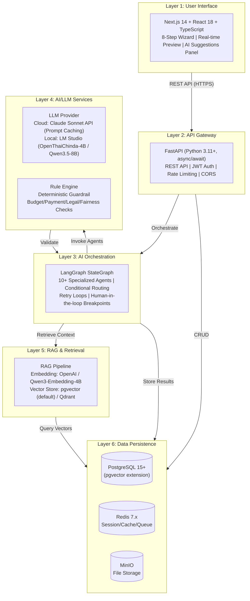
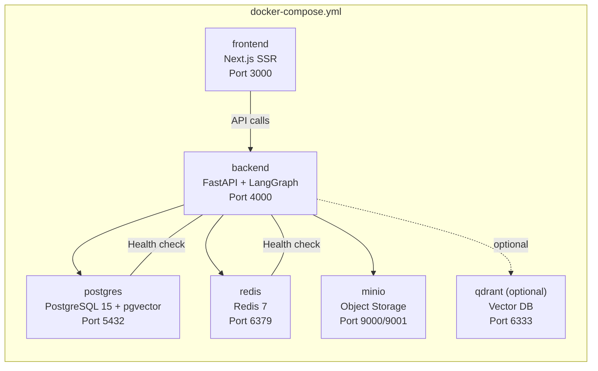
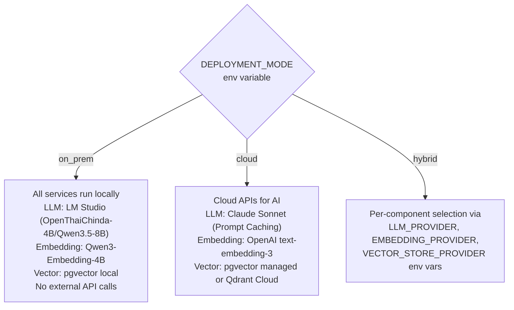
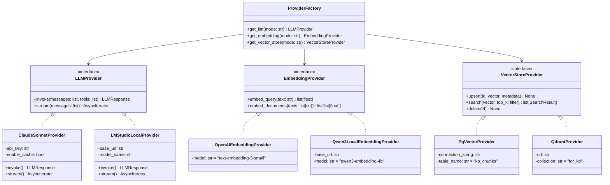
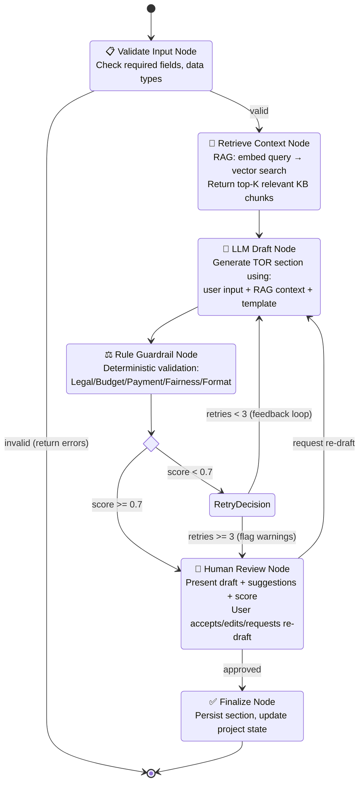
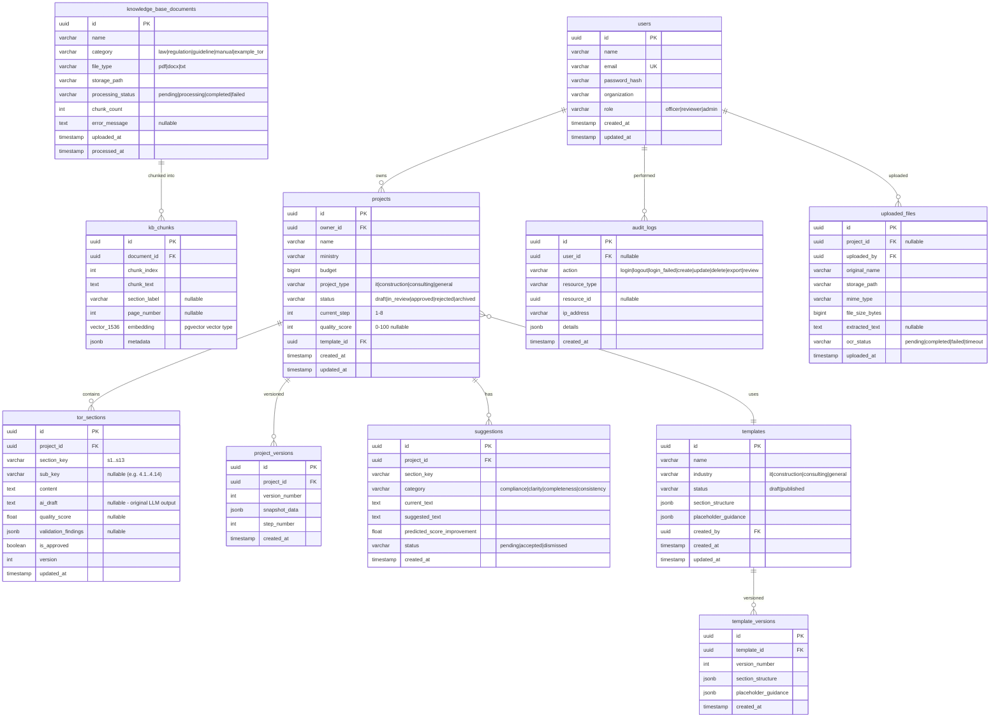
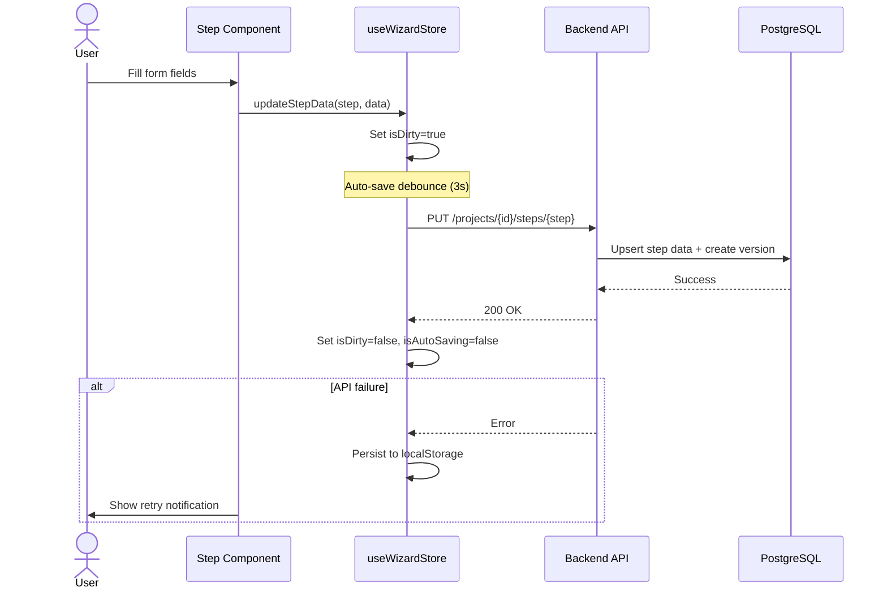
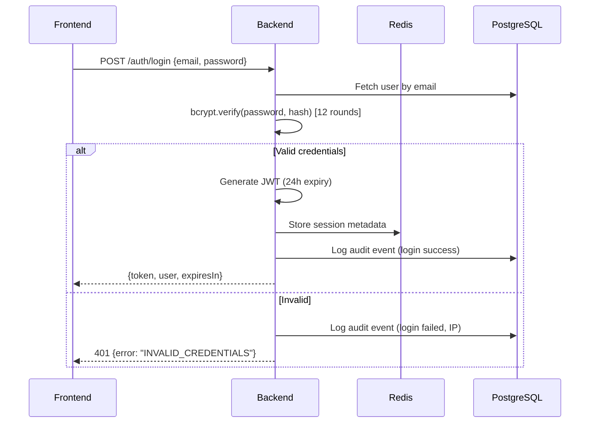
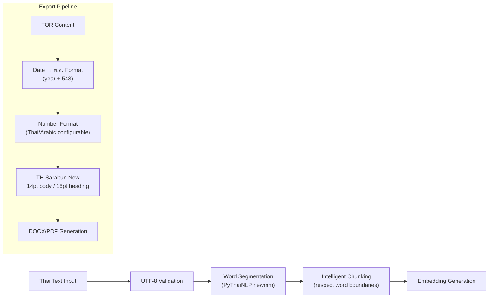

# Design Document: TOR Drafting and Review Application

## Overview

This document describes the technical design for a production-grade, full-stack web application that assists Thai government procurement officers in drafting, reviewing, and exporting Terms of Reference (TOR) documents. The system leverages a hybrid AI architecture combining LLM-based drafting, RAG-augmented context retrieval, and a deterministic Rule Engine guardrail — all orchestrated via LangGraph StateGraph with human-in-the-loop review.

**Core Design Principles:**

1. **Rule Engine as Final Authority**: The LLM accelerates drafting but never makes final decisions on legal/numeric matters. The deterministic Rule Engine (validated against พ.ร.บ. 2560) always validates LLM output before user presentation.
2. **Provider Abstraction (Strategy Pattern)**: All AI components (LLM, Embedding, Vector Store) are abstracted behind interfaces, enabling deployment mode switching via environment variable without code changes.
3. **Three Deployment Modes**: `on_prem` (no data leaves the organization), `cloud` (maximum quality/speed), `hybrid` (per-component flexibility).
4. **Containerized Everything**: Single `docker-compose.yml` deploys the full stack for development, staging, and production consistency.

**Key Metrics Targets:**
- TOR creation time: 30–45 minutes (from 3–6 weeks)
- First-draft compliance rate: 95%+ (from ~70%)
- Legal compliance: 100% validated before export
- System availability: 99.5% uptime

---

## Architecture

### High-Level System Architecture (6-Layer)

The system follows a 6-layer architecture with clear separation of concerns:



### Docker Compose Service Topology



### Deployment Mode Architecture



---

## Components and Interfaces

### 1. Frontend (Next.js 14 SPA)

**Responsibilities:** 8-step wizard UI, real-time TOR preview, AI suggestions panel, document diff viewer, project dashboard, admin interfaces.

**Key State Stores (Zustand):**

| Store | Purpose |
|-------|---------|
| `useWizardStore` | Current step, form data per step, validation state, auto-save |
| `useAuthStore` | JWT token, current user, login/logout actions |
| `useProjectStore` | Project list, active project, version history |
| `useUIStore` | Theme, sidebar state, loading indicators, toast messages |

**Component Hierarchy:**
```
app/
├── layout.tsx (Root layout, ThemeProvider, AuthGuard)
├── page.tsx (Landing / Login)
├── wizard/
│   ├── [step]/page.tsx (Steps 1–8, dynamic routing)
│   └── preview/page.tsx (Live TOR preview)
├── projects/
│   ├── page.tsx (Dashboard with pagination)
│   └── [id]/page.tsx (Project detail + version history)
├── admin/
│   ├── templates/page.tsx (Template CRUD)
│   └── knowledge-base/page.tsx (KB management)
└── components/
    ├── wizard/ (Step1–Step8, WizardForm, StepIndicator)
    ├── preview/ (TORPreview, SectionPreview, DiffViewer)
    ├── suggestions/ (SuggestionsPanel, SuggestionItem)
    └── ui/ (shadcn/ui: Button, Input, Dialog, Tabs, etc.)
```

### 2. Backend (FastAPI)

**Responsibilities:** REST API, authentication, business logic, AI orchestration coordination, file handling, export generation.

**Module Structure:**
```
backend/
├── app/
│   ├── main.py                    # FastAPI init, middleware, startup events
│   ├── config.py                  # Pydantic Settings (env-based)
│   ├── api/v1/
│   │   ├── router.py             # Main API router
│   │   └── endpoints/
│   │       ├── auth.py           # POST /auth/register, /auth/login, etc.
│   │       ├── projects.py       # CRUD /projects
│   │       ├── wizard.py         # PUT /projects/{id}/steps/{step}
│   │       ├── drafting.py       # POST /projects/{id}/draft-section
│   │       ├── review.py         # POST /projects/{id}/review
│   │       ├── templates.py      # CRUD /templates
│   │       ├── knowledge_base.py # KB management endpoints
│   │       ├── export.py         # POST /projects/{id}/export
│   │       └── health.py         # GET /health
│   ├── models/                   # SQLAlchemy ORM models
│   ├── schemas/                  # Pydantic request/response schemas
│   ├── services/                 # Business logic layer
│   ├── orchestrator/             # LangGraph StateGraph + Agents
│   ├── providers/                # Provider Factory + Implementations
│   ├── rule_engine/              # Deterministic validation rules
│   ├── rag/                      # RAG pipeline (chunking, embedding, retrieval)
│   ├── export/                   # Document generation (docx, pdf)
│   └── utils/                    # Helpers, logging, file handling
├── alembic/                      # Database migrations
├── tests/                        # pytest test suite
└── docker/
    └── Dockerfile
```

### 3. Provider Factory (Strategy Pattern)



**Configuration:**
```python
# Resolved at startup based on environment variables
DEPLOYMENT_MODE = "on_prem" | "cloud" | "hybrid"
LLM_PROVIDER = "claude" | "lm_studio"       # (hybrid only)
EMBEDDING_PROVIDER = "openai" | "qwen3"      # (hybrid only)
VECTOR_STORE_PROVIDER = "pgvector" | "qdrant" # (hybrid only)
```

### 4. LangGraph Orchestrator



### 5. Rule Engine

**Validation Categories and Weights:**

| Category | Weight | Rules |
|----------|--------|-------|
| Legal Compliance | 40% | พ.ร.บ. 2560 references, required clauses, penalty rates (0.01–0.20%), vendor qualifications |
| Completeness | 30% | All 13 sections present, required subsections filled, minimum content length |
| Consistency | 20% | Budget↔Scope alignment, Timeline↔Deliverables, Qualifications↔Complexity |
| Format Adherence | 10% | Thai government format, proper numbering, date format (พ.ศ.), section ordering |

**Key Validation Rules:**
- Vendor paid-up capital = budget ÷ 4 (rounded down)
- Payment schedule percentages sum = 100%, each installment 5%–50%
- Timeline feasibility: budget > 100M → duration ≥ 180 days; budget < 10M → duration ≤ 365 days
- Penalty rates: 0.01%–0.20% per day, minimum 100 baht/day
- Brand-lock fairness: flag proprietary brand names without "or equivalent" clause

### 6. RAG Pipeline

**Ingestion Flow:**
1. Document upload (PDF/DOCX/TXT) → text extraction (PyMuPDF for PDF, python-docx for DOCX, Tesseract OCR for scanned)
2. Thai word segmentation via PyThaiNLP
3. Chunking: 500–1000 tokens per chunk, 100-token overlap, preserve section boundaries
4. Embedding generation via configured provider
5. Store vectors + metadata in Vector Store

**Retrieval Flow:**
1. User query → embed with same provider
2. Cosine similarity search (top-K, default K=5)
3. Metadata filtering (document type, legal reference, section relevance)
4. Return ranked chunks with source attribution

### 7. Export Service

**Pipeline:**
```
TOR Content (structured JSON)
    → Template Selection (python-docx template with placeholders)
    → Section Rendering (populate placeholders with validated content)
    → Thai Formatting (TH Sarabun New 14pt, พ.ศ. dates, Thai numbering)
    → DOCX Generation (python-docx)
    → PDF Conversion (WeasyPrint)
    → Upload to MinIO
    → Return signed download URL (configurable TTL 1–168 hours)
```

---

## Data Models

### Entity-Relationship Diagram



### Key Indexes

```sql
-- Performance indexes
CREATE INDEX idx_projects_owner_status ON projects(owner_id, status);
CREATE INDEX idx_projects_updated_at ON projects(updated_at DESC);
CREATE INDEX idx_tor_sections_project ON tor_sections(project_id, section_key);
CREATE INDEX idx_kb_chunks_document ON kb_chunks(document_id, chunk_index);
CREATE INDEX idx_suggestions_project_status ON suggestions(project_id, status);
CREATE INDEX idx_audit_logs_user_action ON audit_logs(user_id, action, created_at DESC);

-- pgvector HNSW index for fast similarity search
CREATE INDEX idx_kb_chunks_embedding ON kb_chunks
  USING hnsw (embedding vector_cosine_ops)
  WITH (m = 16, ef_construction = 64);
```

---

## Correctness Properties

*A property is a characteristic or behavior that should hold true across all valid executions of a system — essentially, a formal statement about what the system should do. Properties serve as the bridge between human-readable specifications and machine-verifiable correctness guarantees.*

### Property 1: Provider Factory Mode Resolution

*For any* valid `DEPLOYMENT_MODE` value (`on_prem`, `cloud`, `hybrid`), the Provider Factory SHALL return a functioning LLM provider, embedding provider, and vector store provider without code modification — and for any invalid or missing value, it SHALL reject initialization with a descriptive error.

**Validates: Requirements 2.1, 2.8, 2.9**

### Property 2: Rule Engine Quality Score Determinism

*For any* TOR document content, invoking the Rule Engine multiple times with identical input SHALL produce identical Quality_Score values and identical validation findings — the Rule Engine is purely deterministic with no randomness.

**Validates: Requirements 6.6, 6.7**

### Property 3: Payment Schedule Percentage Invariant

*For any* TOR document that passes Rule Engine validation, the sum of all payment installment percentages SHALL equal exactly 100%, each installment SHALL be between 5% and 50% inclusive, and the penalty rate SHALL be between 0.01% and 0.20% per day.

**Validates: Requirements 6.3, 6.8**

### Property 4: Vendor Capital Calculation

*For any* positive integer budget value, the computed vendor paid-up capital requirement SHALL equal `floor(budget / 4)` — the Rule Engine output for this field is a pure function of budget input.

**Validates: Requirements 6.2**

### Property 5: RAG Chunking Preservation

*For any* ingested document, the concatenation of all chunk texts (in order, accounting for overlap removal) SHALL reconstruct the original document text with no content loss — chunking is a reversible split operation.

**Validates: Requirements 3.2, 3.3**

### Property 6: Embedding Round-Trip Retrieval

*For any* document chunk stored in the vector store, embedding the chunk text and performing a similarity search with top-K=1 SHALL return that same chunk as the top result (self-retrieval property).

**Validates: Requirements 3.4, 3.6**

### Property 7: Wizard Step Data Persistence

*For any* wizard step data submitted by the user, navigating away and returning to that step SHALL display the same data that was submitted — step data is persisted and restored without loss.

**Validates: Requirements 4.2, 4.3, 4.6**

### Property 8: Project Version Ordering

*For any* project with N versions, the version numbers SHALL form a strictly increasing sequence from 1 to N, and each version snapshot SHALL contain a complete copy of the project state at that point — no version gaps or data truncation.

**Validates: Requirements 9.6**

### Property 9: Quality Score Bounded Range

*For any* TOR document, the Quality_Score produced by the Rule Engine SHALL be an integer in the range [0, 100], and the weighted breakdown (legal 40% + completeness 30% + consistency 20% + format 10%) SHALL sum to the total score.

**Validates: Requirements 6.6**

### Property 10: Export Format Consistency

*For any* finalized TOR document, the exported DOCX and PDF SHALL contain identical textual content — the two formats are two renderings of the same source document with no content divergence.

**Validates: Requirements 8.1, 8.2**

### Property 11: Authentication Token Isolation

*For any* two distinct authenticated users, a valid JWT token for User A SHALL never grant access to projects owned exclusively by User B — project ownership is enforced at every data access point.

**Validates: Requirements 9.3, 9.7**

### Property 12: Orchestrator Retry Bound

*For any* agent invocation that fails Rule Engine validation, the Orchestrator SHALL invoke a maximum of `max_retries` (configurable, default 3) retry attempts before presenting the best result with warnings — the system never enters an infinite retry loop.

**Validates: Requirements 5.4, 5.5, 12.6**

### Property 13: Rate Limiting Enforcement

*For any* authenticated user, sending more than the configured rate limit (default 100 requests/minute) SHALL result in HTTP 429 responses for excess requests — rate limiting is enforced consistently regardless of request content.

**Validates: Requirements 15.1, 15.5**

### Property 14: Thai Date Format Consistency

*For any* date value in the system, exported documents SHALL display that date in Thai Buddhist Era (พ.ศ.) format — the difference between the displayed year and the Gregorian year SHALL always be exactly 543.

**Validates: Requirements 8.3, 4.7**

---

## Error Handling

### Error Categories and Responses

| Error Category | HTTP Code | Behavior | Recovery Strategy |
|---------------|-----------|----------|-------------------|
| Validation Error | 400 | Return field-level errors in Thai | Client fixes input and retries |
| Authentication Failure | 401 | Return error, preserve session data client-side | Redirect to login, restore after re-auth |
| Authorization Failure | 403 | Return error, log access attempt | User contacts admin for permission |
| Resource Not Found | 404 | Return error with resource type | Client navigates to list view |
| Rate Limit Exceeded | 429 | Return error with `Retry-After` header | Client waits and retries |
| LLM Timeout | 504 | Terminate after configured timeout (60s default) | Offer manual retry, log timeout event |
| LLM Provider Unreachable | 503 | Return structured error within 10 seconds | Fall back to template-only mode, notify admin |
| RAG Retrieval Failure | 200 (degraded) | Proceed without RAG context, notify user | Draft uses user input only, flag "legal context unavailable" |
| Export Generation Failure | 500 | Retry once after 30 seconds, then report | User can trigger manual export later |
| OCR Timeout | 200 (partial) | Return partial result with warning | User can re-upload or enter text manually |
| Database Connection Failure | 503 | Health check fails, dependent services don't start | Automatic retry with exponential backoff |

### Error Response Format (Standard Envelope)

```json
{
  "ok": false,
  "error": {
    "code": "VALIDATION_ERROR",
    "message": "งบประมาณต้องเป็นจำนวนเต็มบวก",
    "field": "budget",
    "details": null
  },
  "meta": {
    "requestId": "req_abc123",
    "timestamp": "2569-08-13T10:00:00Z"
  }
}
```

### Circuit Breaker Pattern for LLM Calls

- **Closed state**: Normal operation, all requests pass through
- **Open state**: After 5 consecutive failures, reject immediately for 30 seconds
- **Half-open state**: Allow 1 probe request; if successful, return to closed state

### Graceful Degradation Hierarchy

1. **Full AI Mode**: LLM + RAG + Rule Engine (normal operation)
2. **RAG Degraded**: LLM + Rule Engine only (RAG retrieval failed)
3. **LLM Degraded**: Template-only mode + Rule Engine validation (LLM unreachable)
4. **Manual Mode**: User fills all content manually, Rule Engine validates (all AI failed)

---

## Testing Strategy

### Dual Testing Approach

This system uses both unit tests and property-based tests for comprehensive coverage.

**Property-Based Testing (PBT)** is appropriate for this feature because:
- The Rule Engine contains pure functions with clear input/output behavior
- Provider Factory has deterministic resolution logic
- RAG chunking and embedding are data transformations with universal invariants
- Payment/budget calculations are pure arithmetic functions
- Quality Score computation is a deterministic weighted formula

**Framework:** Hypothesis (Python PBT library)
- Each property test runs minimum 100 iterations
- Tag format: `Feature: tor-drafting-review-app, Property {number}: {property_text}`

### Test Categories

| Category | Framework | Focus |
|----------|-----------|-------|
| Unit Tests | pytest | Individual functions, validators, formatters |
| Property Tests | pytest + Hypothesis | Universal invariants (Properties 1–14) |
| Integration Tests | pytest + testcontainers | Database operations, API endpoints, service interactions |
| E2E Tests | Playwright | Full wizard flow, export generation, multi-user scenarios |
| Load Tests | Locust | Rate limiting, concurrent drafting, export queue |

### Property Test Implementation Plan

```python
# Example: Property 3 - Payment Schedule Percentage Invariant
@given(
    installments=st.lists(
        st.floats(min_value=5.0, max_value=50.0),
        min_size=2, max_size=10
    ).filter(lambda x: abs(sum(x) - 100.0) < 0.01)
)
# Feature: tor-drafting-review-app, Property 3: Payment Schedule Percentage Invariant
def test_payment_schedule_valid_passes_rule_engine(installments):
    """For any valid payment schedule, Rule Engine validation passes."""
    result = rule_engine.validate_payment_schedule(installments)
    assert result.is_valid
    assert abs(sum(installments) - 100.0) < 0.01
    assert all(5.0 <= p <= 50.0 for p in installments)
```

```python
# Example: Property 4 - Vendor Capital Calculation
@given(budget=st.integers(min_value=1, max_value=10_000_000_000))
# Feature: tor-drafting-review-app, Property 4: Vendor Capital Calculation
def test_vendor_capital_is_budget_div_4(budget):
    """For any positive budget, capital = floor(budget/4)."""
    result = rule_engine.compute_vendor_capital(budget)
    assert result == budget // 4
```

### Integration Test Coverage

- Docker Compose health check ordering
- Provider Factory initialization with each deployment mode
- Full RAG pipeline: ingest → chunk → embed → store → retrieve
- LangGraph orchestration: mock LLM → Rule Engine validation → retry loop
- Export pipeline: content → DOCX → PDF → MinIO upload → download URL
- Authentication flow: register → login → JWT validation → token expiry

---

## API Endpoint Design

### Authentication (`/api/v1/auth`)

| Method | Endpoint | Description |
|--------|----------|-------------|
| POST | `/auth/register` | Create new user account |
| POST | `/auth/login` | Authenticate and receive JWT |
| POST | `/auth/logout` | Invalidate session (Redis) |
| GET | `/auth/me` | Get current user profile |

### Projects (`/api/v1/projects`)

| Method | Endpoint | Description |
|--------|----------|-------------|
| GET | `/projects` | List user's projects (paginated, filterable by status) |
| POST | `/projects` | Create new project |
| GET | `/projects/{id}` | Get project detail with sections |
| PUT | `/projects/{id}` | Update project metadata |
| DELETE | `/projects/{id}` | Archive project |
| GET | `/projects/{id}/versions` | List version history |
| POST | `/projects/{id}/versions/{version}/restore` | Restore to version |

### Wizard Steps (`/api/v1/projects/{id}/steps`)

| Method | Endpoint | Description |
|--------|----------|-------------|
| PUT | `/projects/{id}/steps/{step}` | Save step data (1–8) |
| GET | `/projects/{id}/steps/{step}` | Get step data |
| POST | `/projects/{id}/steps/{step}/draft` | Trigger AI drafting for step |

### AI Drafting & Review (`/api/v1/projects/{id}`)

| Method | Endpoint | Description |
|--------|----------|-------------|
| POST | `/projects/{id}/draft-section` | Draft a specific TOR section |
| POST | `/projects/{id}/review` | Run full Rule Engine review |
| GET | `/projects/{id}/suggestions` | Get AI suggestions |
| PUT | `/projects/{id}/suggestions/{sid}` | Accept/dismiss suggestion |
| POST | `/projects/{id}/validate` | Real-time validation (debounced) |

### Templates (`/api/v1/templates`)

| Method | Endpoint | Description |
|--------|----------|-------------|
| GET | `/templates` | List published templates (officers) or all (admin) |
| POST | `/templates` | Create template (admin only) |
| PUT | `/templates/{id}` | Update template (admin only) |
| PUT | `/templates/{id}/publish` | Publish template (admin only) |
| DELETE | `/templates/{id}` | Delete/unpublish template (admin only) |

### Knowledge Base (`/api/v1/knowledge-base`)

| Method | Endpoint | Description |
|--------|----------|-------------|
| GET | `/knowledge-base` | List KB documents with status |
| POST | `/knowledge-base/upload` | Upload new document for ingestion |
| DELETE | `/knowledge-base/{id}` | Remove document and its chunks |
| POST | `/knowledge-base/batch-ingest` | Trigger full KB re-ingestion |
| GET | `/knowledge-base/{id}/status` | Get processing status |

### Export (`/api/v1/projects/{id}/export`)

| Method | Endpoint | Description |
|--------|----------|-------------|
| POST | `/projects/{id}/export` | Generate DOCX + PDF, return download URLs |
| GET | `/projects/{id}/export/status` | Check export generation status |
| GET | `/projects/{id}/export/download/{format}` | Download file (docx/pdf) |

### File Upload (`/api/v1/files`)

| Method | Endpoint | Description |
|--------|----------|-------------|
| POST | `/files/upload` | Upload reference document (multipart/form-data) |
| GET | `/files/{id}/extracted-text` | Get OCR-extracted text |

### Health (`/api/v1/health`)

| Method | Endpoint | Description |
|--------|----------|-------------|
| GET | `/health` | System health check (all dependencies) |
| GET | `/health/ready` | Readiness probe (DB + Redis connected) |

---

## Docker Compose Configuration

```yaml
version: "3.9"

services:
  frontend:
    build:
      context: ./frontend
      dockerfile: Dockerfile
    ports:
      - "${FRONTEND_PORT:-3000}:3000"
    environment:
      - NEXT_PUBLIC_API_URL=http://backend:4000/api/v1
    depends_on:
      backend:
        condition: service_healthy
    networks:
      - tor_network

  backend:
    build:
      context: ./backend
      dockerfile: Dockerfile
    ports:
      - "${BACKEND_PORT:-4000}:4000"
    env_file: ./backend/.env
    depends_on:
      postgres:
        condition: service_healthy
      redis:
        condition: service_healthy
      minio:
        condition: service_healthy
    healthcheck:
      test: ["CMD", "curl", "-f", "http://localhost:4000/health"]
      interval: 30s
      timeout: 10s
      retries: 3
      start_period: 40s
    networks:
      - tor_network

  postgres:
    image: pgvector/pgvector:pg15
    environment:
      POSTGRES_DB: ${DB_NAME:-tor_generator}
      POSTGRES_USER: ${DB_USER:-tor_user}
      POSTGRES_PASSWORD: ${DB_PASSWORD}
    volumes:
      - pg_data:/var/lib/postgresql/data
    ports:
      - "${PG_PORT:-5432}:5432"
    healthcheck:
      test: ["CMD-SHELL", "pg_isready -U ${DB_USER:-tor_user}"]
      interval: 30s
      timeout: 10s
      retries: 3
      start_period: 40s
    networks:
      - tor_network

  redis:
    image: redis:7-alpine
    ports:
      - "${REDIS_PORT:-6379}:6379"
    healthcheck:
      test: ["CMD", "redis-cli", "ping"]
      interval: 30s
      timeout: 10s
      retries: 3
      start_period: 40s
    networks:
      - tor_network

  minio:
    image: minio/minio:latest
    command: server /data --console-address ":9001"
    environment:
      MINIO_ROOT_USER: ${MINIO_ACCESS_KEY:-minioadmin}
      MINIO_ROOT_PASSWORD: ${MINIO_SECRET_KEY:-minioadmin123}
    volumes:
      - minio_data:/data
    ports:
      - "${MINIO_PORT:-9000}:9000"
      - "${MINIO_CONSOLE_PORT:-9001}:9001"
    healthcheck:
      test: ["CMD", "curl", "-f", "http://localhost:9000/minio/health/live"]
      interval: 30s
      timeout: 10s
      retries: 3
      start_period: 40s
    networks:
      - tor_network

  qdrant:
    image: qdrant/qdrant:latest
    ports:
      - "${QDRANT_PORT:-6333}:6333"
    volumes:
      - qdrant_data:/qdrant/storage
    profiles:
      - qdrant
    healthcheck:
      test: ["CMD", "curl", "-f", "http://localhost:6333/healthz"]
      interval: 30s
      timeout: 10s
      retries: 3
      start_period: 40s
    networks:
      - tor_network

volumes:
  pg_data:
  minio_data:
  qdrant_data:

networks:
  tor_network:
    driver: bridge
```

---

## Frontend State Management Detail

### Zustand Store Definitions

```typescript
// useWizardStore.ts
interface WizardState {
  currentStep: number;
  formData: Record<number, StepData>;
  validationErrors: Record<number, string[]>;
  isDirty: boolean;
  isAutoSaving: boolean;
  setStep: (step: number) => void;
  updateStepData: (step: number, data: StepData) => void;
  markSaved: () => void;
}

// useAuthStore.ts
interface AuthState {
  token: string | null;
  user: User | null;
  isAuthenticated: boolean;
  login: (email: string, password: string) => Promise<void>;
  logout: () => void;
  restoreSession: () => void;
}

// useProjectStore.ts
interface ProjectState {
  projects: Project[];
  activeProject: Project | null;
  totalCount: number;
  page: number;
  fetchProjects: (page: number, status?: string) => Promise<void>;
  setActiveProject: (id: string) => Promise<void>;
}
```

### Data Flow: Wizard Step Save



---

## LangGraph Agent Architecture Detail

### Agent Specialization

| Agent ID | Name | TOR Section | System Prompt Focus |
|----------|------|-------------|---------------------|
| Agent 1 | BackgroundDrafter | §1 ความเป็นมา | Government context, problem framing |
| Agent 2 | ObjectivesDrafter | §2 วัตถุประสงค์ | SMART objectives, alignment with background |
| Agent 3 | QualificationsDrafter | §3 คุณสมบัติ | Legal requirements, paid-up capital calculation |
| Agent 4 | ScopeDrafter | §4 ขอบเขตงาน | Technical scope, 14 subsections, deliverables |
| Agent 5 | TimelineDrafter | §5 ระยะเวลา | Duration estimation, milestone planning |
| Agent 6 | EvaluationDrafter | §11 เกณฑ์พิจารณา | Scoring criteria, price/performance weighting |
| Agent 7 | BudgetDrafter | §6 วงเงินงบประมาณ | Budget justification, cost breakdown |
| Agent 8 | PaymentDrafter | §8 งวดงาน/การจ่ายเงิน | Payment installments, deliverable linkage |
| Agent 9 | PenaltyDrafter | §10 อัตราค่าปรับ/§9 การรับประกัน | Penalty rates, warranty terms |
| Agent 10 | DocumentsDrafter | §12 เอกสาร/§13 เงื่อนไข | Required documents, bond conditions |
| Agent R | ReviewAgent | Cross-section | Consistency analysis, improvement suggestions |

### Orchestrator State Schema

```python
from typing import TypedDict, Optional, List
from langgraph.graph import StateGraph

class TORDraftState(TypedDict):
    # Input
    project_id: str
    user_input: dict
    template: dict
    target_section: str

    # RAG Context
    rag_chunks: List[dict]
    rag_retrieval_failed: bool

    # LLM Output
    draft_content: str
    draft_version: int

    # Validation
    quality_score: float
    validation_findings: List[dict]
    retry_count: int
    max_retries: int

    # Human Review
    human_approved: Optional[bool]
    human_feedback: Optional[str]

    # Final
    finalized_content: Optional[str]
    error: Optional[str]
```

### Human-in-the-Loop Breakpoints

The Orchestrator triggers mandatory human review for:
1. Sections containing legal references (§3, §10, §13)
2. Budget calculations and payment schedules (§6, §8)
3. Penalty clause formulations (§10)
4. Any section that failed validation 3 times (flagged with warnings)

---

## Security Architecture

### Authentication Flow



### Security Measures

- **Password Policy**: min 8 chars, 1 uppercase, 1 lowercase, 1 digit, 1 special character
- **Password Storage**: bcrypt with 12 salt rounds
- **JWT**: HS256, 24h default expiry, stored in httpOnly cookie + Authorization header
- **CORS**: Restrict to configured frontend domain only
- **Rate Limiting**: 100 req/min per user (API), 10 uploads/min per user (files)
- **Input Sanitization**: All user input validated via Pydantic schemas before processing
- **Secret Management**: Never in logs/responses; use env vars, recommend Vault/AWS Secrets Manager for production
- **TLS**: Required for all external communication and database connections in production
- **Audit Logging**: All auth events, data access, and modifications logged with timestamp and IP

---

## Thai Language Processing Architecture

### Text Processing Pipeline



### Thai-Specific Configurations

- **Database Collation**: `th_TH.UTF-8` or ICU collation for proper ก–ฮ sorting
- **Word Segmentation**: PyThaiNLP `newmm` engine (dictionary-based, handles mixed Thai/English)
- **Font Embedding**: TH Sarabun New embedded in DOCX/PDF templates (supports U+0E00–U+0E7F)
- **Date Conversion**: All dates displayed as Buddhist Era (Gregorian year + 543)
- **Number Options**: Configurable Thai numerals (๑, ๒, ๓) or Arabic (1, 2, 3) for section numbering
- **Formal Register**: LLM system prompts enforce ภาษาราชการ (formal government Thai) in all generated content
