# 07 — COMPREHENSIVE App Architecture Diagrams
### ระบบ TOR Generator (ร่าง TOR + ตรวจสอบ TOR) — สถาปัตยกรรมเชิงลึกระดับ System / Component / Sequence / Deployment / Data Model

เอกสารนี้ต่อเนื่องจากเอกสาร 05 (Flow Diagrams) โดยลงรายละเอียดสถาปัตยกรรมให้ครอบคลุมมากขึ้นในระดับที่ใช้อ้างอิงสำหรับทีมพัฒนาจริง ครอบคลุมทั้งสถาปัตยกรรมของ **PoC ปัจจุบัน** (Client-only, Rule-based, ไม่มี LLM) และสถาปัตยกรรม **เป้าหมาย Production** ที่ต่อยอดจาก PoC

สอดคล้องกับเอกสาร 01 (โครงสร้าง TOR), 02 (ขั้นตอนการร่าง), 03 (ภาพรวมสถาปัตยกรรมเทคนิค) และ 04 (คู่มือ Implementation ของ Component)

---

## สารบัญ

1. [System Context Diagram (C4 Level 1)](#1-system-context-diagram-c4-level-1)
2. [Container Diagram (C4 Level 2)](#2-container-diagram-c4-level-2)
3. [Component Diagram — PoC ปัจจุบัน](#3-component-diagram--poc-ปัจจุบัน)
4. [Component Diagram — Production เป้าหมาย](#4-component-diagram--production-เป้าหมาย)
5. [Sequence Diagram: Login / Register](#5-sequence-diagram-login--register)
6. [Sequence Diagram: ร่าง TOR (Upload → OCR → NLP → Mapping)](#6-sequence-diagram-ร่าง-tor-upload--ocr--nlp--mapping)
7. [Sequence Diagram: ตรวจสอบ TOR (Rule-based Review Engine)](#7-sequence-diagram-ตรวจสอบ-tor-rule-based-review-engine)
8. [Deployment Diagram — Production](#8-deployment-diagram--production)
9. [Data Model / ER Diagram](#9-data-model--er-diagram)
10. [State Diagram: สถานะโครงการ TOR](#10-state-diagram-สถานะโครงการ-tor)
11. [Class/Module Diagram: Service Layer ของ PoC](#11-classmodule-diagram-service-layer-ของ-poc)

---

## 1. System Context Diagram (C4 Level 1)

ภาพรวมว่าระบบ TOR Generator มีปฏิสัมพันธ์กับใคร/อะไรบ้างในระดับสูงสุด

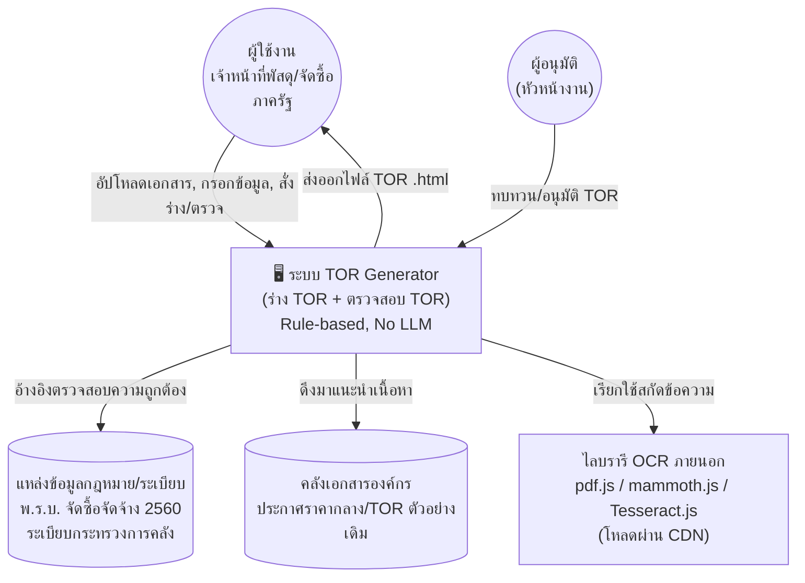

**หมายเหตุ:** ใน PoC ปัจจุบัน "แหล่งข้อมูลกฎหมาย/ระเบียบ" และ "คลังเอกสารองค์กร" เป็นข้อมูลจำลอง (hardcoded array ในโค้ด) ที่อ้างอิงชื่อไฟล์จริงจากคลังเอกสารขององค์กร ส่วนใน Production จะเชื่อมต่อกับ Knowledge Base Service จริงตามที่ระบุในเอกสาร 08 (API Reference)

---

## 2. Container Diagram (C4 Level 2)

แสดง "container" หลักของระบบทั้งสถานะปัจจุบันและเป้าหมาย รวมในภาพเดียวเพื่อให้เห็น mapping การย้ายจาก PoC ไป Production

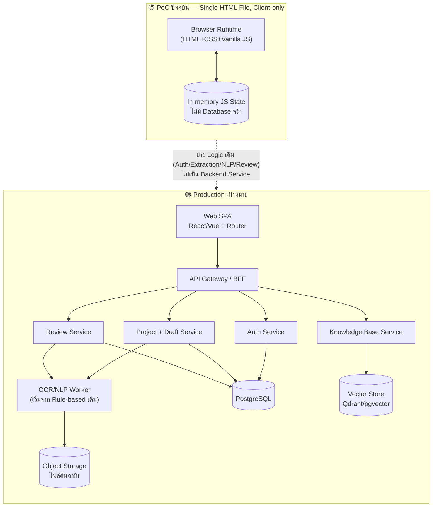

---

## 3. Component Diagram — PoC ปัจจุบัน

รายละเอียดของ Component ภายในไฟล์ `06-UXUI-Mockup.html` ตามฟังก์ชันจริงในโค้ด

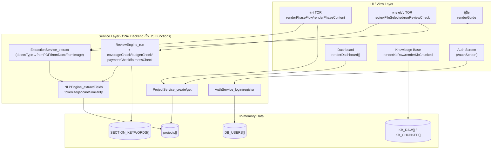

---

## 4. Component Diagram — Production เป้าหมาย

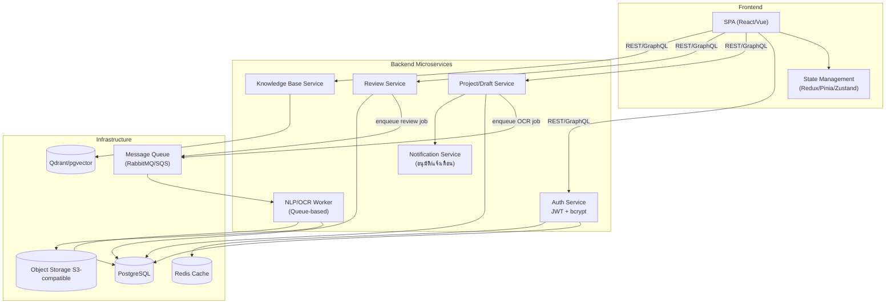

---

## 5. Sequence Diagram: Login / Register

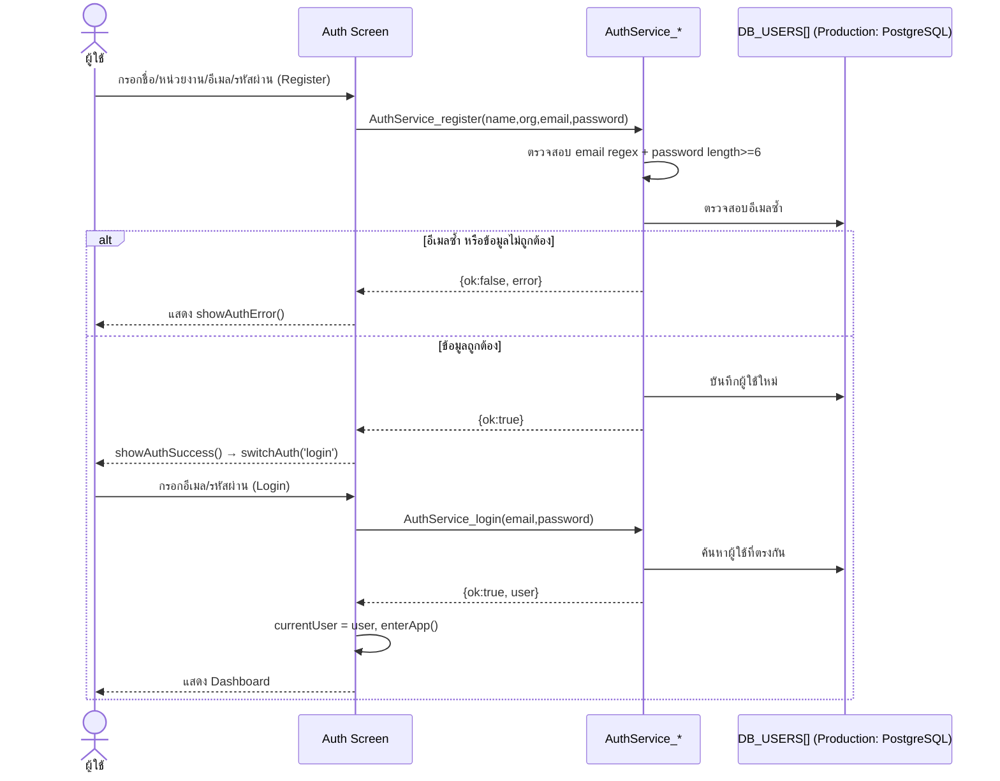

---

## 6. Sequence Diagram: ร่าง TOR (Upload → OCR → NLP → Mapping)

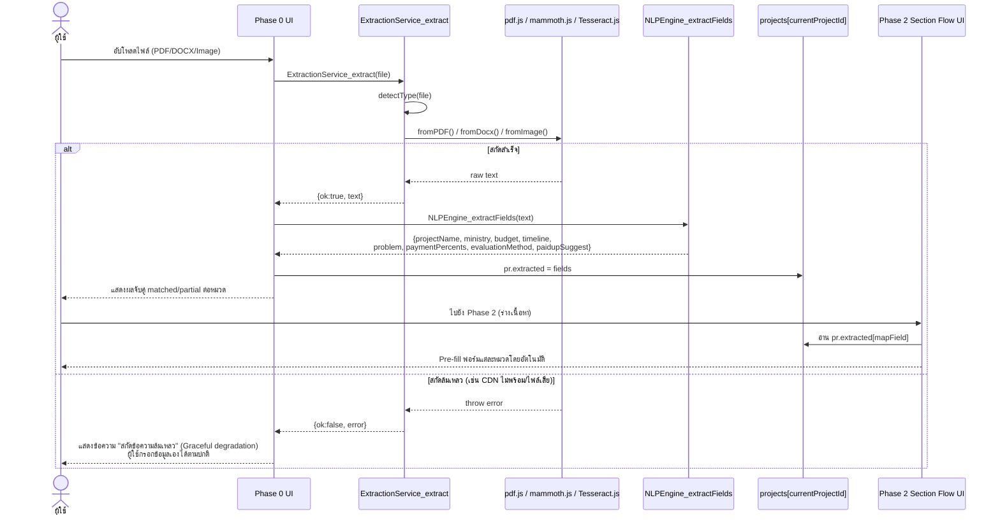

---

## 7. Sequence Diagram: ตรวจสอบ TOR (Rule-based Review Engine)

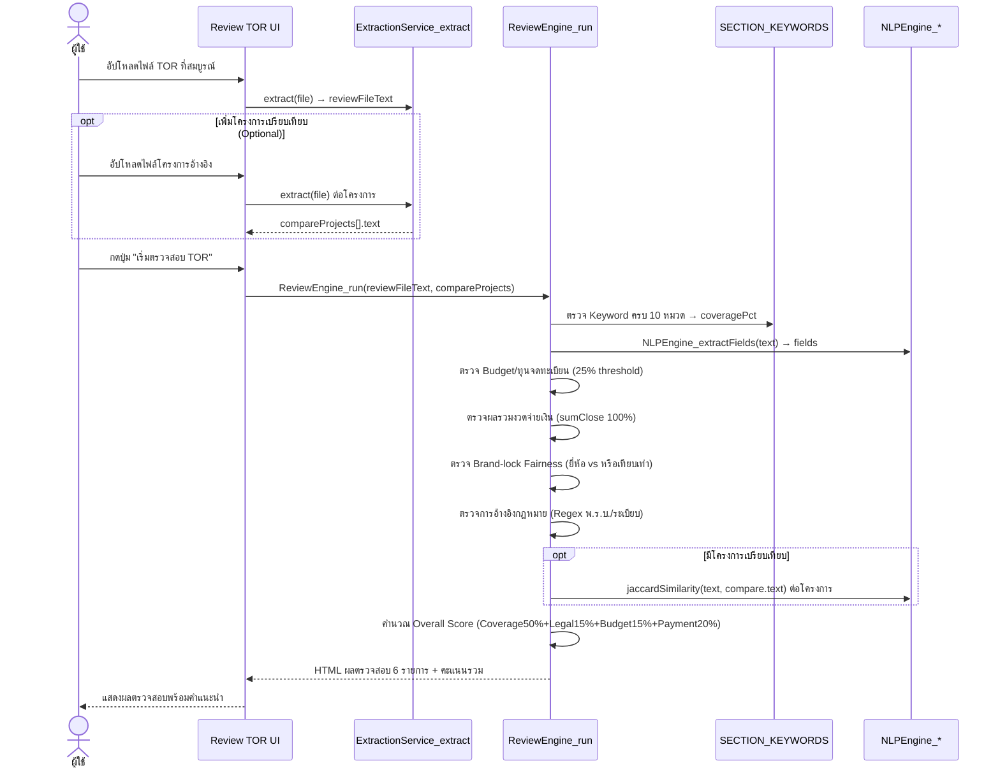

---

## 8. Deployment Diagram — Production

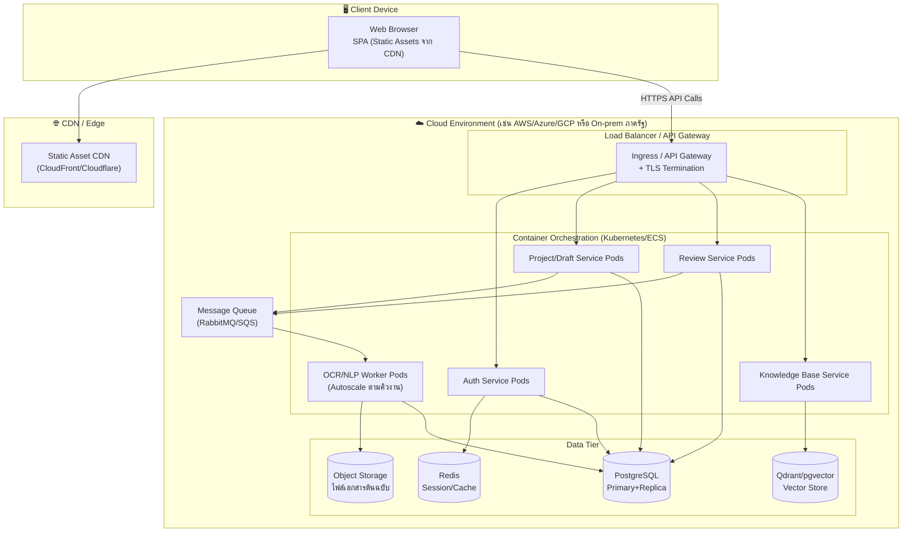

---

## 9. Data Model / ER Diagram

โครงสร้างข้อมูลเป้าหมายสำหรับ Production (แปลงจาก in-memory arrays ของ PoC)

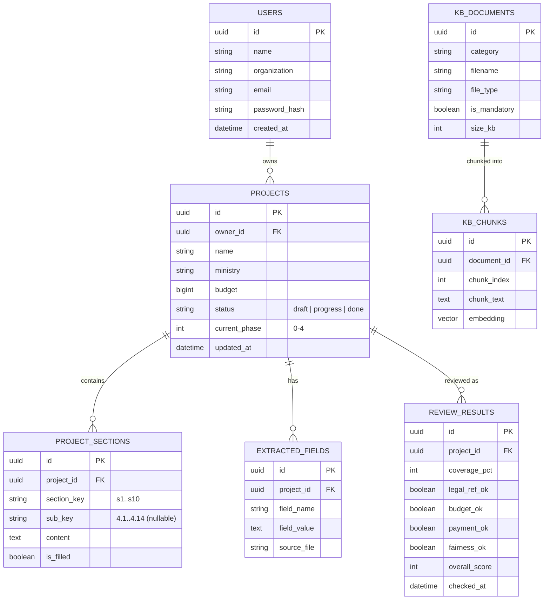

---

## 10. State Diagram: สถานะโครงการ TOR

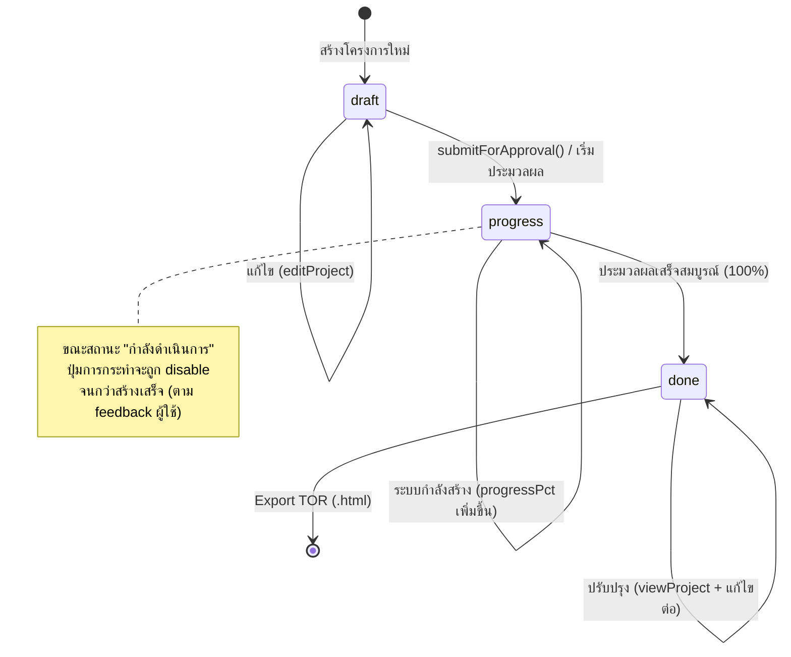

---

## 11. Class/Module Diagram: Service Layer ของ PoC

แสดงความสัมพันธ์ระหว่างฟังก์ชัน/โมดูลจริงในไฟล์ `06-UXUI-Mockup.html` ที่จะกลายเป็น Backend Service ใน Production (เทียบละเอียดกับ API ในเอกสาร 08)

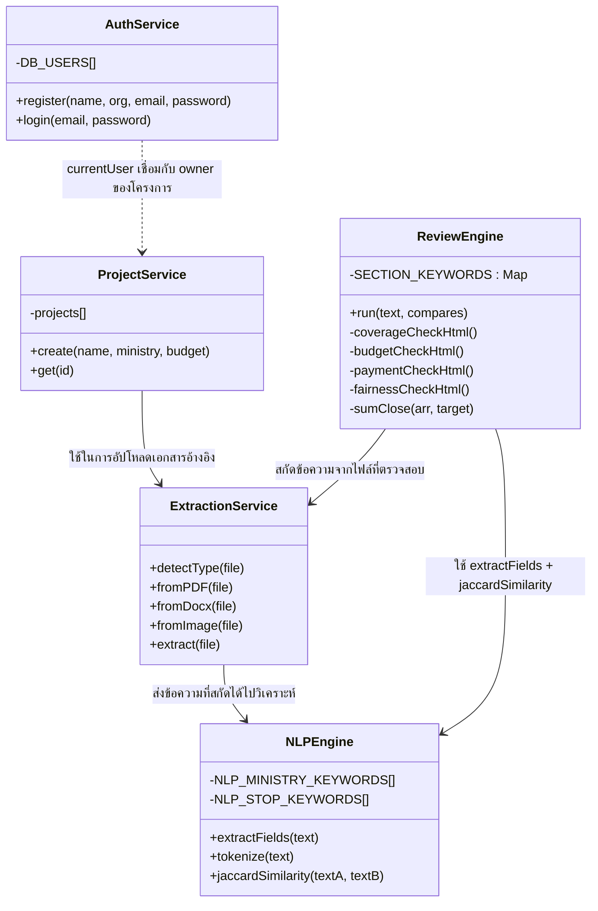

---

## สรุปการต่อยอดจาก PoC สู่ Production

| องค์ประกอบใน PoC (Client-only) | บทบาทใน Production |
|---|---|
| `AuthService_*` + `DB_USERS[]` | Auth Service + PostgreSQL + JWT/bcrypt |
| `ProjectService_*` + `projects[]` | Project/Draft Service + PostgreSQL |
| `ExtractionService_*` (pdf.js/mammoth.js/Tesseract.js) | OCR/NLP Worker (Queue-based, scale ได้) — เริ่มจาก Rule-based เดิม ต่อยอดเป็น ML ได้ในอนาคต |
| `NLPEngine_*` (Regex/Keyword/Jaccard) | คงเป็น Rule-based Service เดิม หรือเสริมด้วย NLP Model แยกส่วน |
| `ReviewEngine_*` | Review Service (เรียกใช้ NLP Engine + Section Keyword Rules) |
| `KB_RAW[]` / `KB_CHUNKED[]` | Knowledge Base Service + Vector Store (Qdrant/pgvector) จริง |
| In-memory JS variables | PostgreSQL + Redis Cache |

---
*เอกสาร 07 — COMPREHENSIVE App Architecture Diagrams | สอดคล้องกับเอกสาร 01-06 | ระบบ Rule-based ทั้งหมด ไม่มีการเรียกใช้ LLM*
