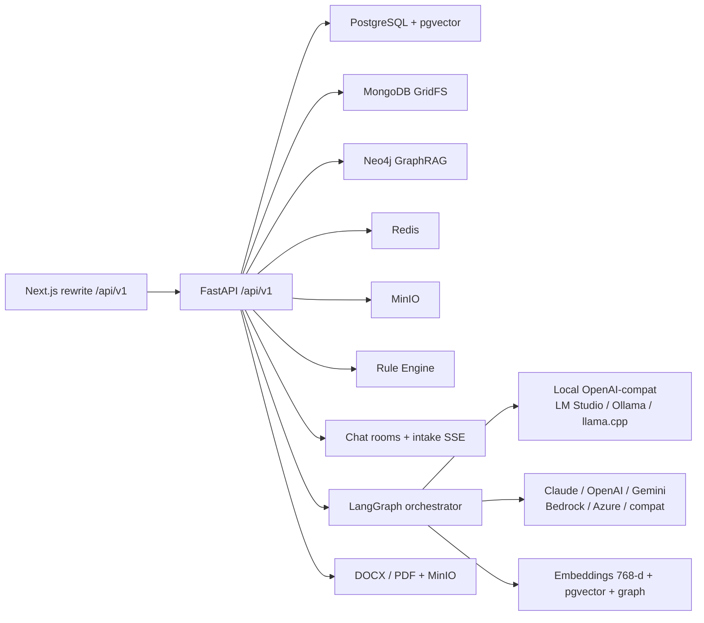

# Backend architecture

FastAPI service in `app/backend`. Listens on port **4000**. The Next.js container proxies browser calls from `/api/v1` to `http://backend:4000/api/v1`.

## Process shape



`redirect_slashes=False` so `POST /api/v1/projects` is not 307’d to `/projects/` (that redirect dropped the JSON body through the Next.js rewrite). The Next.js rewrite proxy timeout is 5 minutes (`experimental.proxyTimeout`) so LangGraph draft retries are not hung up at 30s.

## Layers

| Layer | Path | Role |
|-------|------|------|
| HTTP | `app/api/v1/endpoints/` | Auth, projects, intake (Phase 0–1), drafting, **agent sessions**, **kb-chat**, chat rooms/SSE, wizard compat, review, templates, knowledge-base, export, admin users, admin AI settings, health |
| Domain | `app/domain/` | Canonical s1–s13, NLP mapping, file magic bytes |
| Orchestrator | `app/orchestrator/` | Per-section LangGraph (`graph.py`) plus **agent workflow graph** (`agent_graph.py`) |
| RAG | `app/rag/` | Extract (PDF/DOCX/PPTX/TXT), chunk, ingest, retrieve |
| Rules | `app/rule_engine/` | Legal, completeness, consistency, format, payment, timeline |
| Providers | `app/providers/` | LLM (local OpenAI-compat, Claude, OpenAI, Gemini, Bedrock, Azure Foundry, OpenAI-compat), embeddings, vector stores |
| Export | `app/export/` | Thai formatting, DOCX, PDF, MinIO |
| Models | `app/models/` | SQLAlchemy: users, projects (`current_phase`, `analysis_json`, `extracted_fields`, `workflow_mode`), TOR sections, templates, KB, chat rooms, **agent_sessions**, **kb_chat_sessions**, audit, AI runtime settings |

HTTP handlers use FastAPI `Annotated[..., Depends(...)]`. Shared API strings are in `app/api/constants.py`. Short tempfile writes go through `app/io_temp.py` so they do not block the event loop. Intake copies filled slots into TOR sections via `apply_slot_map_to_sections` / `slot_content`. `GET /projects/{id}/sections` falls back to `slot_map` when a section row is still empty. `get_redis` and `get_minio` are synchronous (they only read `app.state`). `require_role`’s **inner** checker is sync and must use `current_user=Depends(get_current_user)` — wrapping that nested parameter in `Annotated` makes FastAPI 0.115 on Python 3.14 treat `current_user` as a missing body field (HTTP 422). `require_project_access` raises on deny and returns `None` on success. Knowledge-base list is registered on both `""` and `"/"` because `redirect_slashes=False`.

## Canonical TOR model

Persistence is **section-keyed** (`s1`…`s13`, plus `s4.1`–`s4.14`). The live UI is a **5-phase** workspace, not the older 8-step wizard:

| Phase | Stored as | Main APIs |
|-------|-----------|-----------|
| 0 Upload pack | GridFS + `extracted_fields.intake_texts` | `POST /projects/{id}/intake/upload`, `POST .../intake/text`, `POST .../intake/analyze` (user-gated, not auto) |
| 1 Coverage | `analysis_json.slot_map` | `GET .../intake/coverage`, `POST .../intake/fill-references` |
| 2 Q&A + ready | coverage rows, `ready_to_compose` | `POST .../intake/chat` (SSE), `POST .../intake/fill-reference`, `POST .../intake/confirm-ready` |
| 3 Draft 13 sections | `tor_sections` (`content` + `ai_draft`; s4.* as `sub_key`) | `GET /projects/{id}/sections`, `PUT /projects/{id}/sections/{key}`, `POST /projects/{id}/draft-section`, `POST .../intake/confirm-phase4` |
| 4 Review + publish | `quality_score`, MinIO objects | `POST /projects/{id}/review`, `GET /projects/{id}/suggestions`, `POST /projects/{id}/submit`, `POST /projects/{id}/export` |

KB Q&A (not a draft phase) uses `/api/v1/chat/rooms` with `kind=kb`. Draft intake chat uses `kind=draft_intake` on the same room APIs plus the intake routes above. Legacy `POST /projects/{id}/extraction` remains for compatibility; the live UI does not use the 9-class upload form.

A **parallel agent drafting path** (backend-only in v0.2.0, no Next.js pages yet) lives at `/api/v1/agent` and `/api/v1/kb-chat`. It does not replace the 5-phase workspace. Flow: ingest (≤20 files, 50 MB each, PPTX included) → map 27 slots → gap fill (max 20 rounds, 5 Thai questions) → confirm → draft s1–s13 (900s, auto-correct ≤3) → human review (s3, s6, s8, s10, s13) → export DOCX/PDF. State is stored in `agent_sessions.graph_state` + Redis (`agent:session:{id}`); there is no LangGraph Postgres checkpointer. `POST /agent/sessions` is multipart: at least one file or ≥50 characters of text, plus project fields or `project_id` (`workflow_mode='agent'`). Redis write failures log and continue. The agent graph uses the same `ProviderFactory` as the rest of the app: **chat and embeddings are independent in every mode** (e.g. Claude API + EmbeddingGemma in LM Studio).

`PATCH /projects/{id}/phase` stores `current_phase` (0–4). Uploads are checked with magic bytes (`app/domain/file_magic.py`) before extraction. Money and date regexes use ASCII `[0-9]` only — Python `\\d` also matches Thai digits `๐-๙`.

HITL sections (qualifications, budget, payments, penalty, other terms) require `human_confirmed` before Phase 3 submit is enabled. Reviewer/admin approve or reject with `POST /projects/{id}/approve` and `/reject` (dashboard buttons **อนุมัติ** / **ส่งกลับ**).

`llm_draft` calls the s1–s13 agent from `get_agent_for_section()` (`_draft_section_with_agent`). The live Rule Engine registers payment and timeline rules alongside legal rules; those rules skip when installment/timeline data is absent.

The agent workflow graph (`compile_agent_workflow_graph`) uses the same factory: `llm_provider` and `embedding_provider` are honored independently of `deployment_mode`.

`python -m app.seed_raw_docs` wipes `kb_chunks` / baseline GridFS / Neo4j graph (it does **not** wipe per-user GridFS files) then ingests the mandatory corpus with grouping:

- `documents/sources/คู่มือแนวปฏิบัติ_การจัดซื้อจัดจ้างภาครัฐ.pdf` → `corpus_group=mandatory_handbook`
- PDFs under `documents/sources/การจัดซื้อจัดจ้าง/ข้อมูลดิบ` → `corpus_group=mandatory_raw`

Embeddings are 768-d EmbeddingGemma; optional Gemma graph extract writes Neo4j `Document.owner_id` (null for this shared corpus). Run it from the **host** (`POSTGRES_HOST=127.0.0.1`, `LM_STUDIO_BASE_URL=http://127.0.0.1:1234/v1`). Do not ingest old `documents/knowledge-base` JSON as the live corpus.

Officer uploads (`POST /api/v1/knowledge-base/mine`, chat attachments, intake files) use `scope=user`, `owner_id=<that user>`, `corpus_group=user`, and chat attachments set `category=other`. Officers download their files at `GET /knowledge-base/mine/{id}/file` (admins use `GET /knowledge-base/{id}/file`). `hybrid_retrieve` accepts `search_scope` of `global` / `mine` / `both`. Another officer never sees those chunks. Admin `POST /knowledge-base/upload` remains the shared/mandatory path.

Alembic `006_kb_corpus_group` adds `knowledge_base_documents.corpus_group`.

`python -m app.seed_kb` remains for research extracts only (skips `_coverage_matrix*` and `_external_sources_note.md`).

## Local vs cloud LLM

Default `DEPLOYMENT_MODE=on_prem` and `LLM_PROVIDER=lm_studio`:

- Chat completions: `google/gemma-4-e4b` at `http://host.docker.internal:1234/v1`
- Embeddings: `text-embedding-embeddinggemma-300m` (OpenAI-compatible `/embeddings`, **768** dimensions)
- Vector store: pgvector by default; Admin can select Qdrant in any mode including `on_prem`
- Per-section LLM timeout: `LM_STUDIO_TIMEOUT` (default **180s**, clamped to 300s). Gemma E4B often exceeds the 60s cloud default.

The same OpenAI-compat client also targets Ollama (`:11434/v1`) and llama.cpp (`:8080/v1`). `EMBEDDING_PROVIDER=local` is the public id; `qwen3` remains a deprecated alias. Local embedding host is **independent of chat**: `LOCAL_EMBEDDING_SERVER` (`lm_studio` / `ollama` / `llama_cpp`) or `LOCAL_EMBEDDING_BASE_URL`.

Chat (`LLM_PROVIDER`) and embeddings (`EMBEDDING_PROVIDER`) are always selected independently in every mode — `on_prem` / `cloud` do **not** remap the other side. Mix examples: Claude API + EmbeddingGemma in LM Studio; Gemma chat + OpenAI embeddings. Compose passes cloud keys through when set; Admin can also enter keys in the UI. Admin `GET/PUT /api/v1/admin/ai-settings` stores a singleton `ai_runtime_settings` row. `PUT` calls `apply_runtime_overlay` in-process so `get_settings()` / `ProviderFactory()` pick up LLM, URL, and key changes immediately (`restart_required` is false). Changing the embedding vendor, host, or model sets `reingest_required` and still needs `python -m app.seed_raw_docs`. Cloud embeddings request `dimensions=768` so they fit the pgvector column.

`POST /api/v1/admin/ai-settings/test` pings the local `/models` endpoint or a cheap cloud models list and does not require a restart. Keys are returned masked (`****abcd`). Missing cloud keys use shared Thai messages (`ต้องใส่ OPENAI_API_KEY` / `GEMINI_API_KEY`). pgvector cosine search uses a single SQL fragment `embedding <=> :query_vector::vector` (no empty f-string).

## Auth and safety

- Login sets JWT in an **HttpOnly** cookie `tor_access_token` (`SameSite=Lax`). `Authorization: Bearer` is still accepted (tests and API clients).
- `extract_access_token` prefers Bearer, then the cookie (`app/auth_cookies.py`).
- Roles: officer, reviewer, admin
- Officers see only their projects; reviewers/admins see all
- Rate limits on general requests and uploads
- Security headers / CSP on API responses
- Audit log on upload, extraction apply, and submit
- Alembic migrations run at backend startup (including `vector(768)`, `ai_runtime_settings`, `current_phase`, chat rooms, KB `owner_id`, **`005_agent_sessions`**: `agent_sessions`, `kb_chat_sessions`, `projects.workflow_mode`, **`006_kb_corpus_group`**: `knowledge_base_documents.corpus_group`)

## Seed CLIs

From `app/backend` (or `docker compose exec backend`):

- `python -m app.seed_db` — demo users and sample data
- `python -m app.seed_raw_docs` — live corpus from PDFs → Mongo GridFS + pgvector + Neo4j
- `python -m app.seed_kb` — research extracts in `documents/knowledge-base` (not the live corpus)

Source PDFs for laws and manuals live under `documents/sources/`. Do not copy that corpus into `app/frontend` or `app/backend`.

## HTTP details

- FastAPI `Depends` parameters use `Annotated[T, Depends(...)]`. Query/Form **defaults stay on `=`**, not inside `Annotated` (FastAPI 0.115 rejects `Annotated[..., Form(default=None)]`).
- Shared messages and MIME types: `app/api/constants.py` (`PROJECT_NOT_FOUND`, PDF/DOCX/plain MIME, `/projects` prefix).
- Temp files in async handlers: `app/io_temp.py` (`asyncio.to_thread`).
- Startup Alembic: `asyncio.create_subprocess_exec` (not `subprocess.run`).
- Image copy is explicit (`COPY app`, `alembic`, `alembic.ini`, `pyproject.toml`, `scripts`) so the production image does not copy the whole build context. Tests stay out via `.dockerignore`.
- Export generation runs in a **new DB session** with a scalar `ProjectExportSnapshot`. The request session is not reused after HTTP 202 (that caused `DetachedInstanceError` and asyncpg “manually started transaction”).

## Tests

From `app/backend` on the host (Python 3.11+ with `pip install -e ".[dev]"`):

```bash
python -m pytest tests -q --tb=short --cov=app --cov-report=term-missing -m "not live_llm"
python -m pytest tests/test_real_procurement_pdfs.py tests/test_live_lm_studio.py -q --tb=short
```

Latest counts and headed screenshots: `discussions/18-TEST_EVIDENCE.md`. Live LM Studio tests need both chat and embedding models loaded at `http://127.0.0.1:1234/v1`.

**21 ส.ค. 2026 verification:** pytest `-m "not live_llm"` **1500** passed (**86%** cov, **0 skipped**); `live_llm` **14** passed against LM Studio including `test_live_realistic_workflow.py`; headed Playwright **20** passed with human-like typing, live Gemma, and `realistic-flow.spec.ts` (unmocked `/review` + KB other CRUD). Live smoke covered draft-section LangGraph, `POST .../intake/fill-references`, standalone `/review/extract`+`/run`, `/chat` SSE, and private-KB attach ingest (`category=other`, `GET .../mine/{id}/file`).

`POST /api/v1/review/compare-projects` accepts `project_ids` and `extract_ids` (job ids from `POST /review/extract`). Pairwise Jaccard is computed in `_token_set` / `_jaccard`; missing ids are skipped. Combined length must be ≥ 2.

Gregorian years in the format rules are found with an ASCII digit scan (`"0" <= ch <= "9"` / `[0-9]`), not Python `\\d`, which also matches Thai digits `๐-๙`. Sonar rule `python:S6353` is ignored in `sonar-project.properties` and turned off in `.vscode/settings.json` for this reason.
