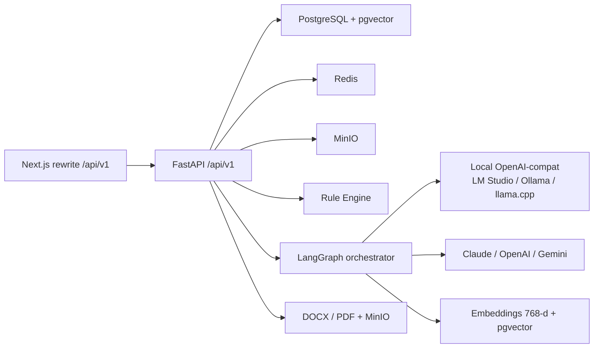

# Backend architecture

FastAPI service in `app/backend`. Listens on port **4000**. The Next.js container proxies browser calls from `/api/v1` to `http://backend:4000/api/v1`.

## Process shape



`redirect_slashes=False` so `POST /api/v1/projects` is not 307’d to `/projects/` (that redirect dropped the JSON body through the Next.js rewrite).

## Layers

| Layer | Path | Role |
|-------|------|------|
| HTTP | `app/api/v1/endpoints/` | Auth, projects (5-phase + extraction), wizard steps (compat), review, templates, knowledge-base, export, admin users, admin AI settings, standalone review, health |
| Domain | `app/domain/` | Canonical s1–s13, NLP mapping, file magic bytes |
| Orchestrator | `app/orchestrator/` | LangGraph nodes and section agents |
| RAG | `app/rag/` | Extract, chunk, ingest, retrieve |
| Rules | `app/rule_engine/` | Legal, completeness, consistency, format, payment, timeline |
| Providers | `app/providers/` | LLM (local OpenAI-compat, Claude, OpenAI, Gemini), embeddings, vector stores |
| Export | `app/export/` | Thai formatting, DOCX, PDF, MinIO |
| Models | `app/models/` | SQLAlchemy: users, projects (`current_phase`, `analysis_json`, `extracted_fields`), TOR sections, templates, KB, audit, AI runtime settings |

HTTP handlers use FastAPI `Annotated[..., Depends(...)]`. Shared API strings are in `app/api/constants.py`. Short tempfile writes go through `app/io_temp.py` so they do not block the event loop. `get_redis` and `get_minio` are synchronous (they only read `app.state`). `require_role`’s **inner** checker is sync and must use `current_user=Depends(get_current_user)` — wrapping that nested parameter in `Annotated` makes FastAPI 0.115 on Python 3.14 treat `current_user` as a missing body field (HTTP 422). `require_project_access` raises on deny and returns `None` on success. Knowledge-base list is registered on both `""` and `"/"` because `redirect_slashes=False`.

## Canonical TOR model

Persistence is **section-keyed** (`s1`…`s13`, plus `s4.1`–`s4.14`). The live UI is a **5-phase** workspace, not the older 8-step wizard:

| Phase | Stored as | Main APIs |
|-------|-----------|-----------|
| 0 Upload | `extracted_fields`, classified files in `analysis_json.intakeFiles` | `POST /projects/{id}/extraction`, `POST /projects/{id}/extraction/apply` |
| 1 Analysis | `analysis_json` | `PUT /projects/{id}/analysis` |
| 2 Draft 13 sections | `tor_sections` | `GET /projects/{id}/sections`, `PUT /projects/{id}/sections/{key}` |
| 3 Review | `quality_score`, project `status` | `POST /projects/{id}/review`, `POST /projects/{id}/submit` |
| 4 Publish | MinIO objects | `POST /projects/{id}/export` |

`PATCH /projects/{id}/phase` stores `current_phase` (0–4). Uploads are checked with magic bytes (`app/domain/file_magic.py`) before extraction. Money and date regexes use ASCII `[0-9]` only — Python `\\d` also matches Thai digits `๐-๙`.

HITL sections (qualifications, budget, payments, penalty, other terms) require `human_confirmed` before Phase 3 submit is enabled. Reviewer/admin approve or reject with `POST /projects/{id}/approve` and `/reject` (dashboard buttons **อนุมัติ** / **ส่งกลับ**).

`llm_draft` calls the s1–s13 agent from `get_agent_for_section()` (`_draft_section_with_agent`). The live Rule Engine registers payment and timeline rules alongside legal rules; those rules skip when installment/timeline data is absent.

`python -m app.seed_kb` ingests `*_tor_extract.json`, `*_combined.json` topic packs, and `04-decision-rules/*.json` (skips `_coverage_matrix*` and `_external_sources_note.md`).

## Local vs cloud LLM

Default `DEPLOYMENT_MODE=on_prem` and `LLM_PROVIDER=lm_studio`:

- Chat completions: `google/gemma-4-e4b` at `http://host.docker.internal:1234/v1`
- Embeddings: `text-embedding-embeddinggemma-300m` (OpenAI-compatible `/embeddings`, **768** dimensions)
- Vector store: pgvector by default; Admin can select Qdrant in any mode including `on_prem`
- Per-section LLM timeout: `LM_STUDIO_TIMEOUT` (default **180s**, clamped to 300s). Gemma E4B often exceeds the 60s cloud default.

The same OpenAI-compat client also targets Ollama (`:11434/v1`) and llama.cpp (`:8080/v1`). `EMBEDDING_PROVIDER=local` is the public id; `qwen3` remains a deprecated alias.

Cloud is opt-in (`claude`, `openai`, `gemini`). Compose passes `ANTHROPIC_API_KEY`, `OPENAI_API_KEY`, and `GEMINI_API_KEY` through when set; Admin can also enter keys in the UI. Admin `GET/PUT /api/v1/admin/ai-settings` stores a singleton `ai_runtime_settings` row. `PUT` calls `apply_runtime_overlay` in-process so `get_settings()` / `ProviderFactory()` pick up LLM, URL, and key changes immediately (`restart_required` is false). Cloud mode accepts only cloud LLM/embedding ids; hybrid PUT requires the matching API key. Changing the embedding vendor or embedding model sets `reingest_required` and still needs `python -m app.seed_kb`. Cloud embeddings request `dimensions=768` so they fit the pgvector column.

`POST /api/v1/admin/ai-settings/test` pings the local `/models` endpoint or a cheap cloud models list and does not require a restart. Keys are returned masked (`****abcd`). Missing cloud keys use shared Thai messages (`ต้องใส่ OPENAI_API_KEY` / `GEMINI_API_KEY`). pgvector cosine search uses a single SQL fragment `embedding <=> :query_vector::vector` (no empty f-string).

## Auth and safety

- Login sets JWT in an **HttpOnly** cookie `tor_access_token` (`SameSite=Lax`). `Authorization: Bearer` is still accepted (tests and API clients).
- `extract_access_token` prefers Bearer, then the cookie (`app/auth_cookies.py`).
- Roles: officer, reviewer, admin
- Officers see only their projects; reviewers/admins see all
- Rate limits on general requests and uploads
- Security headers / CSP on API responses
- Audit log on upload, extraction apply, and submit
- Alembic migrations run at backend startup (including `vector(768)`, `ai_runtime_settings`, `current_phase`)

## Seed CLIs

From `app/backend` (or `docker compose exec backend`):

- `python -m app.seed_db` — demo users and sample data
- `python -m app.seed_kb` — ingest `documents/knowledge-base` (volume `/knowledge-base`)

Source PDFs for laws and manuals live under `documents/sources/`. Do not copy that corpus into `app/frontend` or `app/backend`.

## HTTP details

- FastAPI `Depends` parameters use `Annotated[T, Depends(...)]`. Query/Form **defaults stay on `=`**, not inside `Annotated` (FastAPI 0.115 rejects `Annotated[..., Form(default=None)]`).
- Shared messages and MIME types: `app/api/constants.py` (`PROJECT_NOT_FOUND`, PDF/DOCX/plain MIME, `/projects` prefix).
- Temp files in async handlers: `app/io_temp.py` (`asyncio.to_thread`).
- Startup Alembic: `asyncio.create_subprocess_exec` (not `subprocess.run`).
- Image copy is explicit (`COPY app`, `alembic`, `alembic.ini`, `pyproject.toml`, `scripts`) so the production image does not copy the whole build context. Tests stay out via `.dockerignore`.
- Export generation runs in a **new DB session** with a scalar `ProjectExportSnapshot`. The request session is not reused after HTTP 202 (that caused `DetachedInstanceError` and asyncpg “manually started transaction”).

## Tests

From `app/backend` on the host (Python 3.11+ with `pip install -e ".[dev]"`):

```bash
python -m pytest tests -q --tb=short --cov=app --cov-report=term-missing -m "not live_llm"
python -m pytest tests/test_real_procurement_pdfs.py tests/test_live_lm_studio.py -q --tb=short
```

Last host run (**18 Aug 2026 ~10:52**): **1339 passed** / **92%** coverage including live LM Studio chat and EmbeddingGemma-300M. Screenshots and the 13 headed Playwright cases: `discussions/18-TEST_EVIDENCE.md`.

`POST /api/v1/review/compare-projects` accepts `project_ids` and `extract_ids` (job ids from `POST /review/extract`). Pairwise Jaccard is computed in `_token_set` / `_jaccard`; missing ids are skipped. Combined length must be ≥ 2.

Gregorian years in the format rules are found with an ASCII digit scan (`"0" <= ch <= "9"` / `[0-9]`), not Python `\\d`, which also matches Thai digits `๐-๙`. Sonar rule `python:S6353` is ignored in `sonar-project.properties` and turned off in `.vscode/settings.json` for this reason.
