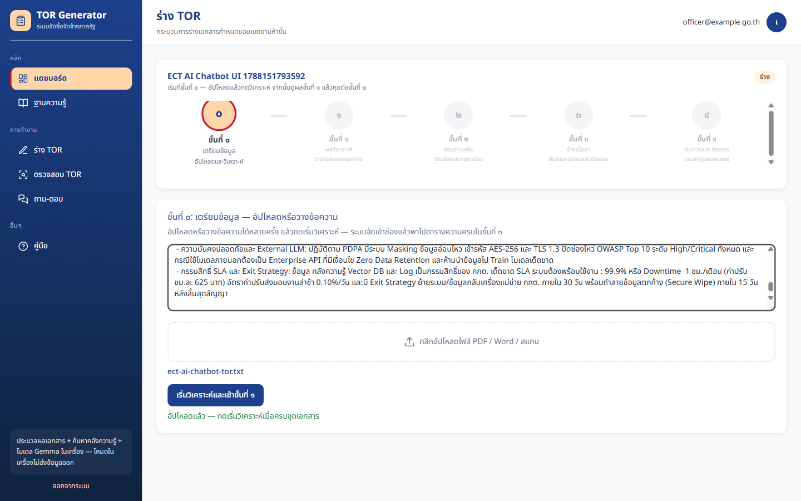
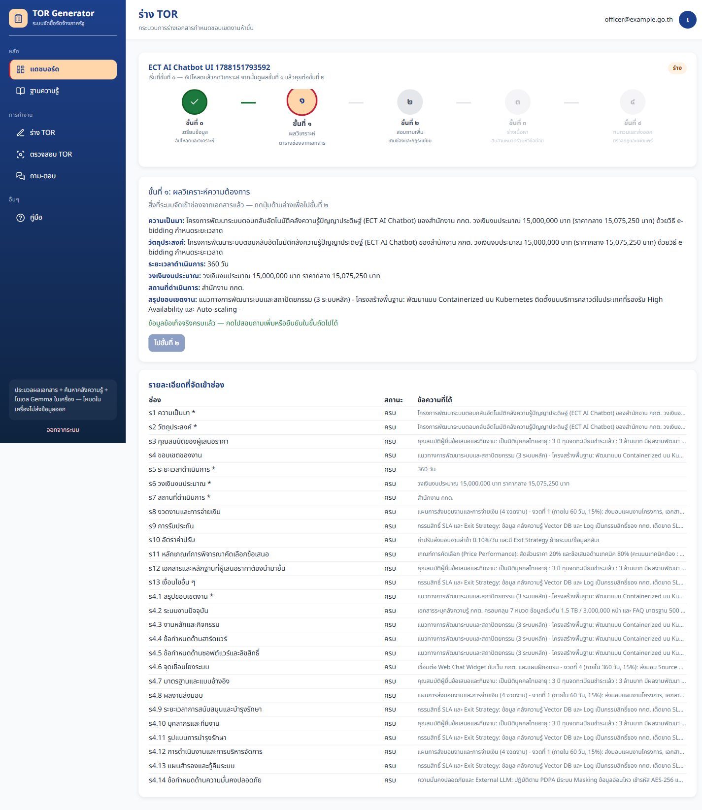
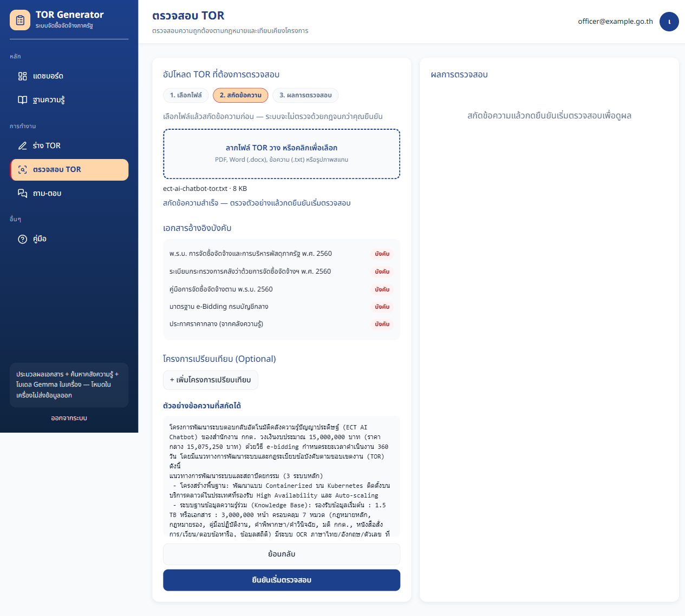
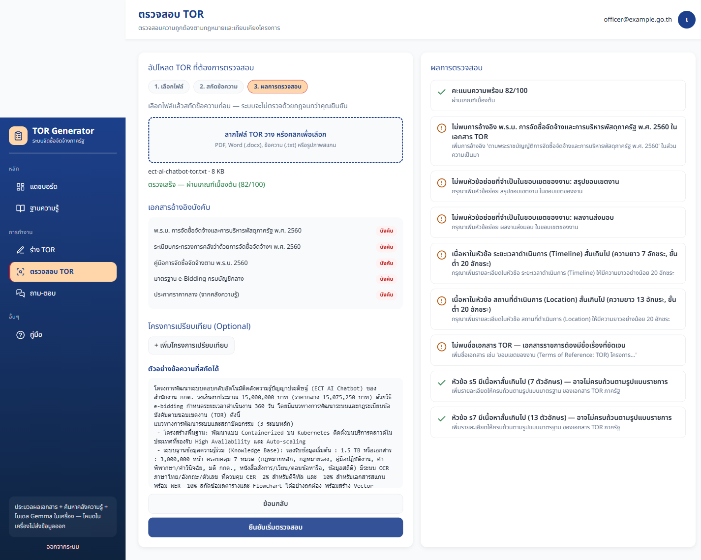
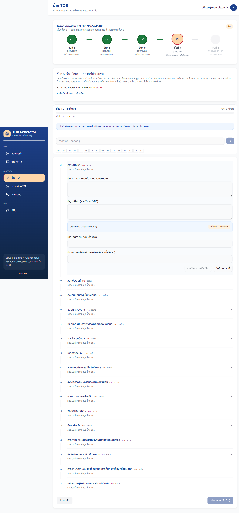
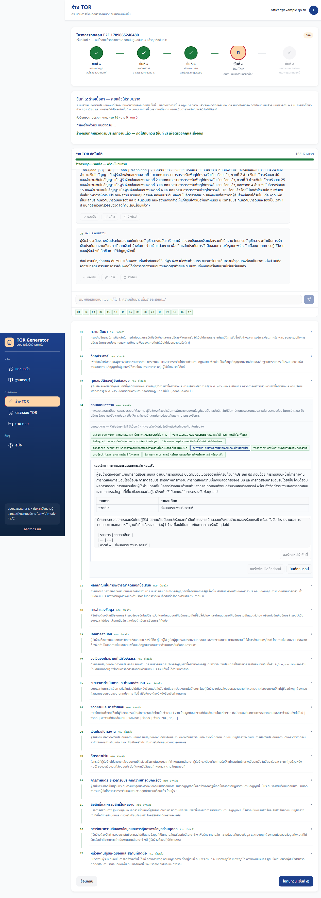
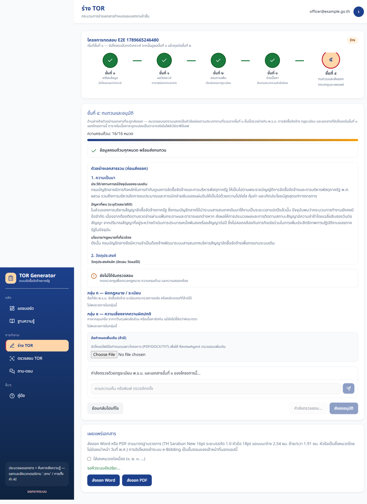
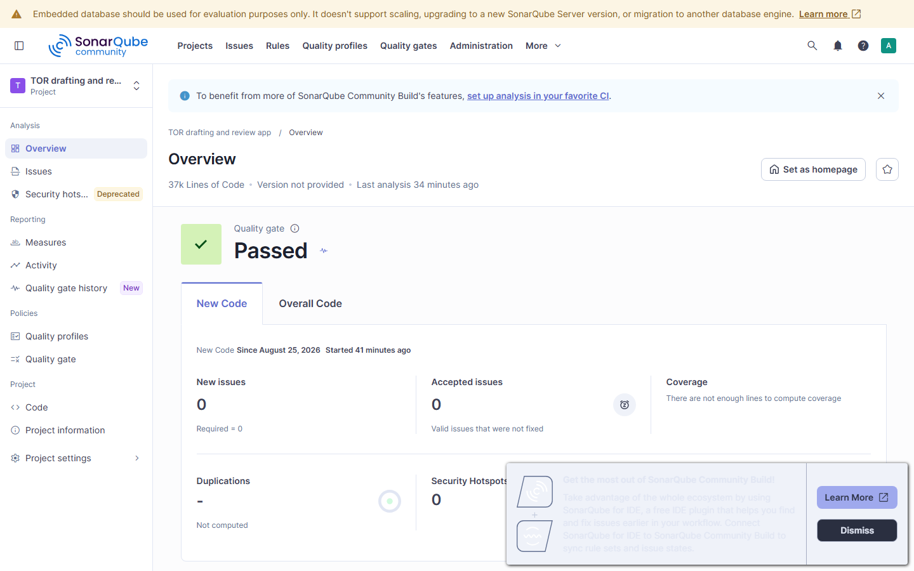

# หลักฐานการทดสอบ — ผ่านทั้งหมด

> **รอบตรวจรวมล่าสุด (31 สิงหาคม 2026):** [`28-VERIFICATION-AND-MIGRATION.md`](28-VERIFICATION-AND-MIGRATION.md) — pytest 1642 + live ECT 3 ผ่าน (คะแนนโครงการ 95) + Vitest 209 + Playwright headed KB  
> ไฟล์นี้เก็บวงจรและภาพรอบ **25–27 ส.ค. 2026** เป็น baseline — ตัวเลขในตารางด้านล่างอาจต่างจากรอบ 28

วันที่ **27 สิงหาคม 2026** (อัปเดตรอบ ECT AI Chatbot full coverage 26–27 ส.ค.) · ฐานเดิม v0.2.4 **25 สิงหาคม 2026**  
สแตก Docker `tor-app` (postgres + mongo + neo4j + redis + minio) + LM Studio ที่ `http://127.0.0.1:1234` (fallback เมื่อ SGLang `:30000` ยังไม่ขึ้น)  
`GET http://localhost:4000/health` = `healthy` ทั้ง `postgres` `redis` `minio` `mongo` `neo4j`

เอกสารชุดปัจจุบันเรียง **13–23** (AWS ล้วน **24–27** + เกต **28** + TBW **29**). หลักฐานภาพอยู่ใน `discussions/test-evidence/`

| โมเดล | ค่า |
|--------|-----|
| Chat / draft (dev) | SGLang `:30000` เมื่อ healthy ไม่เช่นนั้น `google/gemma-4-e4b` ผ่าน LM Studio |
| Structured JSON (intake / ReviewAgent / graph) | SGLang `guided_json` เมื่อ healthy; LM Studio + `parse_json_lenient` เป็น fallback · ข้อเสนอแนะ ReviewAgent จำกัด completion **4,096** โทเคน |
| Embeddings (dev) | `text-embedding-embeddinggemma-300m` (768 มิติ) |
| Production แนะนำ | Amazon Bedrock บน **ECS/RDS ล้วน** — [`24`](24-AWS_CLOUD_OVERVIEW.md)–[`27`](27-AWS_CODE_AND_CUTOVER.md), TBW [`29`](29-TBW-AWS-CLOUD-ONLY.md); ทางลัด EC2+Compose คือเอกสาร 20 |

ภาพถ่ายจาก Playwright แบบ **headed** (`slowMo` 400ms, พิมพ์ทีละตัวอักษร delay 70ms, เบราว์เซอร์โชว์บนจอ) หลังเคสผ่านแล้วเท่านั้น  
คู่มือผู้ใช้: `13-USER_GUIDELINE.md` · รายงานการทำงาน: `19-APPLICATION_OPERATING_REPORT.md`

---

## รอบ ECT AI Chatbot — full coverage ใช้งานจริง (26 ส.ค. 2026 ดึก)

เอกสารต้นทาง: `app/backend/tests/fixtures/ect_ai_chatbot_pack.txt` (สำนักงาน กกต. · ECT AI Chatbot · งบ 15,000,000 บาท · 360 วัน)  
ฮาร์เนส: `tests/test_live_ect_tor_full.py` + Playwright `e2e/ect-full.spec.ts`  
โครงการ API: `afb571e5-c698-4e35-b908-81780e450854` (ECT AI Chatbot live 222750) · pytest **3 ผ่าน ใน 40:36** · Playwright headed **1 ผ่าน ใน 36 วินาที**

วงจรที่พิสูจน์แล้ว: **ขั้น ๐ วาง+อัปโหลด → วิเคราะห์ 27/27 ช่อง → confirm-ready → ร่าง s1–s13 และ s4.1–s4.14 → ตรวจในโครงการ → ตรวจไฟล์ต้นทาง/ร่างประกอบบน `/review`**  
รอบแก้ 27 ส.ค. ปิดปลายวงจรในฮาร์เนสด้วย `confirm-phase4` + ส่งออก และแก้คะแนนไฟล์ล้วนที่เคยได้ 0 เพราะประกอบหมวด ๔ จาก JSON แม่โดยไม่รวมหัวข้อย่อย

| เส้นทาง | ผล | หมายเหตุ |
|---------|-----|----------|
| Phase 0→1 coverage | **27/27** ช่อง `filled` | ฮิวริสติกจัดเอกสารอิสระได้แม้ไม่มีรหัส `(s1):` |
| ตรวจไฟล์ต้นทาง (`/review`) | **74/100** · 9 findings (26 ส.ค.) | รอบนั้นขึ้น «ไม่พบข้อมูลงบประมาณ» ทั้งที่มี 15,000,000 ในข้อความ — แก้ 27 ส.ค. ให้สกัดงบก่อนรันกฎ |
| ร่าง 13 หมวด + 14 หัวข้อย่อย | ครบ · รวม ~239,000 ตัวอักษร | s4 ใช้เวลาส่วนใหญ่ (~19 นาที บน Gemma) |
| ตรวจในโครงการ (Rule Engine + เมทาดาทาวงเงิน) | **95/100** · `valid=true` · warning 2 | อ้างอิง พ.ร.บ. 2560 · ชื่อเอกสาร |
| ตรวจไฟล์ TOR ที่ประกอบจากร่าง | **76/100** | ต้องรวม s4.1–s4.14 + คลาย JSON หัวข้อย่อยเป็นภาษาราชการ |
| ข้อเสนอแนะ ReviewAgent | JSON ล้ม 2 ครั้ง แล้ว fallback | รอบนั้นได้ข้อเสนอขยะจากหัวข้อแพ็กขั้นที่ ๐ — แก้แล้วไม่ส่งแพ็กเป็น `custom_requirements` |









อย่ารีบิลด์คอนเทนเนอร์ backend ระหว่างงานร่าง — คิวร่างอยู่ในหน่วยความจำ

---

## สรุปตัวเลข (รอบ 25 ส.ค. 2026 ดึก — ร่างต่อเนื่อง + หัวข้อย่อย + ตาราง)

| ชุด | ผล | ความหมาย |
|-----|-----|----------|
| pytest `-m "not live_llm and not integration"` + cov | **1596 ผ่าน** / **22 ข้าม** | ครอบคลุมบรรทัด **83%** (`htmlcov/` · `coverage.xml`) |
| Vitest `test:coverage` | **205 ผ่าน** / 48 ไฟล์ | statements **79.81%** · lines **82.22%** |
| Playwright E2E headed (ชุดเต็ม) | **15 ผ่าน** / **3 ข้าม** แล้วตามด้วย wizard รอบแก้ locator | ข้ามเฉพาะ mock (`intake-ui`, realistic Phase0 mock, mocked webapp review) |
| Playwright wizard headed | **1 ผ่าน** (~19.9 นาที) | เส้นเดียว 0→4: ๑๓ หมวด + ๔.๑–๔.๑๔ จาก LM Studio + ตาราง HTML + HITL + Rule Engine + ส่งออก |
| SonarQube `:9400` | Quality gate **OK** | เงื่อนไข CAYC `new_violations` = **0** |

คำสั่งที่รัน: `npm run test:e2e:headed` → `npx playwright test e2e/wizard-flow.spec.ts --headed` → pytest coverage → `npm run test:coverage` → `sonar-scanner` (โฮสต์ `:9400`)

### สิ่งที่ตรวจแบบใช้งานจริงในรอบนี้

- ล็อกอิน/สร้างโครงการ **พิมพ์ทีละตัว** ไม่ใช้ `.fill()` แบบยิงเร็ว
- ถาม-ตอบ `/chat`: พิมพ์คำถามงวดจ่าย แล้วรอคำตอบจาก Gemma
- แนบไฟล์เข้าคลังของฉันจริง (ingest + embeddings) แล้วถามโหมดของฉัน
- ร่าง TOR Phase 0→4 สด: วิเคราะห์ → skip Phase1 → แชทเติมช่อง → **ร่าง 13 หมวดแม่ + เติมหัวข้อย่อย ๔.๑–๔.๑๔ ในช่องจริง** → HITL → ขั้นที่ ๔ ประกอบเอกสาร (`4.1` ไม่ใช่ `s4.s4.1`) + ตาราง HTML → Rule Engine + ส่งออก DOCX/PDF → `phase4-submit` → reviewer อนุมัติ
- ตรวจ TOR สแตนด์อโลน: extract → รัน → คะแนนคงหลังรีเฟรช (Postgres `review_jobs`)
- `realistic-flow.spec.ts`: ตรวจ TOR + KB หมวดข้อมูลอื่น ๆ อัปโหลด/ดาวน์โหลด/ลบ
- ป้าย workflow เป็นภาษาไทย (ขั้นที่ ๓ / ๔.๑–๔.๑๔) ไม่มี `Phase 3` / `As-Is` ในหน้าผู้ใช้

---

## รายงาน Playwright — แอป (headed · 25 ส.ค. 2026)

รัน: `cd app/frontend && npm run test:e2e:headed` แล้วตามด้วย `npx playwright test e2e/wizard-flow.spec.ts --headed` (1 worker, Chromium มองเห็นได้)  
Chromium, viewport 1440×900, ภาษา th-TH · `HEADED=1` + `screenshot: on` + `slowMo: 400` + พิมพ์ทีละตัว 70ms  

ชุดเต็มรอบแรก: **15 ผ่าน / 3 ข้าม / 1 ล้ม** (locator ตาราง `s4.8` เจอ `<table>` สองใบ — แก้เป็น `.first()`)  
เส้นทอง 0→4 หลังแก้: **1 ผ่าน (~19.9 นาที)** ตามภาพรายงานด้านล่าง


ด้านล่างอธิบายทีละเคสว่าตรวจอะไร และภาพที่บันทึกหลังผ่าน

---

## ขั้นที่ 1 — แขกถูกส่งไปเข้าสู่ระบบ

**ไฟล์เทสต์:** `landing.spec.ts` — *sends guests to login*

เปิด `/` ต้องไป `/login` และเห็นฟอร์มเข้าสู่ระบบ (การ์ดกรมทัพเรือ-น้ำเงิน ช่องอีเมล/รหัสผ่าน ปุ่มเข้าสู่ระบบ กล่อง Demo)


---

## ขั้นที่ 2 — ฟอร์มสมัครสมาชิกเปิดได้

**ไฟล์เทสต์:** `landing.spec.ts` — *register form is reachable*  
**ภาพคู่มือ:** `guide-shots.spec.ts`

เปิด `/register` เห็นฟอร์ม **สมัครสมาชิก** และช่องชื่อ-นามสกุล


---

## ขั้นที่ 3 — ตรวจรหัสผ่านและล็อกอินเจ้าหน้าที่

**ไฟล์เทสต์:** `auth.spec.ts`

1. ไม่กรอกรหัสผ่าน → ข้อความข้อผิดพลาดมีคำว่า *รหัสผ่าน*
2. รหัสผิด `WrongPass1!` → แถบข้อผิดพลาดโชว์ ไม่เข้าแดชบอร์ด
3. บัญชี `officer@example.go.th` / `Passw0rd!` → URL เป็น `/projects` เห็น **รายการโครงการ TOR**
4. กดออกจากระบบ → กลับ `/login`


---

## ขั้นที่ 4 — แดชบอร์ดและการ์ดสถานะ

**ไฟล์เทสต์:** `dashboard.spec.ts` + `wizard-flow.spec.ts` (บันทึกภาพก่อนสร้างโครงการ)

เห็นการ์ด **ร่าง (Draft)** / **กำลังดำเนินการ** / **เสร็จแล้ว** ตารางโครงการ วันที่ พ.ศ. ปุ่ม **+ สร้างโครงการ TOR ใหม่**


---

## ขั้นที่ 5 — ฟอร์มสร้างโครงการแล้วเข้า Phase 0

**ไฟล์เทสต์:** `dashboard.spec.ts` — *creates a project from the intake dialog*

1. กด `data-testid=new-project`
2. กล่อง **สร้างโครงการใหม่** เปิด (ข้อความ 5 Phase ไม่ใช่วิซาร์ด 8 ขั้น)
3. กรอกชื่อ `โครงการทดสอบ E2E` หน่วยงาน `กรมบัญชีกลาง` งบ `100000`
4. กดสร้าง → เห็น `draft-page` ภายใน 20 วินาที


---

## ขั้นที่ 6 — เดิน Phase 0 ถึง Phase 4

**ไฟล์เทสต์ UI ครบ:** `intake-ui.spec.ts` — *walks Phase 0–4 with table, skip, chat, and review chat*  
**ไฟล์เทสต์เกต:** `wizard-flow.spec.ts` — *login, create project, walk Phase 0-4*  
**แชทร่างสด:** `chat.spec.ts` — *Phase 0–1 is intake chat; upload then confirm-ready*

สร้างโครงการใหม่แล้วคลิกแถบ Phase ทีละขั้น ตรวจหัวข้อภาษาไทยของแต่ละขั้น  
แชทร่างต้องไม่มีข้อความ *โหลดห้องแชทไม่สำเร็จ*  
`intake-ui.spec.ts` mock API เพื่อพิสูจน์ UI ทั้งเส้นทางโดยไม่รอ LM Studio — สเปกนี้ข้ามเมื่อ `E2E!=1` และมีคอมเมนต์ `NOSONAR` ตาม typescript:S1607

### Phase 0 เตรียมข้อมูล

วางข้อความหรืออัปโหลดหลายไฟล์ได้ **ไม่ต้องเลือก 9 ประเภท** — กด **เริ่มวิเคราะห์** (`intake-start-analyze`) จึงประมวลผล ต้นฉบับไป Mongo


### Phase 1 ตารางความครบ

หัวข้อ *Phase 1: ผลวิเคราะห์ความต้องการ* ตารางความครบถ้วน แล้วนับสั้น ๆ หรือกด **ไปเลย** (`phase1-skip`) เข้า Phase 2 อัตโนมัติ — **ไม่มี**ไดอะล็อก และไม่เรียก `fill-references` อัตโนมัติ


### Phase 2 สอบถามเพิ่ม

หัวข้อ *Phase 2: คุยต่อจากผลวิเคราะห์* ตารางสถานะ (`coverage-row-*`) คู่แชท (`draft-conversation`) บอทถามช่องที่ขาด และตัวเลือก **แนบอ้างอิงกฎหมายประกอบคำตอบนี้** (`intake-attach-legal`, ค่าเริ่มต้นปิด) — **ไม่มี**ชิปดึงอ้างอิงต่อแถว กด **ครบแล้ว — ไปร่าง TOR (Phase 3)**


### Phase 3 ร่าง 13 หมวด + หัวข้อย่อยตรง

หัวข้อ *ขั้นที่ ๓: ร่างเนื้อหา* DraftChat ร่าง ๑๓ หมวดจาก LM Studio ทีละหมวด (งานอยู่เบื้องหลังแม้ SSE หลุด) หมวดขอบเขตงานเติมลงช่อง **๔.๑–๔.๑๔** โดยตรง หมวด HITL ต้องให้เจ้าหน้าที่ยืนยัน ปุ่ม **ไปทบทวน (ขั้นที่ ๔)** (`phase3-confirm`)







### Phase 4 ทบทวน ประกอบเอกสาร และเผยแพร่

หัวข้อ *ขั้นที่ ๔: ทบทวนและอนุมัติ* ตัวอย่างเอกสารรวม (`phase4-merged-preview`) เรียงหมวดแม่แล้วตามด้วย **4.1, 4.8, …** จากแถวย่อย (ไม่ซ้ำ ไม่มีคีย์ `s4.s4.1`) ตารางเป็น HTML ก่อนส่งออกเป็นตารางจริงใน Word/PDF · แชทรีวิว (`review-chat`) · Rule Engine · ปุ่ม **ส่งออก Word** / **ส่งออก PDF**




---

## ขั้นที่ 6b — ถาม-ตอบคลังความรู้

**ไฟล์เทสต์:** `chat.spec.ts` — *ถาม-ตอบ opens Open WebUI-like rooms*

เมนู **ถาม-ตอบ** เปิด `/chat` เห็นรายการห้อง ปุ่มห้องใหม่ กล่องพิมพ์ และชิปพรอมต์ (คุณสมบัติผู้เสนอราคา, งวดจ่าย, ค่าปรับ, ราคากลาง)  
ไม่ปนประวัติกับแชทร่างโครงการ


**ไฟล์เทสต์:** `chat.spec.ts` — *chat attach ingests into private KB list* (~11 วินาที)

รอให้มีห้องแชท (`chat-room-item`) แล้วแนบไฟล์ `.txt` เข้าคลังของฉัน (embed จริง ไม่สกัดกราฟกฎหมายสำหรับไฟล์ส่วนตัว) เห็น `chat-attach-feedback` ข้อความ *เพิ่มเข้าคลังของฉันแล้ว* ตรวจชื่อไฟล์ใน `/knowledge-base` แล้วพิมพ์ถามโหมด **ของฉัน** รอคำตอบจาก Gemma


---

## ขั้นที่ 6c — ร่าง Phase 0 ต้องกดเริ่มต้นก่อน coverage

**ไฟล์เทสต์:** `chat.spec.ts` — *Phase 0–1 is intake chat; upload then confirm-ready*

Phase 0 มีปุ่ม **เริ่มวิเคราะห์และเข้า Phase 1** (`intake-start-analyze`) ยังไม่มีตารางความครบ · อัปโหลดแล้วเห็นรายชื่อไฟล์/`กำลังอัปโหลด...` แล้วกดเริ่มต้นจึงเข้า Phase 1 (แผง `phase0-analyzing` จนกว่า API กลับ) · กด **ไปเลย** หรือรอเข้า Phase 2 · ยืนยันพร้อมร่าง Phase 3


---

## ขั้นที่ 7 — ร่างด้วย AI จริงผ่าน Gemma

**ไฟล์เทสต์:** `wizard-flow.spec.ts` — *walk live Phase 0-4* (~19.9 นาที, `max_tokens=8192`)

1. พิมพ์ข้อความโครงการยาวใน Phase 0 แล้วกดวิเคราะห์ (LM Studio จัดช่องจริง ไม่ mock)
2. รอตาราง Phase 1 แล้วกด **ไปเลย** เข้า Phase 2–3
3. รอ DraftChat ร่างครบ ๑๓ หมวด (`phase3-all-drafted`, `13/13 หมวด`) — หมวด 4 ต้องมีข้อความในช่อง `scope-sub-s4.1`…`s4.14`
4. ตรวจว่าหน้าเป็นภาษาไทย (ไม่มี `Phase 3` / `As-Is`) และตาราง markdown แสดงเป็น `<table>`
5. ยืนยัน HITL ห้าหมวด แล้วไปขั้นที่ ๔ — พรีวิวต้องมี `4.1` / `4.8` และไม่มี `s4.s4.1`
6. ต้องไม่มีข้อความ *ร่างด้วยระบบอัจฉริยะไม่สำเร็จ*


---

## ขั้นที่ 8 — คู่มือในแอป

**ไฟล์เทสต์:** `webapp.spec.ts` — *help page tabs are usable*  
**ภาพแท็บอื่น:** `guide-shots.spec.ts`

คลิกแท็บภาพรวม / เข้าสู่ระบบ / แดชบอร์ด / ร่าง / ถาม-ตอบ / ฐานความรู้ / ตรวจสอบ / ผู้ดูแล / FAQ  
FAQ ต้องมี `google/gemma-4-e4b`, `text-embedding-embeddinggemma-300m`, `127.0.0.1:1234`


---

## ขั้นที่ 9 — ฐานความรู้ในเมนูหลัก

**ไฟล์เทสต์:** `webapp.spec.ts` — *knowledge base is in the main menu*

คลิก `nav-knowledge-base` URL `/knowledge-base` เห็นหัวข้อ **อัปโหลดเอกสารของฉัน** และ **เอกสารที่ผู้ใช้อัปโหลด (เฉพาะบัญชีนี้)**


---

## ขั้นที่ 10 — ตรวจสอบ TOR สแตนด์อโลน

**ไฟล์เทสต์:** `webapp.spec.ts` — *standalone review page loads*

หน้า `/review` มีกล่องอัปโหลด รายการเอกสารอ้างอิงบังคับ และ stepper สามขั้น ปุ่ม **สกัดข้อความ** ยังกดไม่ได้จนกว่าจะมีไฟล์  
ลำดับจริง: เลือกไฟล์ → `POST /review/extract` ดูตัวอย่าง → **ยืนยันเริ่มตรวจสอบ** → Jaccard `compare-projects` → `POST /review/run` แล้วแสดงคะแนน/รายการพบ/ค่า Jaccard

**ไฟล์เทสต์เพิ่ม:** `webapp.spec.ts` — *standalone review extract then confirm run* (mock extract/run) เห็นตัวอย่างข้อความแล้วคะแนน 72/100

**ไฟล์เทสต์สด:** `realistic-flow.spec.ts` — อัปโหลด PDF/ข้อความจริง ไม่ `page.route()` extract/run แล้วรอคะแนนจาก Rule Engine; KB กด **ข้อมูลอื่น ๆ** อัปโหลด ดาวน์โหลด `download-mine-*` แล้วลบ; Phase 0 เห็นปุ่ม **เริ่มวิเคราะห์** โดยยังไม่เข้าตารางความครบ


---

## ขั้นที่ 10b — ผู้ตรวจสอบอนุมัติ/ส่งกลับ

**ภาพคู่มือ:** `guide-shots.spec.ts` (บัญชี `reviewer@example.go.th`)

โครงการสถานะ `in_review` แสดงปุ่ม **อนุมัติ** / **ส่งกลับ** เฉพาะ reviewer และ admin — เรียก `POST /projects/{id}/approve` หรือ `/reject`


รหัสผ่านผิดบนหน้าเข้าสู่ระบบ:


หมวด HITL เมื่อขยายหมวด 3 มีปุ่ม **เจ้าหน้าที่ยืนยันแล้ว**:


แท็บคู่มือฐานความรู้และผู้ดูแล:


---

## ขั้นที่ 11 — หน้าผู้ดูแล (แม่แบบ, KB, ผู้ใช้, AI)

**ไฟล์เทสต์:** `admin.spec.ts` — *templates, knowledge base, users, and AI settings load*  
**ภาพแต่ละหน้า:** `guide-shots.spec.ts`

ล็อกอิน `admin@example.go.th` แล้วเดินเมนูผู้ดูแล


โหมดในเครื่อง: `#ai-mode=on_prem` แชท `google/gemma-4-e4b` embeddings `text-embedding-embeddinggemma-300m` คลัง `pgvector`  
กดทดสอบการเชื่อมต่อ ต้องเห็นข้อความมีคำว่า *เชื่อมต่อ*  
สลับโหมดคลาวด์: รายการมี claude/openai/gemini **ไม่มี** `lm_studio` ช่องคีย์ Claude/OpenAI/Gemini โชว์ (รวม Bedrock / Azure Foundry / OpenAI-compatible)


---

## Coverage HTML

เสิร์ฟ `app/backend/htmlcov` ที่พอร์ต **8765**, `app/frontend/coverage` ที่ **8766**, `app/frontend/playwright-report` ที่ **8767** แล้วรัน `npm run test:e2e:reports`

Backend `coverage.py` v7.13.4: **83%** (9826/11800 บรรทัด) จาก `pytest -m "not live_llm and not integration" --cov=app` — **1596 ผ่าน** / 22 ข้าม


Frontend Istanbul/v8: statements **79.81%** (1514/1897) · lines **82.22%** (1397/1699) — **205 ผ่าน** / 48 ไฟล์ · include ชุด `src/lib` + stores + draft Phase0–4 + `/review` + KB + AI settings


---

## SonarQube (:9400)

สแกน Community Build ที่ `http://127.0.0.1:9400` (ไม่ใช้ :9000 เพราะเป็น MinIO) โปรเจกต์ `tor-drafting-review-app`

| ตัวชี้วัด | ค่า |
|-----------|-----|
| Quality gate | **Passed / OK** (CAYC compliant) |
| New issues / `new_violations` | **0** |
| Vulnerabilities | **0** |
| Coverage รวมที่สแกน | 73.4% (เกตใช้เงื่อนไขโค้ดใหม่ ไม่บังคับตัวนี้) |
| Coverage บนโค้ดใหม่ | ยังไม่พอบรรทัดให้คำนวณในรอบนี้ — เกตยังผ่านเพราะ `new_violations=0` |

สแกนจากโฟลเดอร์ `app/` เท่านั้น (ไม่เดินทั้ง repo เพราะ Python sensor ชน `documents/knowledge-base`)



`python:S6353` ยัง ignore ในคุณสมบัติสแกน เพราะ regex วันที่/เงินต้องเป็น `[0-9]` ไม่ใช่ `\\d`

---

## คำสั่งที่รันในรอบนี้

จาก `app/backend`:

```bash
python -m pytest tests -q --tb=line -m "not live_llm and not integration" --cov=app --cov-report=xml:coverage.xml --cov-report=html
```

ผลรอบนี้: **1596 ผ่าน** / **22 ข้าม** / ครอบคลุมบรรทัด **83%** (`htmlcov/` · `coverage.xml`)

จาก `app/frontend`:

```bash
npm run test:coverage
npm run test:e2e:headed
npx playwright test e2e/wizard-flow.spec.ts --headed
npm run test:e2e:reports
```

Vitest coverage **205 ผ่าน** / 48 ไฟล์ · lines **82.22%** · ชุดเต็ม headed **15 ผ่าน / 3 ข้าม** แล้ว wizard เส้นเดียว **1 ผ่าน (~19.9 นาที)** · ภาพรายงาน coverage **3 ผ่าน**

Playwright ยิง `next dev` ที่พอร์ต 3000 (`reuseExistingServer`) — **อย่ารีบิลด์ backend ระหว่างร่าง** เพราะงานร่างค้างในหน่วยความจำจะหาย

ติดตั้ง: `14-INSTALLATION.md`  
คู่มือผู้ใช้: `13-USER_GUIDELINE.md`
