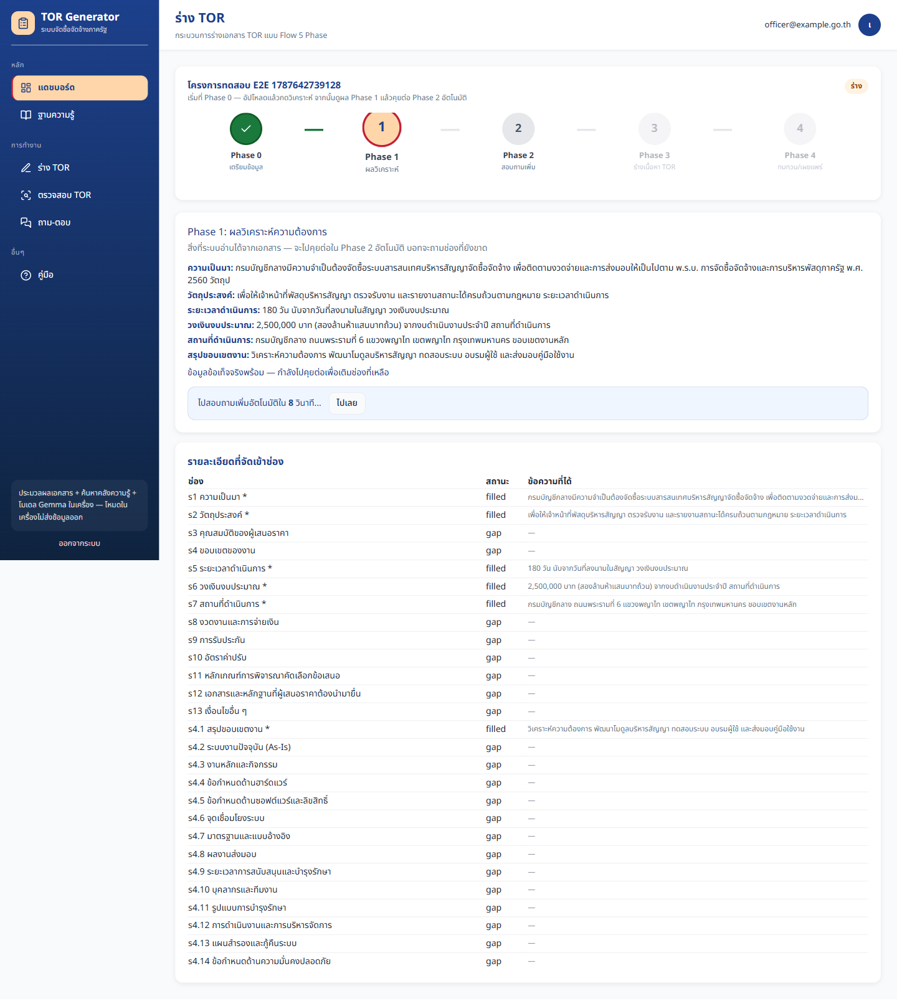
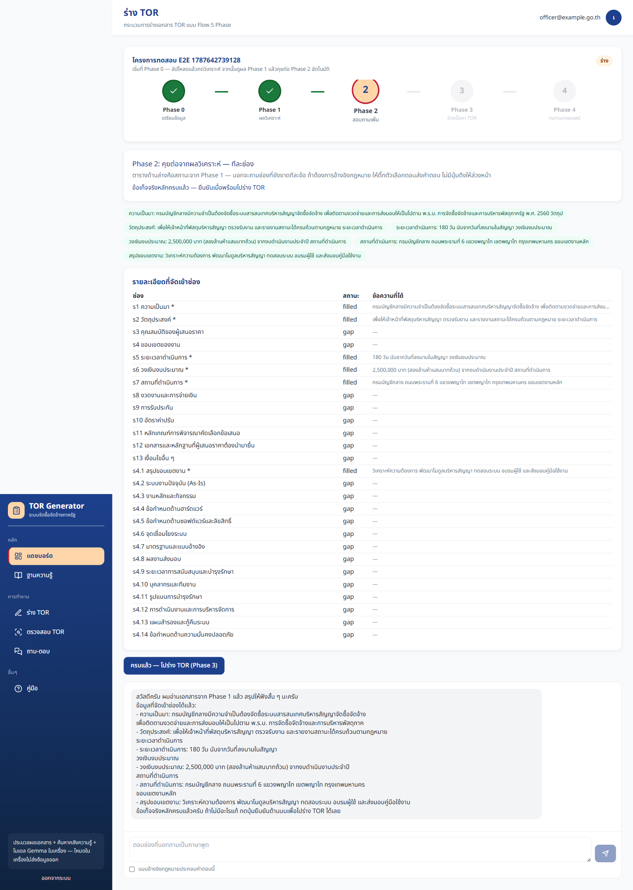
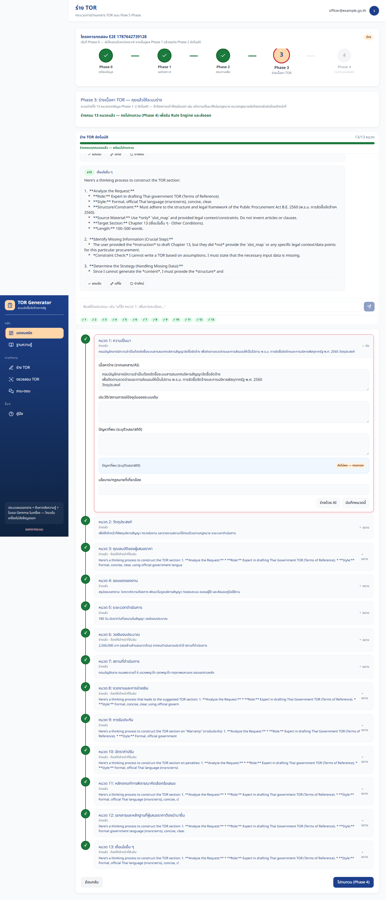
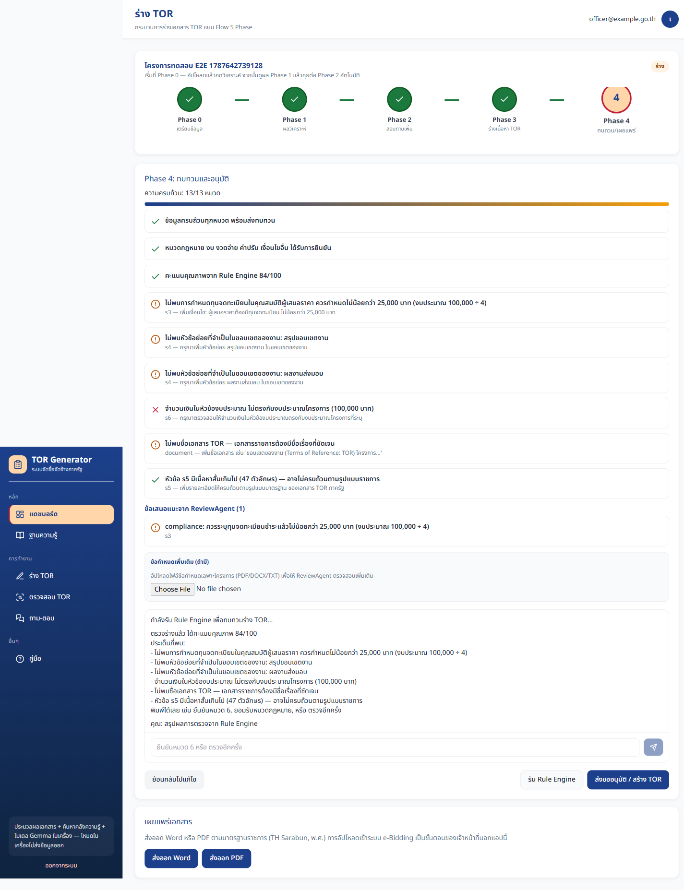
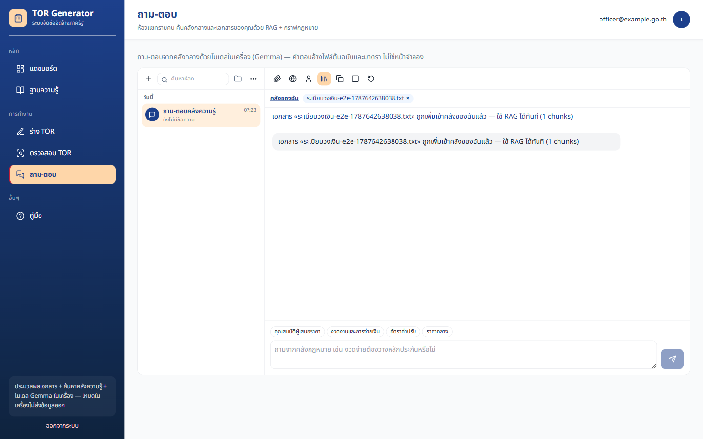
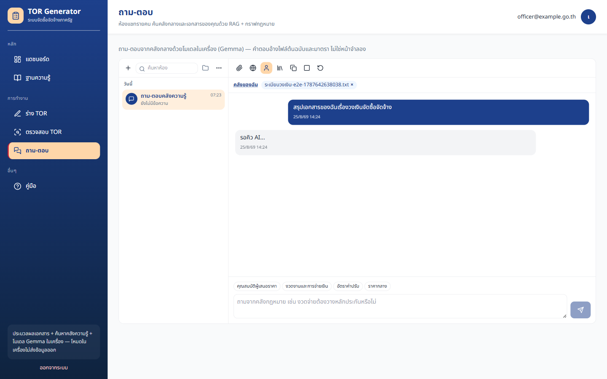
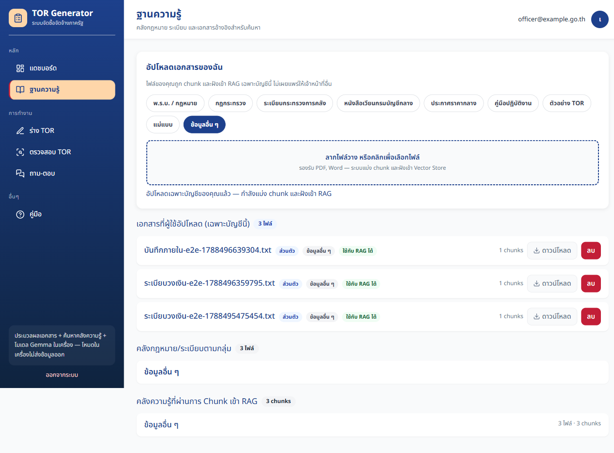

# หลักฐานการทดสอบ — ผ่านทั้งหมด

วันที่ **25 สิงหาคม 2026** (v0.2.4 — SGLang structured draft/review + headed ครบขั้น + coverage)  
สแตก Docker `tor-app` (postgres + mongo + neo4j + redis + minio) + LM Studio ที่ `http://127.0.0.1:1234` (fallback เมื่อ SGLang `:30000` ยังไม่ขึ้น)  
`GET http://localhost:4000/health` = `healthy` ทั้ง `postgres` `redis` `minio` `mongo` `neo4j`

เอกสารชุดปัจจุบันเรียง **13–20** (เพิ่ม `20-AWS_BEDROCK_SETUP.md`). หลักฐานภาพอยู่ใน `discussions/test-evidence/`

| โมเดล | ค่า |
|--------|-----|
| Chat / draft (dev) | SGLang `:30000` เมื่อ healthy ไม่เช่นนั้น `google/gemma-4-e4b` ผ่าน LM Studio |
| Structured JSON (intake / ReviewAgent / graph) | SGLang `guided_json` เมื่อ healthy; LM Studio + `parse_json_lenient` เป็น fallback |
| Embeddings (dev) | `text-embedding-embeddinggemma-300m` (768 มิติ) |
| Production แนะนำ | Amazon Bedrock (ดู `20-AWS_BEDROCK_SETUP.md`) |

ภาพถ่ายจาก Playwright แบบ **headed** (`slowMo` 400ms, พิมพ์ทีละตัวอักษร delay 70ms, เบราว์เซอร์โชว์บนจอ) หลังเคสผ่านแล้วเท่านั้น  
คู่มือผู้ใช้: `13-USER_GUIDELINE.md` · รายงานการทำงาน: `19-APPLICATION_OPERATING_REPORT.md`

---

## สรุปตัวเลข (รอบ 25 ส.ค. 2026 — v0.2.4)

| ชุด | ผล | ความหมาย |
|-----|-----|----------|
| pytest `-m "not live_llm"` + cov | **1557 ผ่าน** / **3 ข้าม** | ครอบคลุม **86%** (`htmlcov/` · `coverage.xml`) |
| Vitest `test:coverage` | **192 ผ่าน** / 45 ไฟล์ | statements **81.26%** · lines **83.41%** |
| Playwright E2E headed | **16 ผ่าน** / **3 ข้าม** / 0 ล้ม (~20.5 นาที) | ข้ามเฉพาะ mock (`intake-ui`, realistic Phase0 mock, mocked webapp review) — live Phase 0–4 + reviewer อนุมัติ + แชท + ตรวจ TOR + KB |
| Playwright guide headed | **3 ผ่าน** | ภาพคู่มือใน `test-evidence/` และ `app/frontend/public/help/` |

**หมายเหตุ LLM:** รอบนี้ GPU เต็มจาก LM Studio จึงรันด้วย fallback ที่ `:1234` — อย่าอ้างว่า SGLang structured generation ถูกทดสอบสดบน `:30000`

คำสั่งที่รัน: `npm run test:e2e:headed` → `test:e2e:guide` → pytest coverage → `npm run test:coverage` (ลำดับ headed ก่อน unit)

### สิ่งที่ตรวจแบบใช้งานจริงในรอบนี้

- ล็อกอิน/สร้างโครงการ **พิมพ์ทีละตัว** ไม่ใช้ `.fill()` แบบยิงเร็ว
- ถาม-ตอบ `/chat`: พิมพ์คำถามงวดจ่าย แล้วรอคำตอบจาก Gemma
- แนบไฟล์เข้าคลังของฉันจริง (ingest + embeddings) แล้วถามโหมดของฉัน
- ร่าง TOR Phase 0→4 สด: วิเคราะห์ → skip Phase1 → แชทเติมช่อง → ร่าง 13 หมวด + HITL → Rule Engine + ส่งออก DOCX/PDF → `phase4-submit` → reviewer อนุมัติ
- ตรวจ TOR สแตนด์อโลน: extract → รัน → คะแนนคงหลังรีเฟรช (Postgres `review_jobs`)
- `realistic-flow.spec.ts`: ตรวจ TOR + KB หมวดข้อมูลอื่น ๆ อัปโหลด/ดาวน์โหลด/ลบ

---

## รายงาน Playwright — แอป (headed · 25 ส.ค. 2026)

รัน: `cd app/frontend && npm run test:e2e:headed` (1 worker, Chromium มองเห็นได้)  
Chromium, viewport 1440×900, ภาษา th-TH · `HEADED=1` + `screenshot: on` + `slowMo: 400` + พิมพ์ทีละตัว 70ms · **16 ผ่าน / 3 ข้าม / 0 ล้ม (~20.5 นาที)**


ด้านล่างอธิบายทีละเคสว่าตรวจอะไร และภาพที่บันทึกหลังผ่าน

---

## ขั้นที่ 1 — แขกถูกส่งไปเข้าสู่ระบบ

**ไฟล์เทสต์:** `landing.spec.ts` — *sends guests to login*

เปิด `/` ต้องไป `/login` และเห็นฟอร์มเข้าสู่ระบบ (การ์ดกรมทัพเรือ-น้ำเงิน ช่องอีเมล/รหัสผ่าน ปุ่มเข้าสู่ระบบ กล่อง Demo)


---

## ขั้นที่ 2 — ฟอร์มสมัครสมาชิกเปิดได้

**ไฟล์เทสต์:** `landing.spec.ts` — *register form is reachable*  
**ภาพคู่มือ:** `guide-shots.spec.ts`

เปิด `/register` เห็นฟอร์ม **สมัครสมาชิก** และช่องชื่อ-นามสกุล


---

## ขั้นที่ 3 — ตรวจรหัสผ่านและล็อกอินเจ้าหน้าที่

**ไฟล์เทสต์:** `auth.spec.ts`

1. ไม่กรอกรหัสผ่าน → ข้อความข้อผิดพลาดมีคำว่า *รหัสผ่าน*
2. รหัสผิด `WrongPass1!` → แถบข้อผิดพลาดโชว์ ไม่เข้าแดชบอร์ด
3. บัญชี `officer@example.go.th` / `Passw0rd!` → URL เป็น `/projects` เห็น **รายการโครงการ TOR**
4. กดออกจากระบบ → กลับ `/login`


---

## ขั้นที่ 4 — แดชบอร์ดและการ์ดสถานะ

**ไฟล์เทสต์:** `dashboard.spec.ts` + `wizard-flow.spec.ts` (บันทึกภาพก่อนสร้างโครงการ)

เห็นการ์ด **ร่าง (Draft)** / **กำลังดำเนินการ** / **เสร็จแล้ว** ตารางโครงการ วันที่ พ.ศ. ปุ่ม **+ สร้างโครงการ TOR ใหม่**


---

## ขั้นที่ 5 — ฟอร์มสร้างโครงการแล้วเข้า Phase 0

**ไฟล์เทสต์:** `dashboard.spec.ts` — *creates a project from the intake dialog*

1. กด `data-testid=new-project`
2. กล่อง **สร้างโครงการใหม่** เปิด (ข้อความ 5 Phase ไม่ใช่วิซาร์ด 8 ขั้น)
3. กรอกชื่อ `โครงการทดสอบ E2E` หน่วยงาน `กรมบัญชีกลาง` งบ `100000`
4. กดสร้าง → เห็น `draft-page` ภายใน 20 วินาที


---

## ขั้นที่ 6 — เดิน Phase 0 ถึง Phase 4

**ไฟล์เทสต์ UI ครบ:** `intake-ui.spec.ts` — *walks Phase 0–4 with table, skip, chat, and review chat*  
**ไฟล์เทสต์เกต:** `wizard-flow.spec.ts` — *login, create project, walk Phase 0-4*  
**แชทร่างสด:** `chat.spec.ts` — *Phase 0–1 is intake chat; upload then confirm-ready*

สร้างโครงการใหม่แล้วคลิกแถบ Phase ทีละขั้น ตรวจหัวข้อภาษาไทยของแต่ละขั้น  
แชทร่างต้องไม่มีข้อความ *โหลดห้องแชทไม่สำเร็จ*  
`intake-ui.spec.ts` mock API เพื่อพิสูจน์ UI ทั้งเส้นทางโดยไม่รอ LM Studio — สเปกนี้ข้ามเมื่อ `E2E!=1` และมีคอมเมนต์ `NOSONAR` ตาม typescript:S1607

### Phase 0 เตรียมข้อมูล

วางข้อความหรืออัปโหลดหลายไฟล์ได้ **ไม่ต้องเลือก 9 ประเภท** — กด **เริ่มวิเคราะห์** (`intake-start-analyze`) จึงประมวลผล ต้นฉบับไป Mongo


### Phase 1 ตารางความครบ

หัวข้อ *Phase 1: ผลวิเคราะห์ความต้องการ* ตารางความครบถ้วน แล้วนับสั้น ๆ หรือกด **ไปเลย** (`phase1-skip`) เข้า Phase 2 อัตโนมัติ — **ไม่มี**ไดอะล็อก และไม่เรียก `fill-references` อัตโนมัติ




### Phase 2 สอบถามเพิ่ม

หัวข้อ *Phase 2: คุยต่อจากผลวิเคราะห์* ตารางสถานะ (`coverage-row-*`) คู่แชท (`draft-conversation`) บอทถามช่องที่ขาด และตัวเลือก **แนบอ้างอิงกฎหมายประกอบคำตอบนี้** (`intake-attach-legal`, ค่าเริ่มต้นปิด) — **ไม่มี**ชิปดึงอ้างอิงต่อแถว กด **ครบแล้ว — ไปร่าง TOR (Phase 3)**



### Phase 3 ร่าง 13 หมวด

หัวข้อ *Phase 3: ร่างเนื้อหา TOR* DraftChat ร่าง 13 หมวด หมวด HITL ต้องให้เจ้าหน้าที่ยืนยัน ปุ่ม **ไปทบทวน (Phase 4)** (`phase3-confirm`)




### Phase 4 ทบทวนและเผยแพร่

หัวข้อ *Phase 4: ทบทวนและอนุมัติ* แชทรีวิว (`review-chat`) Rule Engine รันอัตโนมัติ คะแนน / findings ปุ่ม **ส่งออก Word** / **ส่งออก PDF** ข้อความว่า e-Bidding เป็นงานนอกแอป




---

## ขั้นที่ 6b — ถาม-ตอบคลังความรู้

**ไฟล์เทสต์:** `chat.spec.ts` — *ถาม-ตอบ opens Open WebUI-like rooms*

เมนู **ถาม-ตอบ** เปิด `/chat` เห็นรายการห้อง ปุ่มห้องใหม่ กล่องพิมพ์ และชิปพรอมต์ (คุณสมบัติผู้เสนอราคา, งวดจ่าย, ค่าปรับ, ราคากลาง)  
ไม่ปนประวัติกับแชทร่างโครงการ


**ไฟล์เทสต์:** `chat.spec.ts` — *chat attach ingests into private KB list* (~11 วินาที)

รอให้มีห้องแชท (`chat-room-item`) แล้วแนบไฟล์ `.txt` เข้าคลังของฉัน (embed จริง ไม่สกัดกราฟกฎหมายสำหรับไฟล์ส่วนตัว) เห็น `chat-attach-feedback` ข้อความ *เพิ่มเข้าคลังของฉันแล้ว* ตรวจชื่อไฟล์ใน `/knowledge-base` แล้วพิมพ์ถามโหมด **ของฉัน** รอคำตอบจาก Gemma





---

## ขั้นที่ 6c — ร่าง Phase 0 ต้องกดเริ่มต้นก่อน coverage

**ไฟล์เทสต์:** `chat.spec.ts` — *Phase 0–1 is intake chat; upload then confirm-ready*

Phase 0 มีปุ่ม **เริ่มวิเคราะห์และเข้า Phase 1** (`intake-start-analyze`) ยังไม่มีตารางความครบ · อัปโหลดแล้วเห็นรายชื่อไฟล์/`กำลังอัปโหลด...` แล้วกดเริ่มต้นจึงเข้า Phase 1 (แผง `phase0-analyzing` จนกว่า API กลับ) · กด **ไปเลย** หรือรอเข้า Phase 2 · ยืนยันพร้อมร่าง Phase 3


---

## ขั้นที่ 7 — ร่างด้วย AI จริงผ่าน Gemma

**ไฟล์เทสต์:** `wizard-flow.spec.ts` — *Phase 3 AI draft uses LM Studio Gemma* (~7.0 นาที)

1. พิมพ์ข้อความโครงการยาวใน Phase 0 แล้วกดวิเคราะห์ (LM Studio จัดช่องจริง ไม่ mock)
2. รอตาราง Phase 1 แล้วกด **ไปเลย** (หรือรอเลื่อนอัตโนมัติ) เข้า Phase 2–3 — ไม่เรียก `fill-references` อัตโนมัติ
3. รอ DraftChat ร่างหมวด หรือกด `draft-ai-s1` (หมวดความเป็นมา)
4. รอจนมีเนื้อหาในช่องร่าง (timeout 360 วินาที)
5. ต้องไม่มีข้อความ *ร่างด้วย AI ไม่สำเร็จ*


---

## ขั้นที่ 8 — คู่มือในแอป

**ไฟล์เทสต์:** `webapp.spec.ts` — *help page tabs are usable*  
**ภาพแท็บอื่น:** `guide-shots.spec.ts`

คลิกแท็บภาพรวม / เข้าสู่ระบบ / แดชบอร์ด / ร่าง / ถาม-ตอบ / ฐานความรู้ / ตรวจสอบ / ผู้ดูแล / FAQ  
FAQ ต้องมี `google/gemma-4-e4b`, `text-embedding-embeddinggemma-300m`, `127.0.0.1:1234`


---

## ขั้นที่ 9 — ฐานความรู้ในเมนูหลัก

**ไฟล์เทสต์:** `webapp.spec.ts` — *knowledge base is in the main menu*

คลิก `nav-knowledge-base` URL `/knowledge-base` เห็นหัวข้อ **อัปโหลดเอกสารของฉัน** และ **เอกสารที่ผู้ใช้อัปโหลด (เฉพาะบัญชีนี้)**


---

## ขั้นที่ 10 — ตรวจสอบ TOR สแตนด์อโลน

**ไฟล์เทสต์:** `webapp.spec.ts` — *standalone review page loads*

หน้า `/review` มีกล่องอัปโหลด รายการเอกสารอ้างอิงบังคับ และ stepper สามขั้น ปุ่ม **สกัดข้อความ** ยังกดไม่ได้จนกว่าจะมีไฟล์  
ลำดับจริง: เลือกไฟล์ → `POST /review/extract` ดูตัวอย่าง → **ยืนยันเริ่มตรวจสอบ** → Jaccard `compare-projects` → `POST /review/run` แล้วแสดงคะแนน/รายการพบ/ค่า Jaccard

**ไฟล์เทสต์เพิ่ม:** `webapp.spec.ts` — *standalone review extract then confirm run* (mock extract/run) เห็นตัวอย่างข้อความแล้วคะแนน 72/100

**ไฟล์เทสต์สด:** `realistic-flow.spec.ts` — อัปโหลด PDF/ข้อความจริง ไม่ `page.route()` extract/run แล้วรอคะแนนจาก Rule Engine; KB กด **ข้อมูลอื่น ๆ** อัปโหลด ดาวน์โหลด `download-mine-*` แล้วลบ; Phase 0 เห็นปุ่ม **เริ่มวิเคราะห์** โดยยังไม่เข้าตารางความครบ




---

## ขั้นที่ 10b — ผู้ตรวจสอบอนุมัติ/ส่งกลับ

**ภาพคู่มือ:** `guide-shots.spec.ts` (บัญชี `reviewer@example.go.th`)

โครงการสถานะ `in_review` แสดงปุ่ม **อนุมัติ** / **ส่งกลับ** เฉพาะ reviewer และ admin — เรียก `POST /projects/{id}/approve` หรือ `/reject`


รหัสผ่านผิดบนหน้าเข้าสู่ระบบ:


หมวด HITL เมื่อขยายหมวด 3 มีปุ่ม **เจ้าหน้าที่ยืนยันแล้ว**:


แท็บคู่มือฐานความรู้และผู้ดูแล:


---

## ขั้นที่ 11 — หน้าผู้ดูแล (แม่แบบ, KB, ผู้ใช้, AI)

**ไฟล์เทสต์:** `admin.spec.ts` — *templates, knowledge base, users, and AI settings load*  
**ภาพแต่ละหน้า:** `guide-shots.spec.ts`

ล็อกอิน `admin@example.go.th` แล้วเดินเมนูผู้ดูแล


โหมดในเครื่อง: `#ai-mode=on_prem` แชท `google/gemma-4-e4b` embeddings `text-embedding-embeddinggemma-300m` คลัง `pgvector`  
กดทดสอบการเชื่อมต่อ ต้องเห็นข้อความมีคำว่า *เชื่อมต่อ*  
สลับโหมดคลาวด์: รายการมี claude/openai/gemini **ไม่มี** `lm_studio` ช่องคีย์ Claude/OpenAI/Gemini โชว์ (รวม Bedrock / Azure Foundry / OpenAI-compatible)


---

## Coverage HTML

เสิร์ฟ `app/backend/htmlcov` ที่พอร์ต **8765**, `app/frontend/coverage` ที่ **8766**, `app/frontend/playwright-report` ที่ **8767** แล้วรัน `npm run test:e2e:reports`

Backend `coverage.py`: **85%** (10623 statements, 9034 covered) จากรัน `pytest -m "not live_llm" --cov=app`


Frontend Istanbul/v8: statements **80.6%** (1255/1557), lines **82.36%** (1158/1406) — include ชุด `src/lib` + stores + draft Phase0–4 + `/review` + KB page


---

## SonarQube (:9400)

สแกน Community Build ที่ `http://127.0.0.1:9400` (ไม่ใช้ :9000 เพราะเป็น MinIO) โปรเจกต์ `tor-drafting-review-app`

| ตัวชี้วัด | ค่า |
|-----------|-----|
| Quality gate | **OK** |
| Bugs / Vulnerabilities / Code smells | **0 / 0 / 0** |
| New violations | **0** |
| Coverage บนโค้ดใหม่ | 86.2% (เกณฑ์ 80%) |

`python:S6353` ยัง ignore ใน `sonar-project.properties` เพราะ regex วันที่/เงินต้องเป็น `[0-9]` ไม่ใช่ `\\d`

---

## คำสั่งที่รันในรอบนี้

จาก `app/backend`:

```bash
python -m pytest tests -q --tb=short --cov=app --cov-report=term --cov-report=html
```

ผลที่ยืนยันแยกชุดบนโฮสต์: `pytest -m "not live_llm"` **1533 ผ่าน** (ครอบคลุม **85%**) และ `pytest -m live_llm` **14 ผ่าน** เมื่อ LM Studio ฟังพอร์ต 1234 (Gemma + EmbeddingGemma) รวม `test_live_realistic_workflow.py`

จาก `app/frontend`:

```bash
npm run test:unit
npm run lint
npm run test:e2e:headed
npm run test:e2e:guide
```

Vitest **177 ผ่าน** / 42 ไฟล์ · headed **21 ผ่าน** (~4.7 นาที) · guide **3 ผ่าน** · reports **3 ผ่าน**

หลังแก้ UI ต้อง `docker compose -p tor-app --env-file .env up -d --build frontend backend` ก่อนรัน Playwright เพราะเทสต์ยิงคอนเทนเนอร์ที่พอร์ต 3000

ติดตั้ง: `14-INSTALLATION.md`  
คู่มือผู้ใช้: `13-USER_GUIDELINE.md`
