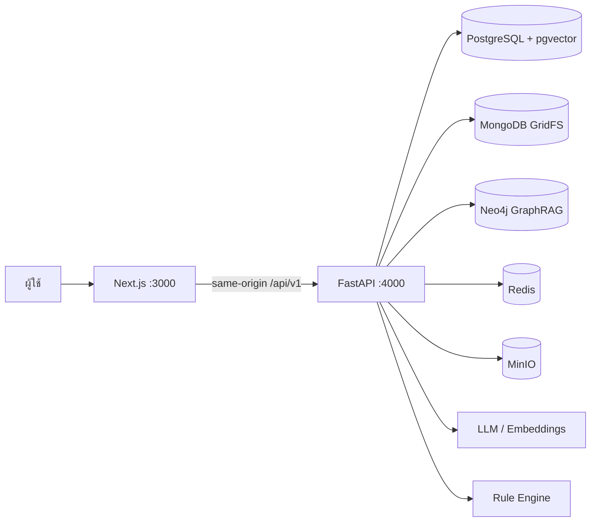
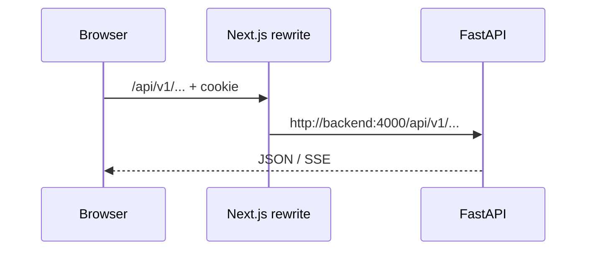
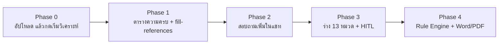
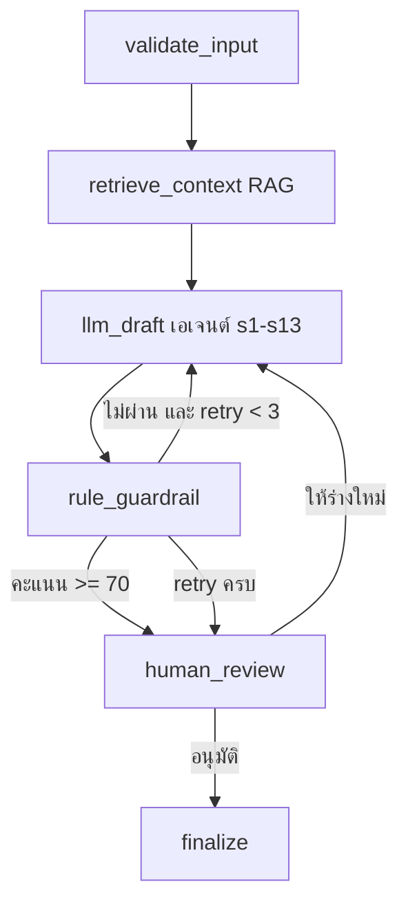
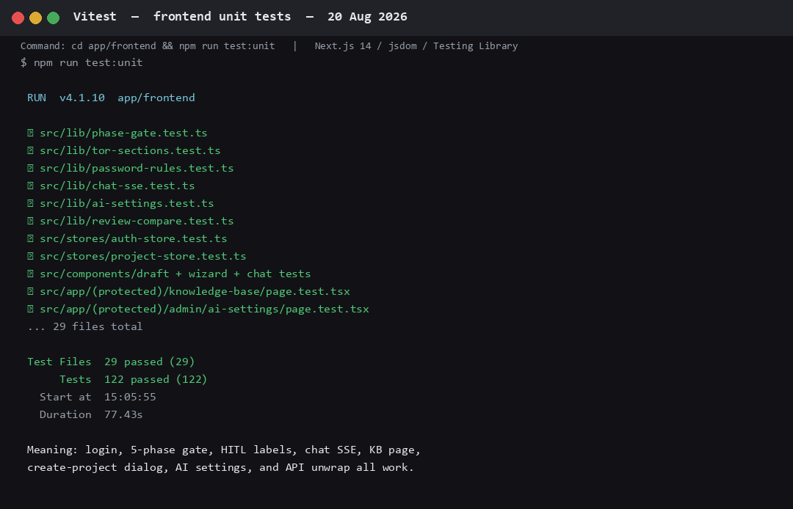
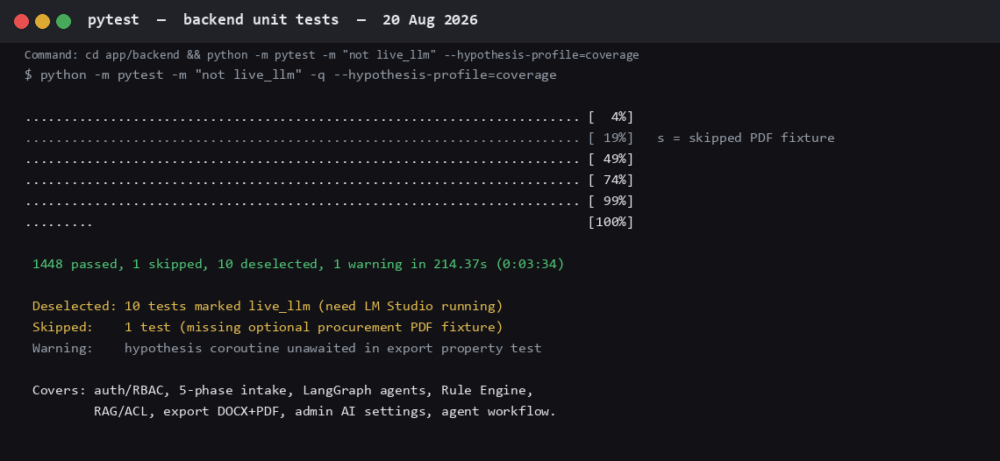
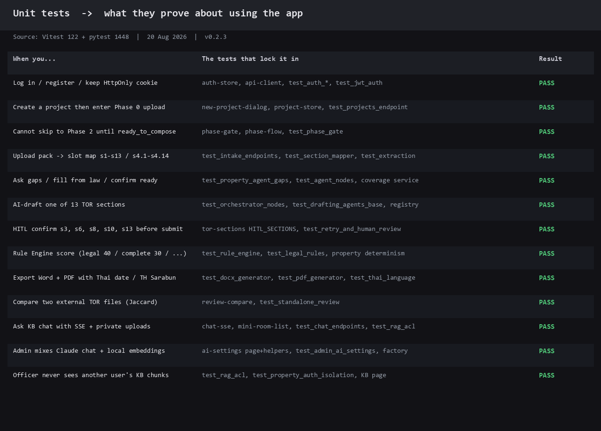

# รายงานการทำงานของแอป TOR Generator

**เวอร์ชัน 0.2.3** · วันที่จัดทำ **21 สิงหาคม 2026**  
แหล่งความจริง: โค้ดใน `app/frontend` + `app/backend` และผล unit tests ที่รันจริงในวันเดียวกัน

แอปนี้ช่วยเจ้าหน้าที่พัสดุ**ร่างและตรวจ TOR** (ขอบเขตของงาน) ตาม พ.ร.บ. การจัดซื้อจัดจ้างและการบริหารพัสดุภาครัฐ พ.ศ. 2560 โดยบังคับโครง 13 ส่วน (`s1`–`s13`) รับชุดเอกสาร จัดเข้าช่อง ตรวจด้วย Rule Engine แล้วยืนยันหมวดเสี่ยงด้วยคน ก่อนส่งออก Word/PDF รูปแบบราชการ

ภาพหน้าจอการใช้งานจริงอยู่ที่ `test-evidence/` (Playwright **headed** 21 ส.ค. 2026 · พิมพ์ช้า + LM Studio จริง)  
ภาพผล unit tests: [Vitest](test-evidence/19-vitest-output.png) · [pytest](test-evidence/19-pytest-output.png) · [แผนที่เทสต์→การใช้งาน](test-evidence/19-unit-test-usage-map.png)  
ไดอะแกรม: [สถาปัตยกรรม](test-evidence/19-diagram-architecture.png) · [5 Phase](test-evidence/19-diagram-phases.png)

ฉบับส่งออก: [PDF](19-APPLICATION_OPERATING_REPORT.pdf) · [Word](19-APPLICATION_OPERATING_REPORT.docx) · [PowerPoint](19-APPLICATION_OPERATING_REPORT.pptx)

---

## 1. สรุปหนึ่งหน้า

| ข้อ | ค่า |
|-----|-----|
| ปัญหาที่แก้ | เขียน TOR ด้วยมือช้า ตกหัวข้อกฎหมาย จัดรูปแบบราชการยาก |
| UI | Next.js 14 App Router · พอร์ต **3000** · ภาษาไทยทั้งหน้าจอ |
| API | FastAPI · พอร์ต **4000** · คำนำหน้า `/api/v1` |
| พื้นที่ทำงานหลัก | **5 Phase (0–4)** ไม่ใช่วิซาร์ด 8 ขั้น (เหลือไว้เพื่อความเข้ากันได้) |
| โมเดลเอกสาร | 13 ส่วนกฎหมาย + ขอบเขตงานย่อย `s4.1`–`s4.14` = **27 ช่อง** |
| AI ค่าเริ่มต้น (dev) | แชท `google/gemma-4-e4b` · ฝังเวกเตอร์ EmbeddingGemma 768 มิติ · ในเครื่องผ่าน LM Studio |
| AI production แนะนำ | Amazon Bedrock บนบัญชี AWS — คู่มือ `20-AWS_BEDROCK_SETUP.md` · ตัวเลือก on-prem/cloud อื่นสลับได้จาก Admin |
| บทบาท | `officer` / `reviewer` / `admin` |
| เทสต์รอบนี้ | **Vitest 167** · **pytest 1500** (+ **live_llm 14**) · **Playwright headed 20** + guide **3** · **0 failed** |



เบราว์เซอร์เรียก `/api/v1` บนโดเมนเดียวกับ UI แล้ว Next.js rewrite ไป `http://backend:4000/api/v1` (timeout 5 นาที) จึงไม่ตัดร่าง AI / SSE ที่นานกว่า 30 วินาที

---

## 2. ผู้ใช้ สิทธิ์ และหน้าจอหลัก

| บทบาท | ทำได้ | ทำไม่ได้ |
|--------|--------|----------|
| **เจ้าหน้าที่ (officer)** | สร้าง/แก้ไขโครงการของตนเอง · อัปโหลดคลังส่วนตัว · ถาม-ตอบ · ส่งขออนุมัติ | เห็นโครงการคนอื่น · อนุมัติ · ตั้งค่า AI ระบบ |
| **ผู้ตรวจสอบ (reviewer)** | เห็นทุกโครงการ · อนุมัติ / ส่งกลับ | จัดการแม่แบบ ผู้ใช้ การตั้งค่า AI |
| **ผู้ดูแล (admin)** | ทุกอย่างของ reviewer + แม่แบบ คลังกลาง ผู้ใช้ การตั้งค่า AI | — |

JWT อยู่ในคุกกี้ HttpOnly `tor_access_token` (`SameSite=Lax`) รองรับ `Authorization: Bearer` สำหรับเทสต์และไคลเอนต์ API

| เมนู | เส้นทาง | ใช้ทำอะไร |
|------|---------|-----------|
| แดชบอร์ด | `/projects` | รายการโครงการ สร้างใหม่ อนุมัติ/ส่งกลับ |
| ฐานความรู้ | `/knowledge-base` | คลังกลาง + เอกสารของฉัน |
| ร่าง TOR | `/projects/{id}/draft` | พื้นที่ทำงาน 5 Phase |
| ตรวจสอบ TOR | `/review` | ตรวจไฟล์ภายนอก + เทียบ Jaccard |
| ถาม-ตอบ | `/chat` | ห้องแชทคลังความรู้ (SSE) |
| คู่มือ | `/help` | FAQ และการใช้งาน |
| แม่แบบ / ผู้ใช้ / ตั้งค่า AI | `/admin/...` | เฉพาะแอดมิน |


### 2.1 สามเครื่องมือหลักของเจ้าหน้าที่

| เครื่องมือ | หน้า | ทำอะไร | ผลที่ควรเห็น |
|-----------|------|--------|-------------|
| **ร่าง TOR** | `/projects/{id}/draft` | 5 Phase: อัปโหลด → เติมช่อง → ร่าง 13 หมวด (+ AI) → HITL | มีเนื้อหา s1–s13 พร้อมส่งตรวจ |
| **ตรวจสอบ TOR** | Phase 3 ในโครงการ + `/review` | Rule Engine ≥ 70 + ข้อเสนอแนะ ReviewAgent · ตรวจไฟล์ภายนอก | คะแนน / findings / suggestions |
| **ถาม-ตอบ** | `/chat` | ห้องคลังความรู้ SSE + citations จาก RAG | คำตอบยาวพร้อมชิปอ้างอิง |

---

## 3. Frontend — Next.js 14

โฟลเดอร์ `app/frontend/src` แยกเป็น **หน้า (App Router)** · **คอมโพเนนต์** · **lib** · **Zustand stores**

### 3.1 เส้นทางคำขอ



- `apiClient` (Axios) ส่งคุกกี้เสมอ และแนบ Bearer ถ้ายังมีโทเค็นในหน่วยความจำ
- HTTP 401 → ล้างเซสชัน แล้วไป `/login` (ยกเว้นหน้า login/register)
- วิซาร์ดเก่า `/wizard/[step]` และ `/projects/[id]/wizard/[step]` **redirect เข้า 5 Phase**

### 3.2 กลุ่มเส้นทาง

| กลุ่ม | หน้า | การ์ด |
|-------|------|--------|
| สาธารณะ | `/` | ส่งแขกไป `/login` |
| ยืนยันตัว | `/login` `/register` | เลย์เอาต์การ์ดกรมทัพเรือ |
| งานหลัก | `/projects` `/draft` `/chat` `/knowledge-base` `/review` `/help` | `AuthGuard` + ไซด์บาร์ 255px |
| แอดมิน | `/admin/templates` `/admin/knowledge-base` `/admin/users` `/admin/ai-settings` | ถ้าไม่ใช่แอดมินจะถูกเด้ง |

### 3.3 สถานะฝั่งลูกข่าย (Zustand)

| Store | หน้าที่ |
|-------|---------|
| `auth-store` | ผู้ใช้ + โทเค็นในหน่วยความจำ · `restoreSession` เรียก `GET /auth/me` · **ไม่เก็บ JWT ใน localStorage** |
| `project-store` | รายการโครงการ โครงการที่เปิดอยู่ สร้าง/อัปเดต/ส่งตรวจ |
| `wizard-store` | เหลือสำหรับขั้นวิซาร์ดเก่า — ตัวร่างจริงคือ `DraftWorkspace` |
| `ui-store` | ธีม ไซด์บาร์ โทสต์ |

### 3.4 คอมโพเนนต์หลัก

| คอมโพเนนต์ | บทบาท |
|-------------|--------|
| `DraftWorkspace` | พื้นที่ทำงาน Phase 0–4 ทั้งก้อน |
| `IntakeChatPanel` | แชทร่าง + อัปโหลดชุดเอกสาร (Phase 0–1) |
| `ChatShell` + `MiniRoomList` | โครงห้องแชทแบบย่อ (ถาม-ตอบคลัง) |
| `PhaseFlow` | แถบ 5 Phase + ล็อกตามเกต |
| `NewProjectDialog` | สร้างโครงการ (ชื่อ หน่วยงาน วงเงิน ASCII ประเภท แม่แบบ) |
| `ProjectRowActions` | เปิดร่าง / อนุมัติ / ส่งกลับ |
| `AuthGuard` | กันหน้า protected |
| `SidebarNav` | เมนูหลัก + กลุ่มแอดมิน |

วิซาร์ด 8 ขั้น (`step1`–`step8`) ยังอยู่ในโค้ดเพื่อความเข้ากันได้กับ API เก่า — **หน้าจอที่ใช้งานคือ 5 Phase**

---

## 4. Backend — FastAPI + LangGraph

ฟังบนพอร์ต **4000** ชั้นหลัก:

| ชั้น | โฟลเดอร์ | ทำอะไร |
|------|----------|--------|
| HTTP | `app/api/v1/endpoints/` | REST + SSE |
| Domain | `app/domain/` | `s1`–`s13`, ช่อง intake, magic bytes, ข้อความหมวด |
| Orchestrator | `app/orchestrator/` | กราฟร่างรายหมวด + กราฟเอเจนต์ทั้งฉบับ |
| Agents | `app/orchestrator/agents/` | เอเจนต์ 13 หมวด + ReviewAgent |
| RAG | `app/rag/` | สกัด หั่น ingest ค้น กราฟ ACL |
| Rules | `app/rule_engine/` | คะแนนคุณภาพแบบกำหนดได้ซ้ำ |
| Providers | `app/providers/` | LLM / embeddings / vector store |
| Export | `app/export/` | DOCX PDF รูปแบบไทย MinIO |
| Services | `app/services/` | intake, coverage, gap, auth, audit, agent workflow |
| Models | `app/models/` | SQLAlchemy |

`redirect_slashes=False` เพื่อไม่ให้ `POST /projects` ถูก 307 แล้วทิ้ง JSON body ตอนผ่าน Next.js rewrite

### 4.1 โมเดล TOR 13 ส่วน

| คีย์ | ชื่อไทย | เอเจนต์ | HITL |
|------|---------|---------|------|
| s1 | ความเป็นมา | Background | ไม่ |
| s2 | วัตถุประสงค์ | Objectives | ไม่ |
| s3 | คุณสมบัติผู้เสนอราคา | Qualifications | **ใช่** |
| s4 | ขอบเขตของงาน (+ s4.1–s4.14) | Scope | ไม่ |
| s5 | ระยะเวลาดำเนินการ | Timeline | ไม่ |
| s6 | วงเงินงบประมาณ | Budget | **ใช่** |
| s7 | สถานที่ดำเนินการ | Location | ไม่ |
| s8 | งวดงานและการจ่ายเงิน | Payment | **ใช่** |
| s9 | การรับประกัน | Warranty | ไม่ |
| s10 | อัตราค่าปรับ | Penalties | **ใช่** |
| s11 | เกณฑ์พิจารณาข้อเสนอ | Evaluation | ไม่ |
| s12 | เอกสารที่ต้องยื่น | Documents | ไม่ |
| s13 | เงื่อนไขอื่น ๆ | Conditions | **ใช่** |

หมวด HITL (`s3 s6 s8 s10 s13`) ต้องกดยืนยันคนก่อนปุ่มส่งขออนุมัติจะเปิด

ขอบเขตงานย่อยที่บังคับขั้นต่ำเพื่อความครบ: **s4.1 สรุปขอบเขต** และ **s4.8 ผลงานส่งมอบ**

---

## 5. Workflows

### 5.1 พื้นที่ทำงาน 5 Phase (เส้นทางหลักบน UI)



| Phase | ผู้ใช้ทำอะไร | API หลัก | เกต |
|-------|--------------|----------|-----|
| **0** | สร้างโครงการ วางข้อความหรืออัปโหลด แล้วกด **เริ่มวิเคราะห์** (ไม่วิเคราะห์อัตโนมัติ) | `POST .../intake/upload` `.../text` `.../analyze` | มีเนื้อหา + กดวิเคราะห์ → ปลด Phase 1 |
| **1** | ดูตารางความครบ ระบบดึงกฎระเบียบอัตโนมัติ | `GET .../coverage` `POST .../fill-references` | วิเคราะห์แล้ว → ปลด Phase 2 |
| **2** | ตอบคำถามส่วนขาด ดึงอ้างอิงรายช่อง กดพร้อมร่าง | `POST .../chat` `POST .../fill-reference` `.../confirm-ready` | `ready_to_compose=true` → ปลด Phase 3 |
| **3** | แก้/ให้ AI ร่างทีละหมวด ยืนยัน HITL แล้วยืนยันไปทบทวน | `GET/PUT .../sections` `POST .../draft-section` `.../confirm-phase4` | ครบ 13 + HITL → ปลด Phase 4 |
| **4** | รัน Rule Engine ส่งขออนุมัติ ส่งออก DOCX/PDF | `POST .../review` `POST .../submit` `POST .../export` | reviewer/admin อนุมัติหรือส่งกลับ |

เกตฝั่ง UI (`phase-gate.ts`): จะข้ามไป Phase 2 ไม่ได้จนกว่า `ready_to_compose` หรือมีหลักฐาน intake


### 5.2 กราฟร่างรายหมวด (LangGraph)

ใช้ตอนกด **ร่างด้วย AI** ใน Phase 2 (`POST /projects/{id}/draft-section`)



Timeout ต่อหมวดค่าเริ่มต้น 180 วินาทีสำหรับ LM Studio (จำกัดสูงสุด 300) เพราะ Gemma มักเกิน 60 วินาทีของคลาวด์

### 5.3 ถาม-ตอบคลังความรู้

หน้า `/chat` ใช้ห้อง `kind=kb` บน `/api/v1/chat` (SSE + ชิปอ้างอิง + แนบไฟล์เข้าคลังส่วนตัวแล้วขึ้นข้อความสำเร็จจาก ingest)  
แชทร่าง Phase 2 ใช้ `kind=draft_intake` คนละประวัติ · โหมดค้นของฉัน fail-closed ถ้าไม่มีเจ้าของไฟล์


### 5.4 ตรวจไฟล์ TOR ภายนอก

หน้า `/review` สามขั้นใน UI: เลือกไฟล์ → **สกัดข้อความ** (`POST /review/extract` + ตัวอย่าง) → **ยืนยันเริ่มตรวจสอบ** (`POST /review/run`) แล้วเทียบ Jaccard (`POST /review/compare-projects`) ไม่ต้องสร้างโครงการ ถ้า API เทียบไม่มี จะเทียบในเบราว์เซอร์แทน


### 5.5 การอนุมัติโครงการ

เจ้าหน้าที่ส่งตรวจ → สถานะกำลังดำเนินการ → reviewer/admin กด **อนุมัติ** หรือ **ส่งกลับ** บนแดชบอร์ด (`POST /projects/{id}/approve|reject`)  
เจ้าหน้าที่แก้โครงการที่อยู่ในคิวตรวจไม่ได้จนกว่าจะถูกส่งกลับ

---

## 6. Features

| ฟีเจอร์ | สิ่งที่เกิดขึ้น | หมายเหตุ |
|---------|-----------------|----------|
| สร้างโครงการ | ฟอร์มชื่อ หน่วยงาน วงเงิน (ตัวเลข ASCII) ประเภท แม่แบบ | แล้วเข้า `/projects/{id}/draft` |
| Intake หลายไฟล์ | PDF/DOCX/PPTX/TXT ตรวจ magic bytes | ต้นฉบับ GridFS |
| แผนที่ช่องอัตโนมัติ | NLP จัดเข้า s1–s13 / s4.1–s4.14 | ตารางความครบใน Phase 1 |
| แชทร่าง | SSE ถามส่วนขาด ดึงอ้างอิงกฎหมาย | ไม่ปนกับ `/chat` |
| ร่างด้วย AI รายหมวด | เอเจนต์เฉพาะทาง + RAG + Rule Engine | ล้มเหลวถ้า LLM ในเครื่องไม่เปิด — กรอกมือได้ |
| HITL 5 หมวด | ปุ่มยืนยันก่อนส่งตรวจ | s3 สมบัติ, s6 งบ, s8 งวด, s10 ค่าปรับ, s13 เงื่อนไข |
| Rule Engine | คะแนน 0–100 ผ่านที่ 70 | ดูหมวด 8 |
| ส่งออก DOCX/PDF | TH Sarabun New · วันที่ พ.ศ. | MinIO |
| คลังความรู้ส่วนตัว | `POST /knowledge-base/mine` | ACL ตาม `owner_id` |
| คลังกลาง | แอดมินอัปโหลด / `seed_raw_docs` | handbook + raw PDFs |
| ตั้งค่า AI ทันที | `PUT /admin/ai-settings` | แชทกับ embeddings **เลือกอิสระ** ไม่ต้องรีสตาร์ท |
| ทดสอบการเชื่อมต่อ | `POST /admin/ai-settings/test` | แยกโปรบแชทกับ embeddings |
| เวอร์ชันโครงการ | restore snapshot | บน API โครงการ |
| อัตราจำกัด | ทั่วไป / อัปโหลด | Redis |
| บันทึกตรวจสอบ | upload, apply extraction, submit | `audit_log` |


---

## 7. Functions — ฟังก์ชันที่ขับการใช้งาน

### 7.1 Frontend (`src/lib`)

| ฟังก์ชัน | ไฟล์ | ใช้ตอน |
|----------|------|--------|
| `validatePassword` / `isPasswordValid` | `password-rules.ts` | สมัครสมาชิก — ยาว ≥8 มีพิมพ์ใหญ่/เล็ก ตัวเลข ASCII อักขระพิเศษ |
| `intakeUnlockedPhase` `canSelectPhase` `displayPhase` | `phase-gate.ts` | ล็อกแถบ Phase ไม่ให้ข้ามไปร่าง |
| `streamSsePost` | `chat-sse.ts` | สตรีมคำตอบแชทคลังและแชทร่าง |
| `applyRequestAuth` `shouldRedirectToLogin` | `api-client.ts` | แนบโทเค็น / เด้ง login เมื่อ 401 |
| `unwrapData` `snakeToCamelProject` | `api-unwrap.ts` | แปลงซอง `{ ok, data }` เป็นอ็อบเจ็กต์ UI |
| `apiErrorMessage` | `api-error.ts` | ข้อความผิดพลาดภาษาไทย ไม่โชว์ `[object Object]` |
| `toReviewFinding` `findingCheckTone` | `review-findings.ts` | แผนที่ข้อค้นพบ Rule Engine บน Phase 3 |
| `jaccard` `localCompareExtracts` `compareExtractJobs` | `review-compare.ts` | เทียบ TOR ภายนอก |
| `llmOptionsForMode` `nextFormOnModeChange` | `ai-settings.ts` | ฟอร์มตั้งค่า AI — โหมดไม่บังคับสลับฝั่ง embeddings |
| `pageMeta` | `page-meta.ts` | หัวเรื่อง/คำบรรยายแต่ละหน้า |
| `serializeSectionDraft` | `tor-sections.ts` | รวมฟิลด์หมวดเป็นข้อความก่อนบันทึก |
| `useAutoSave` `restoreBackup` | `use-auto-save.ts` | สำรองฟอร์มในเบราว์เซอร์ |
| `useRealtimeValidation` | `use-realtime-validation.ts` | ตรวจสดตอนกรอก |
| `calculateCompletionPercentage` `isStepValid` | `wizard-config.ts` | วิซาร์ดเก่า 8 ขั้น |

ค่าคงที่สำคัญ: `HITL_SECTIONS` · `TOR_SECTION_ORDER` · `SCOPE_SUBSECTIONS`

### 7.2 Backend — ออร์เคสตราและบริการ

| ฟังก์ชัน | ที่อยู่ | ใช้ตอน |
|----------|---------|--------|
| `get_agent_for_section` | `agents/registry.py` | จับ `s1`–`s13` (รวม `s4.*` → Scope) ไปเอเจนต์ |
| `compile_agent_workflow_graph` | `agent_graph.py` | กราฟเอเจนต์ทั้งฉบับ ขัดก่อน fill/confirm/HITL |
| กราฟรายหมวด `validate→RAG→draft→guardrail` | `orchestrator/graph.py` | ปุ่มร่างด้วย AI |
| `RuleEngine.validate` | `rule_engine/engine.py` | คะแนนถ่วงน้ำหนัก + ข้อค้นพบ |
| `ProviderFactory` | `providers/factory.py` | เลือก LLM / embeddings / vector store **อิสระต่อกัน** |
| `require_role` `require_project_access` | `rbac.py` | กัน API ตามบทบาทและเจ้าของโครงการ |
| `compute_ready` | `services/coverage.py` | ช่องครบพอจะยืนยันพร้อมร่าง |
| `slot_content` / แผนที่ช่อง | `intake_service` + `section_mapper` | เขียนเนื้อหาเข้า `tor_sections` |
| retrieve + กรอง metadata + ACL | `rag/retrieval.py` `rag/acl.py` | แชทและร่างดึงกฎหมาย |
| `extract_access_token` | `auth_cookies.py` | Bearer ก่อน แล้วค่อยคุกกี้ |

### 7.3 API ที่ใช้จริง (กลุ่ม)

คำนำหน้าทั้งหมดคือ `/api/v1`

| กลุ่ม | เมธอดตัวอย่าง | หน้าที่ |
|-------|----------------|---------|
| Auth | `POST /auth/login` `GET /auth/me` `POST /auth/logout` | คุกกี้ JWT |
| Projects | `GET/POST /projects` `PATCH .../phase` `POST .../submit\|approve\|reject` | วงจรโครงการ |
| Intake | `.../intake/upload` `analyze` `coverage` `fill-reference` `confirm-ready` `chat` | Phase 0–1 |
| Draft | `GET/PUT .../sections/{key}` `POST .../draft-section` | Phase 2 |
| Review | `POST .../review` `GET .../suggestions` | Phase 3 |
| Export | `POST .../export` `GET .../export/{job}` | Phase 4 |
| Chat | `POST /chat/rooms` `.../messages` (SSE) | ถาม-ตอบ + แชทร่าง |
| KB | `GET /knowledge-base` `POST .../mine` `DELETE .../mine/{id}` `POST .../upload` | คลังกลาง/ส่วนตัว (ลบของฉันได้) |
| Standalone review | `POST /review/extract` `.../compare-projects` | ตรวจไฟล์นอกโครงการ |
| Admin | `GET/PUT /admin/ai-settings` `POST .../test` `CRUD /admin/users` `/templates` | ระบบ |
| Health | `GET /health` `GET /ready` | ตรวจ postgres redis minio mongo neo4j |

รายการ endpoint ครบอยู่ใน `08-COMPLETE_API_REFERENCE_DOCUMENTATION.md` (ชุดออกแบบเก่า) — พฤติกรรมปัจจุบันให้ยึดตารางนี้และ `16-BACKEND_ARCHITECTURE.md`

---

## 8. Rule Engine

คะแนนรวม = ผลรวมถ่วงน้ำหนัก ผ่านเมื่อ **≥ 70** เรียกซ้ำด้วยอินพุตเดียวกันได้ผลเดียวกัน (ไม่มีสุ่ม)

| หมวด | น้ำหนัก | กฎหลัก | ข้ามเมื่อไร |
|------|---------|--------|-------------|
| กฎหมาย | 40% | ทุนจดทะเบียน = floor(งบ÷4) · ค่าปรับ 0.01–0.20%/วัน ขั้นต่ำ 100 บาท · ห้ามล็อกยี่ห้อโดยไม่มี “หรือเทียบเท่า” · อ้าง พ.ร.บ. 2560 | — |
| ความครบ | 30% | มี 13 หมวด · ยาวขั้นต่ำ · มี s4.1 และ s4.8 | — |
| ความสอดคล้อง | 20% | งบ↔ขอบเขต · ไทม์ไลน์↔ส่งมอบ · คุณสมบัติ↔ความซับซ้อน | — |
| รูปแบบ | 10% | วันที่ไทย พ.ศ. · ลำดับหมวด · รูปแบบเอกสารราชการ | — |
| งวดจ่าย (เสริม) | ร่วมกฎหมาย | รวมงวด = 100% · งวดละ 5–50% | ไม่มีข้อมูลงวด |
| ระยะเวลา (เสริม) | ร่วมกฎหมาย | งบ > 100 ล้าน → ≥ 180 วัน · งบ < 10 ล้าน → ≤ 365 วัน | ไม่มีข้อมูลวัน |

หักคะแนน: error −20 · warning −10 · suggestion −5 (ต่อข้อในหมวด)

---

## 9. Tools — โครงสร้างพื้นฐาน ผู้ให้บริการ AI CLI และสกิลออฟไลน์

### 9.1 บริการ Docker (`docker-compose.yml`)

| บริการ | บทบาท | พอร์ต |
|--------|--------|-------|
| frontend | Next.js standalone | 3000 |
| backend | FastAPI + Alembic ตอนสตาร์ท | 4000 |
| postgres (pgvector/pg15) | ข้อมูลหลัก + เวกเตอร์ 768-d | 5432 |
| redis | แคช เซสชัน อัตราจำกัด คิว | 6379 |
| minio | อ็อบเจ็กต์ DOCX/PDF | 9000 / คอนโซล 9001 |
| mongo | GridFS ต้นฉบับเอกสาร | 27017 |
| neo4j | กราฟกฎหมาย (ลดเหลือ pgvector ถ้าไม่ขึ้น) | 7474 / 7687 |
| qdrant | เวกเตอร์ทางเลือก `--profile qdrant` | 6333 |

คลังกฎหมายที่แอปถาม-ตอบใช้จริงมาจาก PDF ใน `documents/sources/` ผ่าน `python -m app.seed_raw_docs` — **ไม่ ingest JSON extracts เก่าเป็นคลังหลัก**

### 9.2 ผู้ให้บริการโมเดล (`ProviderFactory`)

แชท (`LLM_PROVIDER`) และ embeddings (`EMBEDDING_PROVIDER`) **เลือกคนละตัวได้ทุกโหมด** เช่น Claude API + EmbeddingGemma ใน LM Studio

| ชนิด | ค่าที่รับ |
|------|-----------|
| โหมด | `on_prem` `cloud` `hybrid` (ป้าย — ไม่บังคับสลับฝั่งอื่น) |
| แชทในเครื่อง | `lm_studio` `ollama` `llama_cpp` |
| แชทคลาวด์ | `claude` `openai` `gemini` `bedrock` `azure_foundry` `openai_compatible` |
| Embeddings | `local` (ค่าเริ่ม) `openai` `gemini` `bedrock` `azure_foundry` `openai_compatible` (`qwen3` = นามแฝงเลิกใช้) |
| Vector store | `pgvector` (ค่าเริ่ม) `qdrant` |

ค่าเริ่มต้น compose: `DEPLOYMENT_MODE=on_prem` · `LLM_PROVIDER=lm_studio` · `EMBEDDING_PROVIDER=local` · โมเดลแชท `google/gemma-4-e4b`

ตั้งจาก **การตั้งค่า AI** (`/admin/ai-settings`) — บันทึกมีผลทันที ไม่ต้องรีสตาร์ท

| เป้าหมาย | แชท | ฝังเวกเตอร์ | หมายเหตุ |
|----------|-----|-------------|----------|
| ค่าเริ่มต้นในเครื่อง | LM Studio (Gemma) | EmbeddingGemma ในเครื่อง | โหลดทั้งสองโมเดลที่พอร์ต 1234 |
| **Amazon production** | Bedrock | Titan หรือในเครื่อง | IAM role / access key · ดู 20-AWS_BEDROCK_SETUP |
| Claude + ฝังเวกเตอร์ในเครื่อง | Claude (Anthropic) | ในเครื่อง | ใส่ Anthropic key · เปิด LM Studio โหลด EmbeddingGemma · ไม่ต้อง seed ใหม่ |
| SGLang multi-user | SGLang | SGLang | `docker compose --profile sglang` · GPU |
| Claude + OpenAI embeddings | Claude | ฝังเวกเตอร์ OpenAI | ใส่ Anthropic + OpenAI key · **ต้อง** `python -m app.seed_raw_docs` หลังเปลี่ยนฝังเวกเตอร์ |

### 9.3 คำสั่ง seed

รันจาก `app/backend` หรือ `docker compose exec backend`:

| คำสั่ง | ผล |
|--------|-----|
| `python -m app.seed_db` | ผู้ใช้ทดลองและข้อมูลตัวอย่าง |
| `python -m app.seed_raw_docs` | คลังสดจาก PDF → GridFS + pgvector + Neo4j |
| `python -m app.seed_kb` | extracts งานวิจัย — **ไม่ใช่คลังที่แชทใช้หลังรีเซ็ต** |

### 9.4 สกิลออฟไลน์ (`skills/`) — ไม่ถูกโหลดโดยแอปเว็บ

ใช้ร่าง/ตรวจ TOR ใน Claude / ChatGPT / Gemini / Hermes **โดยไม่ต้องเปิด Docker**

| แพ็ก | บทบาท |
|------|--------|
| `skills/Draft-TORs-Skills/` | ร่าง TOR |
| `skills/check-TORs-Skills/` | ตรวจรายการตรวจสอบ |
| `.kiro/skills/` | สกิลใน IDE |

---

## 10. Unit tests — ผลจริงและวิธีอ่านเพื่อเข้าใจการใช้งาน

รันเมื่อ **21 ส.ค. 2026** บนเครื่องเดียวกันกับรายงานนี้

### 10.1 ภาพผลลัพธ์







| ชุด | คำสั่ง | ผลรอบนี้ | อธิบายการใช้งาน |
|-----|--------|-----------|-----------------|
| Frontend unit | `cd app/frontend && npm run test:unit` | **167 ผ่าน** / 39 ไฟล์ | รวม Phase0–4 · ตรวจ TOR 3 ขั้น · chat attach · fill-references UI |
| Backend unit | `cd app/backend && python -m pytest -m "not live_llm"` | **1500 ผ่าน** | auth, intake, Rule Engine, RAG fail-closed, catalog ACL, แนบแชท category=other, ส่งออก, แอดมิน |
| E2E headed | `npm run test:e2e:headed` | **20 ผ่าน** | พิมพ์ช้า · วิเคราะห์/แชท/ร่าง AI ยิง Gemma จริง + `realistic-flow` (ตรวจ TOR ไม่ mock · KB other CRUD) |
| Backend live LLM | `cd app/backend && python -m pytest -m live_llm` | **14 ผ่าน** | 10 เดิม + 4 realistic workflow (ร่าง/แชท RAG/ตรวจ TOR/KB other) |
| Guide shots | `npm run test:e2e:guide` | **3 ผ่าน** | รีเฟรช PNG คู่มือผู้ใช้ |

รวม backend unit + live = **1485** เคสผ่าน · `npm run test:e2e` (ไม่มี `--headed`) เป็น **headless** จึงไม่เห็นหน้าต่างเบราว์เซอร์

### 10.2 Frontend — ไฟล์เทสต์กับการใช้งาน

| ไฟล์เทสต์ | พิสูจน์ว่าเมื่อใช้แอปแล้ว |
|-----------|---------------------------|
| `auth-store.test.ts` `api-client.test.ts` `password-rules.test.ts` | สมัคร/ล็อกอิน รหัสผ่านครบกฎ คุกกี้+Bearer เด้ง `/login` เมื่อ 401 |
| `new-project-dialog.test.ts` `project-store.test.ts` | สร้างโครงการด้วยวงเงินตัวเลข ASCII แล้วเข้าพื้นที่ร่าง |
| `phase-gate.test.ts` `phase-flow.test.tsx` | กด Phase 2 ไม่ได้จนกว่าอัปโหลด/ยืนยันพร้อมร่าง |
| `tor-sections.test.ts` | ป้าย 13 หมวด + HITL ตรงกับแบ็กเอนด์ |
| `chat-sse.test.ts` `mini-room-list.test.tsx` | ห้องถาม-ตอบสตรีม SSE ไม่ปนกับแชทร่าง |
| `knowledge-base/page.test.tsx` | เจ้าหน้าที่เห็นคลังกลางและอัปโหลดเอกสารของฉัน |
| `review-compare.test.ts` `review-findings.test.ts` | เทียบไฟล์ภายนอกและแสดงข้อค้นพบเป็นภาษาไทย |
| `admin/ai-settings/page.test.tsx` `ai-settings.test.ts` | แอดมินผสมแชทคลาวด์กับ embeddings ในเครื่องได้ |
| `page-meta.test.ts` | หัวหน้าแต่ละเส้นทางถูกต้อง |

### 10.3 Backend — กลุ่มเทสต์กับการใช้งาน

| กลุ่มไฟล์ | พิสูจน์ว่าเมื่อใช้แอปแล้ว |
|-----------|---------------------------|
| `test_auth_*` `test_jwt_auth` `test_rbac` `test_property_auth_isolation` | เจ้าหน้าที่เห็นแต่โครงการตนเอง reviewer/admin เห็นทั้งหมด |
| `test_intake_endpoints` `test_section_mapper` `test_extraction` | อัปโหลดชุดเอกสารแล้วได้ช่อง s1–s13 / s4.x |
| `test_phase_gate` `test_projects_endpoint` | เปลี่ยนเฟส บันทึกหมวด ส่งตรวจ อนุมัติ/ปฏิเสธ |
| `test_orchestrator_nodes` `test_drafting_agents_base` `test_agent_*` | ปุ่มร่างด้วย AI และเส้น `/agent` เดินตามกราฟ |
| `test_rule_engine` `test_legal_rules` `test_completeness_*` `test_format_rules` `test_payment_timeline_rules` | Phase 3 ให้คะแนนถูกตาม พ.ร.บ. 2560 |
| `test_property_rule_engine_determinism` | กดตรวจซ้ำได้คะแนนเดิม |
| `test_retrieval` `test_rag_acl` `test_ingestion` `test_chunking` | แชทดึงคลังได้ และเจ้าหน้าที่คนอื่นไม่เห็นไฟล์ของคุณ |
| `test_docx_generator` `test_pdf_generator` `test_thai_language_verify` `test_property_thai_date_format` | ส่งออกฟอนต์ไทยและวันที่ พ.ศ. |
| `test_standalone_review` | หน้าตรวจสอบ TOR ภายนอก |
| `test_admin_ai_settings` `test_provider_factory` `test_hybrid_runtime` | ตั้งค่า AI มีผลทันทีโดยไม่รีสตาร์ท |
| `test_chat_endpoints` | ห้อง `/chat` และแนบไฟล์ |

Property tests (Hypothesis) ล็อกขอบเขต เช่น คะแนน 0–100, งวดรวม 100%, ทุนจดทะเบียน, แคชคีย์เอเจนต์ — จึงมั่นใจได้แม้ข้อมูลโครงการจะหลากหลาย

### 10.4 วิธีรันเอง

```bash
# Frontend
cd app/frontend
npm run test:unit
npm run test:coverage

# Backend (ไม่ยิง LLM จริง)
cd app/backend
python -m pytest -m "not live_llm" --hypothesis-profile=coverage

# ถ้า LM Studio เปิดอยู่ที่ :1234
python -m pytest -m live_llm

# E2E ต้องมี UI ที่ :3000 และผู้ใช้ seed
cd app/frontend
npm run test:e2e:headed
```

บัญชีทดลองจาก `seed_db`: `officer@example.go.th` / `Passw0rd!`

---

## 11. สิ่งที่สภาพแวดล้อมนี้ยังไม่ครบ

- ถ้าไม่ได้เปิดเซิร์ฟเวอร์ LLM ในเครื่อง Phase 2 / แชทจะโชว์ข้อผิดพลาด — กรอกมือและส่งออกจากข้อความที่มีอยู่ได้
- Neo4j ไม่ขึ้น → GraphRAG ลดเหลือ pgvector แชทยังตอบได้แต่ไม่มีกราฟ
- ไม่มี e-GP จริง และไม่มี LangGraph checkpointer
- ตัวเลข coverage รอบล่าสุด: backend **86%** · frontend statements **84.95%** / lines **87.09%** รายงาน HTML ที่ `app/backend/htmlcov/` และ `app/frontend/coverage/`

---

## 12. เอกสารชุดปัจจุบัน

อย่าใช้แฟ้ม `10` / `11` เป็นคู่มือติดตั้งของสแตก Docker ปัจจุบัน

| แฟ้ม | เนื้อหา |
|------|---------|
| **19 (แฟ้มนี้)** | รายงานการทำงานครบ frontend/backend/workflows/features/functions/tools + ภาพ unit tests |
| `13-USER_GUIDELINE.md` | คู่มือผู้ใช้ทีละขั้นพร้อมภาพจอ |
| `14-INSTALLATION.md` | ติดตั้ง Docker + LM Studio |
| `15-APPLICATION_DESCRIPTION.md` | คำอธิบายแอปฉบับสั้น |
| `16-BACKEND_ARCHITECTURE.md` | รายละเอียดแบ็กเอนด์ |
| `17-FRONTEND_ARCHITECTURE.md` | รายละเอียดฟรอนต์เอนด์ |
| `18-TEST_EVIDENCE.md` | หลักฐาน Playwright ครบเคส |

เดโม UX ที่คลิกได้โดยไม่เรียก API: https://chiraleo2000.github.io/tor-generator/
