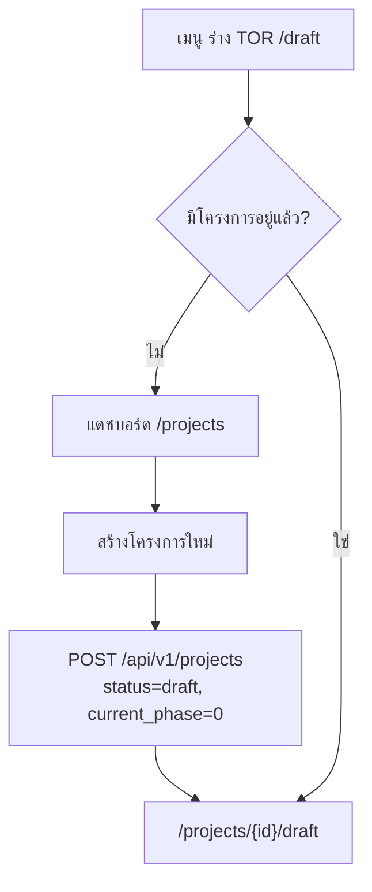
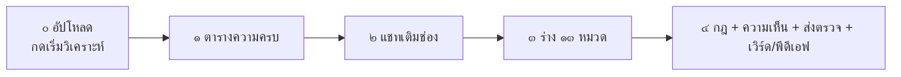

# คำอธิบายเวิร์กโฟลว์ — ร่าง TOR

**ตรวจจากโค้ดจริง:** 27 สิงหาคม 2026 (`app/frontend` + `app/backend`) · อัปเดตจากรอบ 26 ส.ค.  
**เครื่องมือ:** หนึ่งในสามบริการหลักของเจ้าหน้าที่  
**หน้าจอ:** `/projects/{id}/draft` · เมนู **ร่าง TOR** (`/draft` ส่งต่อไปโครงการที่มีอยู่ หรือแดชบอร์ดถ้ายังไม่มี)  
**คู่มือในแอป:** `/help` → ร่าง TOR

เอกสารนี้เป็นแหล่งความจริงของเส้นทาง **ห้าขั้น** ปัจจุบัน ใช้แทนบันทึกเก่าที่ยังพูดถึงวิซาร์ด ๘ ขั้น นับถอยหลัง ๑๐ วินาทีในขั้นที่ ๑ หรือเกต HITL บนปุ่มไปทบทวน/ส่งตรวจ

---

## 1. บริการนี้ทำอะไร

เจ้าหน้าที่สร้างโครงการ ส่งเอกสารหรือวางข้อความ ให้ระบบจัดเข้า **๒๗ ช่อง** (หมวด `s1`–`s13` + หัวข้อย่อยขอบเขตงาน `s4.1`–`s4.14`) เติมช่องข้อเท็จจริงในแชท แล้วให้เอไอร่าง ๑๓ หมวดตามภาษาราชการลง**หัวข้อย่อยของแต่ละหมวด** (หมวด ๔ ใช้ ๔.๑–๔.๑๔) กดไปทบทวนเมื่อครบ ๑๓ หมวด ระบบตรวจกับ พ.ร.บ. การจัดซื้อจัดจ้าง กฎระเบียบ และเอกสารขั้นที่ ๐ ของโครงการนี้ จากนั้นส่งขออนุมัติและส่งออกเวิร์ด/พีดีเอฟ

โครงเอกสารเป็น ๑๓ หมวดเสมอ ความครบของหมวดใช้ `isSectionFilled`: มีเนื้อหาหลัก หรือมีหัวข้อย่อยหมวด ๔ ที่เติมแล้ว

| ผู้เกี่ยวข้อง | หน้าที่ |
|--------------|--------|
| **เจ้าหน้าที่ (officer)** | เป็นเจ้าของโครงการ ทำขั้น ๐–๔ ส่งตรวจแล้วสถานะเป็น `in_review` — แดชบอร์ดปิดปุ่มแก้ แต่หน้าวิซาร์ดห้าขั้น**ยังไม่ล็อกฟอร์มตามสถานะ** (ส่งซ้ำฝั่งเซิร์ฟเวอร์ถูกปฏิเสธ) |
| **ผู้ตรวจสอบ / ผู้ดูแล** | ไม่ว่างร่าง — กด **อนุมัติ** / **ส่งกลับ** ที่แดชบอร์ดหลังส่งตรวจ |
| **โมเดลภาษา / ฝังเวกเตอร์** | วิเคราะห์ช่อง ตอบแชทขั้นที่ ๒ ร่างหมวดขั้นที่ ๓ ข้อเสนอแนะและความเห็นขั้นที่ ๔ |
| **เครื่องยนต์กฎ** | คะแนนคุณภาพขั้นที่ ๔ (ผ่านเมื่อ ≥ ๗๐ เป็นคำเตือน ไม่ล็อกส่งตรวจ) |

---

## 2. จุดเข้าและวงจรโครงการ

ฟอร์มสร้าง: ชื่อโครงการ หน่วยงาน วงเงิน (ตัวเลข ASCII) ประเภทงาน แม่แบบ (ถ้ามี)

อย่าสร้างโครงการจำลองจากเมนูร่าง — ต้องกรอกจากแดชบอร์ด

| สถานะ | ความหมาย |
|--------|----------|
| `draft` | กำลังร่าง |
| `in_review` | กดส่งขออนุมัติแล้ว เจ้าหน้าที่แก้ไม่ได้จนกว่าจะถูกส่งกลับ |
| `approved` | อนุมัติแล้ว |
| `rejected` | ส่งกลับ — แก้แล้วส่งใหม่ได้ |

---

## 3. ภาพรวมห้าขั้น

ป้ายบนแถบ (`PhaseFlow`):

| ขั้น | ชื่อ | คำอธิบายสั้น |
|-----:|------|----------------|
| ๐ | เตรียมข้อมูล | อัปโหลดและวิเคราะห์ |
| ๑ | ผลวิเคราะห์ | ตารางช่องจากเอกสาร |
| ๒ | สอบถามเพิ่ม | เติมช่องและกฎระเบียบ |
| ๓ | ร่างเนื้อหา | สิบสามหมวดรวมหัวข้อย่อย |
| ๔ | ทบทวนและส่งออก | ตรวจกฎและเผยแพร่ |

กล่องยืนยัน (`PHASE_FORWARD_CONFIRM` ปุ่ม **ยกเลิก** / **ยืนยัน**) มีตอน **๐→๑** และ **๒→๓** และ **๓→๔**  
**๑→๒ ไม่มีกล่องยืนยัน**

| ขั้นถัดไป | ข้อความกล่อง |
|-----------|--------------|
| ๑ | *ยืนยันเริ่มวิเคราะห์เอกสาร?* |
| ๓ | *ข้อมูลครบถ้วนแล้ว ยืนยันเริ่มร่างเนื้อหา?* |
| ๔ | *ยืนยันเข้าทบทวน — ระบบจะตรวจร่างกับ พ.ร.บ. การจัดซื้อจัดจ้าง กฎระเบียบ และเอกสารที่อัปโหลดในขั้นที่ ๐ ของโครงการนี้* |

ปลดล็อกไม่ใช่ “ขั้นถัดไปทีละหนึ่ง” — คำนวณจาก `analysis_json`:

| ธงใน `analysis_json` | ขั้นสูงสุดที่เลือกได้ |
|----------------------|------------------------|
| ยังไม่วิเคราะห์ | ๐ |
| `analyzed` หรือมี `slot_map` | ๒ (ขั้น ๑ และ ๒ เปิด) |
| `ready_to_compose` | ๓ |
| `phase4_confirmed` | ๔ |

บันทึกขั้นด้วย `PATCH /projects/{id}/phase` ย้อนกลับบนแถบได้ ห้ามให้การวิเคราะห์ดึงเซิร์ฟเวอร์จากขั้น ๒ กลับไป ๑

---

## 4. ขั้นที่ ๐ — เตรียมและวิเคราะห์

**หน้า:** `Phase0Upload`  
**ยังไม่วิเคราะห์อัตโนมัติ** อัปโหลด/วางข้อความเป็นการเก็บอย่างเดียวจนกดยืนยัน **เริ่มวิเคราะห์**

| ข้อมูลเข้า | API | เงื่อนไข |
|-----------|-----|----------|
| ไฟล์ (หลายครั้งได้) | `POST .../intake/upload` | สูงสุด **๕๐ MB** ต่อไฟล์ สกัดข้อความ เก็บต้นฉบับ ผูก `owner` + `project_id` ไฟล์ที่สกัดว่างได้สถานะ `empty` พร้อมคำเตือน |
| ข้อความวาง | `POST .../intake/text` | อย่างน้อย **๒๐** ตัวอักษร สูงสุด **๕๐๐,๐๐๐** (`INTAKE_TEXT_CHAR_LIMIT`) บันทึกเป็น `ข้อความผู้ใช้.txt` |
| เริ่มวิเคราะห์ | `POST .../intake/analyze` | ปุ่ม **เริ่มวิเคราะห์และเข้าขั้นที่ ๑** (`intake-start-analyze`) กล่อง: *ยืนยันเริ่มวิเคราะห์เอกสาร?* |

ฝั่งลูกข่ายรอวิเคราะห์ได้ถึง **๙๐๐ วินาที** (`ANALYZE_HTTP_TIMEOUT_MS`) และโพล `GET .../intake/coverage` ทุก ๒.๕ วินาที ถ้าเอชทีทีพีขาดแต่แบ็กเอนด์จัดช่องเสร็จแล้ว ยังกู้ได้ถึง **๑๘๐ วินาที**  
ระหว่างรอแผง `phase0-analyzing` บอกไม่ให้ปิดหน้า

สกัด PDF: ถ้าหน้ามีตัวอักษรไทย/ละตินน้อยจะ OCR (Tesseract `tha+eng` หมดเวลา ๑๘๐ วินาที ลอง PSM ๑ แล้ว ๖) รองรับ PDF / DOCX / DOC / PPTX / ข้อความ / รูป

### สิ่งที่วิเคราะห์ทำ

1. รวมเฉพาะชิ้นที่มีข้อความ (ตัดหัวข้อไฟล์ออก) ฮิวริสติกจัดช่องจากรหัส `(s1):` หัวข้อไทย และร้อยแก้ว TOR (`extract_unstructured_slots`) แล้ว `repair_misplaced_slots` — **บันทึกผลฮิวริสติกลงโครงการทันที** ก่อนรอโมเดล เพื่อให้ตารางขั้นที่ ๑ มีข้อมูลแม้ LLM ช้า
2. ถ้าช่องข้อเท็จจริงยังไม่ครบและเปิด LLM จะแบ่งชุดข้อความเป็นก้อนสูงสุด **๔** ก้อน (ก้อนละ ๔๐,๐๐๐ ตัวอักษร ทับกัน ๒,๐๐๐) เรียกโมเดลใส่ JSON ช่อง แล้วซ้อนผล ไม่ทับข้อเท็จจริงที่เติมแล้ว หมดเวลาโมเดล **๑,๘๐๐ วินาที** เพดานคำตอบเท่า `DRAFT_MAX_TOKENS` ในหน้าต่าง ๑๒๘,๐๐๐
3. บันทึก `slot_map`, `gap_questions`, `analyzed=true` — **`ready_to_compose` ยังเป็นเท็จ**
4. **ไม่ดึงคลังกฎหมายอัตโนมัติตอนวิเคราะห์แล้ว** (`standard_fill_keys` คืนว่าง) — กด **ใช้มาตรฐานกลางเติมช่องว่าง** ในขั้นที่ ๒ (`POST .../intake/fill-references`)

ไปขั้นที่ ๑ เมื่อ `analyzed === true` และตารางความครบยาวกว่า ๐

### ๒๗ ช่อง

`s1`–`s13` และ `s4.1`–`s4.14`

**ช่องข้อเท็จจริงบังคับ** (`FACT_REQUIRED_SLOTS` — กฎหมายอย่างเดียวเติมไม่ได้):

| คีย์ | ชื่อ |
|------|------|
| `s1` | ความเป็นมา |
| `s2` | วัตถุประสงค์ |
| `s5` | ระยะเวลาดำเนินการ |
| `s6` | วงเงินงบประมาณ |
| `s7` | สถานที่ดำเนินการ |
| `s4.1` | สรุปขอบเขตงาน |

สถานะในตาราง: ครบ · อ้างอิง · ยังขาด

---

## 5. ขั้นที่ ๑ — ตารางผลวิเคราะห์

แสดงสรุปข้อเท็จจริงที่เติมแล้ว ตาราง ๒๗ แถว และคำถามช่องว่าง  
**ไม่มีนับถอยหลัง** (`phase1-countdown` ไม่มีบนจอ)

ปุ่มต่อ (`phase1-skip`): ข้อเท็จจริงครบแล้วแสดง **ไปขั้นที่ ๒** ไม่เช่นนั้น **ไปสอบถามเพิ่ม (ขั้นที่ ๒) — เติมช่องที่ยังขาด** แล้วเข้าขั้นที่ ๒ ทันที

---

## 6. ขั้นที่ ๒ — แชทเติมช่อง

**ชนิดห้อง:** `draft_intake` (คนละประวัติกับ `/chat`)  
**API แชท:** `POST .../intake/chat` (SSE)

- ชิปสถานะช่องข้อเท็จจริง + ตารางความครบ
- วางข้อความยาวได้ ระบบจัดหลายช่อง แล้วถามเฉพาะที่ยังขาด
- ติ๊ก **แนบอ้างอิงกฎหมายประกอบคำตอบนี้** ได้โดยไม่ทับข้อเท็จจริง
- ปุ่ม **ใช้มาตรฐานกลางเติมช่องว่าง** → `POST .../intake/fill-references` (ค้นคลังกลาง) สำหรับช่องที่ไม่ใช่ข้อเท็จจริงที่ยัง `gap`

เปิดห้องด้วย `POST .../intake/open-qa` (เก็บประวัติ `kind=draft_intake`) แล้วสตรีมที่ `POST .../intake/chat` — **ไม่ได้**ใช้หน้า `/chat`  
ติ๊กแนบกฎหมายแล้วค้นคลังแบบย่อ (`top_k=๓` คำตอบสั้น)

เกตไปขั้นที่ ๓: ช่องข้อเท็จจริงบังคับครบทุกช่อง  
ปุ่ม **ครบแล้ว — ไปร่าง (ขั้นที่ ๓)** (`intake-confirm-ready`)  
กล่อง: *ข้อมูลครบถ้วนแล้ว ยืนยันเริ่มร่างเนื้อหา?*  
`POST .../intake/confirm-ready` `{ confirm: true }` ตั้ง `ready_to_compose` และ `current_phase ≥ 3`

---

## 7. ขั้นที่ ๓ — ร่างสิบสามหมวด

เมื่อเปิดขั้นนี้ `DraftChat` เรียก `GET .../draft-chat/status` ถ้ายังไม่ครบ จะสตรีม `POST .../draft-chat/start`

งานร่างรันต่อเนื่องในพื้นหลังแม้เบราว์เซอร์หลุด (`_DRAFT_JOBS`)  
สตรีม `/draft-chat/start` ส่ง `progress` แล้วโพลงฐานข้อมูลเป็น `section_done` (หมวด ๔ อาจมี `subsection_done`) จากนั้น `all_done` `{ drafted_count, total }` — **ไม่สตรีมโทเคนทีละคำตอนร่างทั้งฉบับ**  
แชทแก้หมวดทีละข้อ (`/draft-chat/message`) จึงสตรีม `section_start` · `token` · `section_done` / `accepted`  
โพลสถานะทุก ๔ วินาทีขณะกำลังร่าง

หมวด ๑–๑๓ ใส่ลงหัวข้อย่อยของแบบฟอร์ม (`SECTION_FIELDS`) เก็บเป็น JSON ตามรหัสฟิลด์ ไม่ใช่ช่อง `body` ก้อนเดียว  
งบประมาณโมเดลร่าง: อย่างน้อยประมาณ **๖,๑๔๔** โทเคน เพดาน **๓๒,๗๖๘** (`DRAFT_MIN_TOKENS` / `DRAFT_MAX_TOKENS`)

| หมวด | หัวข้อย่อยที่ร่างลง (รหัส → ป้าย) |
|------|----------------------------------|
| `s1` | `history` ประวัติ/สถานการณ์ · `problems` ปัญหา · `policy` นโยบาย/กฎหมาย |
| `s2` | `mainObj` วัตถุประสงค์หลัก · `users` กลุ่มผู้ใช้ · `kpi` ตัวชี้วัด |
| `s3` | `general` คุณสมบัติทั่วไป · `paidup` ทุนจดทะเบียน · `experience` ผลงาน |
| `s4` | ร่างลง `s4.1`–`s4.14` โดยตรง หัวข้อหลักเก็บสรุปสั้น |
| `s5` | `timelineRange` วันเริ่ม–สิ้นสุด · `milestones` งวดงานหลัก |
| `s6` | `budgetAmount` วงเงิน · `budgetSource` ที่มา |
| `s7` | `location` สถานที่ |
| `s8` | `installments` จำนวนงวด · `paymentTerms` เงื่อนไขเบิกจ่าย |
| `s9` | `warranty` รับประกัน |
| `s10` | `penalty` ค่าปรับ |
| `s11` | `evalMethod` วิธีประเมิน · `evalWeight` สัดส่วนคะแนน |
| `s12` | `docs` รายการเอกสาร |
| `s13` | `other` เงื่อนไขอื่น |

ตารางในเนื้อหาจะเป็นตารางจริงในไฟล์ส่งออก

ปุ่มในแชทต่อหมวด: **ยอมรับ** · **แก้ไข** · **ร่างใหม่** (ส่ง `section_key` ไปกับข้อความ)  
ปุ่มบนการ์ด: **ร่างด้วยระบบอัจฉริยะ** (`POST .../draft-section` กราฟ LangGraph เกณฑ์ ๗๐ ลองใหม่ได้ไม่เกิน ๓) และ **บันทึกหมวดนี้**  
**ไม่มีปุ่ม «เจ้าหน้าที่ยืนยันแล้ว» บนการ์ดแล้ว** — E2E ตรวจว่า `hitl-confirm-s3` ไม่ปรากฏ  
`HITL_SECTIONS` / `MANDATORY_HUMAN_REVIEW_SECTIONS` (`s3` คุณสมบัติ · `s6` วงเงิน · `s8` งวด · `s10` ค่าปรับ · `s13` เงื่อนไขอื่น) ยังอยู่ในโดเมน แต่**ไม่ใช่เกตบนแถบขั้น**

เกตไปขั้นที่ ๔ ฝั่ง UI: `canLeavePhase3(allDrafted)` — ครบ ๑๓ หมวดตาม `isSectionFilled` (หมวดแม่มีเนื้อหา **หรือ** มีหัวข้อย่อยหมวด ๔ ที่เติมแล้ว)  
ปุ่ม **ไปทบทวน (ขั้นที่ ๔)** (`phase3-confirm`)  
กล่องใช้ข้อความยาวในตารางข้อ ๓  
`POST .../intake/confirm-phase4` ถ้ายังไม่ปลดล็อกขั้น ๔ — ฟังก์ชัน `attest_hitl_sections` **ตั้ง `is_approved` ให้หมวดเสี่ยงที่ยังไม่ยืนยันอัตโนมัติ** เมื่อเจ้าหน้าที่กดยืนยันเข้าทบทวน (ไม่บังคับคลิกทีละหมวด)  
เส้นเอพีไอ/ฮาร์เนสที่ร่างครบแล้วต้องเรียก `confirm-phase4` เอง ไม่งั้น `current_phase` ยังเป็น ๓ และ `current_step` ของวิซาร์ดเก่าเป็น ๑

---

## 8. ขั้นที่ ๔ — ทบทวนในโครงการ ส่งตรวจ ส่งออก

ต่างจากหน้า `/review` ที่ตรวจไฟล์ภายนอก (ดูเอกสาร ๒๒)

เข้าขั้นแล้วแชทรีวิวเรียกตรวจกฎครั้งเดียวถ้ายังไม่มีคะแนน (`review-run-guard` กันรันซ้ำตอนรีเมานต์)  
กด **ตรวจด้วยกฎระเบียบ** หรือพิมพ์ *ตรวจอีกครั้ง* / *รันใหม่* เพื่อบังคับรันใหม่  
พิมพ์คำถามอิสระ → `POST .../review/comment` ให้ ReviewAgent แสดงความเห็นเข้มงวดจากร่าง + findings + บริบทกฎหมาย + เอกสารขั้นที่ ๐

ผลบนจอ: ความเห็นรวม (`overall_assessment` / `review_assessment`) · คะแนนกฎ · findings · ข้อเสนอแนะ

เครื่องยนต์กฎถ่วงน้ำหนัก: กฎหมาย ๔๐% · ความครบ ๓๐% · ความสอดคล้อง ๒๐% · รูปแบบ ๑๐% ผ่านที่ **≥ ๗๐**  
เอเจนต์ทบทวนสร้างข้อเสนอแนะแบบดีที่สุด ถ้าโมเดลล้มยังได้ผลจากกฎ

แผงขั้นที่ ๔: แถบความครบ · พรีวิวร่างรวม · ความเห็นรวม · คะแนนกฎ/ข้อค้นพบ · ข้อเสนอแนะ (ดูอย่างเดียว ไม่มีปุ่มยอมรับบนหน้านี้) · อัปโหลด **ข้อกำหนดเพิ่มเติม** (`GET/POST/DELETE .../review/requirements` รับ PDF/DOCX/TXT เข้าบริบท ReviewAgent ไม่เข้าน้ำหนักกฎ) · แชทรีวิว · **ย้อนกลับไปแก้ไข** · **ตรวจด้วยกฎระเบียบ** · **ส่งขออนุมัติ**  
การ์ดแยก **เผยแพร่**: ส่งออกเวิร์ด/พีดีเอฟ

**ส่งขออนุมัติ** กดไม่ได้จนกว่า `canSubmitPhase4` เป็นจริง — `filledCount >= 13` (ไม่ล็อกด้วย HITL หรือคะแนน &lt; ๗๐ หรือยังไม่เคยรันกฎ)  
ฝั่งเซิร์ฟเวอร์ `officer_can_submit` ตรวจสถานะ `draft`/`rejected` เป็นหลัก **ไม่ตรวจครบ ๑๓ หมวด**  
ส่งออก: `POST .../export` โพลสถานะ แล้วดาวน์โหลด docx/pdf (TH Sarabun New วันที่ พ.ศ.)

---

## 9. API หลัก (`/api/v1`)

| กลุ่ม | เมธอด |
|-------|--------|
| โครงการ | `POST /projects` · `GET /projects/{id}` · `PATCH .../phase` |
| รับข้อมูล | `intake/upload` · `text` · `analyze` · `coverage` · `open-qa` · `chat` · `fill-references` · `confirm-ready` · `confirm-phase4` |
| ร่าง | `GET/PUT .../sections/{key}` · `draft-section` · `draft-chat/start` · `draft-chat/message` · `draft-chat/status` |
| ทบทวน/ส่งออก | `POST .../review` · `GET .../suggestions` (ไม่มี PUT บนหน้าห้าขั้น) · `POST .../review/comment` · `GET/POST/DELETE .../review/requirements` · `POST .../submit` · `export` + `status` + `download` |
| คิว | `GET /ai/queue/{request_id}` |

---

## 10. สิ่งที่เปลี่ยนจากเอกสารรอบก่อน และข้อควรรู้

| หัวข้อ | พฤติกรรมปัจจุบัน |
|--------|------------------|
| HITL บนหน้าจอ | ไม่เป็นเกตไปทบทวน/ส่งตรวจ — ยืนยันรวมตอน `confirm-phase4` |
| แบบฟอร์มหมวด | หัวข้อย่อยตาม `section_fields` ไม่ใช่ช่อง `body` ก้อนเดียว |
| ความครบหมวด ๔ | นับว่าครบถ้ามีหัวข้อย่อยที่เติมแล้ว (`isSectionFilled`) |
| แชทรีวิว | ถามความเห็นได้ ไม่ใช่พิมพ์ยืนยันหมวด |
| เมนู `/draft` ไม่มีโครงการ | ข้อความ *ยังไม่มีโครงการ — สร้างจากแดชบอร์ดก่อน...* ปุ่ม **ไปที่แดชบอร์ดเพื่อสร้างโครงการ** (`new-project`) ไม่สร้างโครงการปลอม |
| สตรีมร่างทั้งฉบับ | `section_done` / `all_done` จากโพลงานพื้นหลัง ไม่ใช่โทเคนต่อเนื่อง |
| ข้อกำหนดเพิ่มเติมขั้นที่ ๔ | ไฟล์เข้าบริบทเอเจนต์ทบทวน ไม่คิดคะแนนกฎ |
| วิเคราะห์ไม่ดึงกฎหมายอัตโนมัติ | กดปุ่มมาตรฐานกลางในขั้นที่ ๒ — ฮิวริสติก/LLM จัดช่องจากเอกสารโครงการเท่านั้น |
| วางข้อความ / เก็บแพ็ก | สูงสุด ๕๐๐,๐๐๐ ตัวอักษรต่อชิ้น แพ็กรวมสำหรับทบทวนตัดที่ ๒๐๐,๐๐๐ |
| รอวิเคราะห์บนจอ | ๙๐๐ วินาที + โพลความครบ (กู้ ๑๘๐ วินาทีถ้า HTTP ขาด) |

### ข้อที่ยังควรทำต่อ (แนะนำ)

| รายการ | ทำไม |
|--------|------|
| ให้ `POST .../submit` ตรวจครบ ๑๓ หมวดฝั่งเซิร์ฟเวอร์ | ตอนนี้เกตอยู่ที่ UI เป็นหลัก |
| เปิด LM Studio (Gemma + EmbeddingGemma) ก่อนร่าง/แชท | ไม่มีโมเดลจะร่างไม่ครบ — กรอกมือและส่งออกจากข้อความที่มีได้ |
| รัน `python -m app.seed_raw_docs` | ช่องมาตรฐาน แชทกฎหมาย และความเห็นขั้นที่ ๔ ว่างถ้ายังไม่ซีดง |
| ไฟล์ PPTX | ตัวสกัดฝั่งเซิร์ฟเวอร์รับ PPTX/PPT ได้ แต่ป้ายอัปโหลดโฆษณาแค่ PDF/Word/สแกน — แปลงเป็น PDF ถ้าปุ่มเลือกไฟล์ไม่โชว์ |
| คะแนนกฎ &lt; ๗๐ ไม่บล็อกส่งตรวจ | เป็นคำเตือน — ผู้ตรวจต้องดู findings ที่แดชบอร์ด |

---

## 11. ขอบเขตกับอีกสองบริการ

- **ตรวจสอบ TOR** ที่ `/review` ไม่สร้างโครงการและไม่เขียน `tor_sections`
- **ถาม-ตอบ** ที่ `/chat` เป็นห้อง `kind=kb` คนละเส้นกับแชทขั้นที่ ๒
- `POST /agent/sessions` เป็นเส้นเอเจนต์ทั้งฉบับฝั่งเอพีไอ ยังไม่มีหน้าจอห้าขั้นนี้
- โค้ดวิซาร์ด ๘ ขั้น (`components/wizard/*`) ยังอยู่ในรีโป **ไม่ใช่**เส้นทางเจ้าหน้าที่ปัจจุบัน — ใช้ `/projects/{id}/draft` เท่านั้น
