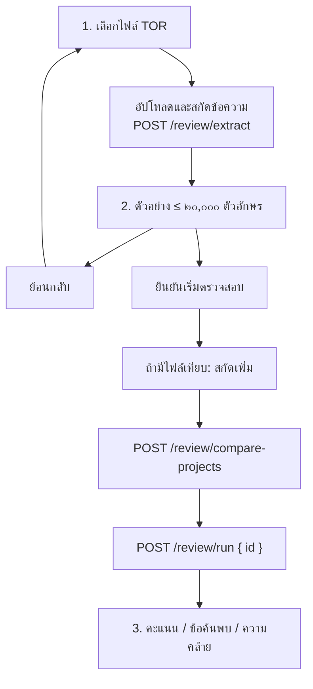

# คำอธิบายเวิร์กโฟลว์ — ตรวจสอบ TOR

**ตรวจจากโค้ดจริง:** 1 กันยายน 2026 (`app/frontend` + `app/backend`)  
**เครื่องมือ:** หนึ่งในสามบริการหลักของเจ้าหน้าที่  
**หน้าจอ:** `/review` (ไฟล์ภายนอก) **และ** ขั้นที่ ๔ ของโครงการร่าง  
**คู่มือในแอป:** `/help` → ตรวจสอบ

เอกสารนี้อธิบายทั้งสองพื้นผิวที่ใช้เครื่องยนต์กฎชุดเดียวกัน และจุดที่ต่างกัน

---

## 1. บริการนี้ทำอะไร

ตรวจเอกสารกำหนดขอบเขตงานเทียบระเบียบจัดซื้อจัดจ้างภาครัฐ แล้วแสดง **คะแนนคุณภาพ** **ข้อค้นพบ** **ความเห็นรวม** และ (เฉพาะในโครงการ) **ข้อเสนอแนะจากเอไอ** รวมถึงแชทถามความเห็น  
เทียบเอกสารสองฉบับขึ้นไปด้วยความคล้ายแบบ Jaccard ได้

| พื้นผิว | ต้องมีโครงการ? | เขียนหมวด TOR? | เอเจนต์ทบทวน? | ส่งออกเวิร์ด/พีดีเอฟ? |
|---------|----------------|-----------------|----------------|------------------------|
| **`/review` ล้วน** | ไม่ | ไม่ | ใช่ (กฎ + RAG หลายคำค้น + ReviewAgent แบบ best-effort) | ไม่ |
| **ขั้นที่ ๔ ในร่าง** | ใช่ | มีอยู่แล้วจากขั้นที่ ๓ | ใช่ (ถ้าโมเดลตอบ) | ใช่ |

เมนู **ตรวจสอบ TOR** เปิดหน้าล้วน การตรวจในโครงการอยู่ท้ายเส้นร่าง

| ผู้ใช้ | `/review` | ขั้นที่ ๔ |
|--------|-----------|-----------|
| เจ้าหน้าที่ | อัปโหลดไฟล์ สกัด ยืนยันตรวจ เทียบไฟล์อื่นได้ | ตรวจร่างโครงการนี้ ถามความเห็น ส่งขออนุมัติเมื่อครบ ๑๓ หมวด |
| ผู้ตรวจ/ผู้ดูแล | งานตรวจผูกเจ้าของไฟล์ | อนุมัติ/ส่งกลับที่แดชบอร์ดหลังส่งตรวจ |

---

## 2. เส้นทางไฟล์ภายนอก (`/review`)

สามขั้นบนจอ: **เลือกไฟล์** → **สกัดข้อความ** → **ผลการตรวจสอบ**

เครื่องยนต์กฎ**ยังไม่ทำงาน**จนกดยืนยัน สกัดกับรันเป็นคนละคำขอ

### ขั้น 1 — เลือกไฟล์

รองรับ PDF, Word (.docx), ข้อความ, รูปสแกน  
**โครงการเปรียบเทียบ** เป็นทางเลือก  
รายการ «เอกสารอ้างอิงบังคับ» บนจอเป็นป้ายแสดง ไม่ใช่ช่องอัปโหลดบังคับ  
ปุ่มสกัดกดไม่ได้จนกว่ามีไฟล์หลัก

### ขั้น 2 — สกัด

`POST /api/v1/review/extract`:

1. ปฏิเสธไฟล์ว่าง
2. สกัดข้อความ (รูปอาจใช้ OCR)
3. เก็บต้นฉบับใน Mongo GridFS
4. สร้างงานใน `review_jobs` สถานะ `extracted` เฉพาะเจ้าของบัญชี
5. คืน `{ id, extracted_text[:20000], status }`

รหัสงานเก็บใน `sessionStorage` (`tor-standalone-review-job`) และ `?job=` — รีเฟรชแล้วเรียก `GET /review/{id}` กู้ขั้น ๒ (มีข้อความ) หรือขั้น ๓ (มีคะแนน) ได้ เฉพาะเจ้าของบัญชี

### ขั้น 3 — ยืนยันตรวจและเทียบ

1. สกัดไฟล์เทียบ (ถ้ามี)
2. ถ้ามีอย่างน้อยสองงาน: `POST /review/compare-projects` `{ extract_ids }` สูงสุด ๕ ฉบับ Jaccard ของชุดคำ (คำยาวกว่า ๑ ตัว) UI ถือ ≥ ๐.๕ เป็นโทนผ่าน ถ้าเอพีไอนี้ไม่มี (๔๐๔/๔๐๕/๕๐๑) จะเทียบในเบราว์เซอร์แทน
3. `POST /review/run` `{ id }` จัดข้อความเข้าหมวดจำลอง ถ้าจัดไม่ได้ทั้งก้อนถือเป็น `s1` แล้วรัน**เส้นเดียวกับโครงการ**: เครื่องยนต์กฎ + RAG กฎหมายหลายคำค้น (`law_review.py`) แนบ `legal_basis` + ReviewAgent (ล้มแล้วยังคืนผลกฎ) · สกัดวงเงินจากข้อความ (`infer_review_budget`) ใส่ `document["budget"]` เพื่อกฎทุนจดทะเบียน · คลาย JSON หัวข้อย่อยเป็นภาษาราชการก่อนคิดคะแนน

แผงผล: หัวข้อ **คะแนนความพร้อม {score}/100** โทนผ่านเมื่อ **≥ ๗๐** ไม่เช่นนั้น «ยังไม่ผ่านเกณฑ์ ๗๐ — ดูรายการด้านล่าง» แล้วแยก **กลุ่ม ก ผิดกฎหมาย/ระเบียบ** กับ **กลุ่ม ข ความเสี่ยงจากความผิดปกติ** (`finding_kind` + `legal_basis` / `risk_type`) พร้อมความคล้าย (Jaccard ≥ ๐.๕ เป็นโทนผ่านบนจอ **ไม่ใช่**เกณฑ์กฎหมาย)

หน้าล้วนใช้กฎ + RAG + เอไอชุดเดียวกับขั้นที่ ๔ (เอไอล้มได้โดยไม่บล็อกคะแนนกฎ)  
ป้ายอัปโหลดรับ `.pdf,.docx,.doc,.txt,.png,.jpg,.jpeg` (คำใบ้เขียน .docx) ตัวสกัดฝั่งเซิร์ฟเวอร์รับ PPTX ได้ถ้าโพสต์ตรง แต่ตัวเลือกไฟล์ไม่โชว์

เอพีไอเทียบรับ `project_ids` ได้ด้วย แต่หน้าจอปัจจุบันส่งแค่ `extract_ids`

---

## 3. การตรวจในโครงการ (ขั้นที่ ๔ ของร่าง)

รายละเอียดวงจรร่างอยู่ในเอกสาร ๒๑ ข้อ ๘ นี่คือสัญญาเฉพาะการตรวจ

แชทรีวิวเรียก `onReview()` ครั้งเดียวตอนเมานต์ **ถ้ายังไม่มีคะแนน** กันรันซ้ำด้วย `review-run-guard`  
พิมพ์ *ตรวจอีกครั้ง* / *รันใหม่* เพื่อรันกฎใหม่  
พิมพ์คำถามอื่น → `POST /projects/{id}/review/comment` → `ReviewAgent.comment_on_draft`

ความเห็นแชทประกอบด้วย: ร่างที่ประกอบแล้ว · วงเงิน/ประเภทงาน · ข้อความข้อกำหนดขั้นที่ ๐ · บริบทกฎหมายจากคลัง · findings ที่เก็บไว้สูงสุด ๑๒ ข้อ · คำถามเจ้าหน้าที่  
พรอมเป็นผู้ตรวจเข้มงวด ห้ามสรุปว่าผ่านถ้ายังมีช่องว่าง อุณหภูมิ ๐.๒ เพดานคำตอบสูงสุด **๑๒๘,๐๐๐** โทเคนภายในหน้าต่าง **๑๒๘,๐๐๐** (`REVIEW_MAX_TOKENS` / `REVIEW_CONTEXT_WINDOW`)

`POST /projects/{id}/review`:

1. รวมเอกสารด้วย `assemble_review_document` — **เครื่องยนต์กฎ**ได้ทุกคีย์รวม `s4.N` ส่วน **ReviewAgent** ใช้เฉพาะหมวดแม่
2. แนบวงเงิน ประเภทงาน และข้อความข้อกำหนดจากขั้นที่ ๐ (`project_intake_pack` ตัดที่ **๒๐๐,๐๐๐** ตัวอักษร) เข้าบริบท LLM · ข้อกำหนดเพิ่มเติมแบบบรรทัดต่อบรรทัดใช้เฉพาะ `custom_requirements_text` ที่อัปโหลดในขั้นที่ ๔ ไม่ใช้ทั้งแพ็กขั้นที่ ๐ (กันหัวข้อไฟล์/`===` เป็นข้อเสนอขยะ)
3. `RuleEngine.validate` ทำซ้ำได้ผลเท่ากัน — ข้อค้นพบมี `finding_kind` (`legal_violation` | `risk_abnormality`) `legal_basis` `excerpt` `risk_type`
4. ดึงคลังกฎหมายหลายคำค้น (วิธีจัดซื้อ ราคากลาง ค่าปรับ คุณสมบัติ เกณฑ์คัดเลือก) แล้วแนบ `legal_basis` ให้ข้อกลุ่ม ก ที่ยังไม่มี citation
5. บันทึก `quality_score`, `analysis_json.review_score` / `review_is_valid` / `review_findings` / `review_assessment`
6. เรียก ReviewAgent สร้างข้อเสนอแนะสูงสุด ๒๐ ข้อ พร้อม `finding_kind` / `legal_basis` ใน JSON และความเห็นรวม ถ้าโมเดลล้มยังคืนผลกฎ

ระหว่างรอคิว LLM แสดง *รอคิวระบบอัจฉริยะ…* (`GET /ai/queue/{request_id}`)

เกตส่งตรวจฝั่ง UI: ครบ ๑๓ หมวด (`isSectionFilled`) — **ไม่ล็อกด้วย HITL คะแนน &lt; ๗๐ หรือ `quality_score` ว่าง**  
ฝั่งเซิร์ฟเวอร์ `officer_can_submit` อนุญาตสถานะ `draft`/`rejected` โดยไม่ดูคะแนน  
อนุมัติจริงอยู่ที่แดชบอร์ด ไม่ใช่หน้า `/review`

อัปโหลด **ข้อกำหนดเพิ่มเติม** (`GET/POST/DELETE .../review/requirements`) เข้าบริบทเอเจนต์ ไม่เข้าน้ำหนักกฎ  
ข้อเสนอแนะบนหน้าห้าขั้นเป็นรายการดูอย่างเดียว — `PUT .../suggestions` ใช้ในวิซาร์ดเก่า ไม่ได้เรียกจากขั้นที่ ๔

---

## 4. เครื่องยนต์กฎร่วม

| หมวด | น้ำหนัก | ตัวอย่างกฎ |
|------|---------|------------|
| กฎหมาย | ๔๐% | ทุนจดทะเบียน = พื้น(งบ÷๔) · ค่าปรับ ๐.๐๑–๐.๒๐%/วัน ขั้นต่ำ ๑๐๐ บาท · ห้ามล็อกยี่ห้อถ้าไม่มี «หรือเทียบเท่า» · ต้องมีราคากลาง · วงเงินสูงต้องระบุวิธีจัดซื้อ |
| ความครบ | ๓๐% | มี ๑๓ หมวด · มี s4.1 และ s4.8 |
| ความสอดคล้อง | ๒๐% | งบ↔ขอบเขต · ไทม์ไลน์↔ส่งมอบ · ภาษาคลุมเครือ · งวดรวมไม่ ๑๐๐% · ส่วนต่างราคากลาง/งบ |
| รูปแบบ | ๑๐% | วันที่ไทย พ.ศ. · ลำดับหมวด |
| งวด/ระยะเวลา | รวมกฎหมาย | ข้ามเมื่อไม่มีข้อมูล |

หัก: error −๒๐ · warning −๑๐ · suggestion −๕  
คะแนนต่ำกว่า ๗๐ เป็นคำเตือน **ไม่ล็อก** การส่งตรวจในขั้นที่ ๔ (ผู้ตรวจต้องอ่าน findings สองกลุ่ม)

---

## 5. ข้อมูลที่เก็บ

**หน้าล้วน:** `review_jobs` + GridFS + รหัสงานในเบราว์เซอร์ — ไม่สร้างแถว `projects`

**ขั้นที่ ๔:** `quality_score`, `analysis_json.review_score` / `review_is_valid` / `review_findings` / `review_assessment`, ตาราง `suggestions`, ไฟล์ข้อกำหนดเพิ่มเติม, บันทึก `submit`

---

## 6. API (`/api/v1`)

| เมธอด | เส้นทาง | ใช้ทำ |
|--------|---------|--------|
| POST | `/review/extract` | สกัด + สร้างงาน |
| POST | `/review/run` | `{ id }` หรือ `{ text }` → กฎ + RAG + เอไอ |
| GET | `/review/{id}` | กู้งานของเจ้าของ |
| POST | `/review/compare-projects` | เทียบ ≥ ๒ รายการ |
| POST | `/projects/{id}/review` | รวมร่าง + กฎ + เอเจนต์ + ความเห็นรวม |
| POST | `/projects/{id}/review/comment` | ถามความเห็นเข้มงวดจากร่าง (ไม่รันกฎใหม่) |
| GET/POST/DELETE | `/projects/{id}/review/requirements` | ข้อกำหนดเพิ่มเติมขั้นที่ ๔ |
| GET | `/projects/{id}/suggestions` | รายการบนหน้าห้าขั้น (ไม่มี PUT) |
| POST | `/projects/{id}/submit` | ส่งตรวจ |
| POST | `/projects/{id}/export` · GET `.../status` · GET `.../download/{docx\|pdf}` | ส่งออก |
| GET | `/ai/queue/{request_id}` | คิว LLM ตอนทบทวน |
| POST | `/projects/{id}/approve` · `reject` | ผู้ตรวจ/ผู้ดูแล |

---

## 7. ปัญหาที่พบและที่แก้แล้ว / ที่แนะนำ

| รายการ | สถานะ |
|--------|--------|
| หน้าล้วนไม่ผูกวงเงิน | แก้แล้ว — สกัดบาทจากข้อความก่อนรันกฎ |
| ประกอบร่างแล้วคะแนน 0 | แก้แล้ว — รวม s4.1–s4.14 และคลาย JSON แม่ |
| ข้อเสนอแนะอ้างหัวข้อแพ็กขั้นที่ ๐ | แก้แล้ว — ไม่ส่งแพ็กเป็น custom requirements · กรองบรรทัด `===` / `[ไฟล์]` |
| JSON ข้อเสนอแนะ ReviewAgent ล้น | แก้แล้ว — `REVIEW_SUGGESTION_MAX_TOKENS=4096` + ข้อความซ่อมรอบสอง |
| สกัดก่อนรันกฎ (ไม่ตรวจอัตโนมัติตอนอัปโหลด) | ทำงานตามออกแบบแล้ว |
| กู้งานหลังรีเฟรชด้วย `GET /review/{id}` | มีแล้ว |
| รายการกฎหมายบังคับบนจอเป็นป้าย ไม่ได้บังคับอัปโหลด | คงไว้ — อย่าเข้าใจว่าต้องแนบห้าไฟล์ |
| คะแนน &lt; ๗๐ ไม่กันส่งตรวจ | คงเป็นคำเตือน — ผู้ตรวจดู findings ที่แดชบอร์ด |
| แชทรีวิวไม่ยืนยัน HITL ทีละหมวดแล้ว | ถามความเห็นผ่าน `/review/comment` แทน |
| เกตส่งตรวจ | ครบ ๑๓ หมวดบน UI — ไม่ใช้ HITL เป็นเกต |
| ไฟล์ PPTX | ตัวเลือกบน `/review` ไม่รับ — แปลงเป็น PDF/Word ก่อน (สกัดตรงเอพีไอรับ PPTX ได้) |
| OCR รูปสแกนคุณภาพต่ำ | ตรวจตัวอย่างข้อความขั้น ๒ ก่อนยืนยันรัน |
| คู่มือในแอปเขียน «ผ่านเมื่อคะแนน ≥ ๗๐» | หมายถึงโทนบนจอ ไม่ใช่เกตล็อกส่งตรวจ |
| เส้น `/agent/.../review` | ไม่ใช่หน้า `/review` |

---

## 8. ขอบเขต

- ไม่ดึงคลังถาม-ตอบมาคิด**คะแนน** ข้อค้นพบหลักมาจากกฎ ความเห็นแชทรีวิวใช้ LLM + บริบทกฎหมายแยกต่างหาก
- ไฟล์ที่ตรวจบน `/review` **ไม่ถูกนำเข้าโครงการ** ต้องคัดลอกเองถ้าจะใช้ในร่าง
- e-Bidding / e-GP นอกระบบ
