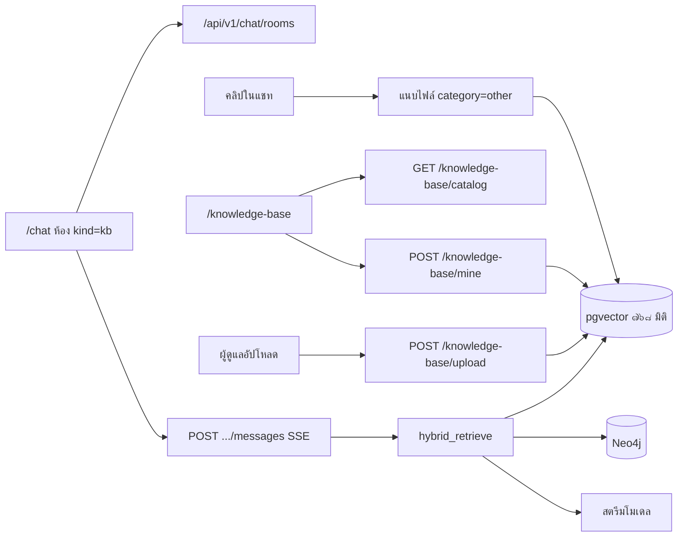

# คำอธิบายเวิร์กโฟลว์ — ถาม-ตอบและฐานความรู้

**ตรวจจากโค้ดจริง:** 26 สิงหาคม 2026 รอบบ่าย (`app/frontend` + `app/backend`)  
**เครื่องมือ:** หนึ่งในสามบริการหลักของเจ้าหน้าที่  
**หน้าจอ:** `/chat` (ถาม-ตอบ) และ `/knowledge-base` (ฐานความรู้)  
**คู่มือในแอป:** `/help` → ถาม-ตอบ · ฐานความรู้

**ไม่ใช่** แชทขั้นที่ ๒ ของร่าง TOR ห้องและประวัติแยกกัน (`kind=kb` กับ `kind=draft_intake`)

---

## 1. บริการนี้ทำอะไร

เจ้าหน้าที่ถามกฎหมาย/ระเบียบจัดซื้อจัดจ้างเป็นภาษาไทย ได้คำตอบสตรีม**แบบบันทึกเจ้าหน้าที่พัสดุ** (หลายหัวข้อ ไม่สรุปสั้น) ที่อ้างชิ้นข้อความจาก **คลังกลาง** และ/หรือ **เอกสารของตนเอง**  
พรอมระบบห้ามแต่งมาตราที่ไม่มีในบริบท

หน้าฐานความรู้คือแค็ตตาล็อกและจุดอัปโหลดของคลังเดียวกับที่แชทค้น  
ไฟล์ที่แนบจากแชทเข้าคลังส่วนตัวหมวด **ข้อมูลอื่น ๆ**

| ผู้ใช้ | `/chat` | `/knowledge-base` |
|--------|---------|-------------------|
| เจ้าหน้าที่ | ห้องของตนเอง SSE อ้างอิง แนบไฟล์เข้า RAG ของตน | อัปโหลด/ลบ/ดาวน์โหลดของฉัน ดูคลังกลางได้ |
| ผู้ดูแล | เหมือนเจ้าหน้าที่ (ห้องของตน) | อัปโหลดคลังกลาง หน้าจัดการ รัน ingest ทั้งคลังได้ |
| ผู้ตรวจสอบ | ห้องของตนเท่านั้น | คลังกลาง + ไฟล์ของตน |

สิทธิ์ค้น**ปิดเมื่อไม่ชัด:** เจ้าหน้าที่อื่นมองไม่เห็นไฟล์ที่มี `owner_id` คนละคน (`rag/acl.py`)

แหล่งค้นเพิ่ม (ปิดโดยค่าเริ่มต้น): Custom RAG HTTP และเซิร์ฟเวอร์ MCP เครื่องมือ `retrieve` — ไม่เปลี่ยนโมเดลตอบ (ยังเป็น Gemma ในเครื่องหรือ Bedrock บนคลาวด์) ดู [29](29-TBW-AWS-CLOUD-ONLY.md) และมอบหมายทีม [30](30-DEV-ASSIGNMENT-MCP-AND-AWS.md)

---

## 2. สองหน้าจอ คลังค้นชุดเดียว

คลังกลางที่ใช้จริงมาจาก PDF ใน `documents/sources/` ด้วย `python -m app.seed_raw_docs` (GridFS + เวกเตอร์ + กราฟ)  
`python -m app.seed_kb` เป็น extracts งานวิจัย **ไม่ใช่** คลังที่แชทใช้หลังรีเซ็ต

บน **AWS Cloud ล้วน** สองแหล่งนี้ยังใช้ได้ (`both` / `global` / `mine`) แต่ทั้งคู่ถูกฝังด้วย Titan บน RDS — ไม่เรียก LM Studio เพื่อ embed  
รายละเอียดและรายการ TBW: [29-TBW-AWS-CLOUD-ONLY.md](29-TBW-AWS-CLOUD-ONLY.md)

ถ้า Neo4j ไม่ขึ้น การค้นตั้ง `graph_degraded` แชทยังตอบจากชิ้นข้อความได้

---

## 3. เวิร์กโฟลว์ถาม-ตอบ (`/chat`)

หน้าเรนเดอร์ `ChatShell kind="kb"` รายการห้องย่อด้านซ้าย

### ห้อง

| API | พฤติกรรม |
|-----|----------|
| `GET /chat/rooms?kind=kb` | ห้องของผู้ใช้ ล่าสุดก่อน |
| `POST /chat/rooms` | `{ kind: "kb", title? }` หน้าจอสร้างด้วยชื่อ **ถาม-ตอบคลังความรู้** (`TITLE_KB`) ถ้ายังไม่มีห้องจะสร้างให้อัตโนมัติ |
| `PATCH` / `DELETE` | เปลี่ยนชื่อ (`window.prompt`) / ลบ เฉพาะเจ้าของ |
| `GET .../messages` | ประวัติรวมชิปอ้างอิง |
| `GET /chat/prompts?kind=kb` | ชิปคำถามตั้งต้น (คลิกเติมช่องพิมพ์) |

ไม่มีห้องร่วมทั้งหน่วยงาน  
แบ็กเอนด์ค่าเริ่มชื่อห้องคือ «ห้องใหม่» และจะแทนด้วย ๖๐ ตัวอักษรแรกของคำถามแรก **เฉพาะเมื่อชื่อยังเป็น «ห้องใหม่»** — ห้องที่ UI สร้างใช้ «ถาม-ตอบคลังความรู้» จึงแทบไม่ถูกเปลี่ยนชื่ออัตโนมัติ

### ขอบเขตค้น

| ค่า | ป้ายบนจอ | ความหมาย | สิทธิ์ |
|-----|----------|----------|--------|
| `both` (ค่าเริ่ม) | ทั้งคู่ | กลาง + ของฉัน | เอกสารกลาง (`owner_id` ว่าง) และไฟล์ผู้ใช้นี้ |
| `global` | คลังกลาง | คลังกลางอย่างเดียว | เฉพาะไม่มีเจ้าของ |
| `mine` | ของฉัน | ของฉันอย่างเดียว | `owner_id == ผู้ใช้` ถ้าไม่มีไฟล์จะว่าง (ไม่รั่วของคนอื่น) |

### ส่งข้อความ (SSE)

`POST /chat/rooms/{id}/messages` `{ content, search_scope }` จำกัดอัตราเอไอ

ห้อง **ถาม-ตอบ** (`kind=kb`) ใช้โมดูล `rag/kb_qa.py` คู่ `llm_tokens.py` (เส้น `/kb-chat` เก่าใน `kb_chat_service` ใช้ค่าชุดเดียวกันแต่คืน JSON):

| ค่าคงที่ | ที่อยู่ | ค่า |
|----------|---------|-----|
| `CHAT_RAG_TOP_K` | `kb_qa.py` | ๓๒ |
| `CHAT_MAX_CONTEXT_CHUNKS` | `kb_qa.py` | ๔๘ |
| `CHAT_CONTEXT_WINDOW` | `kb_qa.py` | ๑๒๘,๐๐๐ |
| `CHAT_MAX_TOKENS` / `CHAT_MIN_TOKENS` | `llm_tokens.py` | ๓๒,๗๖๘ / ๖,๑๔๔ |
| `CHAT_HISTORY_MESSAGES` / `CHAT_HISTORY_CHAR_CAP` | `kb_qa.py` | ๖ ข้อความ / ๑๒,๐๐๐ ตัวอักษรต่อข้อความ |
| งบประมาณบริบท | `kb_qa.py` | ๑๒๘,๐๐๐ − ๓๒,๗๖๘ − ๔,๐๐๐ = **๙๑,๒๓๒** โทเคน |
| อุณหภูมิสตรีม | `chat.py` | ๐.๒ |

ลำดับ:

1. ค้น `hybrid_retrieve` ด้วย `top_k = ๓๒` แล้วคละแหล่งด้วย `diversify_chunks` (ผลัดทีละไฟล์ต้นฉบับ) ใส่บริบทได้ถึง **๔๘ ชิ้น** จนกว่างบประมาณหน้าต่าง Gemma จะเต็ม (`CHAT_CONTEXT_WINDOW − CHAT_MAX_TOKENS − ๔,๐๐๐`)
2. แต่ละชิ้นจัดรูปแบบ `[ชื่อไฟล์ (มาตรา/หัวข้อ, หน้า n)]` ตาม `format_chunk`
3. ประวัติล่าสุด **๖** ข้อความ (ตัดที่ ๑๒,๐๐๐ ตัวอักษรต่อข้อความ)
4. คิว Redis (`queued` / `started`) → สตรีมโทเคน → บันทึกคำตอบ+ชิปอ้างอิง (`done`)
5. พรอม `KB_QA_SYSTEM`: ตอบเหมือนบันทึกเจ้าหน้าที่พัสดุ ห้ามสั้นหนึ่งย่อหน้า ห้ามแต่งมาตรา

หัวข้อบังคับในคำตอบ:

- ประเด็นคำถาม
- หลักกฎหมายและระเบียบที่เกี่ยวข้อง
- คำอธิบายและการตีความเชิงปฏิบัติ
- ขั้นตอน เงื่อนไข ข้อยกเว้น และข้อพึงระวัง
- สรุปแนวทางปฏิบัติ
- แหล่งอ้างอิง

ค่า `custom_rag_top_k` บนหน้าตั้งค่า AI (ค่าเริ่ม ๒๔) ใช้เมื่อเปิดแหล่ง RAG ภายนอก **ไม่แทน** `CHAT_RAG_TOP_K` ของห้อง `kind=kb`

เหตุการณ์ SSE: `queued` · `started` · `token` · `done` · `error`  
`done` ส่ง `citations` และ `graph_degraded` — ชิปบนจอเป็น `{type}: {label}` **ไม่แสดง**ธงกราฟลดเกรด  
แถบเครื่องมือ: คัดลอกคำตอบล่าสุด · หยุดสตรีม · ส่งซ้ำข้อความล่าสุด · รอคิว (`รอคิว AI...`)

หน้า `/chat` บอกชัดว่าดึงหลายชิ้นจากคลังแล้วตอบแบบเจ้าหน้าที่พัสดุ อ้างมาตราและไฟล์ต้นฉบับ (`page-meta` / ข้อความนำหน้าห้อง)

ห้อง `/chat` ชนิด `draft_intake` มีใน `ChatShell` แต่**วิซาร์ดห้าขั้นไม่ได้เมานต์** — ขั้นที่ ๒ ส่งที่ `POST .../intake/chat` เท่านั้น (แนบกฎหมายแล้ว `top_k=๓` `max_tokens=๓๘๔`)

### แนบไฟล์จากแชท

`POST .../attachments` ไม่ใส่ `accept` ที่อินพุต — เซิร์ฟเวอร์ตรวจ magic bytes: **PDF / DOCX / TXT** สูงสุด **๒๐ MB** (`.doc` เก่าและรูปถูกปฏิเสธ)  
ingest เป็นของ user หมวด `other` แล้วขึ้นแถบชิปในแชทและที่ฐานความรู้ «เอกสารของฉัน»  
ข้อความตอบกลับ ingest: เสร็จ / กำลังจัดดัชนี / ไม่สำเร็จ

---

## 4. เวิร์กโฟลว์ฐานความรู้

`GET /knowledge-base/catalog` คืนกลุ่ม รายการดิบตามหมวด ยอดชิ้น และ `userFiles`

| กลุ่ม (`corpus_group`) | ป้าย | ผู้เห็น | ที่มา |
|------------------------|------|---------|--------|
| `mandatory_handbook` | คู่มือแนวปฏิบัติ (บังคับ) | ทุกคน | `seed_raw_docs` / ผู้ดูแลอัปโหลดที่จัดเป็นคู่มือ |
| `mandatory_raw` | ข้อมูลดิบกฎหมาย/ระเบียบ (บังคับ) | ทุกคน | `seed_raw_docs` / ผู้ดูแลอัปโหลดคลังกลาง |
| `user` | เอกสารของฉัน | เจ้าของเท่านั้น | `/mine` หรือแนบจากแชท |

**ไม่มีกลุ่ม «คลังกลางอื่น» แยก** — อัปโหลดผู้ดูแลไปที่ `group_for_filename` แล้วเป็น handbook หรือ `mandatory_raw`  
หน้า `/knowledge-base` แสดงของฉันแล้วกลุ่มกลาง ยอดชิ้นตามหมวด รีเฟรชเมื่อโฟกัสหน้าต่างกลับมา

เจ้าหน้าที่: `POST /knowledge-base/mine` (หมวด: กฎหมาย กฎกระทรวง ระเบียบ หนังสือเวียน ราคากลาง คู่มือ ตัวอย่าง TOR แม่แบบ ข้อมูลอื่น ๆ) · ลบ/ดาวน์โหลดของตนได้ · แถวกลาง «ลบไม่ได้»  
ผู้ดูแลอัปโหลดที่นี่หรือที่ `/admin/knowledge-base` เป็น**คลังกลาง** (`owner_id` ว่าง) เห็นทุกบัญชี — ไม่มีการแชร์ไฟล์ส่วนตัวข้ามคน  
ไฟล์ส่วนตัวข้ามขั้นตอนสกัดกราฟกฎหมาย Neo4j (ค้นเวกเตอร์อย่างเดียว)

สถานะประมวลผล: รอประมวลผล · กำลังแบ่ง chunk · ใช้กับ RAG ได้ · ประมวลผลไม่สำเร็จ

ผู้ดูแล: `POST /knowledge-base/batch-ingest` รันใหม่ทั้งคลัง (๒๐๒, พื้นหลัง) — ปุ่มอยู่ที่**หน้าแอดมินคลังเท่านั้น**

ป้ายอัปโหลดเจ้าหน้าที่รับ `.pdf,.docx,.doc,.txt` และรูป แต่เซิร์ฟเวอร์รับจริงแค่ PDF/DOCX/TXT ๒๐ MB — คำใบ้บนจออาจเขียนแค่ «รองรับ PDF, Word»

---

## 5. การค้น (RAG)

1. ฝังคำถามด้วยผู้ให้บริการ embeddings ที่ตั้งไว้ (ค่าเริ่ม EmbeddingGemma ๗๖๘ มิติ)
2. ค้นเวกเตอร์ pgvector (หรือ Qdrant ถ้าเลือก) — ถาม-ตอบขอ **๓๒** ชิ้นต่อคำถาม
3. คละตามไฟล์ต้นฉบับเพื่อไม่ให้ PDF เดียวครองพรอม
4. ขยายกราฟ Neo4j ถ้ามี ไม่มีก็ลดเกรด (`graph_degraded`)
5. กรองด้วย ACL ตามขอบเขตค้น
6. คืนชิ้นข้อความและป้ายอ้างอิง (ชื่อไฟล์ หน้า มาตราถ้ามี)

ไฟล์ที่ยัง `processing` จะค้นไม่ขึ้น ต้องรอสถานะเสร็จ

---

## 6. API คู่ `/kb-chat` (ไม่ใช่หน้าจอปัจจุบัน)

`POST /kb-chat/sessions` · `.../message` (JSON ไม่ใช่ SSE ความยาวข้อความ ≤ ๑๐๐๐) · `GET .../history`

เป็นเส้นชุดเอเจนต์เก่า หน้า **ถาม-ตอบ** ของ Next.js **ไม่ได้เรียก** อย่าใช้เป็นคู่มือผู้ปฏิบัติงาน

---

## 7. ข้อมูลที่เก็บ

ห้องและข้อความแชท · แม่แบบคำถาม · เอกสารคลัง (`corpus_group`, `owner_id`, สถานะ, จำนวนชิ้น) · เวกเตอร์ ๗๖๘ มิติ · GridFS · กราฟ Neo4j · คิว Redis

---

## 8. API หลัก (`/api/v1`)

**แชท:** `GET/POST /chat/rooms` · `PATCH/DELETE /chat/rooms/{id}` · `GET/POST .../messages` · `POST .../attachments` · `GET /chat/prompts`

**คลัง:** `GET /knowledge-base` และ `/` (ลงทะเบียนทั้งคู่เพราะปิด redirect ท้ายสแลช) · `GET /catalog` · `POST /mine` · `POST /upload` · `GET/DELETE /mine/{id}` · `GET /mine/{id}/file` · `POST /batch-ingest` (ผู้ดูแล)

---

## 9. ปัญหาที่พบและที่แนะนำให้ครบวงจร

| รายการ | สถานะ / วิธีทำให้ครบ |
|--------|----------------------|
| ห้องแชทคนละประวัติกับร่าง | ถูกต้องแล้ว — อย่าคาดว่าคำตอบคลังจะเข้าหมวด TOR อัตโนมัติ |
| แนบไฟล์จากแชทขึ้นหมวดข้อมูลอื่น ๆ | ทำงานแล้ว เปิดหน้าฐานความรู้ตรวจสถานะ chunk |
| คำตอบว่าง / ไม่มีชิปอ้างอิง | รัน `python -m app.seed_raw_docs` ตรวจ Postgres + Mongo + Neo4j + LM Studio โหลดโมเดลฝังเวกเตอร์ |
| เปลี่ยนผู้ให้บริการฝังเวกเตอร์ในตั้งค่า AI | ต้องซีดงใหม่ มิฉะนั้นเวกเตอร์คนละพื้นที่ |
| ขอบเขต «ของฉัน» ไม่มีไฟล์ | ได้คำตอบว่างหรือบริบทน้อย — สลับเป็น «ทั้งคู่» หรืออัปโหลดก่อน |
| `/kb-chat` | ไม่ผูก UI — อย่าสับสนกับ `/chat` (JSON ความยาว ≤ ๑๐๐๐ ประวัติ ๒๐ คู่ ขอบเขตคงที่ `both`) |
| คู่มือในแอปบอกหน้าต่าง ๑๐๐K | แก้ใน `/help` เป็น **๑๒๘K** ให้ตรง `CHAT_CONTEXT_WINDOW` แล้ว |
| ชนิดไฟล์ | PDF / DOCX / TXT ตาม magic bytes สูงสุด ๒๐ MB ไม่รับ `.doc` เก่าและไฟล์ปฏิบัติการ |

เปิดสแตกให้ครบก่อนใช้งานจริง: Docker (backend, postgres/pgvector, redis, minio, mongo, neo4j) + LM Studio พอร์ต ๑๒๓๔ โหลดทั้งแชทและ embeddings

---

## 10. ขอบเขตกับอีกสองบริการ

- ขั้นที่ ๒ ของร่างใช้ `POST /projects/{id}/intake/chat` เพื่อ**เติมช่องโครงการ** ไม่ใช่ถามกฎหมายอิสระ
- หน้าตรวจสอบ TOR ใช้เครื่องยนต์กฎ ไม่ได้ค้นคลังนี้เพื่อคิดคะแนน
- คำตอบแชท**ไม่ถูกเขียน**ลง `tor_sections` ต้องคัดลอกเข้าพื้นที่ร่างเอง
