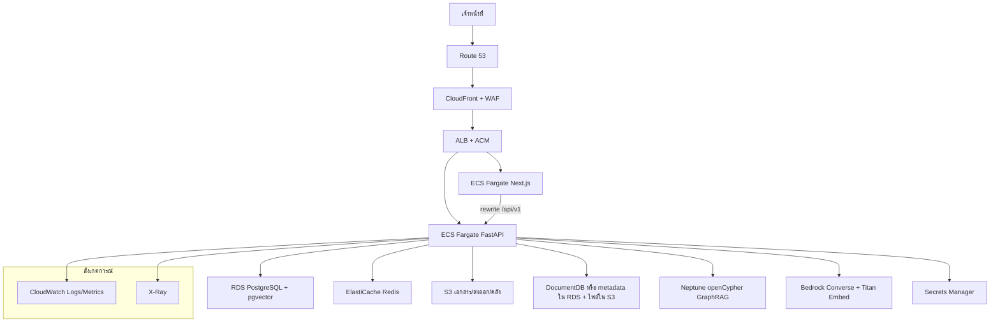

# 24 — AWS Cloud ล้วน (ไม่มี hybrid)

ชุดนี้เป็น **เส้นทาง production บน Amazon Web Services เท่านั้น**: แอป ข้อมูล คิว ไฟล์ กราฟ RAG และ LLM อยู่บน AWS  
**ไม่** รัน LM Studio / Ollama / SGLang / GPU ในเครื่อง และ **ไม่** ผสม on-prem กับคลาวด์

| เอกสาร | เนื้อหา |
|--------|---------|
| **24** (ไฟล์นี้) | เป้าหมาย สถาปัตยกรรม เฟสงาน หลักการ |
| [25-AWS_SERVICE_CATALOG.md](25-AWS_SERVICE_CATALOG.md) | จับคู่ทุกชิ้นใน Docker กับบริการ AWS + บริการเสริม |
| [26-AWS_INSTALL_AND_WIRING.md](26-AWS_INSTALL_AND_WIRING.md) | ติดตั้ง ตั้งค่า เชื่อมโยงทีละขั้น |
| [27-AWS_CODE_AND_CUTOVER.md](27-AWS_CODE_AND_CUTOVER.md) | โค้ดที่ต้องปรับ ย้ายข้อมูล ตัดระบบเก่า |
| โครงไฟล์ | `app/infra/aws/` (Terraform, IAM, ECS task, `.env` คลาวด์) |

[`20-AWS_BEDROCK_SETUP.md`](20-AWS_BEDROCK_SETUP.md) ยังใช้ได้เมื่อต้องการ **แค่ Bedrock** บน EC2+Compose — **ไม่ใช่** เป้าหมายของชุด 24–27

ติดตั้ง Docker ในเครื่องยังเป็นเส้นทาง dev ตาม [`14-INSTALLATION.md`](14-INSTALLATION.md)

---

## 1. เป้าหมาย

แอป TOR Generator (Next.js `:3000` + FastAPI `:4000` + PostgreSQL/pgvector + Redis + MinIO + Mongo GridFS + Neo4j + RAG/LLM) ต้องเปิดให้เจ้าหน้าที่ใช้ผ่าน HTTPS บนโดเมนหน่วยงาน โดย:

1. Compute เป็น **ECS Fargate** (ไม่มี EC2 ที่ต้องแพตช์ OS เอง ยกเว้น bastion ชั่วคราว)
2. ข้อมูลอยู่บริการจัดการของ AWS ไม่ใช่คอนเทนเนอร์ stateful ใน Compose
3. แชท/ร่าง/ฝังเวกเตอร์ใช้ **Amazon Bedrock** — คีย์ยาวอยู่ที่ **IAM task role** ไม่ใส่ access key ใน `.env` ของ task
4. ไฟล์ใช้ **S3** (MinIO SDK พูดกับ S3 ได้เมื่อตั้ง `MINIO_SECURE=true`)
5. ความลับอยู่ **Secrets Manager** + **KMS**
6. ขอบเขตเครือข่ายเป็น VPC ส่วนตัว + VPC endpoint — task ไม่มี public IP

โหมด `DEPLOYMENT_MODE=cloud` เป็นป้ายที่ Admin ใช้ ไม่ได้สลับโพรไวเดอร์เอง ต้องตั้ง `LLM_PROVIDER=bedrock` และ `EMBEDDING_PROVIDER=bedrock` คู่กัน

---

## 2. สถาปัตยกรรมเป้าหมาย

ทิศทางเครือข่าย: เบราว์เซอร์คุยแค่ CloudFront/ALB  
task ใน private subnet ออกอินเทอร์เน็ตผ่าน NAT เฉพาะเมื่อจำเป็น (เช่น Bedrock ถ้ายังไม่เปิด VPC endpoint)  
แนะนำเปิด **VPC endpoint** ของ `bedrock-runtime`, `s3`, `ecr`, `logs`, `secretsmanager`, `kms`, `monitoring`

---

## 3. หลักการที่ต้องยึด

| หลัก | ทำอย่างไร |
|------|-----------|
| ไม่มี hybrid | ไม่ชี้ `LM_STUDIO_BASE_URL` / `SGLANG_*` ใน task definition ของ production |
| ไม่เก็บคีย์ในอิมเมจ | IAM role ของ task; รหัส DB จาก Secrets Manager |
| อย่างน้อยสิทธิ์ | policy แยก execution role vs task role; Bedrock จำกัด ARN โมเดล |
| ข้อมูลใน AZ อย่างน้อย 2 | RDS Multi-AZ, ElastiCache failover, S3 ข้าม AZ โดยค่าเริ่มต้น |
| เข้ารหัส | KMS สำหรับ RDS, Redis AUTH+transit, S3 SSE-KMS, TLS ที่ ALB |
| ไทย/ราชการ | region หลัก **`ap-southeast-1`** (สิงคโปร์) — ตรวจว่าโมเดล Bedrock ที่เลือกมีใน region นี้ หรือใช้ inference profile |
| มิติเวกเตอร์ | ตอนนี้คอลัมน์ `kb_chunks.embedding` เป็น **vector(768)** และ Titan ถูกตัด/แพดในโค้ด — บนคลาวด์ควรย้ายเป็นมิติพื้นเมืองของ Titan (เช่น 1024) แล้ว seed ใหม่ ดูเอกสาร 27 |

---

## 4. เฟสงาน (ลำดับที่แนะนำ)

| เฟส | สิ่งที่ขึ้น | เกณฑ์ผ่าน |
|------|-------------|-----------|
| **A — บัญชีและเครือข่าย** | Organization (ถ้ามี), บัญชี prod, VPC, subnet, NAT, endpoint, Flow Logs | `aws sts get-caller-identity` จาก role ที่ถูกต้อง |
| **B — ข้อมูล** | KMS, S3, RDS+pgvector, ElastiCache, Secrets | `psql` จาก bastion/SSM และ `CREATE EXTENSION vector` |
| **C — AI** | Bedrock model access, VPC endpoint Bedrock, ทดสอบ Converse | แชททดสอบหนึ่งรอบจากเครื่อง jump / ECS Exec |
| **D — คอนเทนเนอร์** | ECR, อิมเมจ frontend/backend, ECS cluster, ALB, task role | `GET https://api.…/health` healthy ทั้ง postgres redis minio(S3) |
| **E — กราฟและต้นฉบับ** | Neptune **หรือ** ปิด GraphRAG ชั่วคราว; ย้าย GridFS → S3 | seed คลัง `seed_raw_docs` จาก task one-shot |
| **F — ขอบ** | Route 53, CloudFront, WAF, ACM, cookie Secure | ล็อกอิน HTTPS ได้ |
| **G — ปฏิบัติการ** | CloudWatch, Backup, GuardDuty, CloudTrail, แจ้งเตือนงบ Bedrock | สัญญาณเตือนเมื่อ 5xx / คิว LLM เต็ม |

อย่าข้ามไป D ก่อน B+C — task จะล้มตอน health check

---

## 5. สิ่งที่จงใจไม่ใช้ในเส้นนี้

- EC2+Docker Compose เป็น **production หลัก** (ยังเป็นทางลัดในเอกสาร 20)
- Qdrant บน ECS (ใช้ pgvector บน RDS)
- GPU / SageMaker endpoint สำหรับ Gemma (ใช้ Bedrock)
- Access key ระยะยาวของ IAM user ใน task (ใช้ task role)
- เปิดพอร์ต 5432/6379/27017/7687 สู่ internet

---

## 6. ประมาณการค่าใช้จ่าย (ลำดับความสำคัญ)

คิดเป็น **รายเดือนใน ap-southeast-1** แบบหยาบสำหรับหน่วยงานเล็ก (2 task backend + 2 frontend, RDS db.t3.medium Multi-AZ, cache.t3.small):

- ECS Fargate + ALB + NAT: หลักพันถึงสองพัน USD ถ้าทิ้ง NAT เปิดตลอด — ลดด้วย VPC endpoint
- RDS Multi-AZ: มักเป็นรายการใหญ่รองจาก Bedrock
- Bedrock: **ตามโทเคน** — ร่าง 13 หมวด+หัวข้อย่อยต่อโครงการแพงกว่าแชท KB; ตั้งงบเตือนที่ Billing + `LLM_MAX_CONCURRENT`
- Neptune และ DocumentDB แพงถ้าเปิดทั้งคู่ — ดูทางเลือกลดในเอกสาร 25

ใส่ AWS Budget + Cost Anomaly Detection ตั้งแต่เฟส A

---

## 7. ความเสี่ยงที่ต้องตัดสินใจก่อนลงมือ

1. **Neptune ไม่ใช่ Neo4j drop-in** — ไดรเวอร์ `neo4j://` ใช้กับ Aura/Neo4j; Neptune ใช้ `bolt`/openCypher คนละ endpoint และจำกัดบาง Cypher ต้องมีอะแดปเตอร์ (เอกสาร 27)
2. **DocumentDB ไม่รองรับ GridFS เต็ม** — ย้ายไฟล์ต้นฉบับไป S3 ปลอดภัยกว่า
3. **งานร่างในหน่วยความจำ** — อย่าทำ `desiredCount` ของ backend เป็นหลาย task จนกว่าคิวร่างจะอยู่ Redis/SQS (ตอนนี้คิวรับ LLM อยู่ Redis แต่ job ร่างบางส่วนยังในโปรเซส)
4. **Cookie JWT** — ต้อง `COOKIE_SECURE=true` + SameSite บนโดเมน HTTPS
5. **Seed คลัง** — PDF ต้นฉบับอยู่ `documents/sources`; บน AWS ใส่ S3 แล้วรัน task one-shot ไม่ bind-mount โฟลเดอร์ไทยจาก Windows
