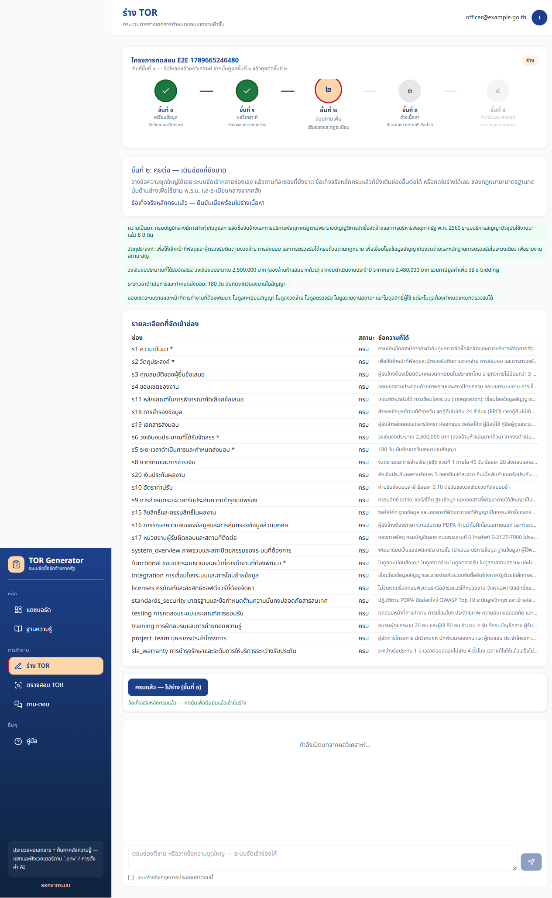
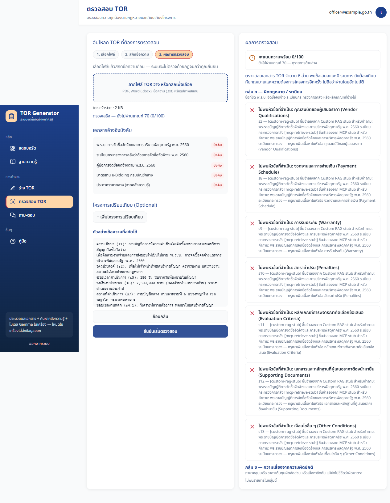

# รายงานตรวจสอบ Local LLM และแผนย้าย AWS — TOR Generator v0.2.4

เอกสารฉบับเดียว (Combined_Report) ตาม `.kiro/specs/local-llm-verification-aws-migration-plan/`  
ลำดับ: **(A) Verification** → **(B) Verification_Gate** → **(C) AWS Migration Plan** → **(D) Stability & Scale**

---

## (A) หลักฐานการตรวจสอบบน Local LLM — TOR Generator v0.2.4

### 0. ส่วนหัว

| ฟิลด์ | ค่า |
|-------|-----|
| วันที่ทดสอบ | 31 สิงหาคม 2026 |
| เวอร์ชันแอป | v0.2.4 |
| สแตก | Docker Compose โปรเจกต์ `tor-app` |
| Local LLM | LM Studio `http://127.0.0.1:1234/v1` (จาก backend ใช้ `host.docker.internal`) |
| ผู้จัดทำ | Verification_Author (รอบ Combined_Report 31 ส.ค. 2026) |

| โมเดล | ค่า |
|--------|-----|
| Chat / draft | `google/gemma-4-e4b` ผ่าน LM Studio |
| Embeddings | `text-embedding-embeddinggemma-300m` (768 มิติ) |
| `DEPLOYMENT_MODE` | `on_prem` |
| `LLM_PROVIDER` | `lm_studio` |
| `EMBEDDING_PROVIDER` | `local` |

ภาพถ่ายจากรอบเดิมและรอบนี้เก็บที่ `test-evidence/` อ้างอิงด้วย relative path ตาม `18-TEST_EVIDENCE.md`

---

### 1. ความพร้อมสภาพแวดล้อม (Req 1)

คำสั่ง:

```bash
docker compose -p tor-app up -d
docker compose -p tor-app ps
curl -m 10 http://localhost:4000/health
```

ผล `GET http://localhost:4000/health` (ตอบใน ~0.01 วินาที, HTTP 200):

```json
{"status":"healthy","services":{"postgres":"up","redis":"up","minio":"up","mongo":"up","neo4j":"up"}}
```

บริการหลักทั้งห้าพร้อม (ค่าใน JSON เป็น `up` ภายใต้ `status: healthy`)

LM Studio `:1234/v1/models` โหลด `google/gemma-4-e4b` และ `text-embedding-embeddinggemma-300m`

**ผลเฟสนี้: ผ่าน**

---

### 2. การ seed คลัง RAG (Req 2)

| คำสั่ง | วัตถุประสงค์ |
|--------|----------------|
| `python -m app.seed_raw_docs` | สร้างคลังกลาง RAG ที่แชทใช้จริง (รันจาก **host** เพราะ bind-mount ชื่อไฟล์ไทยใน container → Errno 5) |
| `python -m app.seed_db` | ข้อมูลเริ่มต้น (ผู้ใช้/โครงการ) |
| `python -m app.seed_kb` | สกัดงานวิจัยเท่านั้น — **ไม่ใช่** คลังแชท |

แหล่ง PDF: `documents/sources/` (คู่มือแนวปฏิบัติ + โฟลเดอร์ข้อมูลดิบ)

รอบนี้คัดลอก PDF ดิบไป `C:\Users\chira\AppData\Local\Temp\tor-raw-pdfs` แล้วรันผ่าน Docker network `tor-app_tor_network` (ไม่ใช้ `docker compose run` เพื่อไม่ให้ recreate DB):

```
ingest [mandatory_handbook] คู่มือแนวปฏิบัติ_การจัดซื้อจัดจ้างภาครัฐ.pdf  status=completed chunks=24
ingest [mandatory_raw] raw-000.pdf  status=completed chunks=64
seed_raw_docs complete (2 PDFs)  exit=0
```

`python -m app.seed_db` สำเร็จก่อนหน้านี้ — login `officer@example.go.th` ได้ token (HTTP 200)

กรณี Neo4j: กราฟ parse JSON ของ handbook ล้ม (attempt 1/2 และ 2/2) แต่ ingest เอกสารยัง `completed` — แชทยังตอบจาก vector chunks ได้

**ผลเฟสนี้: ผ่าน** (`mandatory_handbook ≥ 1`, `mandatory_raw ≥ 1`)

---

### 3. เวิร์กโฟลว์ร่าง TOR (Req 3)

เส้นทาง UI: `/projects/{id}/draft` ตาม [21-WORKFLOW_DRAFT_TOR.md](21-WORKFLOW_DRAFT_TOR.md)

| ขั้น | สิ่งที่ตรวจ | หลักฐานภาพ |
|------|-------------|------------|
| ๐ อัปโหลด/วาง + วิเคราะห์ | 27 ช่อง s1–s13 + s4.1–s4.14 |  |
| ๑ ตารางความครบ | 27/27 filled |  |
| ๒ เติมช่องผ่านแชท | fact-required ครบ, confirm-ready |  |
| ๓ ร่าง 13 หมวด | SSE `section_done` / `all_done` |  |
| ๔ ทบทวน + ส่งออก | คะแนน ≥ 70, DOCX+PDF |  |

ฮาร์เนสรอบนี้: `app/backend/tests/test_live_ect_tor_full.py` (ไม่รัน `ect-full.spec.ts` ตามกลยุทธ์ dedup เมื่อ pytest live ผ่าน)

โครงการ `c3bdba69-bd72-472a-88ad-cd4fbe95bdb5` (ECT AI Chatbot live 095414)

| ขั้น | ผลรอบ 31 ส.ค. 2026 |
|------|---------------------|
| ๐–๑ | analyze filled **27/27** empty=[] ; FACT_KEYS + s3/s8/s11/s4.14 ครบ |
| ๒ | fill-references 200 ; confirm-ready `ready_to_compose=true` |
| ๓ | ร่าง **13/13** หมวด (s4 ใช้ ~19 นาที) |
| ๔ | คะแนนโครงการ **95** `valid=true` findings=2 ; ส่งออก DOCX+PDF `status=completed` |

**อย่ารีบิลด์ backend ระหว่างงานร่าง** — คิวในคอนเทนเนอร์ที่รันยังเป็น in-memory; โค้ดเฟส 3 บนดิสก์ย้ายสถานะไป Redis (`draft:job:{project_id}`)

**ผลเฟสนี้: ผ่าน**

---

### 4. เวิร์กโฟลว์ตรวจสอบ TOR (Req 4)

ตาม [22-WORKFLOW_REVIEW_TOR.md](22-WORKFLOW_REVIEW_TOR.md)

| เส้นทาง | สิ่งที่บันทึก | ภาพ |
|---------|----------------|------|
| `/review` extract → confirm → run | สกัด ≤ 20,000 ตัวอักษร, คะแนน 0–100, ข้อค้นพบกฎ |   |
| เปรียบเทียบ 2–5 ฉบับ | Jaccard 0.0–1.0 (≥ 0.5 โทนผ่านบนจอ) | — |
| ขั้น ๔ ในโครงการ | ReviewAgent ≤ 20 ข้อ; fallback กฎเมื่อ JSON ล้ม |  |

ผลรอบนี้ (LM Studio จริง ไม่ mock):

| เคส | คะแนน | รายละเอียด |
|-----|--------|------------|
| `/review` ไฟล์ต้นทาง ECT pack | **82** | extract 3,787 ตัวอักษร, findings=8, status=completed |
| ขั้น ๔ ในโครงการ | **95** | `valid=true`, findings=2, suggestions=1, ReviewAgent ทำงาน |
| ตรวจ TOR ที่ประกอบแล้ว | **88** | standalone `/review/run` |
| เปรียบเทียบโครงการ vs ฉบับประกอบ | Jaccard **0.8812** | HTTP 200, ≥ 0.5 |

**ผลเฟสนี้: ผ่าน**

---

### 5. เวิร์กโฟลว์ถาม-ตอบ KB (Req 5)

ตาม [23-WORKFLOW_KB_QA.md](23-WORKFLOW_KB_QA.md)  
ฮาร์เนส Playwright: `app/frontend/e2e/chat.spec.ts`

| เคส | เกณฑ์ | ภาพ |
|-----|--------|------|
| `/chat` scope `both` | SSE จบ `done` + citation ≥ 1 |  |
| แนบ PDF/DOCX/TXT ≤ 20MB | category=other → «ใช้กับ RAG ได้» |  |
| ถาม scope `mine` | citation ระบุไฟล์ที่แนบ |  |
| CRUD `/knowledge-base` | อัปโหลด / ดาวน์โหลด `GET /api/v1/knowledge-base/mine/{id}/file` / ลบ |  |
| ACL | `mine` ของเจ้าของอื่นคืนค่าว่าง | API รอบนี้: officer userFiles=1, reviewer=0, overlap=0 |
| ปฏิเสธไฟล์ผิดชนิด/เกิน 20MB | ไม่ ingest | POST `.exe` → HTTP 400 `VALIDATION_ERROR` ไม่ ingest |

Playwright headed `e2e/chat.spec.ts` รอบนี้: **2 passed (3.0 นาที)** เทียบ Docker `:3000` + LM Studio

**ผลเฟสนี้: ผ่าน**

---

### 6. ชุดทดสอบอัตโนมัติ (Req 6)

| ชุด | คำสั่ง | หมายเหตุ live |
|-----|--------|----------------|
| pytest `not live_llm` | `pytest -m "not live_llm and not integration" --cov=app` | ไม่เรียก LM Studio |
| pytest `live_llm` | `pytest tests/test_live_ect_tor_full.py -m live_llm` | LM Studio `:1234` จริง ไม่ mock |
| Vitest | `npm run test:coverage` (จาก `app/frontend`) | — |
| Playwright | `E2E=1 npm run test:e2e:headed` เทียบ Docker `:3000` | ไม่ mock |
| SonarQube | `:9400` | รอบนี้พอร์ตไม่ตอบ → แถวสรุป **ข้าม** |

ชุดเฟส 3 ที่เพิ่มในรอบนี้ (ไม่ live): `tests/test_draft_job_store.py`, `tests/test_property_draft_stability.py`, `tests/test_draft_stability_load.py`

ผลรอบ 31 ส.ค. 2026:

| ชุด | ผล |
|-----|-----|
| pytest `not live_llm and not integration` | **1642 passed**, 3 skipped, 25 deselected, 2 warnings, 186.24s, **coverage 84%** (12745 stmts) |
| pytest `live_llm` (`test_live_ect_tor_full.py`) | **3 passed** in 2488.26s (0:41:28) เชื่อม LM Studio `:1234` จริง |
| Vitest | **209 passed** / 48 files, 88.67s, statements **80.5%**, lines **82.88%** |
| Playwright headed | **2 passed** (3.0m) `chat.spec.ts` |
| SonarQube `:9400` | ไม่ตอบ (curl exit 7) → **ข้าม** |

ล็อก: `test-evidence/_pytest-coverage.txt`, `_pytest-live-llm.txt`, `_vitest-coverage.txt`, `_playwright-headed.txt`

---

### 7. ตารางสรุปผลรวม (แหล่งความจริงของเกต)

| รายการ | สถานะ | จำนวนที่ผ่าน | Coverage | หมายเหตุ |
|--------|--------|--------------|----------|----------|
| ความพร้อมสภาพแวดล้อม (Health 5 บริการ) | ผ่าน | 5/5 | — | `/health` healthy; บริการ `up`; `DEPLOYMENT_MODE=on_prem`; `LLM_PROVIDER=lm_studio` |
| RAG_Seed | ผ่าน | 2/2 PDF | chunks 24+64 | `mandatory_handbook` + `mandatory_raw`; `seed_raw_docs` exit 0; `seed_db` login ได้ |
| เวิร์กโฟลว์ร่าง TOR | ผ่าน | 5/5 ขั้น | — | 27/27 ช่อง, ร่าง 13/13, คะแนน 95, export completed; โครงการ `c3bdba69-bd72-472a-88ad-cd4fbe95bdb5` |
| เวิร์กโฟลว์ตรวจสอบ TOR | ผ่าน | 4/4 เคส | — | ต้นทาง 82; ในโครงการ 95 `valid=true`; TOR ประกอบ 88; Jaccard 0.8812 |
| เวิร์กโฟลว์ถาม-ตอบ KB | ผ่าน | 2/2 Playwright + ACL | — | `chat.spec.ts` headed; ACL overlap=0; ปฏิเสธ `.exe` HTTP 400 |
| pytest not live_llm | ผ่าน | 1642 passed, 3 skipped | 84% | `htmlcov`; 25 deselected (live/integration) |
| pytest live_llm | ผ่าน | 3 passed | — | `test_live_ect_tor_full.py` 41m28s ต่อ LM Studio `:1234` |
| Vitest | ผ่าน | 209 passed / 48 files | 80.5% stmts | `npm`-less รันด้วย Cursor `node.exe` + `vitest.mjs` |
| Playwright E2E | ผ่าน | 2 passed | — | headed, Docker `:3000`; ภาพ `13a`/`13`/`13b`/`13c` เวลา 16:54–16:57 |
| SonarQube | ข้าม | — | — | ไม่มี process ที่ `:9400` ในรอบนี้ (curl ไม่เชื่อมได้) |

นิยามเกต: แถวสถานะ **ข้าม** ไม่ใช่ *ไม่ผ่าน / รอผล / ยังไม่ตรวจ* — ตาม Req 8.3 เกตเปิดได้เมื่อไม่มีแถวที่เป็นสามสถานะนั้น แถวที่ข้ามต้องมีหมายเหตุ (Req 7.4) ซึ่งตารางนี้มีครบ

---

### 8. Coverage

| แหล่ง | ตำแหน่ง | รอบนี้ |
|--------|---------|--------|
| backend htmlcov | `app/backend/htmlcov` | **มี** — TOTAL 84% (python 3.11.16) |
| frontend coverage | `app/frontend/coverage` | **มี** — statements 80.5% / lines 82.88% |
| ภาพรอบก่อน |   | baseline จากเอกสาร 18 |

---

### 9. SonarQube

`http://localhost:9400` ไม่ตอบในรอบ 31 ส.ค. 2026 → **ข้าม** (ไม่มี stack)

---

### 10. คำสั่งที่รันในรอบนี้

```bash
docker compose -p tor-app up -d
docker compose -p tor-app ps
curl -m 10 http://localhost:4000/health
curl -m 5 http://127.0.0.1:1234/v1/models
# seed_db via compose exec; seed_raw_docs via docker run --network tor-app_tor_network (handbook + raw-000.pdf)
docker run --rm -u root -e PATH=/opt/venv/bin:... -v <repo>:/repo -w /repo/app/backend tor-app-backend:latest \
  python -m pytest tests -q --cov=app --cov-report=html -m "not live_llm and not integration"
docker run --rm -u root --network container:tor-app-backend-1 -e PATH=/opt/venv/bin:... \
  -v <backend>:/app -w /app tor-app-backend:latest \
  python -m pytest tests/test_live_ect_tor_full.py -m live_llm -v -s
# Vitest: Cursor node.exe + node_modules/vitest/vitest.mjs run --coverage
# Playwright: E2E=1 HEADED=1 node .../@playwright/test/cli.js test e2e/chat.spec.ts --headed
```

### 11. ผลรวมส่วน (A)

ตาราง §7 ไม่มีแถว *ไม่ผ่าน / รอผล / ยังไม่ตรวจ* (มี ผ่าน 9 แถว และ ข้าม 1 แถวพร้อมหมายเหตุ SonarQube)  
ผลรวมส่วนตรวจสอบบน Local LLM รอบนี้: **ผ่านครบตามนิยามเกต**

---

## (B) Verification_Gate

> **สถานะเกต:** เปิด
>
> **นิยาม "ผ่านครบ":** ไม่มีรายการใดในตารางสรุปส่วน (A) §7 ที่มีสถานะ *ไม่ผ่าน*, *รอผล* หรือ *ยังไม่ตรวจ*
>
> **เงื่อนไขเปิดเกต:** อ้างอิงไฟล์ `Discussions/28-VERIFICATION-AND-MIGRATION.md` วันที่ 31 สิงหาคม 2026 — ตาราง §7 มีผ่าน 9 แถว และข้าม 1 แถว (SonarQube ไม่มี stack `:9400`)
>
> **ขอบเขตเกต:** กั้นทั้งส่วน (C) Migration Plan และงานแก้โค้ดเฟส 3 (Req 11–13)
>
> **หากไม่มี/เข้าไม่ถึงส่วน (A):** ถือว่าเกตยังไม่เปิด สถานะ = ถูกบล็อก

---

## (C) แผนย้ายขึ้น AWS

เนื้อหานี้เป็นแนวทางเท่านั้น **ไม่มี code diff และไม่มีคำสั่ง provision/deploy ทรัพยากร AWS จริง**  
โหมดเป้าหมายคือ **AWS Cloud ล้วน** (`DEPLOYMENT_MODE=cloud`) **ไม่มี hybrid LLM** — คลัง RAG มีได้สองแหล่งข้อมูล (กลาง + ของฉัน/Custom RAG) ดู [29-TBD-AWS-CLOUD-ONLY.md](29-TBD-AWS-CLOUD-ONLY.md)  
รายละเอียดเต็มให้อ่านเอกสารอ้างอิง ไม่ทำซ้ำ

### 1. เอกสารอ้างอิง

- [20-AWS_BEDROCK_SETUP.md](20-AWS_BEDROCK_SETUP.md)
- [24-AWS_CLOUD_OVERVIEW.md](24-AWS_CLOUD_OVERVIEW.md)
- [25-AWS_SERVICE_CATALOG.md](25-AWS_SERVICE_CATALOG.md)
- [26-AWS_INSTALL_AND_WIRING.md](26-AWS_INSTALL_AND_WIRING.md)
- [27-AWS_CODE_AND_CUTOVER.md](27-AWS_CODE_AND_CUTOVER.md)
- [29-TBD-AWS-CLOUD-ONLY.md](29-TBD-AWS-CLOUD-ONLY.md)
- [30-DEV-ASSIGNMENT-MCP-AND-AWS.md](30-DEV-ASSIGNMENT-MCP-AND-AWS.md)
- [`app/infra/aws/env.cloud.example`](../app/infra/aws/env.cloud.example)

### 2. การจับคู่บริการ (อ้างอิงเอกสาร 25)

| สแตกปัจจุบัน | บริการ AWS เป้าหมาย | โน้ต |
|--------------|----------------------|------|
| Next.js + FastAPI | ECS Fargate + ECR | IAM task role — ดู 24 §1, 25 §1 |
| Postgres + pgvector | RDS PostgreSQL 16 หรือ Aurora | `CREATE EXTENSION vector;` — 25 §1 |
| Redis | ElastiCache | `rediss://` + AUTH — 25 §1 |
| MinIO | S3 | `MINIO_SECURE=true`, `MINIO_USE_IAM=true` — 25 §1 |
| MongoDB GridFS | S3 (แนะนำ) หรือ DocumentDB | GridFS ไม่ใช่เส้นทาง AWS — 25 §3, 27 §3.5 |
| Neo4j GraphRAG | Neptune openCypher หรือ `GRAPH_PROVIDER=off` | ต้องอะแดปเตอร์ — 25 §4, 27 §3.6 |
| LM Studio / SGLang | Amazon Bedrock | `LLM_PROVIDER=bedrock` — 25 §1 |
| EmbeddingGemma 768-d | Bedrock Titan Embeddings | **ต้อง re-seed** — 25 §1, 27 §3.4 |
| ความลับ / เครือข่าย | Secrets Manager / VPC · ALB · CloudFront · WAF | ดู 26 |

### 3. ตัวแปรสภาพแวดล้อมโหมดคลาวด์ (อ้างอิง `env.cloud.example`)

| ตัวแปร | ค่าโหมดคลาวด์ | หมายเหตุ |
|--------|----------------|----------|
| `DEPLOYMENT_MODE` | `cloud` | |
| `LLM_PROVIDER` | `bedrock` | ห้าม `lm_studio` / `ollama` / `llama_cpp` / `sglang` ใน prod |
| `EMBEDDING_PROVIDER` | `bedrock` | **ห้าม** `local` ใน production |
| `VECTOR_STORE_PROVIDER` | `pgvector` | |
| `AWS_ACCESS_KEY_ID` / `AWS_SECRET_ACCESS_KEY` | *(ว่าง)* | ใช้ IAM task role ของ ECS |
| `BEDROCK_REGION` | `ap-southeast-1` | |
| `BEDROCK_MODEL_ID` | `anthropic.claude-3-5-sonnet-20241022-v2:0` | |
| `BEDROCK_EMBEDDING_MODEL_ID` | `amazon.titan-embed-text-v2:0` | |
| `REDIS_TLS` / `MINIO_SECURE` / `MINIO_USE_IAM` / `COOKIE_SECURE` | `true` | |

ค่าเต็มดู [`app/infra/aws/env.cloud.example`](../app/infra/aws/env.cloud.example) — ไม่คัดลอกความลับลงเอกสารนี้

### 4. ลำดับตัดระบบ (Cutover) — อ้างอิงเอกสาร 27 ตอน 5

แต่ละขั้นมี การกระทำ / ผู้รับผิดชอบ / เงื่อนไขก่อนเริ่ม / เกณฑ์ตรวจสอบ

| # | การกระทำ | ผู้รับผิดชอบ | เงื่อนไขก่อนเริ่ม | เกณฑ์ตรวจสอบสำเร็จ |
|---|----------|-------------|-------------------|---------------------|
| 1 | ตั้ง VPC + RDS + ElastiCache + S3 + เปิดใช้ Bedrock | Cloud Eng | เกตส่วน (B) เปิด | ทรัพยากรพร้อม, VPC endpoints ตอบสนอง |
| 2 | ย้าย schema + รัน `seed_db` | Backend Eng | ขั้น 1 สำเร็จ | migration สำเร็จ, ข้อมูลเริ่มต้นครบ |
| 3 | seed คลังด้วย Titan (re-seed embeddings + ปรับมิติ vector) | Backend Eng | ขั้น 2 สำเร็จ | เอกสารพร้อมค้น `mandatory_handbook` ≥ 1 และ `mandatory_raw` ≥ 1 |
| 4 | ชี้ DNS ไป UAT สำหรับกลุ่มเล็ก | Ops | ขั้น 3 สำเร็จ | เข้าถึง UAT ได้ |
| 5 | ตรวจสอบบน Bedrock (analyze 27 ช่อง + review ไฟล์ + ร่าง 1 หมวด) | Verification_Author | ขั้น 4 สำเร็จ | สามรายการผ่านบน Bedrock |
| 6 | ปลด Compose dev ออกจากเครือข่ายองค์กร | Ops | ขั้น 5 ผ่าน | ไม่มีทราฟฟิกไป dev เดิม |

ถ้าขั้นใดไม่ผ่านเกณฑ์ตรวจสอบ → ทำตามแผนย้อนกลับ §5 เพื่อคืนสู่สถานะเป้าหมาย

### 5. แผนย้อนกลับ (Rollback) — ลำดับแยกจาก cutover

- **Rollback trigger:** ขั้น cutover ใดไม่ผ่านเกณฑ์ตรวจสอบ (โดยเฉพาะขั้น 5)
- **สถานะเป้าหมายหลังย้อนกลับ:** สแตก on-prem `tor-app` + Local LLM ให้บริการได้ตามปกติ, DNS ชี้กลับ on-prem

| # | ขั้นย้อนกลับ | รายละเอียด |
|---|--------------|-------------|
| 1 | ชี้ DNS กลับ on-prem | ยกเลิกการชี้ UAT |
| 2 | ปิดการรับทราฟฟิกที่ ECS (`desiredCount=0`) | หยุดฝั่งคลาวด์ |
| 3 | ยืนยัน on-prem `/health` = healthy ทั้ง 5 บริการ | คืนสถานะเป้าหมาย |
| 4 | บันทึกสาเหตุและเก็บ artifact คลาวด์ไว้วิเคราะห์ | ไม่ลบทันที |

### 6. ทะเบียนความเสี่ยง

| # | ความเสี่ยง | ผลกระทบ | แนวทางบรรเทา + ผู้รับผิดชอบ |
|---|-----------|---------|------------------------------|
| 1 | มิติเวกเตอร์ Titan ต่างจาก EmbeddingGemma (768); Titan v2 มัก 1024 | RAG ผิดเพี้ยนถ้าปนเวกเตอร์ | Alembic ปรับคอลัมน์ `vector(...)` + ตั้ง `EMBEDDING_DIMENSIONS` + **seed ใหม่ทั้งคลัง** — Backend Eng (27 §3.4) |
| 2 | คิวร่างเคยอยู่ในหน่วยความจำ (`_DRAFT_JOBS`) | อินสแตนซ์อื่นไม่เห็นสถานะร่าง | **หลังเฟส 3:** ใช้ `Draft_Job_Store` Redis (`draft:job:{project_id}`) จึงปลดล็อกข้อจำกัด `desiredCount=1` ได้ — ระหว่างตัดระบบถ้ายังไม่ deploy โค้ดเฟส 3 ให้จำกัด backend `desiredCount=1` — Backend Eng (27 §3.3) |
| 3 | Neo4j → Neptune (Cypher ไม่ครบ, ต้องอะแดปเตอร์) | ถาม-ตอบขาด graph expansion | ขึ้น pgvector ก่อน + `GRAPH_PROVIDER=off` แล้วเปิด Neptune เมื่ออะแดปเตอร์พร้อม — Cloud Eng (25 §4, 27 §3.6) |

---

## (D) สรุปงานความเสถียรและสเกล (เฟส 3)

### D.1 Draft_Job_Store (Req 11)

โมดูลใหม่ [`app/backend/app/draft_job_store.py`](../app/backend/app/draft_job_store.py)

- คีย์ Redis `draft:job:{project_id}` ฟิลด์ `status` / `drafted_count` / `total` / `updated_at`
- TTL 600 วินาทีทุกครั้งที่เขียน; `running` ที่ `updated_at` เก่ากว่า 600s รายงานเป็น `failed` (คง `drafted_count`)
- Fail-open เมื่อ Redis ไม่พร้อม — เขียน/อ่าน in-memory ต่อได้ (mirror `llm_admission`)
- ผูกกับ `draft-chat/start` และ `draft-chat/status` ใน [`draft_chat.py`](../app/backend/app/api/v1/endpoints/draft_chat.py)
- สัญญา SSE คงเดิม: `progress`, `section_done`, `subsection_done`, `all_done`

### D.2 Submit validation (Req 12)

[`projects.py`](../app/backend/app/api/v1/endpoints/projects.py) — `missing_submit_sections` + `submit_project`

- ตรวจ `isSectionFilled` เทียบเท่าฝั่งเซิร์ฟเวอร์: s1–s13 ต้องมี content/ai_draft; s4 ครบเมื่อมีเนื้อหาหลักหรือหัวข้อย่อย s4.1–s4.14 อย่างน้อยหนึ่ง
- ไม่ครบ → HTTP 400 + `details.missing` เป็นรายการ `section_key` / `sub_key`; ไม่เปลี่ยนสถานะ; ไม่บันทึก audit submit
- คงเกตสถานะเดิมของ `officer_can_submit` (draft / rejected / archived หลังเฟส 4)

### D.3 ความเสถียรงานใหญ่ (Req 13)

- ร่างต่อใน background แม้ SSE หลุด (พฤติกรรมเดิม) + บันทึก Redis ทุกหมวดที่เสร็จ
- reconnect: ส่งหมวดที่เสร็จแล้วจากดิสก์/สโตร์ แล้วตามงานเดิม (idempotent start ถ้า `queued`/`running`)
- timeout ต่อหมวด 1800 วินาที → ข้ามหมวดนั้นแล้วทำหมวดถัดไป
- ทดสอบโหลดใน `tests/test_draft_stability_load.py`: paste 500,000 อักขระ, pack จำกัด 200,000, งาน store 3 โครงการพร้อมกันถึง `done`
- รอบนี้รวมใน pytest 1642 passed (รวม property P8–P11 ใน `test_property_draft_stability.py` และ unit `test_draft_job_store.py`)

### D.4 ผลกระทบต่อความเสี่ยง AWS

Risk #2 ในส่วน (C): หลัง deploy โค้ดเฟส 3 เข้าอิมเมจ backend แล้ว **ปลดล็อก** `desiredCount=1` ได้ เพราะสถานะงานร่างอยู่ที่ Redis ไม่ติดโปรเซสเดียว

รอบ live ECT นี้รันบนอิมเมจเดิมโดยไม่ rebuild (ตามกฎห้ามรีสตาร์ทระหว่างร่าง) — โค้ด `draft_job_store.py` พร้อมบนดิสก์และผ่าน pytest แล้ว ต้อง build/deploy แยกก่อนใช้ Redis store ในสภาพแวดล้อมจริง

### D.5 Re-smoke ที่เกี่ยวข้องกับส่วน (A)

| เคส | ผลที่คาด | ผลรอบนี้ | ไฟล์ทดสอบ |
|-----|----------|----------|------------|
| submit ไม่ครบ | 400 + missing, สถานะคงเดิม | ผ่านในชุด unit | `test_submit_incomplete_sections_is_rejected` |
| `draft-chat/status` อ่าน store | ฟิลด์ `job_status` เมื่อมีระเบียน | ผ่าน unit + Property 8 | `test_draft_job_store.py` + property 8 |
| 3 งานพร้อมกัน | ทั้งสาม `done` 13/13 | ผ่าน | `test_three_concurrent_draft_jobs_reach_done` |
| paste 500k / pack 200k | รับได้ / ตัดที่ลิมิต | ผ่าน | `test_paste_accepts_500k_characters`, `test_review_pack_capped_at_200k` |

---

## ภาคผนวก — เช็กลิสต์ตรวจรับเอกสาร (P1–P7)

- [x] Combined_Report มีครบ A → B → C → D
- [x] ตารางสรุป 10 แถว ไม่มีเซลล์สถานะว่าง
- [x] เกต (B) สอดคล้องตาราง (A) §7 (ไม่มี ไม่ผ่าน/รอผล/ยังไม่ตรวจ)
- [x] ส่วน (C) ไม่มี code diff / คำสั่ง provision จริง
- [x] ส่วน (C) อ้างอิง 20/24–27 + `env.cloud.example`
- [x] ไม่แนะนำ `EMBEDDING_PROVIDER=local` ใน prod
- [x] ลิงก์ภาพชี้ไฟล์ที่มีใน `test-evidence/`
- [x] rollback นับจาก 1 แยกจาก cutover
- [x] ส่วนที่ยังไม่มีผล (SonarQube) ใช้สถานะ **ข้าม** + หมายเหตุ (ไม่ละเว้นหัวข้อ)
