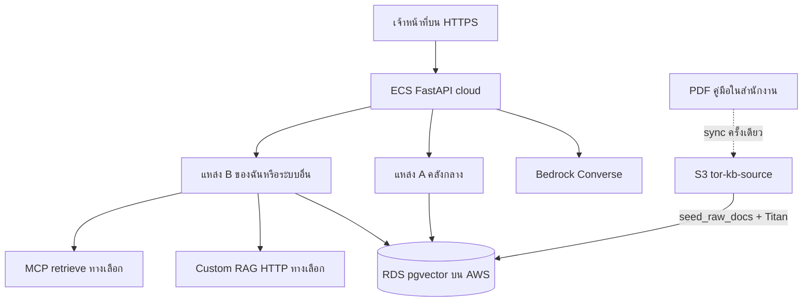

# 29 — TBD: AWS Cloud ล้วน (ไม่มี hybrid) + RAG สองแหล่ง

**TBD** = To Be Determined / งานที่ยังไม่ปิดใน production บน Amazon (ยังต้องกำหนดเจ้าของ บัญชี หรือรอบ deploy)  
**สถานะรันไทม์เป้าหมาย:** `DEPLOYMENT_MODE=cloud` — แอป แชท ร่าง ฝังเวกเตอร์ และฐานข้อมูลหลักอยู่บน AWS เท่านั้น

เอกสารนี้ไม่แทนชุดติดตั้ง [24](24-AWS_CLOUD_OVERVIEW.md)–[27](27-AWS_CODE_AND_CUTOVER.md) และไม่ใช่รายงานตรวจ Local LLM ([28](28-VERIFICATION-AND-MIGRATION.md))  
ใช้เมื่อต้องการคำตอบสั้น ๆ: **production ไม่ใช่ hybrid** แต่ **คลังความรู้มีได้สองแหล่ง**

เกตจากเอกสาร 28 **เปิดแล้ว** (รอบ 31 ส.ค. 2026) — อนุญาตให้วางแผนคลาวด์ต่อได้ แต่ **ยังไม่ provision/deploy จริง** จากเอกสารชุดนี้

มอบหมายทีมและสปรินต์: [30](30-DEV-ASSIGNMENT-MCP-AND-AWS.md)

---

## 1. สิ่งที่ล็อกแล้ว (ไม่ใช่ TBD)

| หัวข้อ | ค่า production | ห้ามใน task ECS |
|--------|----------------|-----------------|
| โหมด | `DEPLOYMENT_MODE=cloud` | `hybrid` |
| แชท / ร่าง / รีวิว | `LLM_PROVIDER=bedrock` | `lm_studio` / `ollama` / `llama_cpp` / `sglang` |
| ฝังเวกเตอร์ | `EMBEDDING_PROVIDER=bedrock` | `local` (EmbeddingGemma ในเครื่อง) |
| คีย์ AWS | ว่าง — ใช้ IAM task role | `AWS_ACCESS_KEY_ID` ระยะยาวใน `.env` ของ task |
| Region | `ap-southeast-1` | — |

Dev ในสำนักงานยังใช้ Docker + LM Studio ได้ (`on_prem`) — นั่นคือ**เครื่องพัฒนา** ไม่ใช่โหมด hybrid ของ production

เอกสารสถาปัตยกรรม hybrid เก่า: [12-HYBRID_ONPREM_CLOUD_LLM_ARCHITECTURE.md](12-HYBRID_ONPREM_CLOUD_LLM_ARCHITECTURE.md) — **อย่าใช้เป็นคู่มือขึ้น AWS ของหน่วยงาน**

---

## 2. ข้อยกเว้นเดียว: ข้อมูล / RAG สองแหล่ง (ไม่ใช่ hybrid LLM)

**Hybrid LLM** = task เดียวเรียกโมเดลคนละที่ (เช่น แชท Bedrock + embeddings LM Studio ในสำนักงาน) → **ห้ามใน production**

**RAG สองแหล่ง** = คำถามหนึ่งข้อดึงชิ้นข้อความจากคลังคนละชุดได้ โดยที่ **โมเดลที่ตอบยังเป็น Bedrock บน AWS**



### 2.1 แหล่ง A — คลังกลาง (กฎหมาย / คู่มือ)

| ช่วง | ที่อยู่ไฟล์ต้นฉบับ | ที่ค้นตอนรัน |
|------|---------------------|----------------|
| พัฒนา | `documents/sources/` บนโฮสต์ | pgvector ใน Compose |
| ตัดระบบ | สำเนาขึ้น S3 `tor-kb-source` (สคริปต์ `pull-kb-from-s3.sh`) | RDS pgvector ฝังด้วย Titan |
| หลังตัดระบบ | **ไม่** bind-mount โฟลเดอร์ไทยจาก Windows เข้า Fargate | RDS (+ กราฟ Neptune หรือปิด `GRAPH_PROVIDER=off`) |

กลุ่มบังคับในโค้ด: `mandatory_handbook`, `mandatory_raw` (`app/domain/corpus.py`)  
ขอบเขตค้นบนจอ: `global` หรือครึ่งหนึ่งของ `both`

### 2.2 แหล่ง B — เอกสารของฉัน / คลังเสริม

| ชนิด | พฤติกรรมที่มีแล้ว | บน AWS |
|------|-------------------|--------|
| คลังส่วนตัว | `search_scope=mine`, `POST /knowledge-base/mine`, แนบจาก `/chat` | ไบต์ใน S3 + ชิ้นใน RDS คนละ `owner_id` |
| คลังกลางเพิ่มโดยแอดมิน | `POST /knowledge-base/upload` | เช่นเดียวกับแหล่ง A หลัง ingest |
| ระบบ RAG อื่นของหน่วยงาน | `CUSTOM_RAG_*` → `CustomRagClient` (`POST {base}/v1/retrieve`) | **TBD ผูก ACL + ไม่ปนเวกเตอร์คนละมิติ** |
| MCP `retrieve` | `MCP_RAG_*` → `mcp_rag.py` (ค่าเริ่มต้นปิด) | **TBD เปิดบน UAT ใน VPC** |

ขอบเขตบนจอ: `mine` หรือครึ่งหนึ่งของ `both` (ค่าเริ่มต้น)

การมีไฟล์ต้นทางสองที่ (ดิสก์สำนักงาน + S3) **ระหว่างตัดระบบ** ถือว่าเป็นสำเนาข้อมูล ไม่ใช่ `DEPLOYMENT_MODE=hybrid`

### 2.3 สิ่งที่ยังไม่ทำ (TBD ของแหล่งคู่)

- รวมผล Custom RAG กับ pgvector แล้วจัดอันดับซ้ำอย่างเป็นทางการ (ตอนนี้เป็น retrieve เสริม)
- Bedrock Knowledge Bases เป็นคลังที่สามในคอนโซล AWS — **ยังไม่แทน** `seed_raw_docs` (ดูเอกสาร 25 §6)
- ดัชนีเวกเตอร์สองชุดคนละมิติ (768 Gemma + 1024 Titan) ในตารางเดียว — **ห้าม**; ต้อง seed ใหม่ทั้งคลังด้วย Titan
- Task production ยิงกลับไป LM Studio ในสำนักงานเพื่อฝังหรือแชท

---

## 3. รายการ TBD (งานค้างก่อน/หลังขึ้นคลาวด์)

คอลัมน์สถานะ: **ค้าง** = ยังไม่มีใน production AWS · **โค้ดพร้อม** = มีในรีโป ยังต้อง deploy · **เอกสารพร้อม** = มีคู่มือ ยังไม่ provision · **โครงพร้อม** = YAML/config ในรีโป ยังไม่ชี้บัญชีจริง

| # | รายการ | สถานะ | อ้างอิง |
|---|--------|--------|---------|
| T1 | Provision VPC, RDS, ElastiCache, S3, ECS, Bedrock | ค้าง — ห้ามทำจากเอกสารนี้ | 26 |
| T2 | ตั้ง task env ตาม `env.cloud.example` (ไม่มี hybrid) | เอกสารพร้อม | 24 §3, ไฟล์นี้ §1 |
| T3 | Deploy `Draft_Job_Store` Redis แล้วค่อย `desiredCount>1` | โค้ดพร้อม | 28 (D), 27 §3.3 |
| T4 | ย้ายมิติเวกเตอร์ Titan (เช่น 1024) + seed คลังใหม่ | ค้าง | 27 §3.4 |
| T5 | ต้นฉบับ GridFS → S3 | ค้าง | 27 §3.5 |
| T6 | อะแดปเตอร์ Neo4j → Neptune หรือ `GRAPH_PROVIDER=off` | ค้าง | 27 §3.6 |
| T7 | Seed จาก S3 (`s3_kb_sync` + `KB_SOURCES_ROOT`) | เอกสารพร้อม / รันบน AWS ยังไม่ทำ | 27 §3.7 |
| T8 | `COOKIE_SECURE` + CORS โดเมนจริง | ค้างจนกว่ามี HTTPS | 27 §3.1 |
| T9 | ซ่อน/ล็อกตัวเลือก Hybrid ในหน้า Admin AI บน prod | ค้าง | 27 §1 |
| T10 | ผูก Custom RAG + ACL เมื่อหน่วยงานมีคลัง HTTP เดิม | ค้าง (มีไคลเอนต์) | ไฟล์นี้ §2.2 |
| T11 | Cognito แทน JWT ของแอป | ค้าง เฟสหลัง | 27 §3.9 |
| T12 | ฮาร์เนส ECT อ่าน `API_BASE` จาก env บน UAT Bedrock | ค้าง | 27 §6 |
| T13 | ตรวจซ้ำบน Bedrock (วิเคราะห์ 27 ช่อง + รีวิว + ร่าง 1 หมวด) | ค้าง หลัง T1 | 28 (C) ขั้น 5 |
| T14 | ต่อยอดคลังอื่นผ่าน MCP `retrieve` (โครงในรีโปแล้ว ค่าเริ่มต้นปิด) | โครงพร้อม / เปิดบน UAT ยังไม่ทำ | [30](30-DEV-ASSIGNMENT-MCP-AND-AWS.md) |

อย่าทำ T1 จนกว่าเกตในเอกสาร 28 ยังเปิด — รอบ 31 ส.ค. 2026 เกตเปิดแล้ว

---

## 4. ค่าสภาพแวดล้อมที่เกี่ยวกับ RAG สองแหล่ง

ชุดบังคับคลาวด์ (คัดลอกจาก `app/infra/aws/env.cloud.example` ไม่ใส่ความลับใน Git):

```env
DEPLOYMENT_MODE=cloud
LLM_PROVIDER=bedrock
EMBEDDING_PROVIDER=bedrock
VECTOR_STORE_PROVIDER=pgvector
```

ทางเลือกแหล่ง B แบบ HTTP (ไม่เปลี่ยนโหมดเป็น hybrid):

```env
CUSTOM_RAG_ENABLED=true
CUSTOM_RAG_BASE_URL=https://rag.example.go.th
CUSTOM_RAG_API_KEY=          # จาก Secrets Manager
CUSTOM_RAG_TOP_K=24
```

ถ้าไม่ใช้ระบบ RAG ภายนอก ให้ `CUSTOM_RAG_ENABLED=false` — แหล่ง A+B ยังครบด้วย pgvector (`both` / `global` / `mine`)

บน ECS อย่าพึ่ง `MCP_RAG_CONFIG_PATH` ชี้ไฟล์ในอิมเมจ — build context ของ backend คือ `app/backend` จึง**ไม่มี** `app/infra/mcp` ใน image ให้ใช้ `MCP_RAG_SERVERS_JSON` (ตัวอย่าง `app/infra/mcp/servers.example.json`)

---

## 5. ความสัมพันธ์กับเอกสารอื่น

| เอกสาร | ใช้เมื่อ |
|--------|----------|
| [24](24-AWS_CLOUD_OVERVIEW.md)–[27](27-AWS_CODE_AND_CUTOVER.md) | สถาปัตยกรรม แคตตาล็อก ติดตั้ง ช่องว่างโค้ด |
| [28](28-VERIFICATION-AND-MIGRATION.md) | หลักฐาน Local LLM + เกต + สรุปเสถียรภาพ |
| [20](20-AWS_BEDROCK_SETUP.md) | ทางลัด EC2+Compose+Bedrock **ไม่ใช่** ECS/RDS ล้วน |
| [23](23-WORKFLOW_KB_QA.md) | พฤติกรรม `both` / `global` / `mine` บน UI |
| [12](12-HYBRID_ONPREM_CLOUD_LLM_ARCHITECTURE.md) | ประวัติออกแบบสามโหมด — ไม่ใช่รันบุ๊ก prod AWS |
| [30](30-DEV-ASSIGNMENT-MCP-AND-AWS.md) | สปรินต์ MCP + YAML ที่มอบทีม DEV |
| `app/infra/aws/env.cloud.example` | ค่า env ตั้งต้นของ task |

---

## 6. สรุปหนึ่งย่อหน้าสำหรับผู้ตัดสินใจ

Production ของระบบนี้บนหน่วยงานให้รัน **บน AWS Cloud ล้วน**: แชทและ embeddings เป็น Bedrock ไม่ผสมโมเดลในเครื่อง  
คลังความรู้**อนุญาตสองแหล่งข้อมูล** — คลังกลาง (คู่มือ/กฎหมายที่ sync จากสำนักงานขึ้น S3 แล้วฝังบน RDS) และคลังของผู้ใช้หรือระบบ RAG อื่น — โดยยังตอบด้วยโมเดลคลาวด์ชุดเดียว  
งานที่เหลือเป็นรายการ TBD ในตาราง §3 ไม่ใช่การเปิด `DEPLOYMENT_MODE=hybrid`

---

## 7. รีวิวความพร้อมของโครงในรีโป (v0.2.7)

รีวิวไฟล์จริงใน `app/infra/` และ `.github/workflows/` สำหรับทีม DEV — **พร้อมต่อยอด** ไม่ใช่พร้อม `terraform apply` ในบัญชีหน่วยงาน

| ชุด | ไฟล์ | สถานะโครง | หมายเหตุให้ทีม |
|-----|------|-----------|----------------|
| นโยบาย | เอกสารนี้ + [30](30-DEV-ASSIGNMENT-MCP-AND-AWS.md) | พร้อมอ่าน | Cloud ล้วน; MCP ไม่ใช่ hybrid LLM |
| ติดตั้ง AWS | [26](26-AWS_INSTALL_AND_WIRING.md), Terraform `app/infra/aws/terraform/` | เอกสาร + tf พร้อม | เปิดแฟล็กทีละชั้น; ห้าม apply โดยไม่มี plan |
| Env / Secrets | `env.cloud.example` | พร้อมคัดลอก | ห้าม commit รหัส; คีย์ยาวเว้นว่าง ใช้ IAM |
| ECS YAML | `ecs/services.yml`, `task-backend.yml`, `task-frontend.yml` | พร้อมโครง | แทน `ACCOUNT_ID`; backend `desiredCount=1` จนกว่า Redis job store อยู่ในอิมเมจที่ deploy |
| App config | `config/cloud-app.yaml` | พร้อม | ไม่มีความลับ; `mcp_rag_enabled: false` |
| แคตตาล็อกบริการ | `config/services.yaml` | พร้อมอ่าน | จับคู่ VPC/RDS/ECS/S3/IAM กับไฟล์ในรีโป; รายการ TBD ที่ยังไม่มีไฟล์ |
| CI | `.github/workflows/ecs-deploy.yml` | พร้อมมือ | `workflow_dispatch` + พิมพ์ `deploy`; ต้องมี OIDC secret |
| Compose ป้ายคลาวด์ | `compose/docker-compose.cloud.yml` | พร้อมทดลองบนเครื่อง | ไม่ผูก LM Studio; ไม่แทน ECS |
| MCP รายการ | `app/infra/mcp/rag-sources.yaml` | พร้อมปิดทุกตัว | YAML สำหรับ dev/bind-mount |
| MCP บน ECS | `app/infra/mcp/servers.example.json` | พร้อมวางใน Secrets | อิมเมจ backend **ไม่มี** ไฟล์ YAML — ใช้ `MCP_RAG_SERVERS_JSON` |
| MCP ไคลเอนต์ | `app/backend/app/rag/mcp_rag.py` | โค้ดพร้อม ปิดโดยค่าเริ่มต้น | fail-open; pytest `tests/test_mcp_rag.py` |
| MCP สตับ | `servers/retrieve_stub.py` | พร้อม dev เท่านั้น | พอร์ต 8765 บน `127.0.0.1` |

**ยังเป็น TBD (อย่าถือว่าพร้อมขึ้น prod):** บัญชี AWS, โควตา Bedrock, โดเมน HTTPS, OIDC GitHub, คลัง Titan ที่ seed แล้ว, เซิร์ฟเวอร์ MCP จริงใน VPC
