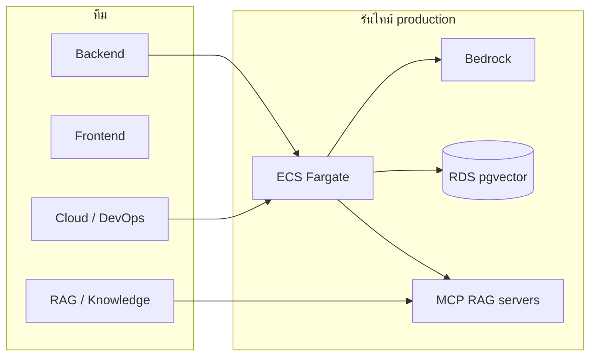

# 30 — มอบหมายทีม DEV: ต่อยอด MCP RAG + โครง deploy AWS

เอกสารนี้มอบงานให้ทีมพัฒนาต่อจากเกต Local LLM ([28](28-VERIFICATION-AND-MIGRATION.md)) นโยบาย Cloud ล้วน ([29](29-TBW-AWS-CLOUD-ONLY.md)) และชุด AWS ([24](24-AWS_CLOUD_OVERVIEW.md)–[27](27-AWS_CODE_AND_CUTOVER.md))

**ขอบเขตรอบนี้ในรีโป:** โครง (skeleton) พร้อมต่อยอด — **ยังไม่ provision บัญชี AWS จริง** และ **ยังไม่ชี้ MCP ภายนอกใน production**

---

## 1. เป้าหมายที่ทีมต้องทำให้ได้

1. แอปบน ECS ใช้ `DEPLOYMENT_MODE=cloud` + Bedrock เท่านั้น (ห้าม hybrid LLM)
2. ค้นคลังได้หลายแหล่งโดยไม่เปลี่ยนโมเดล: pgvector กลาง/ของฉัน + Custom RAG HTTP + **MCP retrieve**
3. ไฟล์ deploy เป็น YAML/config ที่ CI และ Cloud Eng ใช้ร่วมกัน ไม่ฝังความลับใน Git



---

## 2. บทบาทและความรับผิดชอบ

| บทบาท | เจ้าของหลัก | ส่งมอบ | ไม่ทำ |
|--------|-------------|--------|--------|
| **Tech lead** | จัดลำดับสปรินต์ เกตโค้ด ตาม 28/29 | Definition of done ต่อสปรินต์ | `terraform apply` คนเดียวโดยไม่มี plan |
| **Backend** | `app/backend` — MCP client, ACL, fail-open | ทดสอบ unit + ไม่รั่ว `owner_id` | เปิด `EMBEDDING_PROVIDER=local` บน ECS |
| **Frontend** | ชิป citation แหล่ง `mcp` / `custom_rag` | ไม่โชว์ URL ภายในของ MCP | เรียก Bedrock จากเบราว์เซอร์ |
| **RAG / KB** | `app/infra/mcp/rag-sources.yaml` + เซิร์ฟเวอร์ retrieve | สัญญาเครื่องมือ `retrieve` | ปนเวกเตอร์ Gemma กับ Titan |
| **Cloud Eng** | Terraform, ECS YAML, GitHub Actions, Secrets | `workflow_dispatch` ผ่านบน UAT | Access key ระยะยาวใน GitHub |
| **QA** | ECT บน UAT Bedrock ตาม 27 §6 | เช็คลิสต์เกต 28 บนคลาวด์ | รัน `live_llm` ต่อ LM Studio ใน prod |

---

## 3. สปรินต์ที่แนะนำ (เรียงลำดับ)

| สปรินต์ | ช่วง | งาน | เกณฑ์ผ่าน |
|---------|------|-----|-----------|
| **S0 — โครงในรีโป** | ทำแล้วในคอมมิตนี้ | YAML ECS/CI, config คลาวด์, MCP client ปิดโดยค่าเริ่มต้น | pytest ของ MCP stub ผ่าน; workflow เป็น `workflow_dispatch` |
| **S1 — Deploy UAT** | หลังบัญชี AWS พร้อม | เปิดแฟล็ก Terraform ทีละชั้น, Secrets Manager, ECR | `GET /health` บน HTTPS UAT |
| **S2 — Seed คลัง Titan** | หลัง RDS | `pull-kb-from-s3` + `seed_raw_docs` | `mandatory_handbook` และ `mandatory_raw` ≥ 1 |
| **S3 — MCP แหล่งที่ 1** | คู่ขนาน S2 ได้ | เปิดเซิร์ฟเวอร์ MCP ทดสอบใน VPC, `MCP_RAG_ENABLED=true` บน UAT | ถาม-ตอบมี citation ประเภท mcp โดย ACL ผ่าน |
| **S4 — หลายเซิร์ฟเวอร์ MCP** | หลัง S3 | เพิ่มรายการใน `rag-sources.yaml`, รวมคะแนน, จำกัด `top_k` รวม | แหล่งล้มแล้วแชทยังตอบจาก pgvector |
| **S5 — Prod** | หลังเกต UAT | desiredCount ตาม Redis job store ที่ deploy แล้ว, WAF, งบ Bedrock | ตาม cutover เอกสาร 27 + 28 ส่วน C |

อย่าข้าม S1 ไป S5 — task จะล้มตอน health / เวกเตอร์คนละมิติ

---

## 4. สัญญา MCP ที่ Backend คาดหวัง (ต่อยอดได้)

เครื่องมือชื่อ **`retrieve`** (JSON-RPC 2.0 บน HTTP)

**คำขอ (arguments):**

```json
{
  "query": "วิธีเฉพาะเจาะจง",
  "top_k": 8,
  "search_scope": "both",
  "user_id": "uuid-or-null"
}
```

**คำตอบ:** `tools/call` result เป็นข้อความ JSON:

```json
{
  "chunks": [
    {
      "text": "...",
      "score": 0.8,
      "source_document": "ชื่อไฟล์หรือระบบ",
      "metadata": { "legal_reference": "พ.ร.บ. 2560" }
    }
  ]
}
```

กฎ: เซิร์ฟเวอร์ MCP ต้องกรอง ACL เองถ้าถือเอกสารส่วนตัว — แบ็กเอนด์ใส่ `rag_source=mcp` และไม่ถือว่าชิ้นจาก MCP เป็นเอกสารกลางถ้า metadata มี `owner_id` คนละคน (ใช้ `document_is_visible` เมื่อมีฟิลด์นี้)

ค่าเริ่มต้น **ปิด** (`MCP_RAG_ENABLED=false`) จนกว่า RAG owner เปิดแหล่งใน UAT

ไฟล์โครง: [`app/infra/mcp/`](../app/infra/mcp/README.md) · ไคลเอนต์ [`app/backend/app/rag/mcp_rag.py`](../app/backend/app/rag/mcp_rag.py)

ตัวแปร: `MCP_RAG_ENABLED`, `MCP_RAG_CONFIG_PATH`, `MCP_RAG_SERVERS_JSON` (แทนไฟล์), `MCP_RAG_TIMEOUT_SECONDS`

---

## 5. ไฟล์ AWS ที่ทีมใช้ (โครง YAML + config)

| ไฟล์ | ใครใช้ | หมายเหตุ |
|------|--------|----------|
| [`.github/workflows/ecs-deploy.yml`](../.github/workflows/ecs-deploy.yml) | Cloud Eng | `workflow_dispatch` เท่านั้นจนกว่ามี OIDC |
| [`app/infra/aws/ci/github-ecs-deploy.yml.example`](../app/infra/aws/ci/github-ecs-deploy.yml.example) | อ้างอิงเดิม (push ขึ้น main เมื่อพร้อม) |
| [`app/infra/aws/ecs/services.yml`](../app/infra/aws/ecs/services.yml) | ค่า desiredCount / cluster |
| [`app/infra/aws/ecs/task-backend.yml`](../app/infra/aws/ecs/task-backend.yml) | env คลาวด์ล้วน + MCP ปิด |
| [`app/infra/aws/ecs/task-frontend.yml`](../app/infra/aws/ecs/task-frontend.yml) | Next.js |
| [`app/infra/aws/config/cloud-app.yaml`](../app/infra/aws/config/cloud-app.yaml) | ค่าไม่ลับของแอป |
| [`app/infra/aws/compose/docker-compose.cloud.yml`](../app/infra/aws/compose/docker-compose.cloud.yml) | ทดลอง env คลาวด์บนเครื่อง **ไม่** ผูก LM Studio |
| [`app/infra/aws/env.cloud.example`](../app/infra/aws/env.cloud.example) | ต้นทาง Secrets / task |
| [`app/infra/aws/terraform/`](../app/infra/aws/terraform/) | รอบ 1–3 ตาม tfvars |

---

## 6. Definition of done ต่อชิ้นงาน MCP

- [ ] `MCP_RAG_ENABLED=false` แล้วพฤติกรรมเท่ากับก่อนมี MCP
- [ ] เซิร์ฟเวอร์ MCP ล่ม → แชทยังตอบจาก pgvector (fail-open เหมือน Custom RAG)
- [ ] ไม่มี `DEPLOYMENT_MODE=hybrid` ใน task YAML
- [ ] ไม่ commit ค่า API key / JWT / รหัส RDS
- [ ] pytest `tests/test_mcp_rag.py` ผ่านในชุด `not live_llm`

---

## 7. การสื่อสารรายวัน

- Blocker AWS (โควตา Bedrock, VPC) → Cloud Eng + Tech lead
- สัญญา `retrieve` เปลี่ยนฟิลด์ → ประกาศใน PR ที่แตะทั้ง `mcp_rag.py` และ `rag-sources.yaml`
- ตัดระบบ prod → ทำตามเอกสาร 28 ส่วน C ไม่ข้ามเกต UAT
